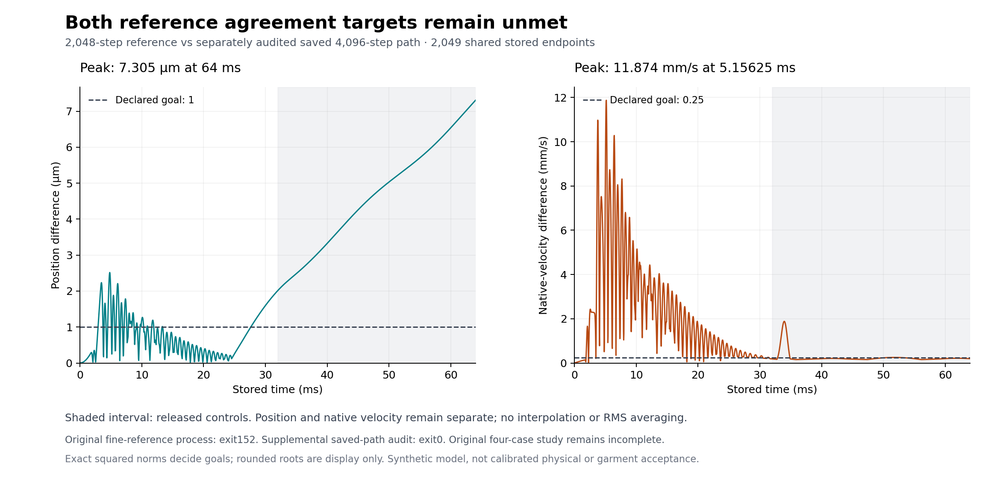
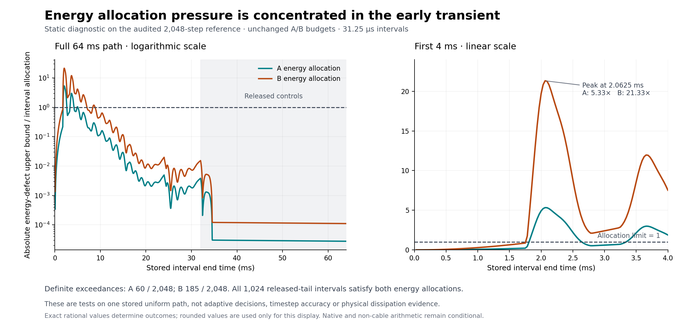
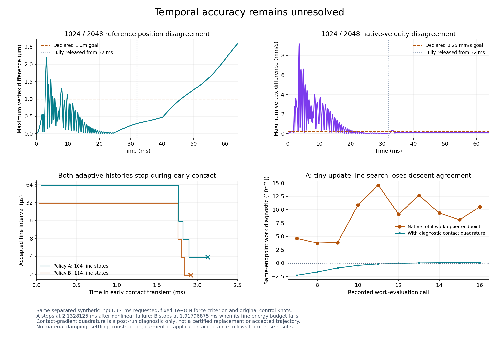
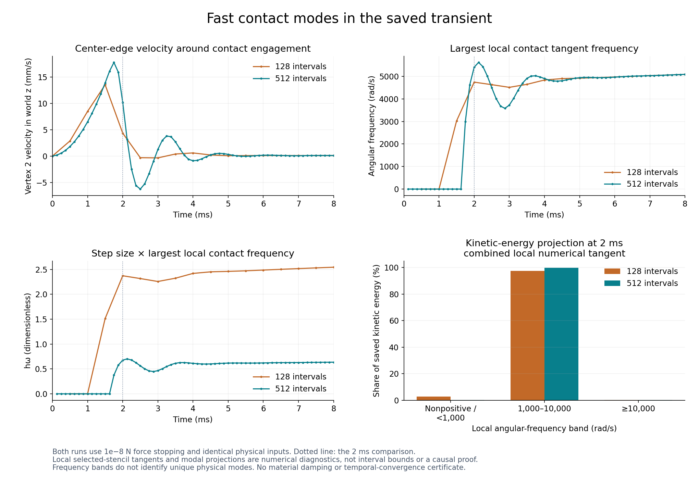
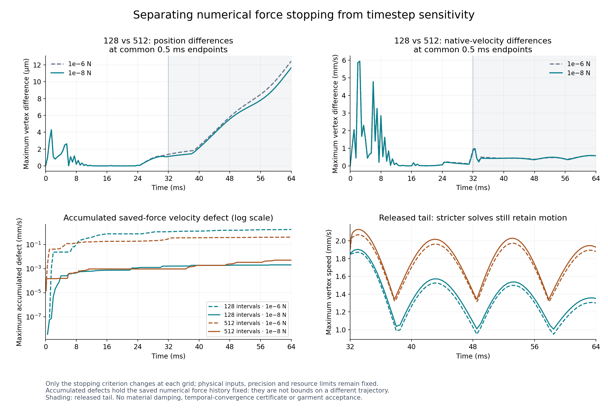
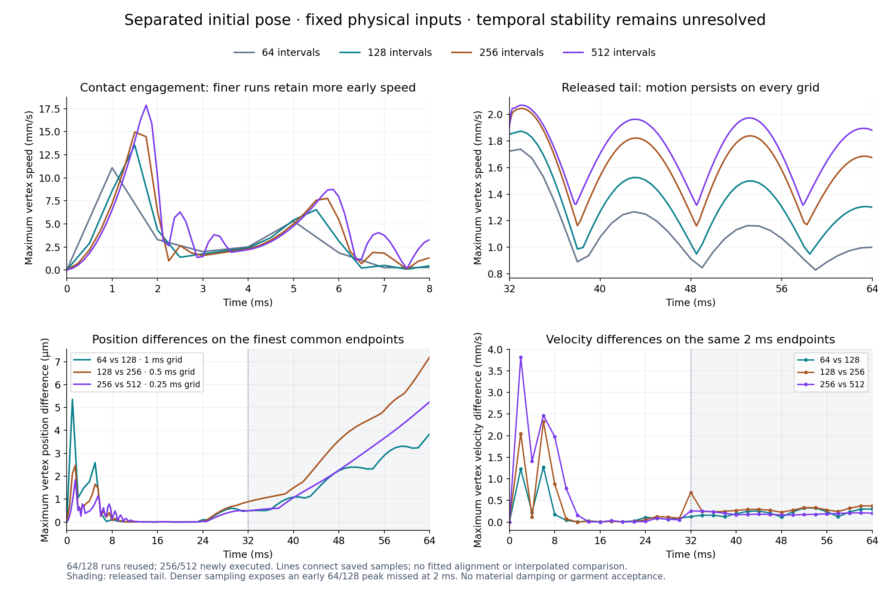
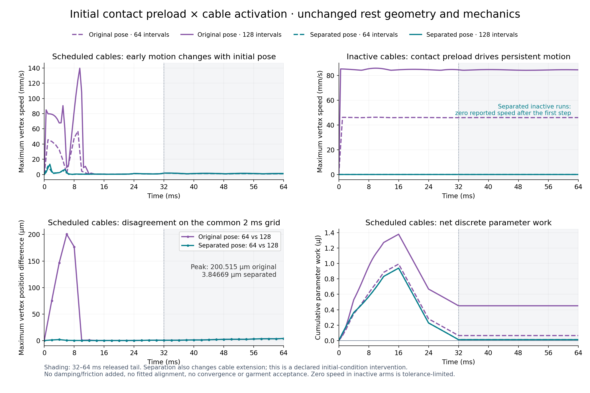
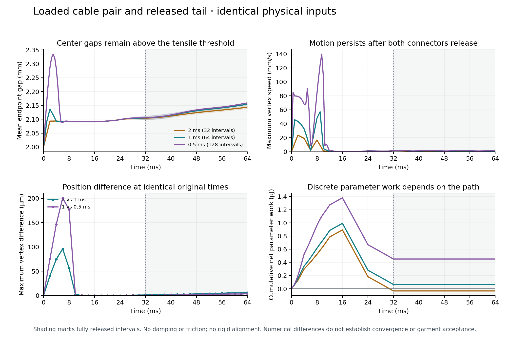

# Pattern-derived 3D solver feasibility

**2026-09-16 · Executed CPU research spike · E0 partly complete; no production solver acceptance**

Latest contact work, 2026-09-18: the optional global-reference experiment supports a pinned IPC barrier and continuous contact guards. The original full-shirt placement fails contact admission; a separate rigid staging experiment now passes static admission without changing source dimensions. Dynamics and assembly remain rejected; see the contact continuation below and the [independent review](../reviews/3d-cloth-contact.md). The default application and Newton experiments are unchanged.

## Native physical response and coupled Lobatto stages · 2026-09-25

The new [physical-response boundary](../../scripts/solver_physical_response.py) and [coupled native stage solver](../../scripts/solver_lobatto_stages.py) pass **207 focused pinned Linux tests**, including **18 independent physical-response methods and 16 independent stage methods**. The other **173 tests overlap the historical 1,626-test full checkpoint**; that full suite is not rerun or added to this count. This implements native stage candidates, not an accepted timestep, original-duration accuracy or a garment result. Both interfaces explicitly return `accepted: false`.

The physical boundary evaluates vector, distance or normal-offset sewing, membrane, bending, legacy/controlled fold actuation, material grippers, fold barrier, native contact and fixed/varying cable, preserving every configured term and the stable membrane energy reference. It contains no backward-Euler inertia and retains fixed-vertex reaction gradients. Each call performs fresh contact state validation and fresh cable evaluation/certificate validation. Exact rational summation of the component binary64 outputs retains cancellation and reports the final rounding error; cable integration uncertainty is counted once. Other constitutive, geometric and internal component-assembly errors remain conditional. Contact, bending, fold and other search-matrix approximations are explicitly labelled; there is no claim that the complete matrix is an exact Hessian.

The stage solver accepts three fixed physical samples at nodes **0, 1/2, 1**, bound to the same exposed solver configuration. It solves the two position stages together using the existing mass matrix and a general nonsymmetric sparse LU search. For displacement defects d₁=Xmid−x₀−hv₀/2 and d₂=Xend−x₀−hv₀, its force equations are R₁=3Md₂/h²+gmid+g₀/2 and R₂=M(−48d₁+12d₂)/h²+gend−g₀. It uses bounded residual backtracking, not two sequential old steps or positive-definite minimization. All initial stages start at the supplied admitted geometry. Fixed vertices remain unchanged and require exactly zero initial velocity.

Force admission uses exact rational assembly of the binary64 states, masses, duration and gradient outputs, plus the physical responses' known uncertainty. Both transformed force upper bounds must meet a tightening-only **10⁻⁸ N** criterion. This is not an equivalence proof to the old backward-Euler stopping test or a temporal-accuracy bound. All three stages are freshly evaluated again before returning; endpoint velocity is the actual last RK stage velocity reconstructed from those same fresh gradients. Separate records retain kinematic defects in metres, impulse defects in newton-seconds, and velocity formation/known-error bounds. A displacement secant cannot substitute for this native velocity.

Every candidate checks optimizer chords, start-to-midpoint, midpoint-to-endpoint and the whole physical endpoint chord. These include numerical triangle guards, all applicable bending/fold/barrier hinge guards and native contact guards. Final paths are checked again. These are explicitly **affine-path checks**, not a proof for a swept collocation polynomial. The default trial limit is **300 physical responses**, 100 nonlinear iterations and 24 backtrack candidates per iteration. Complete candidate pairs and the final three fresh responses must fit their reservation. Responses, helper calls, guards, factorizations, linear solves, rejected candidates and failed trials retain attempted-work counts.

Independent [response tests](../../scripts/test_solver_physical_response.py) derive analytic component laws and compare the old objective/gradient at exactly zero inertia. The separate [stage tests](../../scripts/test_solver_lobatto_stages.py) solve the full four-variable RK position/velocity equations without the producer's eliminated two-position equations, check a rank-one oscillator's rational phase map, reconstruct dimensioned records, retain fixed reactions, and exercise nonzero velocity and changing stage samples. Native cases include contact, fixed/varying cable, normal-offset sewing, both fold routes, bending, grippers and the fold barrier. Adversarial cases reject stale final forces, failed final paths, malformed radii, exhausted reservations and mutated state/model data while preserving costs. They test synthetic mechanics, not a complete garment or original full64ms trajectory.

Source review repaired delayed mutation through a retained guard argument by passing detached arrays; success counters now advance only after post-call identity checks. The physical failure wrapper now retains attempted helper counts and the original cause for ordinary exceptions, including native `RuntimeError`. Earlier constructor-parameter mutation and nonreal scalar response findings were also repaired. The first physical test run retained **182 successes and nine errors** caused by a shared non-normalized anchor fixture; only that fixture was corrected before the historical **191-test** pass. The combined **207-test** run checks the final failure-wrapper change as well as the stage implementation. It completed with actual child/container/outer exit zero, no skipped tests, unchanged frozen inputs and owned-container cleanup; outer elapsed time was **22.054542 seconds**. This is a regression-suite duration, not a solver trajectory performance measurement.

The [evidence ledger](3d-lobatto-stages-results.json) retains the actual pass and earlier failure evidence, source/runtime identities and independent review associations. Application sources and the protected capture/replay/process-budget entrypoints are unchanged. No TypeScript/application/browser release claim, remote publication or deployment follows from this research increment.

**Next bind the original schedule and implement bounded continuous parameter power.** Stage samples currently carry control identities but no schedule provenance, one-sided knot rates, material-power integral or interpolation-rounding allowance. Discrete target-first parameter work is not that continuous power. Integrate these terms with work/energy and complete coarse/fine/rejected trial reservations, then repeat the original full64ms accuracy/runtime study with unchanged preload, released tail and **1 µm / 0.25 mm/s** goals. Temporal/spatial, source construction, actual cuff turning/binding, material/body, full-shirt and private application/release gates remain open. No artificial damping term has been added, and no physical input or accuracy target has been relaxed.

## Coupled nonlinear time-integrator comparison · 2026-09-25

The new [standalone study](../../scripts/study_solver_lobatto.py) completes all **48** predetermined Gauss/Lobatto cases at **80 and 120 Decimal digits**, including **29,256 accepted physical steps per precision**. Both methods show fourth-order state and work refinement on the smooth controls. Select three-stage **Lobatto IIIA for the next experimental native implementation** because its exact nodes 0, 1/2, 1 fit the existing dyadic control schedule. This is an implementation choice, not evidence that Lobatto is universally more accurate, cheaper, symplectic or suitable for cloth contact. Its adverse coarse-grid results and additional evaluations remain explicit below. The previous Gauss comparison remains the alternative reference.

The comparison solves the coupled stage equations for a unit mass over **64 ms**, with the original **1 µm / 0.25 mm/s** sampled position/native-velocity goals. The nonautonomous polynomial fixture retains q(t)=A(t/T)^5, A=0.0001 m and ω=500 rad/s, at 16, 32, 64, 128, 256 and 512 intervals. Its actual solved stages supply parameter-power quadrature against the exact continuous-work integral. The nonlinear conservative fixture uses **U(x)=m a²b²/(2x²)** on x>0, **x(t)=sqrt(a²+b²t²)** and **v(t)=b²t/x**, with a=0.0001 or 0.00001 m, b=0.05 m/s, m=1 kg, and 16, 32, 64, 128, 256, 512, 1,024, 2,048 and 2,730 intervals. The respective bT/a ratios are 32 and 320. This is monotone repulsion with a rapidly changing Hessian, not oscillatory motion, physical contact or a replacement cloth problem.

Let B be the unknown-stage block of A², d its known-initial-stage column, X the two unknown positions and g the physical potential gradients. The solved residual is **R=(m/h²)B⁻¹(X−x₀−hc v₀)+g+B⁻¹d g₀**, in newtons. Its Jacobian is generally nonsymmetric, **(m/h²)B⁻¹+diag(H)**. For Lobatto, B⁻¹=[[0,3],[−48,12]] and B⁻¹d=(1/2,−1). The implementation performs a coupled 2×2 Newton solve with bounded residual-norm backtracking; two sequential single-stage steps would not implement this method. The polynomial admits x=0 and negative positions. Positivity is enforced only for the inverse potential. Neither positions nor velocities are clipped.

Fresh stage evaluation must satisfy the prospectively fixed **10⁻³⁵ N** transformed residual before publication. Initial, candidate, known-stage, fresh-stage and physical-endpoint responses share one **300-potential-call** cap per trial, with at most 32 Newton updates and 20 candidate attempts per update. Separate counts retain rejected candidates, factorizations, fresh residual validations and failed reservations. Lobatto returns its actual last-stage position and velocity; Gauss returns the weighted endpoint. The output records their full stage equations and endpoint-update defects. This diagnostic residual is not an established equivalent of the native 10⁻⁸ N criterion, and Decimal agreement is not a certified force enclosure.

For the harder a=0.00001 m control, these are maximum errors over **every accepted grid endpoint**, not only the final state:

| Method | Fine intervals | Position error, µm | Native-velocity error, mm/s | Potential calls | Both state goals |
| --- | ---: | ---: | ---: | ---: | --- |
| Gauss | 16 | 625.105715 | 9.449460 | 182 | fail |
| Lobatto IIIA | 16 | 7,479.128501 | 116.767510 | 266 | fail |
| Gauss | 512 | 1.335834 | 0.040347 | 5,182 | fail |
| Lobatto IIIA | 512 | 1.960770 | 0.033510 | 5,694 | fail |
| Gauss | 1,024 | 0.067686 | 0.002623 | 10,324 | pass |
| Lobatto IIIA | 1,024 | 0.099707 | 0.001690 | 11,350 | pass |
| Gauss | 2,048 | 0.004056 | 0.000166 | 20,602 | pass |
| Lobatto IIIA | 2,048 | 0.005988 | 0.000101 | 22,654 | pass |

Both methods first pass the tested grids at 64 intervals for a=0.0001 m and 1,024 intervals for a=0.00001 m; this is not a minimum-step proof. All twelve polynomial rows pass their state goals. Across the complete matrix, **32 rows pass and 16 fail** the state targets even though all nonlinear solves complete. In the hard control Lobatto rejects 34, 11 and one residual-decrease candidate at 16, 32 and 64 intervals respectively; Gauss has none. The maximum per-step call count is 101, below the declared 300. These facts demonstrate why convergence and budget success alone cannot certify trajectory accuracy. There is no all-time-between-samples bound or native nonlinear cost measurement.

The primary precision accounts for **307,392 potential calls**, **58,568 coupled linear solves**, **46 rejected residual-decrease candidates**, **29,256 fresh endpoint calls** and **29,256 fresh residual validations**. No domain or budget rejection occurs in the actual matrix; the independent tests deliberately exercise those paths. At the hard control's 1,024 grid Lobatto uses approximately 9.94% more potential calls than Gauss, while having smaller velocity error and larger position/energy error. Its coarse N=16 energy defect is approximately **0.0126456 J**, larger than the initial energy **0.00125 J**; the energy defect is retained, not described as conservation.

Refining the polynomial from 256 to 512 intervals reduces Lobatto's position, native-velocity and continuous-work errors by **15.99825, 15.99132 and 15.99987**. Gauss's corresponding ratios are **15.98967, 16.000006 and 16.000016**. For a=0.0001 m, 1,024→2,048 refinement gives approximately 16 for both state errors and energy defect for each method. For the harder a=0.00001 m case the respective position/velocity ratios are **16.68681/15.80545** for Gauss and **16.65168/16.72305** for Lobatto. The complete ledger preserves all coarse/nonmonotone behavior. Ordinary-RK symplecticity fails for this Lobatto tableau; agreement with Gauss on constant-linear oscillators does not imply equal nonlinear energy behavior. Stage-power work, mechanical energy balance and state accuracy remain separate observations.

The hypothetical one-coarse/two-fine trial mapping remains 3N/2, with a maximum of 4,096 trials and no rejects. The N=2,730 row is only its arithmetic ceiling, not an admitted uniform dyadic grid or executed adaptive calculation. These diagnostic counts and the approximately eleven-second host study do not establish native speed or original full-duration feasibility.

**Thirteen independent tests pass.** Their [source](../../scripts/test_study_solver_lobatto.py) checks exact order/stability identities, full four-variable stage equations over rational/Q(√3) arithmetic, independent inverse-potential derivatives, actual endpoint velocity, stage work, counted budget boundaries, fresh force revalidation, rejected backtracking, failure atomicity, and disagreement retention. Source review found that a repeated run could index beyond an earlier failed prefix and lose completed primary evidence. The repaired producer saves a primary checkpoint before repetition and records unmatched steps and explicit prefix/decision/reason/schema disagreement; the original source and regression cases are retained. A checkpoint alone is neither a verified result nor a resume guarantee.

The actual study compares **672,888 stored numeric fields** across precisions. Their maximum absolute difference is **5.42414×10⁻⁷²** in the respective field's units, below the fixed 10⁻²⁸ tolerance. All completion prefixes, decisions, failure reasons, schemas and per-step counters agree. Each exclusive output file stays below its separately declared 64 MiB cap: the primary checkpoint is **55,403,131 bytes**, and the final result **55,500,686 bytes**. The combined two-file allocation was declared prospectively; the native/protected snapshot cap remains unchanged. Actual test/study children and launchers exit zero, inputs remain unchanged, and both children are reaped. Study outer elapsed time is **10.982417 seconds**. The launcher supplies Python `-I -S`, a sanitized environment and CPU/file/core/wall limits; it does not claim an address-space cap or OS filesystem/network sandbox.

A separate saved-data auditor imports no producer and reconstructs every primary stage and endpoint at **140 digits**, using the original RK equations, physical-time polynomial power and exact nonlinear state reference. Its **600,228 independent numeric comparisons** cover all 48 rows and 29,256 accepted steps; the maximum difference is **4.36812×10⁻⁷²**, below its fixed 10⁻⁵⁵ absolute/relative reconstruction tolerance. Actual exit is zero after **4.119420 seconds**, with unchanged reviewer source and a reaped child. It independently verifies work/energy, all-sample errors, decisions, counters and source/process/checkpoint associations. Repeat histories are not retained in full: their source-bound aggregates, witnesses and outcomes are checked, without claiming an independent second nonlinear solve or a certified interval bound.

The [evidence ledger](3d-lobatto-comparison-results.json) retains every primary summary, all repeated summaries, prospective declarations, actual receipts, independent review associations and identities for the complete local stage histories. The sources reproduce the numerical study and independent tests. Full primary histories and review machinery remain ignored local research evidence.

**Next implement the selected method in the native solver.** Start with an explicit fixed-control physical potential/gradient/derivative boundary, preserving the original mechanics without subtracting inertia from an aggregate gradient. Then solve the two coupled cloth stages with a general nonsymmetric linear method, fresh bounded force checks, counted rejected trials, actual endpoint velocities and separate kinematic/impulse defects. Existing Hessian approximations must be identified as search matrices, not asserted exact derivatives. The previous fast-oscillator control still fails within the hypothetical trial budget; contact and slack transitions can also reduce observed order, so this method choice does not guarantee native feasibility. Preserve the stable energy reference; the membrane helper's returned energy has an additive constant relative to the current objective. This constant does not affect forces but must not silently change reports.

Original cable control sampling requires exact stage fractions, the extra midpoint level on the finest trial, one-sided knot derivatives and bound-preserving binary64 interpolation. Add actual parameter-power evaluation from the existing potential and schedule, including bounded material integrals and control-rounding effects. A chord of fixed-state energy differences is not the required instantaneous nonlinear power. Preserve complete contact/triangle/hinge guards for internal candidates and the declared physical endpoint segment; checked collocation points do not prove a swept polynomial path. Only after this integration should the original **64 ms**, **1 µm / 0.25 mm/s** native refinement study be repeated with all coarse/fine/rejected costs and the original preload/released tail. No numerical damping, relaxed tolerance, changed rest shape or omitted control is selected by this diagnostic.

The **1,626-test native checkpoint is unchanged**, not newly rerun or added to the thirteen diagnostic tests. Spatial convergence, construction-specific joints, actual cuff turning/binding, all fabric/interfacing roles, material/body/full-shirt acceptance and private application/release work remain open. Protected capture/replay/budget sources and production are unchanged. Nothing is pushed or deployed. Earlier entries retain their then-current priorities.

## Analytic time-integrator comparison · 2026-09-25

The bounded smooth-control comparison favors investigating a fourth-order coupled method before implementing midpoint in the native cloth solver. This is a method-selection witness, not a replacement physical problem or a completed cloth trajectory. The unchanged native implementation remains at the preceding 1,626-test checkpoint; no new native, application, browser or deployment run is claimed.

The new standalone [study](../../scripts/study_solver_time_integration.py) evaluates implicit midpoint and two-stage Gauss on unit-mass oscillators for the full **64 ms** diagnostic interval, with exact decimal inputs, a synthetic **10 mm/s** velocity amplitude, frequencies **50, 5,000 and 85,991 rad/s**, and ten predetermined fine-grid counts from 128 through 32,768, including 2,730. The frequencies/amplitude are illustrative controls, not established sustained cloth modes. It checks every grid sample and the maximum over arbitrary initial phase against independent trigonometric rotation; it does not certify times between samples or binary64 native integration. Position and native-velocity goals remain **1 µm and 0.25 mm/s**.

| Method, 5,000 rad/s | Fine intervals | Hypothetical coarse/fine trials | Maximum position error, µm | Maximum native-velocity error, mm/s | Result |
| --- | ---: | ---: | ---: | ---: | --- |
| Midpoint | 2,730 | 4,095 | 0.727206 | 3.636032 | velocity fails |
| Gauss order four | 512 | 768 | 0.132458 | 0.662289 | velocity fails |
| Gauss order four | 1,024 | 1,536 | 0.008428 | 0.042139 | sampled diagnostic passes |
| Gauss order four | 2,730 | 4,095 | 0.000168 | 0.000838 | sampled diagnostic passes |
| Midpoint | 16,384 | 24,576 | 0.020344 | 0.101719 | accuracy passes outside budget |

One coarse step plus two fine steps costs three physical trials and publishes two fine intervals. Thus the unchanged 4,096-trial limit admits at most **2,730** fine intervals with no rejects; that count is not an admitted uniform dyadic partition. The table is a hypothetical cost mapping, not an executed adaptive controller or nonlinear runtime measurement. Gauss needs two coupled unknown positions per mechanical degree of freedom, at least two stage-force evaluations per trial, and potentially repeated nonlinear iterations and fresh guards. Its 1,024-step row therefore counts at least 3,072 stage-force evaluations. The first passing tested grid is not claimed globally minimal.

Both methods pass the low-frequency control. At **85,991 rad/s**, neither method passes any tested grid within the trial budget. Gauss reaches **0.060716 mm/s** at 32,768 steps, which would require **49,152** hypothetical trials. At the chosen amplitude, every oscillator rotation already lies within 0.232583 µm in position at that frequency; a position pass alone is uninformative. Fast-mode velocity, nonlinear coupling, contact/slack transitions and the actual cloth amplitudes remain unresolved.

The evidence deliberately preserves misleading local/energy controls. At 5,000 rad/s, midpoint's 2,730-step local velocity indicator is only **0.007970 mm/s**, yet its full-grid error is 3.636032 mm/s. Gauss at 512 steps likewise passes the unchanged raw local indicators while failing the global velocity goal. Both ideal oscillator maps preserve quadratic energy exactly; phase can still be wrong. Do not promote a method by controller-order relabeling, energy equality, a favorable final phase, or dividing current indicators by an assumed order factor.

The manufactured nonautonomous control uses **q(t)=A(t/T)^5**, A=0.0001 m, T=0.064 s and ω=500 rad/s. Its potential is **U(x,t)=m[ω²x²/2−f(t)x]**, with **f=ω²q+q''** in m/s² and **m=1 kg**. Stiffness is constant; only the linear coefficient varies. Its exact continuous parameter work is **m[−ω²A²/2−(15/2)A²/T²]**. Actual solved stages supply the work quadrature; analytic q values never replace them. On refinement from 256 to 512 intervals, Gauss position, native-velocity and work errors decrease by **15.9897, 16.000006 and 16.000016**; midpoint quadrature's corresponding ratios are **3.99995, 4.00010 and 3.99992**. Midpoint's separate symmetric parameter split can balance discrete energy exactly while disagreeing with true continuous work. The retained coarse split errors are nonmonotone; they are not discarded or conflated with midpoint power quadrature.

**Eleven independent stdlib tests pass.** The [oracles](../../scripts/test_study_solver_time_integration.py) include exact rational rotations, full coupled 4×4 stage equations over Q(√3), conjugate-stage cancellation, arbitrary initial states, exact polynomial work, independent Machin-pi/direct-Taylor trigonometry, every-sample/all-phase errors, misleading energy/local controls, budget boundaries, and unresolved near-threshold decisions. The complete study evaluates **60 oscillator and 12 forced rows at both 80 and 120 Decimal digits**; all 786 numeric fields agree within **1.4819×10⁻⁷⁵** and all row identities/decisions agree. A separate saved-result auditor recomputes all 60 oscillator rows using direct angle/sine scans and all 12 manufactured rows using full coupled stage elimination at 100 digits. Its actual exit is zero; all counts, decisions and result/process/failure associations pass. Every oscillator comparison passes the declared tolerance: 2×10⁻¹¹ m/s for velocity and that quantity divided by ω for position. Every decision is more than 246,000 corresponding tolerance units from a boundary. Precision stability is not a certified interval enclosure. The prospective 10⁻⁴⁵ near-threshold guard leaves ambiguous diagnostic comparisons unresolved.

The successful study's actual child/launcher exits are zero, inputs are unchanged, the child is reaped, and outer elapsed time is **4.648839 seconds**. The eleven-test child also exits zero. The host launcher uses Python `-I -S`, a sanitized environment, CPU/file/core limits and a wall watchdog; it claims neither an address-space cap nor an OS network/filesystem sandbox. The initial source-parse failure and the first test import failure happened before numerical execution and remain retained; parentheses and explicit file-based test loading were repaired without relaxing the study. The [evidence ledger](3d-time-integrator-comparison-results.json) contains the fixed declaration, full result, actual receipts and independent review associations. The numerical study and tests are reproducible from the committed stdlib sources; retained launcher/reviewer/failure snapshots remain local research artifacts.

**Next:** compare a separately declared rational-node Lobatto IIIA candidate with Gauss on solved-stage work and a smooth nonlinear conservative control, then implement the selected coupled native step. The supplied three-stage Lobatto tableau has a known initial stage, nodes 0, 1/2, 1, two coupled unknown stages and a physical endpoint equal to its last stage. Algebra gives the same constant-linear [2/2] Padé map as Gauss; this is a source derivation, not an executed Lobatto experiment. Ordinary-RK symplecticity fails at its first diagonal condition, −1/36. Rational sampling addresses one integration obstacle but does not establish nonlinear energy behavior, solve cost, or solver acceptance.

The next discriminator can use the exact nonlinear conservative solution **x(t)=sqrt(a²+b²t²)** for **U(x)=m a²b²/(2x²)** on x>0, a>0, with **v=b²t/x**, **m=1 kg** and constant **E=m b²/2**. Here a is in metres and b in metres/second; this is monotone repulsive motion with changing stiffness, not a contact or oscillation surrogate. Its changing Hessian distinguishes the coupled nonlinear methods without using one candidate as the reference. Freeze parameters, residual/rounding policies and budgets before execution. The native route still needs dimensioned stage/endpoint residual bounds, original control identity, fresh endpoint responses, complete physical contact/triangle/hinge paths, fourth-order parameter-work accounting, all failed-trial costs and the original full-duration refinement goals. No numerical damping, relaxed target, retargeted anchor or changed rest geometry follows from the analytic result.

Method background: [Hairer's collocation and quadratic-invariant notes](https://www.unige.ch/~hairer/poly_geoint/week2.pdf), [variable-step caveats](https://www.unige.ch/~hairer/preprints/varsymp.html), and [Kennedy–Carpenter's method review, Table D6](https://ntrs.nasa.gov/api/citations/20250008379/downloads/NASA-TM-20250008379.pdf). These references describe methods; the project equations, executable checks and diagnostic conclusions above have their own scope. Full64ms cloth accuracy, spatial convergence, source joints/cuff turning/binding, complete fabric/interfacing roles, material/body/full-shirt validation and private application/release gates remain open. Protected capture/replay files and production are unchanged. Nothing is pushed or deployed. Earlier entries retain their then-current priorities.

## Exact cable interval contraction · 2026-09-25

Fresh cable responses now share a bounded common denominator across the used radial-moment endpoints, accumulate each signed contribution with integers and construct final Fraction endpoints once. Each coefficient retains its own endpoint selection, including uncertainty width under cancellation. The unchanged radial kernel still runs freshly with the original tolerances and budgets. The helper admits only exact canonical inputs, positive panel widths, degree at most five and 4–1,024 response rows; new integer multiply/add and LCM results have conservative 65,536-bit eligibility guards checked before allocation. Ineligible shapes, types or growth return to the original contraction. These are fast-path limits, not new physical-input rejection criteria. No basis or response survives a call.

**1,626 full pinned Linux numerical/supervision tests pass**, including sixteen new independent methods. The full runner interval is **871.104652355 seconds**; the overlapping **205 focused tests** have a **33.628213140-second** runner interval. Twelve new host math controls use separate rational and Cartesian endpoint oracles, lazy lookup/type/fallback checks, pre-allocation growth checks and alias tests. Four native methods compare complete response/certificate/statistics, fresh moment calls, effective-parameter responses and fixed/parameter work, plus zero-radial, energy-only and failure paths. Parameter work uses its unchanged separate contraction and is an unchanged-path control. Independent review verifies all 416 frozen source rows, test identities, actual zero exits and cleanup. These checks do not constitute garment or application acceptance.

The prospective synthetic witness passes its predeclared materiality thresholds: all four 91-output cases admit the fast path and improve at least 10%; the sum of case median CPU intervals improves **76.237%**. The one-output energy case uses the original fallback. Complete `_smooth` controls match exact intervals, statistics and fresh kernel requests. The 2.354-second host invocation is retained with actual exit zero; it used `-B/-u`, not `-I/-S`, and its timeout-receipt limitations remain explicit. This isolated contraction result is not a whole-solver speedup.

Six equally instrumented early128 observations run in the frozen order baseline, candidate, candidate, baseline, baseline, candidate:

| Sequence | Variant | Operation CPU seconds |
| --- | --- | ---: |
| 1 | baseline | 44.788273325 |
| 2 | candidate | 40.735878881 |
| 3 | candidate | 40.113126126 |
| 4 | baseline | 45.042169963 |
| 5 | baseline | 45.301645206 |
| 6 | candidate | 41.429042217 |

The three oriented pair reductions are **9.048%, 10.943%, 8.548%**. Median operation CPU changes from **45.042169963 to 40.735878881 seconds**, a **9.561%** reduction. All three oriented pairs have lower candidate CPU. These are three local observations per variant, not a population confidence claim or full-worker/full-duration performance result.

Every complete 129-record history, including the stopped trial, matches the previous reference after normalizing only the externally verified unique envelope run identity. The normalized SHA-256 remains `84d8c8dbae3cd278beb69862ec12154ff584439be4156227919b4757f6474471`. The same incomplete **1.890625 ms** prefix is retained; no additional 64 ms duration is completed. Actual numerical child exits are **86** by design. All six outer/container launches and the saved-only comparator exit zero with unchanged inputs and completed cleanup. Independent review reproduces the performance arithmetic and checks the exact comparison artifacts. The compact direct-input manifests retain the authenticated ancestor manifest and explicitly bind actual runtime and historical comparator reads. Missing reference mounts and incomplete result/receipt associations found during review were repaired before comparison/publication; inspected drafts are retained. The first curation exited with status 1 before writing its ledger because the frozen review inventory used Path ordering rather than full-string ordering. The original inventory, failed invocation and curator snapshot are retained; the corrected inventory sorts the same 102 identities.

The [implementation ledger](3d-cable-contraction-results.json) retains source snapshots, actual processes, exact fixtures, complete-history comparison and independent reviews. Reproduce it from retained local artifacts with `python3 .planning/solver/package-cable-contraction-results-v1.py --check`. Next compare implicit midpoint and two-stage fourth-order Gauss on bounded analytic phase/error and stage-cost controls before selecting a native integrator. The comparison must count all coarse/fine trials and preserve the original full-duration position/native-velocity goals. A midpoint route needs distinct stage and endpoint reports, dimensioned force/impulse/velocity bounds, complete physical-segment guards and symmetric control-work accounting. A Gauss route additionally needs coupled stages and an explicit internal control-sampling contract; its irrational abscissae do not fit the current dyadic stages. Do not change the controller order alone or start another chain of small arithmetic optimizations. The major milestone remains complete same-input temporal accuracy within practical resource limits.

Full 64 ms accuracy, original preload/released tail, spatial convergence, construction-specific joints, actual cuff turning/binding, all fabric/interfacing roles, material/body/full-shirt and private application/release gates remain open. Production and protected capture/replay entrypoints are unchanged; nothing is pushed or deployed. Earlier entries retain their then-current priorities.

## Cable integration decomposition · 2026-09-25

The current numerical implementation is unchanged from `2f2117a`. A control and instrumented fixed128 run now separate eight source-bound cable scopes and their direct parent–child timing edges. Both imported radial-moment aliases resolve to the same original defining function and are observed separately. The defining lookup is untouched, and all wrappers restore before snapshot/export. Geometry also runs outside response integration; edge accounting prevents assigning those calls to the wrong parent.

Both children deliberately stop before dispatch 129 with actual exit **86**. Actual outer/container exits are zero, cleanup completes, and all **8,523 inputs per case** remain unchanged. The two outer intervals are **57.361681167 and 55.420466667 seconds**. The separately bounded saved comparator exits zero, with an **outer wrapper interval of 25.146986500 seconds** and verifies the complete 129-record histories against each other and the previous reference, including stopped trial 129. Only the externally verified unique envelope run identity is normalized; the normalized hash remains `84d8c8dbae3cd278beb69862ec12154ff584439be4156227919b4757f6474471`. Both observations cover the same incomplete **1.890625 ms** prefix, not additional progress through the 64 ms case.

The instrumented adaptive operation takes **45.050299078 CPU seconds**. Selected disjoint self times total **15.792775042 seconds / 35.056%**:

| Selected scope | Calls | Self CPU seconds | Operation CPU share |
| --- | ---: | ---: | ---: |
| Smooth response, excluding radial moments | 2,054 | 8.725839665 | 19.369% |
| Response radial moments | 2,054 | 3.841692199 | 8.528% |
| Response functional construction | 2,054 | 2.385385814 | 5.295% |
| Response intervals, excluding selected children | 2,066 | 0.396194330 | 0.879% |
| Geometry, including calls outside intervals | 3,346 | 0.305606948 | 0.678% |
| Parameter-work radial moments | 256 | 0.111916920 | 0.248% |
| Smooth parameter work, excluding radial moments | 256 | 0.026139166 | 0.058% |
| Boundary response bounds | 0 | 0.000000000 | 0.000% |

The smooth-response residual is the largest selected cost, **8.725839665 seconds / 19.369%**. It combines affine composition, tolerance calculations and interval arithmetic; it is not a measurement of interval arithmetic alone. Response radial moments use **3.841692199 seconds / 8.528%**, and functional construction uses **2.385385814 seconds / 5.295%**. Remaining response-interval self includes classification and accumulation. Boundary-response bounds are never called in this workload, so their cost remains unmeasured. Inclusive costs overlap and must not be summed. These operation-wide scopes span solver, energy and fresh-validation calls; they are not directly comparable to the earlier isolation-only callback totals. Clock/wrapper overhead is included, and no speedup follows from this single diagnostic pair.

Both pinned parents pass **28 existing timer, 10 phase and 13 new independent adapter controls**. The adapter checks separate aliases, source identity, nested/standalone/recursive timing, disabled clocks, exception identity and restoration, partial installation, edge-storage failure and detached summaries. All **26 detached saved-data cases** have their expected outcomes, including valid zero-use scopes and rejected malformed counts, edges and timing totals. The full **1,610-test numerical baseline** remains historical evidence against unchanged numerical bytes; no new full suite or application checks ran.

Next, make one bounded investigation of batched exact interval contraction inside `_smooth`: prepare endpoint/sign/denominator data for the freshly computed moment basis, then reduce repeated exact multiply/add work across functionals. First require an independent rational endpoint oracle, mixed signs, zero/constant and extreme coefficients, nonidentity panels, complete energy/gradient/Hessian and work equivalence, bounded temporary integer growth, and a material isolated cost witness. Stop this arithmetic investigation if the witness is weak; do not start another chain of unmeasured optimizations. A successful candidate must still pass applicable regressions and a complete-history matched benchmark. The current measurement does not establish how much of smooth self is contraction or predict a gain.

The next major numerical milestone remains complete same-input temporal accuracy. Separately specify any higher-order integrator's stage states, returned native velocity, schedule/work quadrature, contact/path and energy evidence, error estimator and dissipation expectations. Preserve the current first-order baseline and all physical/accuracy criteria; changing controller order alone is insufficient.

The [measurement ledger](3d-cable-integration-profile-results.json) preserves actual processes, source/method identities, complete-history comparison, independent review and retained curator findings. Reproduce locally with `python3 .planning/solver/package-cable-integration-profile-results-v1.py --check` using retained ignored artifacts in the isolated checkout. The two curator draft gaps concerned missing inspected-copy provenance and insufficient independent timing aggregation checks; they were repaired before curation, with earlier inspected versions preserved. The first curation command exited 1 because its proposed destination already held the historical cable-integration ledger; exclusive creation preserved that file. The profiling ledger uses a distinct destination and retains the failed command, log, receipt and original curator. Numerical sources, physical inputs, accuracy/resource criteria and protected entrypoints remain unchanged. Full-duration temporal accuracy, original preload/released tail, spatial convergence, cuff turning/binding, material/body/full-shirt and private application/release gates remain open. Production is unchanged; nothing is pushed or deployed.

## Shared cable polynomial products · 2026-09-25

Fresh cable force construction now reuses exact vertex-row products within each call and skips multiplication by a canonical exact-Fraction zero polynomial. Reuse is keyed by row ordinal, preserving ordered duplicate-vertex rows, and returned coefficients remain independent objects. Other numeric types and containers retain the original multiplication path. There is no persistent response cache, omitted native validation or change to the radial kernel's arithmetic budgets. An independent four-row control verifies **368 to 202 multiplication-helper calls**; that count is not itself a runtime measurement.

**1,610 full pinned Linux numerical/supervision tests pass in 872.516 seconds**, including ten new independent methods. The overlapping **189 focused tests** pass in 35.669 seconds. Eight host math methods use separate distributive and analytic energy/gradient/Hessian oracles, retained original implementations, extreme rational inputs, type/error checks, duplicate rows and alias-mutation controls. Two native methods compare complete response/certificate and fixed/parameter-work records, including the imported multiplication alias. The frozen regression inventory contains 414 files. Actual outer/container exits are zero, all declared test IDs succeed, inputs remain unchanged and cleanup completes. These are numerical regressions, not garment or application acceptance.

The declared six-run order is baseline, candidate, candidate, baseline, baseline, candidate. Each variant contains 308 source files with only the cable sewing module differing. The original fixed 128-call driver, broad/seven contact timers, 28 parent controls, physical inputs, force/state criteria and resource limits remain unchanged. Every child deliberately stops before call 129 with actual exit **86**; all outer launches exit zero. The saved comparator exits zero in a **34.610-second outer wrapper interval** and verifies all six complete histories against the prior reference, including stopped trial 129. Only the externally verified unique envelope run identity is normalized. All observations cover the same incomplete **1.890625 ms** prefix.

| Sequence | Variant | Operation CPU seconds |
| --- | --- | ---: |
| 1 | Baseline | 45.820163457 |
| 2 | Candidate | 45.134540905 |
| 3 | Candidate | 43.668924610 |
| 4 | Baseline | 45.148525272 |
| 5 | Baseline | 45.520797326 |
| 6 | Candidate | 44.017797852 |

The three adjacent baseline-minus-candidate CPU reductions are **1.496333710%, 3.277184920% and 3.301786353%**. Median operation CPU is **45.520797326 seconds baseline / 44.017797852 seconds candidate**, a **3.301786353%** reduction. Each candidate is lower than its paired baseline in these three observations. This is a modest measured improvement on the declared prefix, without population confidence, a whole-worker speedup claim or full-duration feasibility. Existing contact timers are not measurements of the polynomial helper's individual cost.

Independent review authenticates the mathematical controls, complete test inventories, all six process/source associations, complete histories, state/commit/work accounting, parent controls and timing arithmetic. The generated declarations and saved-only comparison retain their existing limits, including the 2 MiB metadata cap. The [shared-product ledger](3d-cable-shared-products-results.json) preserves results and review provenance; local reproduction uses `python3 .planning/solver/package-cable-products-results-v1.py --check` with retained ignored artifacts in the isolated checkout.

This improvement alone does not justify another unchanged full-budget accuracy attempt. Next decompose fresh cable-response integration on the unchanged workload: distinguish radial moments, interval assembly, boundary partitioning and remaining functional construction before selecting another optimization. A higher-order time policy is a separate numerical-method change requiring explicit stage, native-velocity, control-work and contact/path semantics; changing the controller alone would not upgrade the existing backward-Euler step. Full 64 ms temporal accuracy, original preload/released tail, spatial convergence, actual cuff/binding construction, material/body/full-shirt and private application/release acceptance remain open. Production and protected entrypoints are unchanged; nothing is pushed or deployed. Earlier entries retain their then-current next steps.

## Exact cable identity composition · 2026-09-25

The exact polynomial helper now recognizes an identity affine map only when the polynomial is an exact tuple of exact Fraction coefficients and its start/width are exact Fraction zero/one. It returns trimmed copies of the coefficients, retaining independent Fraction instances without polynomial products. Other maps, containers and numeric types retain the previous Horner arithmetic. Fresh cable responses, fixed/parameter work and native validation remain in place; no response cache or arithmetic-budget change is introduced.

**1,600 full pinned Linux numerical/supervision tests pass in 972.878 seconds**, including ten independently authored methods. The overlapping **179 focused tests** pass; their runner interval is 34.913648182 seconds. Eight host math methods cover an independent binomial expansion and evaluation oracle, deterministic rational cases, extreme/subnormal values, trimming, type/error fallbacks and alias isolation. Two native methods compare complete energy/gradient/sparse-Hessian/certificate and work records against both binomial and previous-Horner calculations, including the imported parameter-work alias. These counts overlap, and they do not establish physical garment acceptance. The frozen regression inventory contains 413 files; actual outer/container exits are zero, with unchanged inputs and complete cleanup.

Six fresh children run in the declared baseline, candidate, candidate, baseline, baseline, candidate order. Both 307-file source variants differ only in the cable composition helper. The previous driver, broad/seven selected timers, 28 parent controls, physical fixture, force/state criteria and resource limits are preserved. Each child deliberately stops before solver call 129 with actual exit **86**; every outer launch exits zero. The separately bounded saved comparator exits zero in a **33.511-second outer wrapper interval**. All six complete 129-record histories match each other and the prior reference, normalizing only the externally verified unique envelope run identity. This remains the same incomplete **1.890625 ms** prefix, including discarded trials and the stopped record.

| Sequence | Variant | Operation CPU seconds |
| --- | --- | ---: |
| 1 | Baseline | 52.157667508 |
| 2 | Candidate | 52.208029343 |
| 3 | Candidate | 50.615135385 |
| 4 | Baseline | 52.985517791 |
| 5 | Baseline | 51.550863261 |
| 6 | Candidate | 47.570905192 |

The three adjacent baseline-minus-candidate CPU reductions are **−0.096556916%, +4.473642053% and +7.720448926%**. Median operation CPU is **52.157667508 seconds baseline / 50.615135385 seconds candidate**, a **2.957440769%** reduction. Results are mixed; retain the adverse first pair. Three pairs establish neither a consistent speedup nor population confidence, whole-worker performance or full-duration feasibility. The previous family-level profiling does not measure composition's individual cost, and the selected contact timers are not relabelled as composition timers.

Independent review verifies the mathematical controls, exact test inventories, complete histories including trial 129, state/commit/energy accounting, parent controls, timing algebra and actual process/source associations. Static review repaired missing review-to-result associations and a result-curator pair-count gap before execution; the initial and repaired source snapshots remain retained. No experimental source, criterion or budget was changed to make a numerical run pass.

The [identity-composition ledger](3d-cable-identity-composition-results.json) binds **7,184 artifacts** and preserves actual results and review provenance. Local reproduction uses `python3 .planning/solver/package-cable-compose-results-v1.py --check` with retained ignored artifacts in the isolated checkout. Next investigate repeated exact polynomial products within fresh cable force construction, especially shared row products across Hessian components, as a source-derived candidate requiring its own review and measured evidence. This mixed result alone does not justify another full-budget accuracy attempt. Full 64 ms temporal accuracy, original preload/released tail, spatial convergence, actual cuff/binding construction, material/body/full-shirt and private application/release acceptance remain open. Production and protected entrypoints are unchanged; nothing is pushed or deployed.

## Isolated-helper callback profiling · 2026-09-25

The next prospectively declared pair separates the original isolation helper from ten source-bound callback families. Both numerical children intentionally exit **86** after 128 valid trials and the recorded stop at trial 129. Both outer launches exit zero with unchanged inputs and complete cleanup. The separately bounded saved comparator exits zero in a **27.916-second outer wrapper interval** and verifies complete raw histories against each other and the prior reference, normalizing only the unique verified envelope run identity. This remains the incomplete **1.890625 ms** prefix. All 271 numerical source files, original physical inputs, accuracy criteria and resource limits are unchanged.

The adapter binds five exact method definitions and six exact lambda code sites, including the nested contact-validation callback. It preserves the original helper's copies, dispatch and mutation checks, retains no numerical receiver/input/result or ephemeral callback, and restores the original lookup before export. Each pinned parent passes the unchanged **28 helper and 10 phase controls**, plus **14 independently authored adapter controls**. The primary **78 serialized-sidecar cases** and **11 fake parent-gate cases** also match expectations. These are diagnostic controls, not additions to the historical full numerical test count.

All eleven conditional counts match in both arms. The instrumented operation uses **50.319088174 process CPU seconds**, with **15.120255516 seconds** outside the separately timed solver steps and energy transitions. Within that latter interval:

| Isolation component | Calls | Self CPU seconds |
| --- | ---: | ---: |
| Fresh cable diagnostics | 384 | 7.829211 |
| Fresh contact-energy validation | 128 | 2.220855 |
| Varying-energy record validation | 128 | 0.829583 |
| Parameter records | 770 | 0.523933 |
| Parameter work | 128 | 0.400366 |
| Fixed-parameter motion work | 128 | 0.392907 |
| Effective-control construction | 512 | 0.309421 |
| Parameter-work record validation | 128 | 0.176009 |
| Diagnostic record validation | 384 | 0.107291 |
| Motion-work record validation | 128 | 0.020990 |
| Remaining isolation helper | 2,818 | 0.044995 |

The ten callback bodies total **12.810565941 seconds / 99.650%** of the helper's **12.855561316 inclusive seconds**. Their times are disjoint within this call tree; each includes its own lower-level work and is not a global method total. The helper's remaining self time includes classification, copying, mutation checks and instrumentation, not copying alone. The tree accounts for **25.548%** of operation CPU, leaving **2.264694200 seconds** of broad controller/other time outside it. Previous profiling layouts measure different nested boundaries; do not subtract their values from this run.

Fresh cable diagnostics is the largest family: **15.559%** of operation CPU and **60.901%** of isolation CPU. Explicit effective-control and parameter-record calls together use only **0.833354040 seconds**; this does not establish immutable construction as the principal target. Next implement and measure a narrow exact-polynomial optimization inside fresh cable-response evaluation, beginning with identity affine composition, while preserving rational coefficients, response/work records, budgets and every fresh validation. The source observation identifies a candidate, not that helper's measured share or an established speedup. Require independent mathematical and adversarial checks, applicable regressions and unchanged complete histories before returning to the original 64 ms accuracy study.

Independent saved-result review verifies complete histories including the stopped trial, state hashes, committed energy, source/process identities, all counts and CPU/wall partition arithmetic. The missing `Subscript` metadata case found before freezing was repaired and tested. A setup bookkeeping failure and two reviewer-only schema/permission assumptions remain explicitly associated with retained failed sources and receipts; no experimental method or criterion changed to make the runs pass. The first final saved-result review passes with actual exit zero.

The [isolated-helper ledger](3d-isolated-helper-results.json) retains the 311-row frozen source snapshot, actual processes, methods and reviews across **7,974 artifact bindings**. Local reproduction uses `python3 .planning/solver/package-isolated-helper-results-v1.py --check` in the isolated study checkout with its retained ignored artifacts. Numerical/application sources are unchanged; no new full regression suite ran, and the **1,590-test** baseline remains historical evidence. No speedup, full-duration accuracy, construction, material/body/full-shirt or application acceptance follows. Nothing is pushed or deployed.

## Adaptive-validation scope profiling · 2026-09-25

A prospectively declared pair measures eight adaptive-validation scopes on the unchanged 128-call workload. Both numerical children intentionally exit **86** after 128 valid trials and the recorded stop at trial 129. Both outer launches exit zero with unchanged inputs and complete cleanup. The separately bounded saved comparator exits zero, with an **outer wrapper interval of 26.512 seconds**, and verifies exact complete histories against each other and the prior reference after normalizing only the unique verified envelope run identity. The result remains the incomplete **1.890625 ms** prefix. Original physical inputs, the 1e-8 N stationarity criterion and every numerical/resource limit are unchanged.

The new adapter loads a private instance of the byte-identical timer core, changing only its labels, source-bound lookup targets and profile. Installation/removal remains outside the broad operation clock; original bindings are restored before snapshot/export. The adaptive module's imported `same` alias and the execution module's locally imported `enrich_result` function are explicitly bound. Each pinned parent passes the unchanged **28 helper and 10 phase controls**, plus **seven independently authored adapter controls**, before numerical imports. The separate **64 serialized-sidecar cases** and **11 fake parent-gate cases** also match their expected outcomes. These are instrumentation checks, not new full numerical regression tests.

All eight source-derived call counts match in both arms. Each selected function returns normally, while the broad operation records the deliberate stop exception. The instrumented operation uses **52.590812467 process CPU seconds**; **15.176035639 seconds** is outside the separately measured solver-step and global-energy-transition scopes. The source review places these eight selected scopes within that latter interval:

| Selected validation scope | Calls | Self CPU seconds | Inclusive CPU seconds |
| --- | ---: | ---: | ---: |
| Isolated helper call | 2,818 | 12.977066 | 12.987143 |
| Varying cable step validation | 256 | 0.039025 | 6.036958 |
| Varying cable energy validation | 128 | 0.075984 | 4.934767 |
| Varying control identity | 386 | 0.008175 | 0.044171 |
| Array equality | 17,668 | 0.028079 | 0.028079 |
| Adaptive JSON equality | 3,589 | 0.531881 | 0.531881 |
| Accepted work totals | 1 | 0.001987 | 0.001987 |
| Result enrichment | 1 | 0.176306 | 0.178293 |

Only self/exclusive times are additive: they total **13.838503648 seconds**, **26.314%** of operation CPU and **91.187%** of its broad controller/other interval, leaving **1.337531991 seconds** unassigned there. Inclusive values overlap because the step/energy/identity/enrichment functions call other selected functions. The isolated helper's self time includes the actual supplied numerical helper, as well as copies and dispatch; it is **not** a measurement of array-copy cost. In particular, it includes fresh cable parameter/control construction, response/work checks and the final contact-energy validation. Timing instrumentation overhead remains included.

This evidence substantially narrows the formerly unassigned interval. Next distinguish immutable effective-control construction from fresh response/work evaluation inside isolation, with contact validation attributed explicitly, then select a measured optimization without skipping any fresh check. The small equality/enrichment costs do not support prioritizing those as the main runtime fix. This pair establishes no speedup, full-worker cost, temporal/spatial accuracy or garment acceptance. Numerical/application sources are unchanged, and no new full suite ran; the source-bound **1,590-test** baseline remains historical evidence. The original 64 ms study, preload/released-tail and refinement criteria, source construction, material/body/full-shirt and private application/release gates remain open.

Independent saved-result review checks source/process identities, complete histories including the stopped record, state hashes, committed energy, counts and timing arithmetic. Its first invocation rejected an unsupported 10 ms agreement requirement between epoch and monotonic elapsed clocks; that reviewer failure and the actual clock differences are retained. Removing that undeclared equality changes no measured artifact, numerical criterion or execution limit. The successful review has its own actual exit-zero receipt.

The [adaptive-validation ledger](3d-adaptive-validation-results.json) retains declarations, 309 frozen source rows, actual processes, methods, review and failure provenance across **7,229 artifact bindings**. The initial independent adapter-test wrapper failed while serializing its receipt after passing test output; its tool exit 1, unavailable child exit and original output remain explicit beside the subsequent successful actual receipt. Local reproduction uses `python3 .planning/solver/package-adaptive-validation-results-v1.py --check` in the isolated study checkout; the ignored raw artifacts and historical inputs remain required. Nothing is pushed or deployed.

## Targeted controller scope profiling · 2026-09-25

A prospectively declared control/instrumented pair isolates eight operation scopes on the unchanged 128-call workload. The original numerical sources, physical inputs, 1e-8 N stationarity requirement, fixed stop and resource limits remain unchanged. Both children intentionally exit **86** after 128 valid trials and the recorded stop at trial 129. Both outer launches exit zero with clean cleanup. The separately bounded saved comparator exits zero, with an **outer wrapper interval of 23.921 seconds**, verifying complete raw histories against each other and the prior reference after normalizing only the unique verified envelope run identity. This remains the incomplete **1.890625 ms** prefix, not a completed 64 ms trajectory.

The wrappers are installed only around the adaptive operation, with installation/removal outside its broad timer and original functions restored before snapshot/export. Both arms count calls; only the instrumented arm reads clocks. Every target matches its source-derived conditional count and returns normally. The broad operation raises once at the deliberate stop. The **28 adapted helper controls** and **10 independently authored phase controls** pass on the host and in both pinned Linux parents. Separately, **63 serialized sidecar cases** and **11 fake parent-gate cases** match their expected outcomes. These are diagnostic controls, not added numerical regression tests.

The instrumented operation uses **50.148306528 process CPU seconds**, of which **15.054279944 seconds** lies outside the separately measured solver-step and energy-transition scopes:

| Selected operation scope | Calls | Self CPU seconds |
| --- | ---: | ---: |
| Problem identity | 517 | 0.110270 |
| State records | 259 | 0.008985 |
| Position/velocity discrepancy | 84 | 0.011014 |
| Temporal energy defect | 84 | 0.036074 |
| Diagnostic conversion | 256 | 0.245999 |
| Reservation publication | 129 | 0.001001 |
| Trial-record publication | 129 | 0.094709 |
| Assessment publication | 42 | 0.002999 |

Together these scopes account for **0.511049793 self CPU seconds**, or **1.019% of operation CPU** and **3.395% of the broad remaining interval**. **14.543230151 seconds** of that interval is still unassigned to a named function. The measurements do not support choosing these eight functions as the principal performance target. Numerous validation calls, array comparisons, report copies and enrichment remain outside them. Inclusive timers may overlap; only exclusive values are summed, and observer overhead remains included. The pair supplies no speedup estimate or whole-worker attribution.

The [controller-scope ledger](3d-controller-scope-results.json) retains source/declaration identities, actual process outcomes, counts, timer accounting, complete-history evidence and independent review. The numerical snapshot binds **307 source files**, including **271 unchanged numerical/test scripts**; each native execution binds **6,377 inputs**, and the saved comparison binds **6,404**. The preceding 1,590-test numerical/supervision checkpoint remains historical evidence for unchanged sources; no new full suite or application test run is claimed. Two failed prelaunch reviewer invocations remain explicit: one imposed an undeclared host-file mode requirement; the other compared image metadata to an image-ID string. Only the checker was corrected. Preparation has a retained primary tool observation of exit zero, without an independent subprocess log or elapsed interval.

Next isolate the surrounding response/energy revalidation and report-enrichment calls on the same workload, preserving every fresh native check and exact complete history. Source inspection identifies these as candidates, not measured bottlenecks. Do not cache mutable native results or weaken acceptance based on this diagnostic. Full temporal/spatial accuracy, original preload/released tail, construction-specific joints/folds/turning/binding, material/body/full-shirt validation and private application/release gates remain open. No numerical optimization, assembled garment acceptance, push or deployment follows. Local reproduction uses retained ignored artifacts and `python3 .planning/solver/package-controller-scope-results-v1.py --check`; a Git clone alone does not include the raw histories or runtime.

## Coordinate admission and artifact inventory · 2026-09-25

Strict coordinate admission now checks built-in binary64 type and finiteness without constructing rational coordinates that were immediately discarded before a cache lookup. Actual exact geometry, closest-feature/tie decisions, per-call arithmetic budgets, fresh native endpoint validation and the 256-entry immutable cache remain unchanged. This removes unused allocations; the measured performance result below is mixed.

Regression testing exposed a separate artifact-observation defect. Reusing the anchor's open directory description could miss names created after opening it. Each inventory now opens a fresh dot descriptor relative to the trusted anchor, scans it and closes it in `finally`. Existing name/byte limits, allowlists and final-file observation remain intact. Six new tests cover newly created names, renamed paths, existing iterator interference, open/scan failures and descriptor cleanup. These six methods were authored by the primary agent and independently reviewed; the eight new coordinate-boundary methods were independently authored.

The retained old-observer control runs ten of the same methods and produces exactly its five declared failures and five successes. The repaired focused run passes **226 tests in 185.295 seconds**; the full run passes **1,590 tests in 879.978 seconds**, including all ten shared controls. These counts overlap. Both runs actually exit zero with complete cleanup and unchanged **3,071 bound inputs**; their frozen candidate inventories contain 412 source rows. The full runner interval is 880.073 seconds and its outer wrapper interval is 886.466 seconds, distinct from unittest's duration.

Earlier failed full runs remain failed evidence. The initial bind-scratch run had synthetic fixture permission errors; eight `chmod0600` statements in five test files now make private attack fixtures writable before deliberate test mutations, and the regression harness uses bounded native Linux scratch space. A later native-scratch full run failed a sleep assertion and the directory test; the full-context diagnostic still failed the directory test. The sleep test now requires an actual SIGTERM or SIGKILL exit instead of assuming exit before the existing fixed grace. Its wall/CPU/grace limits and cleanup assertions remain unchanged, and this correction does not identify the intermittent failure's cause. The protected process-budget supervisor and capture/replay entrypoints are unchanged.

Matching four- and fourteen-method directory sequences pass with the diagnostic observer but fail without it. This establishes masking by the observer bundle, not a uniquely isolated hook. Upstream [Linux v6.10.14 directory iteration](https://raw.githubusercontent.com/gregkh/linux/v6.10.14/fs/libfs.c), [tmpfs operations](https://raw.githubusercontent.com/gregkh/linux/v6.10.14/mm/shmem.c) and [CPython v3.13.15 scandir](https://raw.githubusercontent.com/python/cpython/v3.13.15/Modules/posixmodule.c) explain how a per-open enumeration boundary can become stale and how a live offset query or rewind can refresh it. The reported runtime kernel is `6.10.14-linuxkit`; correspondence with its exact installed kernel/libc build sources remains unverified. The new regressions inspect descriptor state passively and retain the original failing test.

Six fresh 128-call observations use the prospectively fixed baseline/candidate/candidate/baseline/baseline/candidate order. Both versions share the inventory and fixture repairs, broad and seven selected timers, 28 parent controls and unchanged resource limits. Only `solver_contact_work.py` differs between the two 306-row source snapshots. All six numerical children actually exit **86** at the intended stop before call 129; all outer launches exit zero with cleanup and unchanged **5,545 inputs per case**. Each parent's 28 controls passes.

| Sequence | Version | Operation CPU seconds |
| --- | --- | ---: |
| 1 | Baseline | 49.858768 |
| 2 | Candidate | 50.375959 |
| 3 | Candidate | 49.917096 |
| 4 | Baseline | 50.278492 |
| 5 | Baseline | 51.320380 |
| 6 | Candidate | 49.650588 |

Baseline-minus-candidate operation CPU changes for the three adjacent pairs are **−1.037%, +0.719% and +3.254%**. The baseline median is **50.278492346 seconds**, versus **49.917095692 seconds** for the candidate, a **0.719%** reduction. One pair is adverse. These six observations do not establish a consistent speedup, population estimate or whole-worker/full-duration benefit. The original 18.06% construction scope did not identify the cost attributable to discarded coordinate allocations.

The separately bounded saved comparator actually exits zero, with an outer wrapper interval of **29.841 seconds**. It verifies every byte of all six complete raw histories against the earlier reference, including stopped trial 129, after only externally checked unique envelope run-identity normalization. The normalized hash remains `84d8c8dbae3cd278beb69862ec12154ff584439be4156227919b4757f6474471`. All wrapper counts and timing/control records satisfy their declarations. This is matched early-workload evidence; it inherits the reference's original-A response/path evidence rather than recomputing those physical laws.

The [coordinate and inventory ledger](3d-contact-coordinate-admission-results.json) retains actual outcomes, all timings, source identities, failed regressions, observer contrasts and independent reviews. Local frozen methods and artifacts remain in ignored `.planning/solver/` in `/private/tmp/sew-computer-3d-directory-scan-repair`. Reproduce the ledger with `python3 .planning/solver/package-coordinate-admission-results-v3.py --check`; preserve all preceding failed and diagnostic checkouts.

Next isolate the unassigned controller/reporting work on the same fixed workload before another full numerical budget. Preserve the original physical inputs, preload and released tail, 1e-8 N stationarity, state/energy criteria, fresh native validation and exact-history controls. Full 64 ms temporal accuracy, spatial sensitivity, construction-specific joints, actual cuff/binding operations, material/body/full-shirt validation and application/release gates remain open. This increment runs no application build, deploys nothing and establishes no physical-fit or calibrated-material acceptance.

## Matched targeted scope profiling · 2026-09-25

A lighter observer now completes the unchanged 128-call diagnostic. It wraps seven explicit lookup locations in both arms, records wrapper entries/returns/raises in both, and enables direct process-CPU/wall clocks only in the instrumented arm. The original broad timers remain unchanged in their separate tree. The source-bound observer rejects substituted static, inherited and dynamic method bindings before installation; retained witnesses reproduce the original descriptor defect and repaired rejection. All **28 helper controls** pass on the host and in each pinned Linux parent. Separate host checks pass **52 serialized sidecar cases** and **10 parent-gate cases**; these are diagnostic checks, not a new full numerical suite.

Both numerical children actually exit **86** after 128 completed solver calls and the declared stop before call 129. Both outer launches exit zero with complete cleanup, taking 62.611 and 60.367 seconds respectively. The separately bounded saved comparator exits zero in 13.364 seconds. It verifies the **complete raw histories** against each other and the earlier 128-call reference, including the stopped trial, after normalizing only the externally verified unique envelope run identity. All seven wrapper counts match between arms. The prior reference's original-A response/path evidence remains inherited, not independently recomputed by this timing diagnostic.

The instrumented adaptive operation uses **51.620192226 process CPU seconds**. These values describe the seven selected scopes in that early workload:

| Scope | Wrapper calls per arm | Inclusive CPU seconds | Self CPU seconds | Self share of operation |
| --- | ---: | ---: | ---: | ---: |
| Exact contact construction | 5,239 | 9.323776 | 9.323776 | 18.06% |
| Bounded contact arithmetic | 1,676 | 3.946399 | 3.243323 | 6.28% |
| Native endpoint capture | 3,352 | 8.123837 | 2.597123 | 5.03% |
| Complete work evaluation | 1,676 | 13.382440 | 1.312204 | 2.54% |
| Contact bucket lookup/build | 7,109 | 10.394687 | 1.070911 | 2.07% |
| Bounded logarithm series | 42,730 | 0.703076 | 0.703076 | 1.36% |
| Checked change wrapper | 774 | 12.559505 | 0.153932 | 0.30% |

Only the **18.404344972 seconds of self time** can be summed across this targeted tree. Inclusive scopes overlap; neither they nor the separate broad timers may be added together. The remaining **33.215847254 seconds** includes all operation work outside these selected scopes and observer overhead. Exact construction is the largest measured scope here, not a demonstrated whole-worker bottleneck. The single ordered pair establishes neither unprofiled costs nor a speedup; elapsed differences between arms are not an optimization result.

The [scope ledger](3d-scope-profile-results.json) binds the two runs, saved comparison, source/count/timer admission and review evidence. Frozen local methods and inputs use `*-scopes-v1.py` and `cached-profile-scopes128-*` names in ignored `.planning/solver/`. Reproduce the ledger with `python3 .planning/solver/package-cached-scope-profile-results-v1.py --check`. The failed detailed profiler and earlier zero-count anomaly remain retained; this success does not explain that anomaly.

Next review a narrow allocation change in a fresh isolated checkout: pure-geometry cache admission currently constructs exact rational coordinates only to discard them before lookup. Preserve the same strict type/finiteness checks while avoiding those unused allocations, then require measured benefit and complete matched histories. This source observation does not attribute the entire construction cost to those allocations. Keep per-call native parameter checks, fresh endpoint observations and validation, exact feature/contribution multiplicity, arithmetic budgets and existing memory bounds. Broader reuse of mutable native buckets needs separate admission and memory review. No such optimization is implemented by this checkpoint. Numerical/application sources, physical inputs, resource limits and accuracy criteria are unchanged. Full 64 ms temporal accuracy, original preload/released tail, spatial sensitivity, source construction, material/body/full-shirt and application/release gates remain open.

## Failed function-level profiling · 2026-09-25

A separately declared diagnostic adds raw `cProfile` observations with a process-CPU clock to the unchanged 128-call workload. All twelve measurement/execution methods are reviewed and frozen before execution. Thirty-five helper controls cover clocks, recursion, exceptions, label multiplicity, opaque runtime labels and call-graph counts; the same controls pass in each pinned Linux parent before its fresh numerical child starts. Forty-two saved-report cases and eight parent failure-publication cases pass separately on the host. These checks concern the diagnostic, not new solver or garment acceptance.

| Observation | Control | Instrumented |
| --- | ---: | ---: |
| Completed solver calls | 128 | 119 |
| Declared 128-call stop reached | Yes | No |
| Actual numerical child exit | 86 | 1 |
| Earlier proposed worker exit | 86 | 86 |
| Actual outer Docker exit | 0 | 0 |
| Outer elapsed seconds | 60.197 | 370.349 |
| Cleanup completed | Yes | Yes |
| Usable function measurements | Disabled | None published |

The instrumented supervisor sends SIGTERM at **360.003 seconds**, its unchanged wall limit. The worker traceback shows `TemporalStopRequested` inside the profiler clock callback, followed by a reported ignored exception. The later profiling summary raises `ValueError` for incomplete or invalid observations. The helper's error tracking and the execution stop latch explain this behavior by source inspection; their internal state is not separately serialized. A **9,880,380-byte** raw snapshot and an as-of outcome proposing exit 86 were already published. Subsequent profiling failure makes the actual child exit **1**. The missing function report makes launcher verification false even though the parent driver and Docker exit zero. No out-of-memory event or cleanup failure is reported.

This attempt supplies no admitted function-cost table, complete instrumented workload or saved pair comparison. The retained broad timers describe an interrupted 119-call operation; they cannot establish the intended matched 128-call diagnostic or unprofiled performance. Independent failure review verifies all 1,431 inputs per arm, current/frozen source bytes, process observations and retained artifact hashes without decoding or numerically auditing the interrupted snapshot. The earlier zero-count profiler anomaly remains unresolved and is not explained by this separate stop/clock interaction.

The [attempt ledger](3d-function-profile-attempt-results.json) preserves the failure, successful control, review evidence and local artifact identities. Its reproduction command is `python3 .planning/solver/package-function-profile-attempt-v1.py --check`. No numerical/application source, physical input, stationarity criterion or resource limit changed; no new full numerical/application suite or deployment is claimed. Next use lightweight targeted scope timers inside the previously measured solver/energy scopes, requiring the same complete 128-call history and fresh native endpoint validation. Keep the full 64 ms accuracy, preload/released-tail, spatial, construction, material/body/full-shirt and application gates open.

## Matched worker profiling · 2026-09-25

Two prospectively declared pairs execute three and then 128 original solver calls, with timing disabled in the control and enabled in the second arm. The same observation wrappers, physical inputs, numerical criteria and pinned offline Linux ARM64 runtime apply to both arms. Each numerical child actually exits **86** at its declared fixed stop; every outer launch and both separate saved-history comparisons exit zero with clean cleanup. No resource limit or physical criterion changes during execution.

Within each pair, the complete raw histories match byte-for-byte after replacing only the unique, externally verified top-level run identity. The three-call control commits no intervals. Each 128-call history contains **129 recorded/reserved trials**, **128 valid candidates**, **42 committed fine intervals** in **21 transactions**, **86 uncommitted valid trials**, including **two unassessed valid trials**, and **1.890625 ms** of committed progress. Trial 129 records the deliberate stop; charged evaluation allowance is 38,700. The bounded saved checker also compares every field of the first 128 trial/reservation records and every published assessment, transaction and accepted-step prefix against the original audited A history. The distinct terminal stop is excluded from that original-A comparison. Repeated observations are not additional physical coverage.

The instrumented 128-call operation takes **51.512 process CPU seconds**:

| Measured scope | Process CPU seconds | Share of operation CPU |
| --- | ---: | ---: |
| Solver steps | 24.894 | 48.33% |
| Energy transitions | 12.015 | 23.32% |
| Other controller/report work, including timer overhead | 14.603 | 28.35% |

Separately measured fixture setup takes 3.315 CPU seconds. The worker scope takes 52.931 CPU seconds, including 0.341 seconds for snapshot construction and 1.078 seconds for publication. Operation time is nested inside worker time; these inclusive totals must not be added. Timer counts and nesting identities pass for CPU and wall clocks. Fixture timing excludes earlier common/timer imports; worker timing excludes outer hook restoration, timing-sidecar writing, final source checks and process exit. Process CPU does not include aggregate descendant CPU.

Independent saved-evidence review rechecks complete pair bytes, state hashes, published controller indicators, the committed state/energy-sum chain and timer identities. The original-A association is authenticated through the frozen comparator's exact inputs and actual execution; the reviewer does not repeat the 196 MB decode or perform a new native/path audit.

This identifies costs in one early workload. It supplies no statistical speedup estimate, whole-worker bottleneck conclusion or complete-trajectory accuracy result. The ordered pair uses natural caches, and its elapsed-time difference is not a speedup measurement. The next performance investigation should separate the work inside solver steps and energy transitions while retaining fresh native validation and exact numerical-history checks; the current evidence does not justify choosing a particular cache or weakening validation. Original preloaded and released-tail controls, temporal/spatial accuracy, source construction and application acceptance remain open.

The [profiling ledger](3d-cached-profile-results.json) retains declarations, source snapshots, actual receipts, timing scopes and original-A associations. Each native snapshot binds 302 source files; the 128-case saved comparison binds 999 inputs and finishes in **12.245 seconds** under its separately declared 6 GiB memory/address-space and 300/330-second CPU limits. All numerical/application source files and protected capture/replay entrypoints remain unchanged. No new full numerical or application suite, garment acceptance or deployment is claimed. Reproduction uses the retained ignored artifacts and `python3 .planning/solver/package-cached-profile-results-v1.py --check`; a Git clone alone does not include the raw histories or local runtime.

## Cached adaptive prefix study · 2026-09-25

The prospectively frozen cached A case preserves the original separated eight-vertex/four-face/two-cell fixture, seven-knot 64 ms schedule, zero material damping/friction, 1e-8 N conditional stationarity and original local position/native-velocity/energy criteria. Its numerical worker stops at the declared 1,800-second wall limit with **actual exit 86**. It retains a **6.7578125 ms** committed prefix, **2,351 recorded/reserved trials**, **2,318 valid response candidates**, **33 invalid trials**, **808 committed fine intervals** in **404 transactions**, and **1,510 uncommitted valid trials**. There are no unassessed valid trials or unrecorded reservations; charged evaluation allowance is 705,300. This is incomplete numerical execution, not a full 64 ms trajectory or temporal-accuracy result.

Eight separately bounded offline audit chunks cover every valid candidate, including discarded alternatives and their actual starts. They verify the existing source/control/response/work bindings, conditional stationarity, contact/triangle/hinge paths and supplemental membrane/bending/kinetic work. Together they check **82,612 contact leaves** and **9,272 triangle leaves**, producing **56,880,890 bytes** of per-trial proofs. There are **2,108 trial end-state observations with positive contact energy**; these are not distinct physical endpoint counts. The maximum freshly recomputed native residual is **9.997707619679302e-9 N**. Shared native and constitutive laws remain trusted; the inherited 2e-10 N native recomputation allowance remains separate from each exact stored conditional stationarity bound of at most 1e-8 N. No audited trial reaches the 32–64 ms released tail.

A separate standard-library reduction re-admits the complete **196,410,757-byte** raw history, reconstructs its trial plan and requires exact disjoint coverage across all eight chunks. It checks true-start/end-state and assessment/commit bindings, every required proof and receipt, all ten original phase commands and unchanged source inputs. Actual checker exit is zero with complete cleanup and no new motion. The original numerical child remains exit 86; successful supervision and saved-result checks do not change that outcome. Its recorded SIGTERM at 1,800.024509905 seconds is distinct from the supervisor's 1,840.161205923-second total including final publication/cleanup.

The [result ledger](3d-cached-temporal-study-results.json) preserves the frozen source/context identities, all source and proof links, commands, budgets and actual outcomes. The 300-input native snapshot retains byte-identical copies of the 269 scripts covered by the preceding 215-test checkpoint; this increment does not claim a new numerical or application suite. The worker has a declared 512 MiB raw snapshot limit and 6 GiB memory/address-space limits; the protected captured-evidence supervisor and its original 64 MiB cap are unchanged. Native audit chunks use separate 64 MiB per-file and 256 MiB aggregate proof limits. All jobs execute sequentially in the pinned offline Linux ARM64 runtime.

The first Linux reduction launch fails before container creation with Docker CLI exit **125**, because Docker rejects the `as` ulimit option. Its declaration, log and actual receipt remain preserved. The corrected declaration removes that unsupported flag while the unchanged reducer applies its own 6 GiB address-space limit in `main` before reading inputs. Python startup/standard-library imports and GNU timeout precede or do not share that limit; the container memory/swap cap still covers the container. The corrected reduction succeeds in **59.508 seconds** after independent wrapper fault review. The unexecuted host design and failed reviewer setup/development invocations also remain separate evidence.

The tighter B case remains frozen but **unexecuted**. Before spending another full numerical budget, measure the existing solver/controller/energy/export costs with matched fixed-dispatch controls and require unchanged numerical histories. No dominant bottleneck or full-worker speedup is established by this run. The original preloaded initial-value problem, full released tail, failed 2,048/4,096 reference comparison, temporal/spatial accuracy, source garment joints, cuff turning/attachment, material/body validation, full-shirt assembly and private application/release gates remain open.

## Retained trial response and path auditing · 2026-09-24

`solver_temporal_trial_plan.py` connects independently admitted raw histories to separate mechanical audits. It reconstructs each trial's actual start through assessment groups and whole-pair transactions: coarse and first-fine trials start from the committed prefix, and second-fine trials start from their own first-fine result. Discarded trials and valid returns without a published assessment remain audit subjects. Only transaction-bound fine pairs advance the physical trajectory. Invalid diagnostic states and unreturned reservations cannot become response inputs. The planner itself makes no source, solver-response or physical-path claim.

The reader first completes raw admission, then reads the same externally identified final artifact again. Both reads enforce the original bytes, hash and decoder limits. This avoids retaining two decoded envelopes together, but is not a streaming or constant-memory implementation. Returned observations are mutable data, not resume capabilities. The applicable temporal/controller/admission/transport/supervision suite passes **215 tests in 28.893 seconds**, including **17 independently authored mapping attacks**. The new fixtures are hand-authored branch-distinct observations; they do not rely on the controller to generate expected starts. Coverage includes rejected parents and committed children, interrupted publication, valid orphan tails, invalid/fatal diagnostics, repeated states at different fractions, replaced files, state identities and unavailable snapshots.

Two prospectively declared stopped controls preserve the original separated eight-vertex, four-face, two-cell fixture, seven-knot 64 ms schedule, zero material damping, exact-feature contact/work policies and original A thresholds. A separately executed preflight reconstructs the source and complete expected raw context before each worker. Both workers actually exit **86** after the declared stop before native solver call 25 or 129. Outer supervision success does not turn these stopped processes into completed numerical runs. All 297 frozen inputs remain unchanged in each declaration; the second control reuses the successful test result against identical script inputs.

Separate native audits check every valid returned trial against its original fractions and true starting state. They independently sample both cable parameter endpoints, bind complete freshly evaluated before/after response definitions, energies and certificates, compare contact scalar work with the retained exact/Decimal450 reference, check cable parameter/motion work and conditional stationarity, and verify contact, triangle and hinge paths. These include uncommitted alternatives, not just the surviving fine trajectory. Native inventory/weights/forces remain conditional. The inherited native force comparison permits 2e-10 N beyond the reported 1e-8 N conditional bound; it is not a fresh rigorous force-error certificate. The contact-path helper supports the declared fixture with no rest-local filtered pairs and its explicit candidate families.

| Declared stop before solver call | Valid trial audits | Committed fine intervals | Uncommitted valid trials | Committed time | Contact / triangle leaves |
| ---: | ---: | ---: | ---: | ---: | ---: |
| 25 | 24 | 8 | 16 | 0.5 ms | 96 / 96 |
| 129 | 128 | 42 | 86 | 1.890625 ms | 2,492 / 512 |

The extended control includes **60 trial end-state observations with positive contact energy**; those are not distinct endpoint counts. Trials 127 and 128 are valid returns without a published assessment and remain uncommitted. Trial 129 retains interrupted diagnostics and is excluded from response admission. The earlier run's first 24 trial records are byte-identical to the extended run's first 24; these overlapping observations must not be added as distinct physical states. The 1,984,587-byte and 10,575,783-byte snapshots, actual exits, source bindings, per-trial proofs and regression receipt are retained in the [response ledger](3d-temporal-response-results.json). The extended supervised worker takes 60.747 seconds; its separate audit launcher takes 53.367 seconds. These timings have different observation scopes and do not establish general throughput.

Supplemental saved-state review, 2026-09-25: separate offline processes reproduce membrane, bending and kinetic numerical work and inactive-control zero terms for all **24 and 128 valid candidate observations**, including discarded branches. These are fresh evaluations of shared trusted numerical laws, not independent constitutive laws or complete rounding-error certificates. The existing raw checker separately verifies exact stored kinetic accounting; inactive zeros admit either binary64 sign. Each process first reproduces the selected fine-second trial's complete native proof, then rejects **eleven declared alterations**: both endpoints' cable energy/definition/certificate, a consistently regenerated transition with substituted earlier controls, changed velocity, an incorrect branch start, a consistent membrane/kinetic work swap and a nonzero inactive gripper energy. Nine alterations first pass the older structural validator; each rejection must arise at its intended later check. Known solver/controller entry points are guarded against new motion. These guards are not an arbitrary-code security boundary, and this is a bounded mutation corpus rather than exhaustive adversarial coverage.

Both review processes exit zero with all input identities unchanged, taking 10.898 and 10.719 seconds under their separately declared offline resource limits. These observations are not additional unit tests or distinct physical states. The first launch's Docker-socket sandbox denial is retained with actual outer exit 126 and no numerical result; its authorized retry uses the same reviewed inputs and limits. The ledger binds successful and failed invocation receipts, prospective commands, declarations, logs and results. Curation requires every declared artifact and trial proof to remain linked to its actual execution receipt; removing a required entry cannot erase that check.

This establishes stopped response/path audit coverage for the declared fixture, including active contact and discarded alternatives. It does not resolve temporal/spatial accuracy, verify the original preloaded initial-value problem or the released tail, or admit source garment construction. A newly declared cached accuracy study must preserve all original criteria and failed evidence. Construction-specific joints, cuff turning/attachment, material/body evidence, full-shirt acceptance and private application integration remain unfinished. The protected capture/replay entrypoints and original 64 MiB captured-evidence cap remain unchanged.

## Buffered temporal output and resource limits · 2026-09-24

The raw exporter now coalesces small canonical JSON tokens into a buffer of at most 65,536 bytes. Admission counts written bytes, pending bytes and the next encoded chunk against the existing per-file limit, including the final newline. Only successful `os.write` counts advance persisted-byte observations and the hash. A short write followed by failure retains its actual prefix; unflushed bytes are not reported as persisted. Complete flushing still precedes permission changes, file sync and no-replacement publication. Published final files survive later cleanup or metadata failures. Failed temporary prefixes can differ because pending data is discarded; successful canonical content is unchanged.

The prospective resource witness uses the real retained controller, detached report allocation, snapshot copying, export, parent byte observation and a separate bounded auditor. Each callback freshly decodes an 87,939-byte copied JSON input containing one nested saved synthetic diagnostic record, then stores the result under an explicitly nonauthoritative key. The input's compact canonical representation is 60,781 bytes including the newline. Current positions, velocities and energy remain zero for eight vertices. This measures resource behavior without executing mechanics or producing a new accuracy result. A separate standard-library generator predicts the complete canonical envelope one row at a time, including run and context identities, before each measured execution.

The [baseline ledger](3d-temporal-output-resource-results.json) retains all nine cases. Its 320,028-byte, 5,095,832-byte and 40,769,215-byte complete outputs match the independent expected hashes and pass separate audits. The 40.8 MB worker takes 123.885 seconds; its audit takes 5.408 seconds. The intended 326,262,706-byte case receives SIGTERM at 300 seconds and SIGKILL at 600 seconds, leaving a 197,658,025-byte temporary and no named final snapshot. That temporary remains unadmitted; the killed process has no independently admitted numerical prefix.

The [buffered ledger](3d-temporal-buffered-output-results.json) repeats the same nine case definitions with distinct run identities and unchanged resource allowances. All four ordinary sizes now complete, match the full independent canonical predictions and pass fresh audits. The largest has 3,072 returned trials, 2,048 committed fine records and 1,024 transactions. Its worker takes **81.291 seconds** and the separate audit **56.452 seconds**. These supervised phase times include their own setup and parent byte observation; worker timing also includes controller/report construction, snapshot acquisition, both publications and restoration. They are single declared observations, not throughput guarantees or isolated write timings.

| Snapshot bytes | Baseline worker seconds | Buffered worker seconds | Buffered audit seconds |
| ---: | ---: | ---: | ---: |
| 320,028 | 1.303 | 0.444 | 0.188 |
| 5,095,832 | 15.170 | 1.159 | 0.763 |
| 40,769,215 | 123.885 | 7.262 | 5.315 |
| 326,262,706 | 600.452; killed, no final | 81.291 | 56.452 |

The five declared fault controls in each version distinguish byte-cap refusal, a requested stop after one whole committed pair, an ordinary error after complete controller work, metadata-cap failure after final snapshot publication, and hard kill after observing an export temporary reach 8 MiB. The two failed-process cases retain complete independently audited prefixes with child exit 1. The stop retains one audited pair with child exit 86. Hard-killed exports retain child signal 9 and unadmitted temporary bytes. Neither missing final files nor temporary bytes are promoted into numerical results. The eighteen cases use forty-nine separately observed phases; these are resource witnesses, not additional unit-test counts.

All resource witness phases use the pinned offline Linux ARM image, one CPU, 3 GiB aggregate memory with no additional swap allowance and 256 PIDs. Worker and audit processes have 300/600-second CPU limits, a 300-second wall deadline plus 300-second grace, 3 GiB address-space limits and explicit output budgets; outer observation is separately bounded. Ordinary snapshot capacity is 512 MiB, with separate 4 MiB snapshot-cap and one-byte metadata-cap fault cases. Linux process high-water RSS and whole-container cgroup peaks have distinct scopes; an absent final worker measurement is not treated as zero. This is measured support for the declared payload and history counts, not arbitrary output sizes or the older 757 MB report schema.

The applicable eleven-module temporal/controller/admission/transport/supervision suite passes **198 tests in 29.344 seconds**, including **14 independently authored buffering methods**. Coverage includes Unicode, signed zero, long scalars, many short tokens, exact newline/cap boundaries, short/zero/error writes, interrupted encoding, pre-link races and failures after publication. All 293 frozen inputs remain unchanged during the successful test run. The first invocation is retained: it invoked 198 tests with thirty Warp cache initialization errors under the read-only source mount; all fourteen new methods passed. The retry changes only the cache location to a separately bounded 256 MiB tmpfs. The earlier 1,545-test full numerical baseline remains historical; full numerical, application and release suites were not rerun for this serialization change.

Independent evidence review verifies all eighteen cases and forty-nine nonoverlapping phase containers, their actual command/limit/wait-status bindings, complete artifact inventories, expected full hashes, audit inputs, zero-state/count reductions and failure distinctions. It checks the serialization-only producer change and test results without rerunning mechanics or decoding large snapshots. Its successful actual exit is retained alongside three reviewer-only inventory/log-parsing failures; those repairs change no producer, test or study evidence. The buffered ledger binds the review report, executed script, log and receipt.

Separate adaptive-response/source/path audit adaptation and the next prospectively declared cached accuracy study remain unfinished. Preserve the original force and position/native-velocity targets, physical inputs, all failed studies and the captured supervisor's 64 MiB cap. The protected capture/replay entrypoints, mechanics, application and production remain unchanged. Construction, material/body and full-shirt acceptance are still open.

## Retained temporal prefix admission · 2026-09-24

`solver_temporal_evidence.py` independently reads the raw transport snapshot without importing mechanics or producer validators. The caller supplies expected artifact bytes/SHA256, run identity and canonical context identity from a separate frozen declaration. The decoder requires a regular final `snapshot.json`, unchanged file identity, canonical finite ASCII JSON and explicit byte/depth/value/string/history/state limits. Duplicate keys, nonfinite or overflow values, Boolean counts, malformed rational fields and signed-zero substitutions reject. Whole JSON decoding still allocates the input and object tree; a file-byte limit is not a constant-memory guarantee. Separate process memory/CPU/wall budgets remain mandatory.

The explicit `controller-callback-binary64-le-v1` contract reconstructs the bounded dyadic coarse/fine scheduler, reservation charges, original intervals, parent IDs and start-state hashes. Raw valid attempts remain provisional and need an observed callback return. Invalid interrupted trials may retain diagnostic state or `converged:true`; those fields cannot authorize a next trial or commit. A successful raw assessment remains awaiting-commit even when its two fine trials were subsequently committed. Only the separately retained whole-pair transaction advances state, fraction and conditional energy accounting. Unpublished reservations, orphan trials, passed-but-uncommitted assessments and report/enrichment failures retain their distinct meanings. Numerical completeness never implies a successful outer process.

The checker independently reproduces exact maximum-vertex squared position/native-velocity indicators, exact stored kinetic differences and the eight fixed-motion terms. It binds contact/cable control presence to the external context, matches stored work endpoint hashes, checks cable motion scalar copies, combines the conditional contact/cable radii once and verifies the five bounded-contact aggregates. Every accepted copy, transaction, cumulative allocation and final state must match. A generic callback need not set `converged` or satisfy backward-Euler kinematics. Full adaptive response/control interpolation, primitive enclosure truth, force balance, source/model authenticity and physical contact/triangle paths remain separate audits; this checker does not replace them.

An `invalid-temporal-evidence` assessment is supported only as a final unresolved observation with a consistent prefix of position/velocity reductions. It cannot authorize a later retry or commit under this profile. Histories that retry after such an assessment reject as unsupported, and malformed suffixes cannot be silently discarded to obtain a successful audit. Results keep identity, envelope, scheduler, committed-accounting and numerical-completeness scopes separate and remain `accepted:false`. Unavailable snapshots receive no invented numerical state or fraction.

The frozen focused run passes **108 tests in 14.521 seconds**, including 25 independently authored serialized attacks and sixteen primary methods. Coverage includes hand-derived kinetic cancellation, exact metric boundaries, real controller interruption points, nonuniform refinement, actual oscillator output, fixed/varying cable with bounded contact, and an enrichment failure after full completion. Independent execution review verifies all 108 passing method identities, all 239 current/snapshot input pairs and protected/application source preservation. The full pinned Linux numerical/supervision regression passes **1,545 tests in 883.635 seconds**, including all 41 new methods and the ten preceding process-fault methods previously executed separately. Both successful suite receipts retain actual exit zero and unchanged 239-input snapshots. The focused count overlaps the full count; do not add them. The [ledger](3d-temporal-admission-results.json) binds declarations, actual exits, source snapshots and independent reviews.

Independent review repaired missing return-observation admission, impossible full-prefix resource reasons and budget labels without a reached dispatch gate. It also prompted explicit contact/cable work endpoint and cable motion-value binding. The initial sandboxed launcher exits 126 before tests because it cannot reach the Docker socket; that failed invocation is retained separately from the successful focused execution. No producer, tolerance, protected entrypoint, garment trajectory, application or production change is supplied. Next measure the intended large-output export/decode budget and finish separate saved-path/adaptive-response audit adaptation, then freeze a cached study preserving the original physical and accuracy criteria. Full temporal/spatial, construction, material/body and application gates remain open.

## Bounded temporal process evidence · 2026-09-24

A separate, opt-in Linux research route now joins the retained temporal handle to process signals and bounded raw export. `solver_temporal_process.py` owns one unused handle on the main Python thread, installs temporary SIGXCPU/SIGTERM/SIGINT/SIGXFSZ handlers, and exports the authoritative snapshot before process metadata. The first observed signal interrupts numerical execution and latches the stop; subsequent signals during export only latch. Orderly cleanup attempts to restore the exact prior masks and handlers and reports restoration failures. The first observed signal, the exception active at that observation, the escaping operation error and secondary recovery failures remain separate. Python observations may be delayed or coalesced; native calls do not promise prompt interruption.

Numerical completion and process outcome remain independent. A full committed prefix stays complete if later enrichment, export or process cleanup fails. The worker proposes exit 0 only for an ordinary full return without recovery failure, 86 for a latched stop without another failure, and 1 for ordinary incomplete/unavailable returns or operation/recovery failures. Its metadata is explicitly as-of publication, before handler restoration. Only `solver_temporal_supervision.py` records the actual child wait status, return code, signal and group-cleanup observations; child JSON cannot certify those facts.

`solver_temporal_transport.py` streams canonical finite JSON into exclusive private temporary files with explicit byte limits, newline accounting, incremental hashes, short-write handling and no-replacement publication. File and directory sync observations remain distinct. A final file survives a later unlink, directory-sync or metadata failure. Anchored directory descriptors and no-follow regular-file reads preserve fixed-path access. The parent audits fixed final and temporary names, count limits, per-file limits, log limits and a conservative total of named bytes; temporary artifacts never become snapshots. It hashes surviving bytes without parsing or admitting their structure, source identity, numerical contents or physical path. A separately budgeted audit is still required before using them as evidence. Snapshot copying and large scalar encoder chunks still consume memory.

The parent declares absolute per-process CPU soft/hard limits, address-space and file-size limits before exec. A fixed wall deadline and nonextendable grace bound group termination, followed by a separate bounded reaping interval. The leader remains unreaped until signalling ends. Live-process samples and reaped usage are diagnostics, not a rigorous aggregate descendant CPU budget. An outer container/cgroup and launcher must separately declare aggregate resources and the parent's observation allowance. The interface is for trusted research processes staying in the owned group; it does not confine arbitrary escaped processes or enforce aggregate disk consumption by arbitrary code. The existing captured supervisor and its **64 MiB** evidence cap are unchanged.

The first frozen focused execution passes **117 tests in 19.607 seconds**, including fifty new methods. Real subprocess checks cover external SIGTERM/SIGINT, CPU-soft export after a committed pair, repeated export-phase signals, native-call wall/CPU hard kills, complete prefixes with failed exits, descendant cleanup, log flooding and actual limit inheritance. Deterministic adversarial checks exercise ownership, installation/restoration, raw-first publication, byte caps and surviving final files. The full pinned Linux regression passes **1,494 tests in 921.705 seconds**; all 235 frozen inputs and snapshots match. A subsequent independently drafted ten-method fault suite passes in **3.203 seconds**, preserving all prior producer/test bytes and binding 236 inputs. It adds pre-link failure, an EEXIST race, ENOSPC, real kernel file-size exhaustion, pending signals invoking restored custom/default handlers, and allocation/encoding failures after raw publication. These ten tests are separate from the full-suite count; the focused count overlaps the full suite. All executed declarations return exit zero. The [ledger](3d-temporal-process-results.json) binds declarations, actual exits, sources, snapshots and reviews. Multi-hundred-megabyte export budgeting and structural/numerical audit remain future gates.

Independent source review identified and repaired an initial-mask failure, late parent stop classification, an unbounded inner reap loop, missing leader-liveness evidence and premature cleanup when an empty process sample preceded a waitable leader status. The descendant fixture uses an explicit readiness pipe. Version-one declarations remain retained as unexecuted; these repairs precede version-two execution. No numerical source, tolerance, protected capture/replay entrypoint, garment trajectory, application or deployment changes in this increment. After the separate raw admission/audit and large-output budget prerequisites close, declare a cached adaptive study with the original physical/accuracy criteria and a separate bounded raw-output/audit policy. This route supplies best-effort evidence after cooperative stops, not a journal, resume protocol or hard-kill recovery guarantee.

## Exact-contact temporal study and retained reference audit · 2026-09-24

The prospective temporal study of `area-weighted-ipc-exact-binary-features-v1` **does not pass its four-case completeness or agreement requirements**. Adaptive A, adaptive B and the 4,096-step reference each reach their declared CPU limit with process exit 152. Only the 2,048-step reference returns a successful complete audited terminal result. The [evidence ledger](3d-exact-contact-temporal-results.json) preserves every original exit, declaration, log and artifact inventory. All six original pair comparisons are unavailable because they lack two complete audited histories; these are not six measured tolerance violations.

The changed contact model is explicit. The separated eight-vertex, four-face, two-cable geometry, initial state, rest/material/mass inputs, seven original control knots, **64 ms** duration, zero material damping and **1e-8 N** force criterion remain bound. Prospective sampled agreement still requires **1 µm position and 0.25 mm/s native velocity** at every shared stored endpoint and all 129 common half-millisecond points. A/B retain their earlier indicator and energy-budget values; declared depth rises from eight to twelve before execution. Uniform references use 2,048/4,096 subdivisions. No force, accuracy, work-precision or resource threshold in the original motion declarations is relaxed after seeing these results. The later supplemental static audit has its own explicitly added budget.

| Original process | Exit | Wall seconds | Original terminal evidence |
| --- | ---: | ---: | --- |
| Adaptive A | 152 | 1,828.968 | No returned report or saved accepted prefix |
| Adaptive B | 152 | 1,832.873 | No returned report or saved accepted prefix |
| Uniform 2,048 | 0 | 2,010.202 | Complete 64 ms; all 2,048 states audited |
| Uniform 4,096 | 152 | 3,658.486 | 4,096 saved states, report and 2,543 audit files; no successful summary/terminal.json |

The successful 2,048-step audit verifies **43,755 contact leaves, 8,192 triangle leaves, 2,048 contact-work pairs and 52,836 endpoint terms**, including **1,024 fully released intervals**. Maximum conditional force residual is **9.9804738e-9 N**. The final maximum speed, approximately **2.19586 mm/s**, does not establish settling. Original CPU soft/hard budgets are 1,800/1,805 seconds for each adaptive run, 2,400/2,405 for the coarse reference and 3,600/3,605 for the fine reference; external wall budgets and actual exits remain distinct. No adaptive prefix is reconstructed from unavailable memory.

The fine reference's original stored report claims a complete numerical path, but its process still fails during auditing. A separately declared **supplemental saved-state audit** now recomputes all 4,096 intervals using unchanged frozen helpers and returns exit zero in **1,282.379 wall seconds**, within its distinct 2,400/2,405 CPU-second and 3,600 wall-second budgets. It executes no new motion, changes none of its **11,036 bound inputs**, preserves both original directory inventories and reproduces all **2,543 original audit files byte-for-byte**. Fresh checks cover **84,751 contact leaves, 16,384 triangle leaves, 4,096 contact-work pairs, 104,220 endpoint terms and 2,048 released intervals**. Maximum conditional force residual is **9.9727495e-9 N**. This is a primary adaptation of retained independently authored arithmetic/path helpers, not a new independent second-author physical-law audit. Its successful result is labelled separately and does not replace the original exit 152 or create a missing original terminal receipt.

The resulting two-reference comparison **fails both prospective state goals** at the **2,049 exact shared stored endpoints**. Maximum position difference is **7.304983 µm at 64 ms**; maximum native-velocity difference is **11.874280 mm/s at 5.15625 ms**. All **129** common half-millisecond observations are present; that coarser observation grid sees the same position maximum but a smaller **9.501204 mm/s** velocity maximum at 6.5 ms. Even the released interval has **1.881376 mm/s** peak velocity disagreement. Exact stored-value squared norms decide every goal, while displayed roots are approximate. Common-window displacement secants remain separate from native velocity. These metrics establish a remaining temporal-resolution failure under this synthetic model, not a global error bound, physical settling or garment acceptance. The original four-case study remains incomplete because adaptive histories are unavailable.

An independent standard-library review reconstructs the complete pair result directly from stored coordinates and native velocities using its own exact rational reductions. All 2,049 shared endpoints, 129 common observations, six event windows, three phase summaries, 128 displacement-secant intervals and 2,049 plotted data rows match. It binds all 4,096 new audit descriptors and checks the unchanged input/original-inventory closure before and after; it does not rerun or independently replace the native constitutive/path oracle.



A separate post-hoc static energy diagnostic uses all **2,048 audited coarse-reference intervals**, reconstructing the controller's conditional local test from eight stored fixed-control work fields and exact stored kinetic-energy change. The published uniform report does not contain temporal-controller assessments. Exact rational comparisons find **60 definite A allocation exceedances and 185 B exceedances**, with zero uncertainty-overlap outcomes. The first four milliseconds contain 49 and 72 of these; all 1,024 released-tail intervals satisfy both allocations. Peak allocation ratios are approximately **5.33126 and 21.32505 at 2.0625 ms**. The total absolute upper bound, **1.2689664e-8 J**, lies below both whole-window budgets, which does not repair local allocation failures. Known contact/cable radii are counted once; other constitutive and derivative arithmetic remains conditional. Negative nominal defects do not demonstrate calibrated physical damping.



Independent direct reduction checks all **4,096 A/B interval decisions**, eight overlapping window summaries, exact kinetic telescoping, native states, force certificates and input/runtime identities without importing the producer's numerical reduction. Six valid and twelve adverse controls for canonical radius representations pass separately. The first static v2 execution's rational-dictionary comparison error is retained; v3 repairs the numeric comparison and exits zero with all 4,370 inputs unchanged. This fixed-trajectory diagnostic neither predicts another timestep nor recovers missing adaptive decisions or certifies temporal state accuracy.

All **249 original frozen study inputs remain unchanged**. The existing **1,406-test / 841.366-second** pinned Linux numerical/supervision run is the unchanged-source baseline, not rerun or added to saved-state counts for this evidence increment. Original assessment/comparison, static diagnostic and independent review receipts remain separately identified. No application, browser, build, release or deployment checks are claimed. Temporal/spatial accuracy, the original preloaded control, construction-specific joints, actual cuff turning/attachment, remaining garment operations, material/body calibration, full-shirt acceptance and private worker/viewer integration remain open.

## Retained temporal execution · 2026-09-24

The generic conditional controller now accepts an optional exact-type, single-use `TemporalExecution`, supplied to the adaptive wrapper as `temporal_execution` with an explicit temporal policy. Its fixed-reason stop request is a persistent latch, separate from thrown exceptions. The controller observes it at guarded Python boundaries, so a cleanup error cannot authorize a subsequent trial after the request is observed. This does not immediately cancel an already-entered native call. The [evidence ledger](3d-temporal-stop-results.json) binds the implementation, regression declarations, actual exits, source snapshots, reviews and compatibility witnesses.

The handle owns one authoritative in-memory committed prefix. A complete fine pair replaces that reference only after the existing state, work and exact prefix-budget checks. Public snapshots and returned arrays/records are detached, including mutable array metadata. Original initial state, masses, duration, temporal policy, admitted control knots, force criterion and preflight context are captured before optional reporting. This supplements the experiment's separately declared model/source identity; it is not a portable mechanical-model serialization.

Reservations retain their IDs and full unchanged evaluation allowances even when a result is unavailable. `reserved`, `dispatch-authorized` and `return-observed` describe observations: a marker immediately before a callback is not proof that it entered, and a callback can return before interruption prevents the return marker. Recorded and reserved trial counts remain separate; absent optimizer counts stay unknown. Snapshot assessments retain their precommit observation, while the authoritative transaction list determines commitment. The opt-in report/snapshot profile is `conditional-temporal-retained-run-v1`; default reports retain their existing profile. Auditors must explicitly understand the additional reservation semantics.

Numerical completion is exactly the authoritative committed fraction equal to one. A stop after final commitment keeps completion true while exposing the stop separately. Report normalization and adaptive enrichment use detached data. Their failure leaves the raw prefix reachable through the handle when Python can still allocate a snapshot, preserving a primary interruption and recording secondary errors where possible. Finalization performs no solve or replacement mechanical work. Hard termination can lose everything; no durable storage, persistent journal, resume protocol, arbitrary cross-thread guarantee or allocation guarantee is introduced.

The full pinned Linux numerical/supervision suite passes **1,444 tests in 847.777 seconds**, including **26 new methods**, with all **232 frozen inputs** and their snapshots unchanged. The overlapping **83-test** temporal suite passes in **8.611 seconds**. Tests cover reservation/dispatch/return/publication boundaries, whole-pair commits, final-window stops, cleanup replacement, report/enrichment failures, admitted control context and alias attacks. Actual short subprocesses exercise a CPU soft-limit signal, repeated requests, ordinary interruption and an unrecoverable hard kill. These scripted tests do not prove immediate cancellation inside arbitrary native code.

A separate frozen seven-case comparison loads the previous `1e95535` controller and compares complete/retry/depth/attempt-budget/evaluation-budget/interrupted/resource-limited cases. Default report bytes, q/v bytes, exception type/message and actual scripted callback counts match exactly. This is bounded controller compatibility, not exhaustive whole-engine equivalence. Independent review repaired a local/retained-history gap, misleading trial-count labels, direct context encoding and secondary publication errors replacing a primary interruption. The evidence curator also now binds its own source identity.

The separately frozen temporal study and supplemental audit are documented above. Next implement and verify signal/export integration under fixed total CPU/wall/memory limits before long cached adaptive runs. Preserve original force/accuracy criteria, controls and failed histories. Full temporal/spatial accuracy, original preload, construction-specific joints, cuff turning/attachment, bindings, collar/stand/gathers, interfacing, calibrated material/body evidence, full-shirt acceptance and private application integration remain open. Protected source capture/replay entrypoints, production and deployment remain unchanged. Application/build/browser checks are separate and were not rerun for this numerical-orchestration increment.

The geometry-cache and earlier entries below retain preceding checkpoints and their then-current next steps.

## Exact contact geometry reuse · 2026-09-24

Repeated exact finite-feature distance calculations now use a bounded geometry cache. The underlying rational arithmetic body is unchanged. Each of at most **256 retained entries** contains up to four finite binary64 points and nine feature distances as immutable numerator/denominator integers. Callers receive fresh dictionaries and fractions. Strict coordinate validation precedes lookup, and selected-feature admission and each caller's arithmetic budgets remain outside the cache. Native inventories, activation, coefficients, work records and solver decisions are not memoized. The [verification ledger](3d-contact-geometry-cache-results.json) retains the source identities, regression receipts, independent reviews and matched static observations.

The full pinned Linux numerical/supervision suite passes **1,418 tests in 856.326 seconds**, with all 228 frozen inputs matching their saved bytes. The overlapping **153-test** contact suite also passes. Twelve new methods exercise cold/warm equivalence, raw-type aliases, detached values, stricter budgets after cache warming, feature ties, adjacent binary64 values, eviction, degeneracy and concurrent calls. Independent review compares the unchanged arithmetic structure, 512 extreme/subnormal stencils, 1,024 public budget pairs, three almost-parallel interior witnesses and fifteen whole-work cases, including expected budget failures. The reviewer's initial budget-witness assumption and the evidence curator's two repaired artifact-binding gaps remain retained.

A separately declared static benchmark evaluates six predetermined old-state pairs twelve times per variant. The candidate cache is cleared before every timed public work operation, so only reuse inside that operation contributes. Both variants prime the native endpoint cache identically. **All six complete work records and native endpoint energy/gradient/Hessian representations match exactly**, including work radii, inventory identities and accounting counters. Across 72 timed calls per variant, CPU time changes from **6.892183105 to 3.807754442 seconds**, approximately **44.75% less**; wall time changes from 6.946982755 to 3.854351918 seconds. Independent review reconstructs these totals and the twelve endpoint state identities. This fixed-order, local static observation does not establish full-solver speedup or trajectory equivalence. The earlier instrumented call profile had inconsistent counts and supplies no performance claim.

The retained-entry limit is not a total memory or concurrent-temporary bound. Native coefficients and derivative arithmetic remain conditional numerical inputs. The benchmark launcher was independently inspected and hashed, but its identity was omitted from the frozen declaration; its exit receipt records it separately. Regression launchers likewise have exit-time identities rather than predeclared identities. This increment runs no new research trajectory and changes no contact model. The separately frozen uncached temporal study remains unchanged; prospective cached full-window verification is still needed. Original preload, spatial accuracy, construction-specific joints, actual turning/binding, material/body evidence, full-shirt acceptance and private application integration remain open. Application/build/browser checks and deployment are not part of this offline primitive change.

The construction and earlier entries below retain their preceding checkpoints and then-current next steps.

## Exact finite-feature contact construction · 2026-09-24

The [implementation and evidence ledger](3d-exact-contact-results.json) records the optional `area-weighted-ipc-exact-binary-features-v1` model, which now classifies every supplied broad-phase candidate using exact rational geometry **before activation or primitive conversion**. It constructs the complete native collision vectors through the pinned IPC Toolkit 1.6.0 constructor API, so the recorded feature governs energy, gradient, Hessian and bounded endpoint work together. The default native profile and its exact-minimum rejection remain available unchanged. This is an explicitly changed contact model, not a tolerance adjustment, a patched native library or an accepted garment solver.

The classifier covers finite point/point, point/segment, point/triangle and segment/segment distances without an angular cutoff. Exact ties prefer lower-dimensional features, then a fixed native enumeration order. Degenerate required primitives reject. Activation compares exact distance squared against the captured scalar clamp `RN(dmin*dmin) + RN((2*dmin+dhat)*dhat)`, rather than the legacy rounded outer-distance square. An outward broad-phase half-radius encloses every parameter bucket's clamp. Rest filtering uses exact closest distance before the declared `RN(sqrt(RN(d2)))/4` conversion and verifies that derived local contact is inactive at rest. The integrated adapter retains its existing conversion to binary64; exactness applies to the converted coordinates, while bounded-work capture separately requires raw binary64 endpoint arrays.

Each active source candidate retains its own fixed native rest-area coefficient and source role. Contributions are not merged: state-dependent conversion can merge and split primitive identities, and rounding merged coefficients would introduce another coefficient discontinuity. Duplicate contributions remain distinct and deterministic. Near-parallel edge contributions retain the mollifier and a forced exact feature; the builder rejects nonfinite required distance/mollifier derivatives and loss of a positive mollifier through native underflow. These checks do not bound the remaining finite native derivative error. Native areas, rest thresholds and barrier/derivative arithmetic remain captured numerical inputs.

The full pinned Linux numerical/supervision suite passes **1,406 tests in 841.366 seconds**, including **22 new test methods**, with all **227 frozen source/test/runtime inputs unchanged**. The overlapping focused run passes **141 tests in 53.651 seconds**. It covers exact geometry/permutations, the earlier omitted-candidate witness with positive surface-area weight, lower-dimensional ties, unrepresentable primitives, contribution multiplicity, branch-switch work and actual guarded synthetic motion with the new policy. The first run's six failures exposed a diagnostic-cache identity regression: populating the cache incorrectly changed the physical problem identity. Only the derived certificate cache is now excluded, with configuration mutation still detected; independent static review verifies that distinction. Both final regression executions exit zero. Application, browser, build and release checks are not rerun for these offline research changes; no deployment is claimed.

Static evaluation of the retained old-model reference admits **all 2,049 endpoints**, including the sixteen previously rejected states. The check independently recomputes finite minima and activation over **43,672 supplied native candidates**, checks per-bucket active counts and each captured term's closest feature, and evaluates finite native energy, gradient and Hessian for **26,418 active contributions**. A separate independent pass reconstructs every complete candidate-to-stencil record, including coefficient bits, captured parameters and duplicate multiplicity. All records match; **1,034 states contain identical duplicate contributions**. Original state hashes, exact fractions and ordered inventories also match, and all 249 audit inputs remain unchanged. The independent oracle uses its own rational closest-feature and conversion logic; native candidate inventories, areas and thresholds remain explicit trusted inputs.

These static checks execute no new research trajectory and do not make the old trajectory a solution of the new model. Native broad-phase completeness, derivative-error bounds, path safety and temporal accuracy do not follow. Independent bounded corpus/builder controls also cover eighteen exact cases, three degeneracy rejections, sixty-eight permutations, source-role conversion, finite native component sums and unrepresentable derivatives. Six static default-profile comparisons reproduce legacy profile/energy/gradient/Hessian bytes. The reviewer harness's initial container/git-path failure is retained; its corrected baseline comes from a hash-verified host-git snapshot.

Next declare prospective temporal verification with the contact model change explicit, preserving the original force/Armijo criteria and geometric guards. Resolve B's energy/depth feasibility independently, and retain the original A/B failures and 1024/2048 reference discrepancy. The original preloaded case, released tail, temporal/spatial accuracy, source construction, material/body evidence, full-shirt acceptance and private application integration remain open. Protected capture/replay entrypoints, production checkout and deployment remain unchanged.

The diagnostic and earlier entries below retain preceding checkpoints and their then-current next steps.

## Native near-parallel feature diagnosis · 2026-09-24

Independent static review now explains all **16** exact/native feature rejections in the retained reference. The inspected IPC classifier deliberately treats squared sine values below **2.5e-16** as parallel and chooses a projection-based branch. Every rejected selected point-to-line formula is defined, with its projection inside the edge, but another finite-edge feature is closer. The exact selected squared distance exceeds the minimum by **4.46986e-14–1.27893e-12 m²**. Direct calls to the pinned compiled library reproduce all sixteen selections, distances and mollifiers. This is a branch approximation, not merely rounding in the final squared distance. The [diagnostic ledger](3d-contact-feature-diagnosis-results.json) retains the source identities, compiled observations, exact geometry and high-precision references.

Evaluating the captured branch exactly would define an endpoint scalar, but would not repair its force/work relationship across selector changes. A synthetic parallel-heuristic switch has a **7.35335e-24 J** scalar jump while the fixed-branch derivative for the same tangential translation is exactly zero. A second compiled witness crosses the angular cutoff between adjacent binary64 coordinates separated by **2^-57 m**, producing a **−2.70349e-20 J** scalar change. Its endpoint force-times-displacement comparison is a diagnostic, not a path-wide derivative bound. Positive mollification scales these differences without making them zero. These controls prevent promoting a captured-branch arithmetic policy as a globally continuous conservative potential. The current exact-minimum rejection remains unchanged.

A separate exact/compiled activation witness exposes why correcting only existing collision records is insufficient. For one supplied edge-edge candidate, convex closest-point conditions prove that its finite-segment minimum is below the activation threshold, while the native selected distance is above it. The compiled builder therefore returns **zero collisions**. Widening only the activation distance produces **one collision** with positive mollifier. The same gate behavior reproduces on two separated positive-area triangles with the adapter's IPC collision-set profile and area weighting; its retained collision has positive weight and mollifier. These are isolated narrow-phase controls with an explicitly supplied candidate. They do not prove broad-phase completeness or an omitted term in the saved cloth trajectory.

The next implementation must explicitly version an exact finite-feature contact policy **before candidate activation**, and carry it consistently through primitive conversion, weighting/multiplicity, energy, gradient, Hessian, scalar work, caches and model identity. Preserve the legacy profile for comparison. Cover near-parallel nondegenerate geometry, exact ties, degeneracy rejection, activation crossings, positive tiny mollifiers and the new jump/gate witnesses. Source inspection alone cannot prove a compiled runtime includes a repair; bind and exercise the resulting runtime. Keep independent geometric path guards, arithmetic budgets and force criteria. This coordinated classifier implementation is still pending; no native feature is silently replaced and no term is dropped here.

The independent sixteen-case review and selector witnesses pass and reproduce byte-identically. The parent wire witness passes with an independent exact geometry/KKT review; the area-weighted extension completes with exit zero after releasing a borrowed native collision reference before its owning container is destroyed. Its preceding post-output exit **139**, the initial Docker sandbox failure and the reviewer's corrected arbitrary ratio assertion remain retained. All **225** numerical/test/runtime inputs remain identical to the preceding **1,384-test** passing checkpoint; that full suite is not rerun for this evidence-only increment. No solver motion, temporal acceptance, garment acceptance, application release or deployment occurs. Repeat prospective temporal verification after the new policy passes static, derivative, inventory and regression checks; the unresolved B energy/depth issue and all construction/material/body/application gates remain open.

The integration and earlier entries below preserve their historical scope and then-current next steps.

## Bounded contact-work integration · 2026-09-24

The explicit `contact_work_policy` now connects bounded native scalar work to guarded direct line search, energy accounting and temporal fixed-motion budgets. Contact-only, fixed-cable and varying-cable cloth tests execute real numerical motion. The default policy remains unchanged. This generic integration does not admit captured garment inputs or implement full-shirt assembly.

`scripts/solver_contact_work_control.py` binds the actual binary64 endpoints, complete ordered native inventories, model identity and all five arithmetic budgets. Fresh validation checks the exact work interval, rounded midpoint, outward radius and complete record. The line search evaluates its existing noncontact baseline separately, then sums contact and cable work with their applicable radii. It preserves actual endpoint coordinates even when `start+(end-start)` rounds differently, and never subtracts a native contact value from an already rounded combined total to replace it.

Contact uncertainty enters each of the three mechanical sum bounds and each temporal fixed-motion radius exactly once. Target and total parameter-work sums retain their own explicit components and receive no contact error. Native endpoint energy observations remain separate from work certificates. The complete raw public energy envelope is checked before diagnostic JSON conversion and again at adaptive publication. Final helper calls receive detached states, preserving an accepted prefix if a helper mutates its inputs or fails. Legacy captured journals explicitly reject the new policy; both protected entrypoints are unchanged.

Independent adversarial review retained and repaired four concrete issues: consistently stale native endpoint results could pass initial validation; truly empty native inventories returned integer zero; incomplete raw energy reports could be published; and a late validator could corrupt the accepted prefix before rejection. All seventeen adverse publication cases now reject with intact prefixes. Independent checks also confirm the three contact/cable error decompositions, six complete legacy report byte comparisons and two artificial callback properties for endpoint transport and baseline separation. Those callback probes stop before optimization and disclose their stubs; they are not motion evidence.

Verification passes **1,384 full pinned Linux numerical/supervision tests in 830.473 seconds**, including the 23 new control/integration methods. All 225 frozen inputs remain unchanged. The overlapping **53-test** focused run passes in **9.309 seconds**. The first full run's two legacy Mock-fixture failures remain retained: both fixtures now explicitly declare the absent optional policy, and independent targeted reruns pass. Their original underflow and storage-budget assertions remain unchanged; executable numerical code is unchanged between the two full runs. The newly declared one-trial replay binds that successful receipt and all **239 source/input identities**, which remain unchanged. The [integration ledger](3d-contact-work-integration-results.json) retains the failures, actual receipts, source snapshots and review evidence.

The original failed **3.90625 µs** trial now converges in **3 evaluations and two coupled steps**, with residual **7.03671999883e-13 N**, versus the retained failure after **55 evaluations at 1.10173417757e-8 N**. The **1e-8 N** criterion, 300-evaluation cap, start state, rest geometry, masses, materials, contact law and original-fraction controls remain unchanged. Contact-work evaluation reports zero failures. Physical-step contact work is **1.0940521948705214e-10 J** with outward radius **1.7758558831471753e-27 J** over nine union terms. Independent saved-result verification directly enumerates both native inventories and encloses the contact work using exact closest geometry and an outward **450-digit Decimal** scalar reference. It checks original controls and state identity, cable response/work, all five aggregate bounds, the temporal motion radius, **37 contact leaves and four triangle leaves**. The independently reassembled conditional force residual is **7.03671999896e-13 N**; shared existing non-cable/native force laws remain trusted numerical evaluations, not independently certified force arithmetic. This is a single local numerical solve, not a resumed adaptive history or a temporal acceptance decision.

A separately declared static coverage pass checks **all 2,049 saved endpoints**, including the initial state, of the retained 2,048-step reference. **2,033 admit; 16 reject** exact closest-feature agreement, with no endpoint-budget failure. Each rejection contains one edge-edge mismatch between the native selection and exact finite-edge geometry, at **4.4375–14.71875 ms**. Its small positive native mollifier, approximately **5.71e-16–4.68e-13**, is retained. Complete inventories and all unsupported states remain in the evidence. This executes no new motion and does not test work-log budgets, optimizer intermediates or full-path coverage. The policy therefore does not yet cover the complete retained trajectory. Resolve that explicit limitation before claiming general coverage or a completed same-input accuracy study.

Native force/Hessian arithmetic and other constitutive work remain conditional inputs. Exact closest-feature disagreement still rejects; no tiny contact term is dropped or native feature silently replaced. Temporal/spatial resolution, actual construction operations, material/body evidence, full-shirt acceptance and assembled-view integration remain open. The primitive and earlier entries below retain their historical scope and then-current next steps.

## Bounded contact-work primitive · 2026-09-24

The retained tiny-update failure now has a separately verified contact-work arithmetic primitive and complete native endpoint capture. **All 54 saved endpoint pairs, containing 972 native contributions, pass exact-feature admission and independent work-enclosure checks.** This is a standalone numerical foundation: the solver, line search, energy-balance reducer and temporal controller still use their preceding code. No new research trajectory executes and neither adaptive failure is repaired yet. The [ledger](3d-contact-work-results.json) binds the source, static observations, failures, reviews and verification receipt.

`scripts/solver_contact_work.py` evaluates an explicitly versioned scalar formula. Positions are exact binary64 inputs; distance projections and the edge cross-norm mollifier use rational arithmetic. The scalar retains separately captured native-rounded `dmin*dmin`, `H=(2*dmin+dhat)*dhat`, `H*H`, and `dhat/(H*H)`, then exact products with stored pressure and weight. It does not replace these with a newly rounded composite coefficient. Native endpoint energy, gradient and Hessian remain separate binary64 evaluations; the work radius does **not** enclose their arithmetic errors or certify physical contact. Native candidate inclusion remains authoritative: its rounded `(dmin+dhat)^2` threshold differs from `RN(dmin²)+RN(H)` by **−9.42986e-22 m²** at the retained parameters. Replacing the inventory gate by the scalar barrier clamp would change the declared function.

For active scalar arguments, the implementation evaluates the factored barrier difference using exact distance changes and rational logarithm arguments. Exact power-of-two reduction and an outward dyadic atanh series provide a proved tail bound. Default limits are 160 fractional bits, 96 terms per logarithm, 100,000 total series terms, 32,768 bits per checked rational and 10,000 combined endpoint contributions. Every arithmetic limit rejects on exhaustion. Output midpoint rounding contributes to the error radius; a compact outward binary64 error certificate preserves positive underflow without changing Python's integer-string limit. Signed cancellation cannot cancel error radii.

`scripts/solver_contact_work_native.py` admits raw binary64 arrays and the existing area-weighted IPC rest-filtered adapter. It separately builds each actual endpoint inventory, captures ordered primitive/vertex identity, selected feature, weight, minimum and edge mollifier threshold, and preserves multiplicity and missing-endpoint zero terms. Exact geometry must verify the native selected feature as a closest feature; it never silently substitutes another. An offset almost-parallel two-square control fails this admission on one diagonal, whose native mollifier is approximately **1.97718e-32**, and remains an explicit rejection regression. This limits coverage even though the retained failed-trial pairs all pass. The native object and its positive stored weights are trusted model inputs; source authenticity is not certified by this arithmetic helper.

At saved call seven, the new contact work is **−7.887929843091314e-17 J**, with outward absolute radius **5.108349402604882e-33 J**. It differs from native endpoint subtraction by **−6.886330038535135e-22 J**. Its difference from the retained Simpson diagnostic is approximately **−2.24667e-30 J**; Simpson was not used to construct or fit the bound. The independent reference instead uses exact finite-feature geometry and outward 450-digit Decimal endpoint-energy enclosures. Static substitution into the already-rounded saved total-work interval remains a diagnostic, not a newly evaluated solver predicate or an accepted trajectory.

Verification passes **81 focused pinned Linux tests in 6.998 seconds**, including **30 new methods** and 51 existing contact regressions. The same declared run reproduces all saved native terms, features, weights, observations and endpoint energies in **0.584 seconds**. All 239 frozen inputs remain unchanged. Independent review covers all 54 pairs/972 terms, nineteen geometry fixtures, nine fixed and 72 seeded logarithm cases across three precision policies, twelve scalar cases, five mollifier cases, nineteen rejection cases and seven compact-bound cases. Review exposed ordinary frozen-record reinitialization; the repair rejects it before assigning fields and preserves retained captures. The records are not a security boundary against arbitrary Python class editing. Earlier producer-test assumptions, near-parallel admission failures and reviewer-oracle/runtime failures remain retained rather than hidden.

The preceding **1,331-test** full numerical run remains the historical baseline; this increment runs the focused suite and adds four standalone files, without changing existing solver, application or protected capture/replay code. Next add an explicit contact-work policy to conditional Armijo and energy accounting, preserving complete endpoint identity and including the same error radius exactly once in each temporal energy budget. Preserve native-gradient limitations and reject unsupported features/budgets. Then declare and replay the failed trial and repeat the same-input temporal study; B's energy/depth feasibility, temporal/spatial resolution, construction, material/body evidence, full-shirt acceptance and application integration remain open.

## Same-input temporal study and search failure · 2026-09-24

The first declared accuracy study of the conditional temporal controller **does not establish temporal resolution**. Both adaptive histories stop during early contact, and the complete 1024/2048 uniform references exceed the declared maximum-vertex goals of **1 µm position and 0.25 mm/s native velocity**. The [curated ledger](3d-temporal-accuracy-study-results.json) binds declarations, all four terminal receipts, retained states/audits, exact reductions and independent reviews. These are synthetic numerical results, not garment construction or physical calibration.

Every case starts from the same separated eight-vertex, four-face, two-cable state and requests the same **64 ms**. The seven original target/activation knots, rest geometry, masses, materials, frictionless contact, zero material damping, **1e-8 N** force criterion and response/work precision remain unchanged. The shared-input comparison removes exactly eight historical execution/classification fields while retaining every other field; reconstruction checks actual model arrays and recipes. The new execution declaration independently fixes 300 evaluations per trial, 4,096 trials, depth eight, 1,200/1,205 CPU seconds and a 2,400-second external limit plus five-second termination grace. Pinned Linux ARM64 runs use one CPU, 3 GiB, 256 pids and no network. Those resource limits are declared changes from the earlier study, not unchanged physical inputs.

Adaptive A starts with 128 intervals and declares local indicators of **1e-7 m**, **1e-4 m/s** and a full-window conditional absolute energy budget of **1e-7 J**. B divides all three thresholds by four. Its response/work precision remains identical. Depth includes the evaluated fine halves; the smallest possible fine interval is **1.953125 µs**. Independent prospective review raised the initially considered depth six to eight before any new trajectory, based on a conditional smooth-scaling feasibility calculation. No threshold or budget changed after observing a result. Temporal runs retain in-memory reports after return; reference callbacks retain accepted states. A hard-killed temporal process still has no durable-prefix guarantee.

| Case | Accepted numerical states | Mechanical trials | Completed physical time | Result |
| --- | --- | --- | --- | --- |
| Adaptive A | 104 | 315 | 2.1328125 ms | Depth exhausted after repeated nonlinear failure |
| Adaptive B | 114 | 342 | 1.91796875 ms | Depth exhausted on fine energy allocation |
| Uniform 1024 | 1,024 | 1,024 | 64 ms | Numerical completion; no retries |
| Uniform 2048 | 2,048 | 2,048 | 64 ms | Numerical completion; no retries |

All **3,290 accepted numerical states** pass the adapted saved-state audit. It checks native velocity reconstruction, original control sampling, force bounds, independent cable work arithmetic, hinge paths, **71,226 exact contact leaves** and **13,160 triangle leaves**. The references contain **1,536 fully released intervals**, with exact zero cable response/work under the original 32–64 ms controls. The primary agent adapted retained independently authored helpers; this is not a newly independent physical-law audit. Provisional/discarded estimator states are separate from the accepted count.

The two adaptive stopping mechanisms differ. A's last coarse solve and the preceding fine-first solve repeat the same **3.90625 µs** interval. Both stop after 55 evaluations with residual **1.10173417757e-8 N**, above the unchanged criterion, and no cable evaluation failure. The terminal assessment therefore has no valid coarse/fine error estimate. B's last three solves are numerically valid; its position and velocity indicators pass. The second **1.953125 µs** fine interval has conditional energy upper bound **7.67641652965e-13 J**, exceeding its **7.62939453125e-13 J** allocation by approximately **0.6163%**. Its cable uncertainty radius is approximately **5.93e-23 J**. The first half passes. Neither failure is converted into acceptance by ignoring a half, relaxing a tolerance or accepting a coarse state.

| 1024/2048 comparison | Position difference (µm) | Native-velocity difference (mm/s) |
| --- | --- | --- |
| Common 0.5 ms observations, 129 states | 2.59534 | 7.64714 |
| Every shared stored endpoint, 1,025 states | 2.59534 | 9.20945 |
| Shared endpoints during 0–4 ms | 2.19391 | 9.20945 |
| Shared endpoints during 32–64 ms | 2.59534 | 0.357938 |

The full shared-grid position maximum occurs at **64 ms**; the native-velocity maximum occurs at **3.625 ms**, between the coarser common observations. The complete references finish at maximum speeds of **2.09353 and 2.19586 mm/s**, which do not establish settling. A/B themselves differ by **0.570199 µm / 0.875849 mm/s** on their 50 shared prefix observations. Their four common 0.5 ms observations are incomplete coverage and cannot substantiate released motion. Exact stored-value squared norms decide the goals; square roots are displayed approximations. Common-window displacement secants are reduced separately from exact rational endpoint differences. No alignment, RMS averaging or interpolated velocities hide discrepancies.

A separate passive replay reproduces A's failed trial's checked scalar fields and complete accepted-direction history. It records **54 line-search work calls** without changing the solve. Post-run contact-gradient endpoint/midpoint quadrature would change **16 rejected Armijo predicates** to passes for those same endpoints. For call seven, native total-work upper endpoint is **+4.63543e-22 J** against a negative slope upper endpoint of **-4.74261e-22 J**; native contact work differs from the Simpson estimate by **6.88633e-22 J**. The inherited contact helper subtracts separately rounded endpoint energies. This identifies arithmetic sensitivity worth repairing; gradient quadrature is not an independent rigorous work enclosure, proof of a unique cause, or an admitted replacement. No state from the failed replay is accepted, and no alternate trajectory is executed.

Independent review reconstructs every adaptive assessment: **655 successful trial states**, **436 exact position/velocity metrics** and **436 fine energy decisions** across A/B. It verifies original controls, transaction/state chains, native velocity, costs and prefix totals, and rejects eleven private-copy mutations. Separate trace review checks all 54 predicates and the original failure. Independent comparison review covers the final stored-state reductions and their incomplete-run gates. All **226 frozen study inputs** remain unchanged. The preceding **1,331-test / 845.829-second** suite remains the unchanged numerical-source baseline; this evidence-only increment does not rerun it or count audits as unit tests. No application/build/browser/release check or deployment is claimed.



Next validate stable contact-work differences against the pinned collision/barrier implementation, then repair small-update arithmetic without weakening the force or Armijo conditions. Preserve collision-set profile, endpoint features, bucket parameters, weights and edge mollifiers; the current adapter uses IPC, not improved-max correction weights. A high-precision or bounded independent reference must check the replacement. Repeat a newly declared same-input study afterward; B's depth/energy-rate feasibility still requires its own explicit budget decision. The original preloaded regression, temporal/spatial accuracy, construction-specific joints, cuff turning, full-shirt/material/body evidence and private application integration remain unfinished. Protected refined capture/replay entrypoints and remote-publication boundaries are unchanged.

The controller and earlier entries below retain preceding checkpoints and their then-current next steps.

## Conditional temporal controller · 2026-09-24

An opt-in **conditional step-doubling controller** now runs through the generic adaptive solver. It compares one full step with two half steps from the same committed state, at the original global control fractions. It commits only the two fine physical segments, with their native velocities, individual work records and retained endpoint states. Numerical failure, temporal rejection, uncertain energy allocation and resource exhaustion remain distinct evidence. The [controller ledger](3d-temporal-controller-results.json) binds the implementation, tests and independent review. This is generic numerical research, not source-capture admission, temporal convergence or assembled-garment acceptance.

The explicit `temporal_policy` requires positive finite absolute position and velocity thresholds, a positive absolute numerical-energy budget in joules and a separate maximum evaluation budget. Position and velocity each use the maximum vertex Euclidean discrepancy; exact squared differences decide the comparison, while a rounded norm is display-only. No fitted alignment, RMS averaging, extrapolation or macro secant replaces the accepted fine states. The mass inputs must be finite, positive and free; the existing force, contact, triangle and hinge checks remain in each provisional trial.

For each fine interval, the controller reduces exact stored mass/velocity kinetic change plus the exact sum of eight recorded new-control potential-motion terms. It adds the available cable fixed-work error radius and compares the resulting absolute upper bound with the declared energy budget times that interval's exact original-fraction length. Opposite signed defects cannot cancel between halves. Prefix totals are checked exactly. The new payload must match the complete public fixed-motion terms, cable aggregation and cable error certificate; every unconditional mechanical/parameter-work scalar remains required. Non-cable work is still trusted numerical input. This is not a fully certified physical-energy balance, continuous actuator-work estimate, phase-error bound or global state-error theorem.

The first policy only bisects. It preserves original knots and resamples original controls, without reusing stale right-hand trials. `max_depth` includes the deepest evaluated fine half, and the whole grid must remain within the existing 2^40 fraction domain. Cable preflight covers that depth; knot and nearest finest-grid neighbor checks cover sewing activation and fold/gripper activation and effective coefficients. A duration that cannot represent its exact original fraction of the requested physical time rejects, even if rounding would produce a nonzero duration.

Every attempted interval reserves the full unchanged per-trial nonlinear-evaluation allowance before evaluation, including failed trials. The existing maximum-attempt count includes estimator trials. A successful assessment needs at least three trials for two committed segments. Reported optimizer evaluation counts and calls to the interval energy helper are recorded separately; they do not count every internal constitutive, primitive or guard evaluation. Fixed per-trial primitive budgets and external CPU/wall/memory limits remain necessary. The policy never enlarges these limits or changes force/primitive precision to obtain a pass.

Commitment is synchronous and in memory. The policy rejects the existing journal and per-step callback interfaces before solving; it does not promise durable two-step persistence or resume. Detached states and records prevent later trials from overwriting earlier evidence. Python numerical model/control identities and exposed native contact parameters are checked around each trial, with numerical caches excluded; arbitrary hidden native implementation state is not independently inspected. Runtime/resource failures return the old committed prefix. Propagated interruptions carry that prefix as `temporal_result`, including declared criterion, masses and varying-cable context/work totals. Hard process termination cannot promise an allocated exception report.

Verification passes **1,331 full pinned Linux numerical/supervision tests in 845.829 seconds**, including **38 new tests**. The overlapping focused run passes **199 tests in 29.351 seconds**, and the thirty-eight new tests also pass on macOS in **3.711 seconds**. All 218 frozen source/test/runtime inputs remain unchanged during both pinned runs. The commands terminate with exit zero; no application/browser/build or release verification is claimed. The tests cover an independently calculated smooth oscillator recurrence, stiff-oscillator false state agreement rejected by the energy budget, exact norm/kinetic cancellation boundaries, all three trial failure stages, budgets, interruption, stale midpoints, aliased buffers/reports, missing/contradictory work and model mutation. Actual synthetic cable/contact and fold/contact cases retain both fine paths; triangle, contact and hinge checks run on those saved segments. The sewing/gripper/legacy-fold combination uses the existing analytic quadratic fixture and is not a geometric construction proof.

Independent review supplied exact arithmetic and bounded transaction oracles, then found and drove repairs for a contradictory temporal-work payload, rounded subnormal durations that changed elapsed physical time, incomplete generic work reports and interrupted-report context. The native-wrapper identity development failure and all review/development failures remain retained in the ledger's local artifact inventory. Final independent closure finds no remaining demonstrated blocker in its bounded scope: five exact metric cases, seven energy cases, fifteen stage/resource traces and thirty-two complete default compatibility traces pass. These probes are separate from, and not additional methods in, the numerical suite.

The next experiment must freeze a same-input temporal-accuracy target, fixed precision and a feasible resource envelope, then compare the new controller against independent refinement on the early contact transient and released tail. The prior strict 128/512 runs are global trajectories, not local step-doubling pairs. No new research cloth trajectory is claimed here; regression fixtures do execute synthetic motion. The existing stiff-oscillator and nonconvex zero-energy-defect witnesses still prohibit unconditional accuracy claims. Spatial sensitivity, construction-specific joints, cuff turning, binding, the complete shirt, material/body evidence and application integration remain unfinished. Both protected capture/replay entrypoints and production are unchanged.

The following entries retain previous checkpoints and their then-current next steps.

## Contact timescales and private interval trials · 2026-09-24

Local tangent analysis of the retained 1e-8 N runs identifies a fast contact transient that the current grids sample sparsely. At 2 ms, the largest mass-weighted contact angular frequencies are approximately **4,743 and 5,406 rad/s** for the 128/512 runs. Their constant-frequency periods would be **1.32468 and 1.16231 ms**, while the respective timesteps are **0.5 and 0.125 ms**. These are selected-state numerical tangents, not interval frequency bounds or a causal explanation of the complete trajectory. No new garment or cloth motion is executed in this diagnostic. The [timescale and trial-boundary ledger](3d-contact-timescale-results.json) binds the saved inputs, numerical checks, refactor and review scope.

The analysis covers **86 saved states**: all first-8-ms endpoints plus 32, 34 and 64 ms in each run. It assembles the existing membrane derivative, signed contact tangent, saved bounded cable response and a separately labeled central difference of the actual bending gradient. The existing bending Hessian is a Gauss–Newton search metric, so it is retained separately rather than treated as an exact physical tangent. Two bending difference scales disagree by at most **1.186e-12 N/m** over the sampled states. Numerical contact-gradient differences along the two largest local contact directions at eight states give maximum relative tangent discrepancies **7.90e-7, 7.90e-9 and 3.87e-10** as the displacement scale decreases from 1e-7 to 1e-9 m. These checks share the existing numerical force law; they are not independent constitutive certificates.

At 2 ms, **97.3430% and 99.7895%** of saved kinetic energy projects into the combined local tangent's **1,000–10,000 rad/s** band. Much faster membrane modes exist, with a maximum near **85,991 rad/s**, but carry little kinetic energy at this snapshot. The frequency bands are diagnostic groupings, not unique physical modes. Nonpositive eigenvalues are retained and separated from positive oscillatory frequencies; the world-z restriction is not assumed to remain an invariant subspace after deformation. Independent reduction review checks **174 artifact identities, 86 states and 1,032 spectrum arithmetic records**, including exact stored mass/velocity kinetic sums. It verifies the reductions and figure, not an independent tangent reassembly or eigensystem derivation; the local report does not retain full matrices/eigenvectors.



For a constant-frequency undamped oscillator, backward Euler multiplies the scaled-state amplitude by `1/sqrt(1+(h*omega)^2)` per step. Using the **contact-only local frequencies at 2 ms** gives hypothetical amplitude-envelope factors of approximately **0.0817 and 0.1740 over one exact oscillator period** at the two timesteps. This is the exponential envelope of the discrete amplification; the period need not contain an integer number of steps. These are analytic oscillator analogies, not measured damping ratios of the changing, nonlinear cloth/contact trajectory. They explain why force convergence and finite, collision-guarded steps do not by themselves establish temporal accuracy. No physical damping has been introduced.

The adaptive code now separates one interval's numerical solve, force/geometry checks, work accounting and final validation from the outer journal/publication loop. The private `validated_interval` closure uses the already admitted problem and original global schedule. It returns the candidate states and outcome without appending accepted states, accumulating accepted-path work or calling publication callbacks. Existing schedule sampling, journal ordering, retry behavior and publication remain in the caller. This is an orchestration prerequisite: **no temporal controller, new interval/resume API, source admission or acceptance criterion is added**.

Verification: **1,293 full pinned Linux numerical/supervision tests pass in 838.696 seconds**. The overlapping focused run passes **132 tests in 20.950 seconds**; no unittest methods are added in this refactor. All 215 frozen source/test/runtime inputs remain unchanged during execution. Independent review confirms exact structural equality of the moved validation body, the surrounding loop and setup/return, plus **32 old/current result-and-event comparisons** covering success, retries, depth/budget exhaustion, numerical/runtime exceptions, interruption, callback failures and journal ordering. Those mock comparisons execute no cloth motion; the regression suite still exercises actual solver motion fixtures. No new research trajectory or application release check is claimed.

Adversarial design review rules out a naive step-doubling acceptance claim. For an undamped unit-amplitude oscillator with `omega*h = 1024`, one full and two half backward-Euler steps differ by less than **0.001** in scaled state, while the two-half result's amplitude is only **1/262145** and its error from the exact unit-amplitude state is at least **0.999996**. Both approximate solutions can agree because both have lost unresolved motion. A numerical-energy budget can detect that example, but cannot replace a state/phase check: an inverted-quadratic example has zero energy defect on every backward-Euler step and positive-definite step objectives, yet coarse and fine states differ. The ledger retains exact rational witnesses and their limitations.

The next controller must evaluate a full step and two half steps from a common accepted state, using original fractions and control knots, then commit only the validated fine path. Every trial solve, failed branch and guard/work reevaluation must remain budgeted; a successful comparison requires at least **three solves for two published substeps**. The extra half-step consumes a dyadic level and must be included in schedule preflight/depth limits. Existing per-step callbacks alone do not promise atomic two-step persistence; provisional evaluation and durable path commitment need explicit semantics.

Use separately declared position and velocity indicators, and investigate a separate absolute budget on each accepted fine substep's numerical mechanical change minus discrete parameter work. Sum absolute interval defects with their available work-error radii; do not cancel defects between the two halves. Exact original-fraction allocations can bound the aggregate recorded defect, conditional on trusted non-cable work. Nonconvex within-step cancellation, phase error, nonlinear force feedback and unknown continuous actuator work remain outside that condition. Fixed primitive precision can make small allocations unresolved; it must not silently relax. Preserve actual partitions, rejected evidence and all physical inputs, and require independent same-problem temporal studies before claiming accuracy. Spatial/construction/material/full-shirt gates and pending refined-entrypoint/publication authorizations remain open.

The following entries retain previous checkpoints and their then-current next steps.

## Explicit force stopping and matched temporal sensitivity · 2026-09-24

The generic direct solver now accepts an explicit **tightening-only numerical force criterion**. Two matched separated scheduled runs at **1e-8 N**, using 128/512 intervals over 64 ms, complete **640 new states with zero rejected attempts**, including **320 fully released intervals**. The tighter criterion greatly reduces accumulated saved-force balance defects, but the dominant early timestep velocity difference remains approximately **5.954 mm/s**. This separates observed stopping sensitivity from the remaining temporal sensitivity; it does not establish convergence or identify a unique cause. The [evidence ledger](3d-tight-stationarity-results.json) binds code, tests, declarations, local artifacts, exact reductions and independent reviews.

`stationarity_tolerance_newtons` defaults to **1e-6 N** and admits only original, exactly representable, non-Boolean binary64 scalars satisfying **0 < tolerance <= 1e-6 N**. Nondefault requests require guarded direct search. The selected criterion propagates through search termination, final numerical gradients, exact cable uncertainty bounds, adaptive retries and post-work publication, controlled-fold checks and gripper momentum bounds. Raw top-level and nested declarations are checked before diagnostic conversion can narrow them; exact rational comparisons retain positive contributions smaller than a floating-point addition can resolve. Cable response/work precision and arithmetic budgets are not automatically changed. An unattainable request may fail honestly.

Default reports and states retain their existing behavior. Tightened requests reject the legacy `AttemptJournal` and its subclasses before activity because its capture/replay schema still declares 1e-6 N. Both refined entrypoints remain unchanged. These synthetic runs use an explicitly declared research journal; they do not admit refined garment sources. The stationarity result remains conditional on the trusted non-cable numerical force/work terms, not a complete constitutive-error certificate.

Only the criterion changes in each same-grid motion comparison. Independent direct input checks remove only the profile name and added criterion, preserving subdivision count, coordinates, mass, materials, both cable schedules, contact, precision and resource limits. Both static preflights precede motion. The pinned Linux image, one CPU, 3 GiB, 256-process limit, no network, 600/605 CPU-second limits, 1,200-second external limit and five-second termination grace remain fixed. Each run retains 512 maximum attempts, retry depth six and 300 maximum evaluations; the 512-step run completes without spare nominal attempts or a budget increase.

| Intervals | Force criterion (N) | Final accumulated saved-force velocity defect (mm/s) | Final accumulated position defect (µm) | Final maximum native speed (mm/s) |
| --- | --- | --- | --- | --- |
| 128 | 1e-6 | 1.783912 | 63.4240 | 1.300440 |
| 128 | 1e-8 | 0.00203895 | 0.0792717 | 1.352501 |
| 512 | 1e-6 | 0.409526 | 17.0165 | 1.880015 |
| 512 | 1e-8 | 0.00500687 | 0.100079 | 1.929154 |

These defects hold the **saved numerical force history fixed**. They are not trajectory-error bounds for a different simulation with changed force feedback. For each stored interval, exact arithmetic reconstructs `e = m*(v1-v0) + h*g`, accumulates `e/m`, and integrates that velocity defect together with `(q1-q0)-h*v1`. A separate exact kinetic/work identity retains inertial attenuation, potential-motion remainder, impulse-defect work and kinematic-work defect. None of these terms is labeled calibrated material damping. The primary reduction checks 1,600 saved intervals across six runs: 640 new and 960 reused.

| 128-versus-512 comparison at every common 0.5 ms endpoint | 1e-6 N | 1e-8 N |
| --- | --- | --- |
| Maximum position difference (µm), at 64 ms | 12.44059 | 11.66199 |
| Maximum native-velocity difference (mm/s), at 2.5 ms | 5.953707 | 5.954307 |
| Maximum common-window secant difference (mm/s), ending at 2 ms | 10.73619 | 10.73723 |

Same-grid default-versus-tight maximum native-velocity changes are **0.0839953 mm/s at 128 intervals** and **0.0613835 mm/s at 512 intervals**. Maximum position changes are **1.75980 and 0.981204 µm**. All common endpoints and fixed 2 ms observations are retained separately, including phase maxima; no interpolation or alignment is used. The large early cross-grid discrepancy persists under tighter solves, while released-tail speed remains nonzero. Smaller conditional balance defects do not establish temporal convergence, physical settling or a causal explanation for the remaining motion.



Verification: **1,293 full pinned Linux numerical/supervision tests pass in 813.512 seconds**, including **21 new cases**. The same twenty-one pass on macOS and pinned Linux; counts overlap. An independent adversarial source review passes **62 checks**, including raw narrowing, exact tiny bounds, late coherent cable mutations, detached journals, legacy journal rejection and four default-byte comparisons. Its orchestration probes use mocked equilibrium claims and an analytic scalar search test; they are not independent cloth motion. The production suite includes actual fixed/varying cable, cloth/contact and gripper cases.

The primary agent adapted earlier independently authored saved-state oracles to verify **13,962 contact leaves, 2,560 triangle leaves, all 640 new states and all 320 fully released intervals**. A separate second author independently reconstructs the new runs' saved balance identities and all **3,088 sample metrics and 24 global maxima across eight grids**, using 1,280 states from the four matched runs. This does not constitute a second complete contact/constitutive audit. Source bytes remained fixed during verification. The ledger retains a corrected focused-test fixture, two independent-review harness mistakes, an exploratory caller error and the repaired figure layout; none changed the motion inputs or relaxed a criterion. No application build, browser, release or deployment result is claimed.

Next resolve **early contact/control dynamics and released motion** with a declared temporal-accuracy target and explicit dissipative semantics. The stopping criterion can now be controlled separately; endlessly tightening it is not evidence of temporal convergence. Then establish spatial accuracy, validate construction-specific joints and execute actual cuff/binding operations. Joint spatial/temporal seam verification, calibrated material/friction/damping/body evidence and full-shirt application acceptance remain unfinished. Refined capture/main-replay changes and remote publication remain pending specific authorization.

The following entries retain previous checkpoints and their then-current next steps.

## Finer separated-pose temporal comparison · 2026-09-24

Two finer runs preserve the complete separated scheduled physical input and extend the comparison to **64, 128, 256 and 512 intervals over 64 ms**. The new 256/512 runs complete **768 states with zero rejected attempts**, including **384 fully released intervals**; 192 states from the earlier 64/128 runs are reused. Saved-state geometry, response and work checks pass, but native-velocity differences grow near contact engagement and position agreement remains nonmonotone. Temporal convergence and physical settling remain unestablished. The [finer-grid ledger](3d-cable-separated-finer-results.json) binds the declaration, exact input comparison, complete artifacts, audits and reduced observations.

Only the subdivision count changes. Initial positions, rest geometry, mass, material/bending/contact inputs, both cable schedules, force tolerance, response/work precision and retry/resource limits remain identical. Their complete normalized input hash is `5b90869237546f20fcfa392c3eac6b0f668ea6992042a83dc00184e7c117b3e9`. Both new static preflights complete before motion. All four runs use the same pinned Linux runtime; the 512-interval run completes within its unchanged 512-attempt limit without a retry or budget increase.

| Adjacent grids | Maximum position difference on fixed 2 ms endpoints (µm) | Maximum native-velocity difference on fixed 2 ms endpoints (mm/s) | Maximum common 2 ms secant difference (mm/s) |
| --- | --- | --- | --- |
| 64 / 128 | 3.84669 | 1.27284 | 1.06975 |
| 128 / 256 | 7.19700 | 2.32116 | 0.583850 |
| 256 / 512 | 5.24359 | 3.81542 | 0.293874 |

All three fixed-grid position maxima occur at 64 ms in the released tail. Their successive discrepancy ratios are **0.5345 and 1.3725**, so these observations do not establish a consistent asymptotic rate. The common 2 ms displacement secants improve while native-velocity differences grow; time averaging is a different observable and cannot certify velocity convergence. The largest native-velocity difference moves from 6 ms in the first two pairs to 2 ms in the finest pair. Individual phases also remain nonmonotone, and all six phase comparisons are retained.

Denser common endpoints expose a limitation of the earlier sampling. On the **1 ms** common grid, the 64/128 position maximum is **5.35569 µm at 1 ms**, larger than the 3.84669 µm tail maximum seen at 2 ms sampling. The preceding checkpoint's tail-dominance statement is therefore specific to its declared 2 ms observation grid. The 128/256 and 256/512 comparisons additionally use their complete **0.5 and 0.25 ms** common endpoints; their whole-window position maxima remain 7.19700 and 5.24359 µm. No interpolation, fitted alignment or nearest-time matching is used. Peak secant differences on those three different common windows are **5.85388, 6.07906 and 6.71567 mm/s**; because the windows differ, they do not define a cross-pair convergence rate.



Final maximum speeds rise across the four grids: **0.999600, 1.300440, 1.674184 and 1.880015 mm/s**. Peak native speeds likewise rise from **11.0890 to 17.8731 mm/s**. Every saved state moves. Recorded contact entry occurs at **1, 1.5, 1.75 and 1.75 ms**, and exit at **35, 34.5, 34.25 and 34.375 ms**. These are saved endpoint observations, not exact event times or a proof that contact alone explains the trajectory differences. The release tail remains active motion; no material damping or friction has been added.

Net recorded discrete parameter work is positive but nonmonotone: approximately **11.4383, 11.1439, 11.2180 and 11.4476 nJ**. Its quadrature bounds and exact sums of recorded values remain separate from temporal integration error and physical dissipation. Released intervals require both endpoint activations to be zero, constant targets and exactly zero cable response/work; the interval ending at release is not counted as fully released.

Saved-evidence audits verify all **768 new states, 16,713 contact leaves, 3,072 triangle leaves and 384 released intervals**, including per-cell reference responses, work, conditional stationarity and actual partitions. The primary agent adapted and executed the earlier independently authored exact/high-precision helpers; no new independent second-author review is claimed. The existing plotting environment was needed after two Python environments lacked Matplotlib; those failed rendering attempts are retained, with no numerical or trajectory change. All seventy-nine numerical/entrypoint/fixture files remain identical to `792cdb6`; the prior **1,272-test / 801.821-second** suite is the unchanged baseline and was not rerun.

Next diagnose the **contact-engagement velocity transient and release-phase sensitivity** using these retained trajectories before extending time grids. Declare intended temporal accuracy and dissipative semantics, then establish spatial sensitivity and construction-specific joints. Keep the original preloaded initial-value problem as an unresolved regression. Actual binding/cuff construction, joint spatial/temporal seams, calibrated material/body evidence and full-shirt application acceptance remain unfinished. No application behavior, source admission or deployment changes.

## Initial contact preload and cable interaction · 2026-09-24

The declared pose × activation comparison now isolates a major source of the early timestep sensitivity. With scheduled cables, the maximum common-grid position discrepancy between 64 and 128 intervals is **0.200515 mm** from the original pose and **0.00384669 mm** from a separated initial pose. This approximately 52-fold reduction compares two explicitly different initial-value problems; it is not a convergence proof or a tolerance change. The [preload ledger](3d-cable-contact-preload-results.json) retains six new runs, two reused original scheduled runs, static preflights, complete source/artifact identities, comparison scope and failed review attempts.

The new pose translates upper vertices 4–7 by exactly **1/8192 m**, preserving every within-layer pair difference and leaving rest geometry, native material/bending data and the contact model unchanged. Initial positions are stored separately from rest positions. The interlayer gap becomes **2.1220704 mm**, outside the unchanged 2.1 mm outer contact distance. Candidate sets are recomputed under the same completeness policy. Static checks verify zero contact energy, gradient and Hessian there. The original pose instead starts with **8.49296e-6 J** contact energy and a maximum absolute contact-force component of **0.101105 N**. Both begin with zero cable energy and velocity.

The experiment crosses original/separated poses with scheduled/all-zero cable activation at **64 and 128 intervals over 64 ms**. Target knots, mass, material, contact parameters, optimizer/retry settings, force tolerance and response/work precision remain unchanged. The inactive arms retain changing target values and verify exactly zero cable response/work throughout. The two original scheduled runs are reused after complete identity checks. All **six new runs complete 576 states with zero rejects**, including **288 fully released intervals**; the eight-arm comparison contains 768 states including 192 reused states. All runtime identities match the earlier pinned Linux runs, and no declared resource limit is exhausted.

| Initial pose / activation | Final maximum speed, 64 intervals (mm/s) | Final maximum speed, 128 intervals (mm/s) | Peak common-grid position disagreement (mm) |
| --- | --- | --- | --- |
| Original / scheduled | 0.999600 | 1.300440 | 0.200515 |
| Original / inactive | 45.9354 | 84.4728 | 2.46098 |
| Separated / scheduled | 0.999600 | 1.300440 | 0.00384669 |
| Separated / inactive | 0 | 0 | 2.92760e-10 |

The original inactive cases show that cable actuation is not required for substantial timestep-dependent contact relaxation and persistent motion. Initial contact preload is therefore a demonstrated contributor to the original transient. The scheduled pose comparison also changes cable extension and resulting parameter work; it cannot be interpreted as pure preload removal with otherwise identical trajectories. The retained reductions include scheduled-minus-inactive contrasts at each pose, the difference of those contrasts, raw pose differences and displacement-from-own-initial-pose differences. No fitted rigid alignment or nearest-time matching is used.



For the separated scheduled cases, peak native speeds are **11.0890 and 13.5306 mm/s**, versus **57.1476 and 139.780 mm/s** for the corresponding original scheduled cases. The separated 0–4 ms position discrepancy is **1.75998 µm**, versus **146.668 µm** originally. Its whole-window maximum now occurs at the 64 ms end of the released tail. That **3.84669 µm** tail discrepancy and final speeds remain essentially the same as before separation; removing the dominant early transient does not finish the release/stability gate. Net discrete parameter work is **1.14383e-8 and 1.11439e-8 J** for the separated scheduled cases. Work uncertainty remains distinct from temporal trajectory error.

The separated inactive cases are not exact rest equilibria or physical-damping evidence. A numerical membrane gradient of approximately **1.59998e-5 N** remains initially. Each moves slightly in its first step, then accepts unchanged positions and zero reconstructed velocity in the remaining **63 or 127 states** under the existing force tolerance. Exact pose arithmetic also does not make the unchanged absolute-coordinate membrane calculation bit-invariant: upper z-gradient components differ by up to **2.63347e-24 N** after translation. The review retains those differences rather than relaxing a mechanical criterion or altering rest data.

Saved-evidence checks cover all **576 new states, 5,979 exact contact leaves, 2,304 triangle leaves and 288 released intervals**, along with per-cell response bounds, parameter/motion work, source bindings and original-fraction histories. The primary agent adapted and executed previously independently authored exact/high-precision audit helpers; live reviewers had reached an account usage limit. No new independent second-author review is claimed. The initial reviewer run lacked NumPy in the system Python; the next exposed an overstrict membrane bit-equality assumption. Both failures and the corrected measured-difference reduction are retained. A ledger-only reference-count iteration error is also retained; no trajectory or numerical source was changed to repair it.

All seventy-nine numerical/entrypoint/fixture files remain identical to `b9f0a95`. The preceding **1,272-test / 801.821-second** numerical/supervision result remains the baseline and is not rerun or increased by these audits. Next refine the **same separated scheduled physical inputs and released tail** on additional declared time grids, then establish spatial sensitivity and construction-specific joint/layer behavior. Retain the original preloaded case as an unresolved numerical regression. Calibrated materials/body contact, actual binding/cuff construction and full-shirt application acceptance remain open; this checkpoint changes no application behavior or deployment.

## Loaded cable pair and released-tail timestep comparison · 2026-09-24

Two integrated cable cells now carry load during the same saved motion interval, followed by a fully released tail. Three matched synthetic runs complete **64 ms at 32, 64 and 128 uniform intervals**, with **224 accepted states, zero rejected attempts and 112 fully released intervals**. Independent response, work and geometry checks pass. The timestep comparison nevertheless exposes unresolved early dynamics: whole-window position and velocity discrepancies grow as the timestep halves. The [loaded-pair ledger](3d-cable-loaded-tail-results.json) retains the complete input, source and artifact identities, reduced observations and prospective diagnostic. This is an evidence increment using unchanged numerical code from `624a45c`, with no garment or application acceptance.

The eight-vertex, four-triangle, two-layer fixture retains its rest geometry, mass, membrane/bending and contact inputs. It has no point seams, fold/gripper actuators, gravity, body, friction or material damping. Compared with the preceding 32 ms experiment, this explicitly new input shortens the outer cell's tensile thresholds from 3→2.75 mm to **1.75→1.625 mm** and adds 32 ms after release. The center threshold remains 1.5→1.25 mm. The historical outer cell ID remains `slack-outer-points`; measured response, rather than that inherited name, determines whether it is loaded. This is neither a continuation nor an equivalent trajectory of the previous input.

| Time (ms) | Center threshold (mm) | Outer threshold (mm) | Center activation | Outer activation |
| --- | --- | --- | --- | --- |
| 0 | 1.5 | 1.75 | 0 | 0 |
| 4 | 1.5 | 1.75 | 1 | 0 |
| 12 | 1.25 | 1.625 | 1 | 0.5 |
| 16 | 1.25 | 1.625 | 1 | 1 |
| 24 | 1.25 | 1.625 | 0 | 1 |
| 32 | 1.25 | 1.625 | 0 | 0 |
| 64 | 1.25 | 1.625 | 0 | 0 |

All grids share exactly the same physical inputs, raw schedule and precision/resource policies. Controls interpolate on the original fractions. The predeclared runs use the pinned Linux ARM64 image, 600/605-second soft/hard CPU limits, a 1,200-second external timeout with five-second termination grace, 3 GB memory, one CPU, 256 PIDs and no network. No limit is exhausted. The force criterion stays at 1e-6 N; response and work precision do not change with timestep. The ledger records every actual partition and command. No motion failure or rejected prefix is omitted.

| Intervals | Step (ms) | Released intervals | Peak native speed (mm/s) | Final maximum speed (mm/s) | Net discrete parameter work (J) |
| --- | --- | --- | --- | --- | --- |
| 32 | 2 | 16 | 23.6185 | 0.666070 | −3.35800e-8 |
| 64 | 1 | 32 | 57.1476 | 0.999600 | +6.44563e-8 |
| 128 | 0.5 | 64 | 139.780 | 1.300440 | +4.51216e-7 |

Both cells have independently checked positive energy and force lower bounds at every saved state from **12 through 16 ms**. Exact rational quadratic minima at the fixed material fraction one-half additionally prove positive extension with positive activation over each saved affine path through that common interval; continuity supplies a positive material neighborhood. A separate exact Bernstein check confirms all twenty-eight cell/time witnesses. These statements distinguish sampled mechanical response from continuous geometry along the recorded affine paths. They do not certify an unsampled nonlinear physical trajectory or a complete seam.

The fully released tail comprises intervals **starting at or after 32 ms**. The interval ending at 32 ms can still remove stored cable energy and is excluded. Across all 112 tail intervals, both old/new activations are zero, targets stay fixed, and cable energy, gradient, Hessian, response error bounds, parameter work and new-control motion work are exactly zero. Cloth, bending and contact remain enabled with their guards enforced; this does not imply nonzero contact force throughout the tail. Every saved state moves; there is no unchanged-position tail and no settling or material-damping claim. Final center endpoint gaps remain approximately 2.139–2.160 mm across these runs, above the initial approximately 2 mm gap and the final 1.25 mm tensile threshold.



At the original common 2 ms endpoints, with no rigid alignment or nearest-time matching, peak maximum-vertex position disagreement increases from **0.0960456 mm** for 32 versus 64 intervals to **0.200515 mm** for 64 versus 128. Native velocity disagreement increases from **31.2029 to 103.597 mm/s**; common 2 ms secant disagreement increases from **29.6440 to 88.6670 mm/s**. The latter uses the same displacement window for both runs and remains distinct from each run's final-substep velocity. Tail-only position disagreement decreases from **6.17236 to 3.84669 µm**, but this narrower improvement does not establish whole-window convergence. Net discrete parameter work changes sign; its numerical enclosure does not bound trajectory discretization error or continuous actuator work.

Independent saved-state review verifies **4,793 exact contact leaves and 896 triangle leaves**, all 224 endpoint responses/work records and all 112 released identities. Separate 32-node/100-digit and 64-node/180-digit response/work quadrature are numerical cross-checks, not a second rigorous enclosure. A standard-library comparison reproduces byte-identically; an additional 180-digit reduction checks 294 position/velocity/secant metric triples and all 224 kinetic energies. The preceding **1,272-test numerical/supervision suite passed in 801.821 seconds** on `624a45c`; it is not rerun or increased by these saved-state checks. All seventy-nine numerical/entrypoint/fixture files in the frozen manifest remain byte-identical. Documentation/whitespace checks apply to this evidence increment; no application build, browser, release or deployment result is claimed.

The next diagnostic must isolate initial contact preload from cable control interaction. Initial contact energy is **8.49296e-6 J**, while initial cable energy is zero. Timestep discrepancies are already present by 2 ms, before the target ramp begins at 4 ms, but activation is changing during that interval. A prospective original/separated initial pose × scheduled/zero-activation comparison at 64 and 128 intervals would distinguish these effects more clearly. A proper rigid separation of the upper initial pose beyond the contact activation buffer is an explicitly changed initial condition that also changes later cable extension/work; it is not an equivalent trajectory or a proven fix. That experiment has not executed in this checkpoint. Temporal/spatial stability, construction-specific joint/layer semantics, joint spatial/temporal seam verification, actual binding/turning, calibrated material/body behavior and full-shirt acceptance remain open.

## Guarded varying cable controls · 2026-09-24

Changing cable targets and activation now execute through the generic guarded solver, adaptive retries and complete discrete work accounting. The [varying-control ledger](3d-cable-varying-results.json) retains implementation identities, independent references, publication repairs and the matched synthetic comparison. This closes the generic integration prerequisite from the preceding parameter checkpoint. The controls remain supplied-cell research mechanics; they do not select a physical garment joint or admit refined source execution.

The constructor requires an immutable parameter recipe and explicit, separate response/fixed-motion and parameter-work precision policies. Each direct trial freezes one effective potential. Adaptive continuation samples the original dyadic fractions, requires an exact initial numerical-parameter match, preflights coefficient admission and advances neither state nor controls on rejected attempts. Precision and acceptance thresholds stay fixed across retries. Existing uncertainty-aware stationarity, interval Armijo, search safeguards and cloth/contact guards remain in force, conditional on the existing non-cable numerical terms.

Work changes targets first at the old activation and then activation at the new targets, all at the previous positions. Motion work uses the new parameters. Writing these as target work `T`, activation work `A`, direct total parameter work `P` and new-control motion work `M`, the cable contributions are `P+M` to mechanical change, `A+M` after subtracting target work, and `M` after subtracting all parameter work. This retains the direct small total when rounded components cancel. Every sum includes the applicable certified cable error and final binary64 addition rounding. Twelve accepted-prefix totals accumulate accepted records only; endpoint diagnostic energies and rejected attempts are excluded. Released actuator energy is a discrete potential reduction, not material heat or damping.

Before publication, fresh complete old/new diagnostics, parameter work and motion work must agree with the reported values and certificates. Final state, control, model, core and report checks reject late mutation. Varying journal callbacks now receive detached records and states. Independent review also found that deleting a required public energy scalar could reach the journal while the nested work and totals remained correct. The varying validator now requires all thirty-four unconditional baseline scalars, with deletion attacks checked at the adaptive boundary. Optional/internal fields and legacy/fixed-cable behavior retain their existing distinctions. The first full regression was deliberately stopped after this finding and is explicitly incomplete.

Focused final verification passes **55 new tests plus two changed legacy journal fixtures on macOS and pinned Linux**. These include five independently derived exact backward-Euler parameter transitions, actual cloth/contact with an existing point seam, constant-schedule equality with the fixed route, retry rollback, tiny/cancelling work and publication attacks. Forty-eight complete legacy/fixed energy dictionaries match the committed baseline byte-for-byte. Full pinned Linux discovery passes **1,272 numerical/supervision tests in 801.821 seconds**; focused counts overlap that total. Full log: `.planning/solver/cable-varying-full-numerical-sep24-v2.log`. No application build, browser, release or deployment result is claimed.

The retained synthetic comparison uses eight free vertices, four triangles and two declared cable cells. The disabled and scheduled cases share all physical inputs and target schedules, differing only in activation. Both complete **32 ms in sixteen uniform 2 ms steps**, with no rejected attempts. The center cable engages over 0–4 ms, tightens its tensile threshold from 1.5 to 1.25 mm over 4–12 ms, holds through 16 ms and releases through 24 ms. The outer cell has its own activation/hold/release schedule but remains geometrically slack throughout the scheduled trajectory; this does not test a second loaded cable. Both activation values become zero at 32 ms, with no completed interval afterward. Cable energy is already zero from 24 ms because the remaining outer cell is slack.

Final center endpoint gaps are **2.11070–2.11365 mm** scheduled versus **3.52570–3.53342 mm** disabled. They remain above the approximately 2 mm initial gap and the scheduled 1.25 mm tensile threshold. Final maximum speeds are **0.826066 mm/s** and **23.9541 mm/s**, respectively. Every saved state moves; there is no unchanged-position tail. The [figure](3d-cable-varying.png) shows the restraint, continuing motion and separate work contributions. The scheduled total target work is approximately **3.58696e-7 J**, activation-increase work **3.01066e-7 J** and release removal **7.10800e-7 J**. Net parameter work is approximately **−5.10380e-8 J**, balanced by positive new-control motion work; the tiny rounded total cable change encloses zero within its propagated bound. No damping or friction is installed, and this short control does not establish settling or convergence.

All thirty-two saved paths pass independent exact verification totaling **663 contact-separation leaves and 128 triangle nondegeneracy leaves**, with swept candidate coverage at the unchanged **0.1 mm** contact core. Separate response, target-first work and fixed-new-control motion references distinguish exact rational/structural cases from high-precision numerical quadrature: **158 exact and 34 numerical work comparisons**, plus **42 exact and 22 numerical response evaluations** across the ordinary and tighter policies. Quadrature refinement is a numerical cross-check, not a second rigorous error certificate. The final-source motion rerun follows the publication-completeness repair; **134 case files**, including every input, state, audit, report and journal, are byte-identical between the two versions. Timings and the changed energy-helper source hash are recorded separately. Failed auditor attempts retain their summation-policy, structural-zero and comparison-path corrections; they changed no solver value or acceptance threshold. Full positions, forces, journals and proof leaves remain ignored local artifacts.

Next validate a genuinely loaded second cell, an explicit fully released interval and temporal/spatial sensitivity, then establish construction-specific joint/layer controls and joint spatial/temporal seam verification. The cable law still permits coincidence, wrong sides and tangential/rotational freedom. Binding wrap/finish/apex, cuff turning through its reserved opening, calibrated material/damping/friction, body contact and complete shirt acceptance remain unfinished. The application still provides placement inspection. Refined capture/main-replay changes and remote publication remain pending specific authorization; no alternative refined execution path is introduced.

The earlier sections below preserve their checkpoint-specific scope and next steps.

## Cable target and activation parameters · 2026-09-24

A standalone immutable parameter recipe and schedule now describe changing cable targets and activation over the existing supplied material cells. A separate work helper bounds the energy change at one fixed state. The [parameter ledger](3d-cable-parameter-work-results.json) retains source identities, independent references, repair history and regression evidence. The generic solver still uses fixed cable controls: these new modules do not yet execute a changing-control trajectory, alter source admission or advance a garment phase.

The work convention is explicit: change targets at the old activation, then change activation at the new targets, all at the supplied positions. The helper reports target work, signed activation work, total work, activation-increase work and energy removed on release. Total work is integrated directly rather than subtracting rounded endpoint energies or summing rounded components. In a constant-gap example with gap 3 m and unit stiffness measure, changing the target from 1 m to 2 m while releasing activation from one to zero gives target work −1.5 J, activation work −0.5 J and total −2 J. The released actuator energy is 0.5 J at the intermediate new target, not the original 2 J. These are synthetic arithmetic checks, not garment dimensions or calibrated mechanics.

Beta retains the primitive's exact product of binary64 activation/density and rational material length. Each positive endpoint coefficient must pass finite positive binary64 admission, but its difference and resulting work need not be representable as positive binary64 values. Separate component tolerances allow a tight total bound when large target and activation contributions cancel. Every returned error includes output rounding; exhausted arithmetic budgets or unattainable output precision reject. A retained example has exact positive work **2^-1127 J**, returned as zero with a positive **2^-1074 J** error bound.

Old and new slack boundaries share a dyadic partition classified with exact arithmetic; unresolved root slivers retain explicit bounds. Signed polynomial and radial terms combine before integration, including matching cross-cell panels. Equal target functions combine before boundary bounding, preserving exact zero target work across slack crossings; an inactive old target does not spend boundary depth. Nonmatching partitions may still leave conservative uncertainty on an algebraically cancelling total. Smooth square-root moments use the unchanged bounded kernel. Slack and zero-gap regions avoid normalization. This supplies bounded discrete parameter work, not a continuous actuator-work or trajectory certificate.

The schedule binds the complete ordered cell identities and unchanged geometry. It supports explicit ramps, holds, release and reengagement, with exact interpolation of original binary64 endpoints at the original dyadic fraction and one final rounding. Raw capture preserves signed zero and rejects malformed or narrowed input. Each query rejects positive-activation underflow and validates exact-beta admission; explicitly inactive cells remain permitted. Finite-grid preflight checks monotone endpoint and adjacent-zero witnesses without enumerating as many as **2^40 + 1** points. Its minimum witnesses cover only the declared retry grid; per-cell minima can occur at different times. A standalone schedule may start away from the recipe's initial parameters, but executes and accounts for no initial jump. Integration must explicitly resolve that initial-state policy.

Adversarial review found two schedule immutability gaps. Calling the initializer again replaced an existing declaration, and read-only NumPy arrays still allowed indexing metadata to change their meaning under the same recorded identity. Reinitialization now rejects, and retained numerical storage is immutable with disposable array views. Before/after probes preserve the failures and verify unchanged descriptions and parameter bytes after attacks. The first full regression was deliberately stopped after the metadata finding and remains a partial run, not a test pass.

Verification: **1,217 full pinned Linux numerical/supervision tests pass in 788.479 seconds**, including **38 new cases**. All thirty-eight also pass in focused macOS and Linux runs; these counts overlap. The work tests include 243 independent exact polynomial cases inside one method; schedule tests include 108 exhaustive small-grid comparisons inside an existing method. These are not extra test-method counts. Twenty-four additional independent work probes cover irrational crossings, nearly coincident roots, tiny measures, slack collapse and cancellation. General high-precision quadrature comparisons are numerical cross-checks; selected wholly taut and small-total cases also use separately derived directed square-root/logarithm bounds. Known exact cancellations use algebraic references, with residual numerical quadrature values retained separately. Ledger review corrected a historical zero-difference label that had substituted the exact reference for the saved numerical residue; no mechanical result changed. Source/test identities, raw logs and the distinction between these references are retained in the ledger. No application build, browser, release or deployment result is claimed.

Next connect the declared controls to the generic guarded solver and adaptive retries, freeze each trial's effective potential, and publish parameter work plus fixed-parameter motion work with complete identity/error checks. Source-specific joints and joint spatial/temporal seam verification remain separate. Binding wrap/finish/apex, cuff turning through its reserved opening, temporal/spatial convergence, calibrated material/damping/friction, body contact and full-shirt acceptance remain unfinished. Refined capture/main-replay integration and remote publication remain pending specific authorization; no alternate refined execution path is introduced.

## Guarded continuous cable integration · 2026-09-24

The optional generic solver now includes the continuous tension-only connector in its coupled energy, forces, search curvature and fixed-parameter work. A separate immutable cable recipe and explicit numerical precision policy are required; existing point seams may coexist with it. The [integration ledger](3d-cable-integration-results.json) retains source/test identities, exact work/decision policies, the matched synthetic comparison and failed development runs. The cable law remains an uncalibrated separation-limit candidate. It permits slack, coincidence, wrong-side placement and tangential/rotational freedom, so completing a cable solve cannot establish a physical attachment.

The direct solver accounts for cable uncertainty in its decisions. Convergence requires the exact binary64 gradient infinity norm plus the cable component error and final addition rounding to be at most the unchanged **1e-6 N** threshold. Each line-search decision uses the exact displacement between the actual binary endpoints: the directional upper bound must be negative, and the work upper bound must satisfy Armijo against the directional lower bound. This is conditional on the existing binary64 non-cable force/work terms; it is not a rigorous error certificate for the whole mechanical system. All four absolute tolerances and five arithmetic budgets are explicit and fixed. Unresolved precision rejects without relaxing convergence or integration bounds.

Both assembled search metrics include the cable's slack-sided generalized curvature and retain positive-definiteness/descent safeguards with the existing physical-inertia fallback. Neither entrywise error bounds nor the analytic positive-semidefinite target guarantee that the rounded matrix is PSD. Existing cloth/contact and declared fold-actuator/angular-barrier hinge guards remain active; cable path checks use the actual candidate endpoint. Passive bending does not acquire a general new swept hinge-branch certificate. Independently rounded anchor coefficients retain their disclosed translation and net-force defects; exact force balance is not promised for arbitrary recipes.

Adaptive continuation freezes the cable definition and precision across retries. It computes fixed-parameter cable work before publishing every accepted step, including runs with no external schedule. The energy report retains before/after/work certificates, named aggregate terms and exact rational cable/addition error bounds. Tiny signed work is preserved even when the two rounded endpoint energies coincide. Target/activation work is zero because controls remain fixed; changing cable controls is not yet implemented.

Adversarial publication checks re-evaluate cable endpoint energy and work from the immutable control. Metadata consistency alone could admit equally shifted endpoint energies or a one-ULP forged work value. Fresh numerical comparison closes those cases. Isolated helper inputs, a complete report snapshot and final core/control checks also reject mutation or replacement during the last validation call. These are same-primitive publication checks, separate from independent captured replay. Rollback, interruption and retained accepted prefixes remain tested.

Verification passes **1,179 full pinned Linux numerical/supervision tests in 779.794 seconds**, including **54 new focused cases**, which also pass on macOS and Linux. These counts overlap. The full log is `.planning/solver/cable-integration-full-numerical-sep24-v2.log`. Tests cover an analytic two-particle backward-Euler solution, real cloth/contact coupling, simultaneous old point seams, slack/zero activation, exact displacement and uncertainty decisions, geometry guards, fixed-budget failure, work cancellation and publication attacks. Twenty-four complete no-cable energy dictionaries also match the committed prior implementation exactly across sewing modes and optional controls. No application build, browser, release or deployment evidence is claimed.

The first full run found two older journal mocks that fabricated a non-None cable attribute. Both fixtures now explicitly declare no cable, preserving strict real-control admission and all journal assertions. The corrected journal/cable set passes all **78 tests on Linux**, and the two changed fixtures separately pass natively. A broader native journal run encountered two pre-existing Linux supervision dependencies; its failed log remains distinct from numerical mechanics results. No numerical source changed after the successful motion comparison.

A retained synthetic comparison uses eight free vertices, four triangles, two cable cells and identical cloth/contact inputs. Both fixed-activation zero/one cases complete **32 ms in sixteen uniform 2 ms steps**, with no rejected attempts. Neither engages or releases a cable during motion. Both start with about **8.493e-6 J** contact energy; the enabled case also starts with about **2.500e-7 J** cable energy. The cable restrains the ensuing opening: final center-cell endpoint gaps are **2.09246–2.09247 mm**, versus **3.52570–3.53342 mm** with it disabled. They remain above the approximately 2 mm initial gap and the 1.5 mm tensile threshold. This is a coupled response test, not commanded seam closure.

The [motion figure](3d-cable-integration.png) shows the endpoint gaps and maximum speed. The disabled run ends at **23.954 mm/s**. Enabled states twelve through sixteen accept unchanged positions in one evaluation, with final residual about **1.823e-7 N**; their reported zero speed is a tolerance-limited numerical outcome. No material damping or friction is installed. This single short comparison does not establish settling, calibrated dissipation or temporal/spatial convergence.

All thirty-two saved affine paths pass independent exact checks totaling **128 triangle nondegeneracy leaves and 774 contact-separation leaves**, with swept-AABB candidate completeness and the unchanged **0.1 mm** contact core. At all thirty-four initial/saved states, a 100-fold tighter same-kernel response is cross-checked against separate references: eighteen exact rational zero/constant-distance references and sixteen general high-precision quadrature references. Each numerical policy checks **816 gradient components and 19,584 curvature entries** within its published bounds. General quadrature agreement is a numerical cross-check, not a second rigorous integration proof. Full states, forces and proofs remain ignored local artifacts.

The first motion probe completed the disabled case but stopped at the enabled initial-state audit: finite-precision quadrature left a tiny nonzero force where the primitive certified exact zero error. The corrected independent oracle handles rational constant-distance cases exactly; the earlier disabled trajectory reproduces byte-identically. The failed log and partial artifacts remain retained. Mechanical code, inputs, budgets and acceptance thresholds did not change.

Next add separately declared target/activation schedules and their parameter-work accounting, then establish source-specific joint controls and joint spatial/temporal seam verification. Actual binding wrap/finish/apex, cuff turning through the reserved opening, temporal/spatial convergence, calibrated damping/friction/materials, body contact and full-shirt acceptance remain unfinished. The refined capture/main-replay entrypoints are unchanged pending specific authorization. The application still provides placement inspection.

## Continuous tension-only sewing candidate · 2026-09-24

A standalone continuous connector now pulls separated material anchors together while leaving compressed regions slack. It is an explicit candidate law, with an independently reviewed radial integration kernel and caller-selected absolute error bounds on energy, every gradient component and every curvature entry. The [cable evidence ledger](3d-continuous-cable-sewing-results.json) retains frozen code, tests, static source checks and development failures. At this checkpoint the connector was not installed in the solver; the subsequent generic integration above remains separate from physical seam acceptance.

The model choice follows a further limitation of the symmetric continuous distance penalty. For affine gap vector `D(u)` and strictly positive affine target `d(u)`, exact zero energy requires `|D(u)|²=d(u)²` throughout the cell. Comparing polynomial coefficients implies `D(u)=d(u)*e` for one constant unit vector. Continuity propagates this direction across connected active cells; a constant target therefore requires translated paired curves. This can resist legitimate curved offsets or gathers. An exact chord fixture has both endpoints at their target distance while the interior is closer. A tension-only connector leaves that contracted chord slack. Separate exact fixtures retain panel roll, wrong-side, tangential-offset and intersection counterexamples, so zero connector energy cannot establish a valid attachment.

The new cell energy is `beta/2 * integral(max(|D(u)|-d(u),0)^2 du)`, with `beta=activation*density*referenceLength`. Density has units N/m² and the per-cell material measure is an explicit exact rational length in metres. Beta is the exact product of the admitted binary64 activation/density and rational measure. Exact unit anchors are independently rounded once without normalization; all conversion defects remain visible. This model neither changes historical point-spring compliance nor establishes thread calibration, a textile side, minimum layer separation, seam bending or friction. Even coincidence can have zero energy.

On taut regions the implementation integrates the radial gradient and curvature. Slack regions contribute zero without dividing by the gap length. The energy is C1; a whole cell exactly at the threshold generally lacks a classical Hessian. The declared **slack-sided generalized curvature** selects zero there. Isolated threshold points have zero integration measure. The analytic target curvature is positive semidefinite, but entrywise error bounds do not certify positive semidefiniteness of its rounded sparse representation.

The numerical kernel returns exact rational enclosures for monomial moments of positive quadratics. It uses exact range subdivision, directed square-root factors and a binomial-series remainder. Irrational slack/taut crossings are isolated with exact dyadic quadratic tests; the remaining slivers receive separate energy, force and curvature bounds. Smooth regions are coalesced before integration. Exact assembly retains small terms beside large cancelling forces. Final midpoint rounding is included in each response bound; exhausted budgets or unattainable output precision reject. The responses approximate one analytic functional, not exact derivatives of one rounded energy. Fixed-parameter work subtracts unrounded energy enclosures; target and activation work remain unimplemented.

An actual-source static check retains all **21 held cells** of the earlier hidden-gap example and verifies that the prior **76 face/sign alternatives** have identical point-anchor and scale inputs. The diagnostic keeps the explicitly chosen density of **1,000 N/m²** and each negative-member captured arc interval as its reference measure. Removing director/sign fields defines this separate candidate; it does not choose textile sides or replace the forty stored sewing rows. The constructed state returns approximately **9.98977281981e-7 J**, with a certified absolute error about **1.04158e-22 J** and gradient norm about **0.00604362 N**. The initial energy midpoint, **7.23766e-31 J**, has a nearly equal absolute error bound and is therefore unresolved in relative terms. A separate high-precision numerical reference is about **3.23774e-39 J**. These observations concern supplied static states, with no motion or construction acceptance.

Independent source review uses 100/160-digit arithmetic and 32/64-node quadrature. Both states' energy, all **735 gradient components** and **1,332 curvature entries** lie within the published bounds. Quadrature refinement agreement is a numerical cross-check, not a second rigorous quadrature certificate. The separate kernel audit proves containment of **52 analytic rational reference brackets** and rejects three nonpositive minima and sixteen malformed/budget cases. Precision review also checks fifty-two error-bound rounding cases and two invalid inputs.

The first source run exposed a publication failure: accumulated exact error fractions exceeded Python's integer-string limit. The repaired output takes the least binary64 upper bound of the exact nonnegative error and expresses that compact value as an exact rational. It stays within the caller's binary64 tolerance and preserves positive subnormal errors. Internal certification still uses exact fractions; no global integer-string limit is disabled. The failed run and subsequent successful run remain in the ledger.

Verification passes **1,125 full pinned Linux numerical/supervision tests in 766.085 seconds**, including **22 connector tests and fourteen kernel tests**. All thirty-six also pass in focused macOS and Linux runs; these counts overlap the full discovery. The full log is `.planning/solver/continuous-cable-full-numerical-sep24-v1.log`. These tests cover exact and high-precision mechanics, irrational crossings, generalized curvature, covariance/subdivision, anchor rounding, cancellation, tiny work, malformed inputs and output-bound serialization. The source derivative evaluations took about 0.70 and 8.20 seconds for the two states; this is not evidence of usable solver-loop speed. No application build, browser, release or deployment verification is claimed.

The subsequent generic integration above includes the returned error bounds in stationarity, line search and fixed-work publication. Source controls, parameter work, joint spatial/temporal verification, binding wrap/finish/apex, cuff turning, stable motion, material/body validation and full-shirt acceptance remain open. The refined capture/main-replay proposal remains unapplied pending specific authorization, and application output remains placement inspection.

## Continuous normal-offset sewing penalty · 2026-09-24

A standalone candidate sewing penalty now acts over complete supplied material cells instead of isolated point samples. It integrates the affine vector-offset residual through each cell, including frame reactions and full normal curvature. It is not installed in the solver or admitted as a garment seam law. The [mechanics evidence ledger](3d-continuous-normal-sewing-results.json) retains the input policy, independent checks, development failures and exact source/test identities.

Each cell declares two endpoint anchors per member, an oriented negative-member face, a mechanical sign, two target distances, activation, stiffness density in N/m² and its own material reference length in metres. The reference measure is an explicit modeling choice, including which member supplies it for a gather. With `R(u)=C(u)q−side*d(u)*n(q)` and `gamma=activation*density*length`, the intended cell energy is `gamma/2*(|Rmean|²+|R1−R0|²/12)`. This integral is algebraically exact in the cell parameter. The implemented modal weights are the exact squares of the reported binary64 scale roots; their conversion differences from gamma and gamma/12 remain visible. It is a vector registration penalty, with tangential resistance and one-sided face reactions, rather than an equivalent resampling of the old scalar-distance springs.

Independent synthetic checks demonstrate why integration matters. A triangular interior displacement produces **0.25 J** and **1 N** of interior gradient under the fixture's declared scales while its two endpoint samples report zero energy. Subdivision preserves energy, forces and curvature to the measured numerical tolerances when the reference length is divided with the interval. Reusing the full length for each child incorrectly increases stiffness and is explicitly tested. These are numerical fixture results, not measured thread or fabric properties.

Adversarial review exposed and repaired several failures that ordinary finite differences missed. Subtracting rounded normals reversed the sign of work for a one-ULP frame tilt; summing large opposed cell forces erased a real 1 N remainder; floating sparse contraction erased a residual of −2^-54 m from converted one-third/two-thirds coefficients. Mutable nested helper state could also change the force law without changing its description. The implementation now contracts and assembles exact binary-input values before one final rounding, expands analytic unit-normal identities to remove cancelling squared-target terms, uses stable differences of independently scaled area vectors, and stores immutable input/parameter state. Raw JSON types are checked before encoding, including tuple and NumPy-scalar rejection.

Normal precision required a separate modeling decision. A pose made from an ordinary binary64 normalized vector is generally not exactly one unit from its frame in real geometry. At high stiffness, the old arithmetic reported zero residual while retaining a millinewton-scale force. A separate 150-digit geometric calculation established a real tiny residual and **3.20815e-19 J** energy for the retained example. The repair preserves that geometry: exact area vectors and a directed 256-bit square-root enclosure keep the normal rational internally through the derivative calculations. Twenty-two tiny-tilt work probes agree with their high-precision references to binary64 rounding. Extreme positive rescalings, large normal rotations, shared-frame cancellation and full-curvature checks also pass.

The public normal diagnostics provide exact squared inequalities for the area-magnitude enclosure and report the normal's unit-length defect. They do not certify a global force, curvature or work error bound; small triangles can amplify geometric error. Gradient and full Hessian approximate derivatives of the analytic geometric law, not exact derivatives of the discrete enclosure-midpoint algorithm. The Gauss–Newton matrix contracts the returned binary64 Jacobian and differs from full curvature away from zero residual. Pending cells retain their definitions but contribute zero mechanical terms; the caller still needs complete cloth, hinge and contact guards.

A counterexample also preserves an unresolved limitation: two adjacent faces with different signed normals generally cannot both have zero residual at a continuous positive-offset seam. The penalty may therefore resist a legitimate crease. No smoothing, miter, corner gap, textile side or preferred director is inferred to hide this incompatibility. A finite integrated energy is also not a pointwise seam-distance certificate, particularly on very short or weakly weighted cells.

A separate static diagnostic connects the candidate penalty to the retained actual-source hidden-gap example. It reconstructs exact material anchors over all **21 held-path cells**, enumerates **38 admissible cell-face alternatives** and evaluates both signs: **152 energy/gradient evaluations** across the two supplied states. The explicitly chosen diagnostic density is 1,000 N/m², with each cell measured against the negative member's captured arc interval. Original rows and five target knots remain unchanged; newly cut target and anchor conversions are reported. Thirty-two alternatives change gradient, while eight decrease energy; none is selected or installed. For sign −1, sums over independent per-cell choices range from approximately **6.2433e-19 J** initially to **2.0414–2.1955e-6 J** in the constructed state. Both signs and every candidate remain in the ledger. These are sums of rounded numerical energies over independent choices, not directed exact-energy bounds, a coherent chosen director field, or a garment equilibrium. A separate standard-library audit rederives all candidates and measures and matches all 152 energies and 111,720 gradient components against a 160-digit geometric reference. No dynamics or contact path is executed.

Verification passes **1,089 full pinned Linux numerical/supervision tests in 755.048 seconds**, including **twenty new independent cases**. All twenty also pass in focused macOS and Linux runs; these counts overlap the full discovery. The full log is `.planning/solver/continuous-normal-full-numerical-sep24-v1.log`. The [mechanics ledger](3d-continuous-normal-sewing-results.json) records frozen source/test identities, focused/full logs, adversarial failures and repaired precision probes. This is offline numerical verification, with no application build, release or deployment claim.

This closes the standalone integrated-penalty implementation and its scoped numerical review. Source-authorized cell construction, a compatible fold/corner joint model, parameter-work accounting, generic guarded integration and joint spatial/temporal verification remain open. Actual binding wrap/finish/apex, cuff turning, temporal/spatial stability, material/body validation and full-shirt application acceptance remain unfinished. The refined capture/main-replay proposal still awaits specific authorization; no source admission, application behavior or deployment changed.

## Continuous material-seam geometry and fixed-state bounds · 2026-09-24

A new static mapping follows each captured stitch-path polyline through every crossed original and refined material triangle. It preserves all eight member-pair selectors, forty original/numerical sewing rows, five held samples and thirty-five pending samples. A separate exact evaluator checks the complete paired paths at one supplied state. The [spatial evidence ledger](3d-binding-spatial-seams-results.json) records the source identities, independent reconstruction and retained counterexample; the [gap plot](3d-binding-spatial-seams.png) shows why five passing samples are insufficient.

The geometric policy is explicit. Original material coordinates are the captured binary millimetre coordinates. Refined material coordinates use the exact composition of the two captured lineage stages; stored numerical rest metres remain separate, with every rounding difference reported. The forty-four binding children exactly tile their twelve original parents: positive areas, parent-confined nonnegative unit bases, oppositely paired interior edges, complete oriented boundary partitions and equal total areas. This material-coordinate identity does not make arbitrarily deformed refined vertices equal to interpolation of the original vertex prefix.

Each side retains its own registration direction and arc interval, including unequal gathered lengths. Exact clipping traverses the captured arc/position polyline through all original and numerical faces. Arc metadata supplies the parameter; this does not recover exact Euclidean arclength or an unsampled curve. Positive rational cells are never merged by tolerance. One binding interval is only **2^-47 mm** long; its distinct endpoints round to the same binary64 fraction. Shared-edge point operators are combined only after exact endpoint agreement, without choosing a normal director or textile side.

The continuous point operators differ slightly from the immutable stored sample operators. Across the forty rows, the maximum per-anchor coefficient L1 discrepancy is approximately **2.7673e-15**. All signed coefficient sums and residual terms remain in the descriptor. Neither the original rows nor their refined counterparts are replaced, normalized or retargeted. The scalar reference between samples is a separately declared piecewise-affine interpolation through the five raw targets; it is a diagnostic reference, not a stitching force law or stiffness density.

The fixed-state evaluator merges both members' exact face crossings and the target knots. Its eight selectors contain **21, 21, 47, 47, 4, 8, 22 and 8** cells. On each cell the squared gap and the upper/lower distance margins are exact quadratics. Interior extrema and the region where the lower bound applies are checked exactly. A valid report can have `verified: true` and `withinTolerance: false`; invalid inputs or exhausted rational-complexity budgets produce no certificate. No rounded square root or sampled grid decides the bound. All pending curves remain reported without becoming active constraints.

The retained initial placement passes the held path's **1e-6 m** distance-error diagnostic. An independently constructed state changes only binding vertices 55 and 58 (current canonical indices). In exact arithmetic all forty numerical signed row vectors remain unchanged, but the continuous held gap ranges from about **0.511719 mm to 1.488281 mm**, instead of approximately 1 mm. Rounding that constructed state once changes a numerical row component by at most **4.8148e-35 m**; the original-row vectors remain exactly unchanged. The new evaluator rejects the rounded state, with eight failing held cells. Its exact minimum/maximum squared gaps and their locations agree with the separate geometry witness. All 398 endpoint triangles remain nondegenerate with positive dot products against their initial normals; this does not establish collision freedom, an admissible trajectory or acceptable strain.

The standalone mapping auditor reconstructs lineage, tiling, clipping, candidate point equivalence and all forty operator discrepancies without importing the producer, pattern engine or mechanics. Original pattern/split rederivation remains a separate strict prerequisite. Its retained audit reproduces byte-identically in an isolated standard-library process with six copied auditor modules. An additional independent nonplanar-state probe checks 534 exact geometry evaluations over 178 cells, including 122 member-exclusive and twenty target-only breaks, all forty raw-row diagnostics and five-held/thirty-five-pending handling. Every held cell in that probe differs from original-prefix interpolation, directly exercising current refined geometry.

Verification passes **1,069 full pinned Linux numerical/supervision tests in 762.033 seconds**, including **41 new cases**: twelve source-mapping/evaluator tests, thirteen independent-auditor tests and sixteen exact spatial-distance tests. All forty-one also pass in focused macOS and Linux runs; these counts overlap the full discovery. Native fixtures are regenerated on macOS, without a cross-runtime bit-identity claim. A separate retained-artifact review recomputes all 356 cells across both states. Ledger preflight reconciles eighty file-identity records, including separate raw-file and canonical-JSON hashes. This offline change does not execute motion, alter captured source admission, install continuum sewing or change application behavior.

Continuous material-path geometry and fixed-state distance diagnostics are now available for the scoped five-fabric unit. A physical seam model, joint spatial/temporal verification, construction-specific frame/sign/textile decisions, actual binding wrapping and cuff turning, stable motion, material/body validation and full-shirt application acceptance remain open. Refined capture/main-replay integration remains pending specific authorization.

## Source-bound sewing-frame correspondence · 2026-09-24

A separate static descriptor now enumerates the complete support-containing frame candidates for all forty original and refined sewing rows. It binds oriented local/canonical faces, current instance offsets, ultimate original parents, exact coefficient lineage and exact cross products of stored rest coordinates. The original scalar-distance targets, 1e-8 m/N compliance, five held rows and thirty-five pending rows remain unchanged. No normal-offset controls are installed. The [frame evidence ledger](3d-binding-frames-results.json) retains the descriptor, independent audit and geometric counterexamples.

The retained pinned-Linux source has **42 candidates: thirty-eight singleton rows and two ambiguous row indices, 27 and 37 (zero-based)**. Singleton selection records its geometric authority; ambiguous candidates remain unresolved unless a complete source-bound request chooses an oriented face. Mechanical offset signs remain unresolved for every row, and textile right/wrong sides remain unresolved for all five instances. These declarations are independent: neither positive mesh winding nor topological body/allowance membership identifies a textile side. Even a fully specified request leaves every execution and acceptance flag false.

A separate exact constructed-pose witness explains why the ambiguous choices matter. Folding one half of the cuff facing by 90° about its geometric centerline preserves both ambiguous anchors and all **638 source edge squared lengths** while keeping all **398 triangles nondegenerate**. At each ambiguous anchor, one candidate director stays flat while the other rotates by 90°. Choosing the opposite mechanical sign cannot make these orthogonal directions equivalent. The once-rounded binary64 pose is reported separately: its maximum coordinate rounding error is 2^-58 m and thirteen edge-squared identities acquire nonzero rounding defects. This is a geometry counterexample, with no claimed motion or contact path.

The first five retained binding candidates lie on **body / allowance / body / allowance / body** relative to the directed attachment crease. Row indices 1 and 3 (zero-based) retain respectively 109/2^63 and 231/2^61 of numerical negative-anchor weight on allowance vertices. An all-body request cannot retain those operators under this support-containing triangle model. Removing either coefficient loses a nonzero response under an independent vertex perturbation; rounded point containment is therefore insufficient authority for director selection. The producer rejects such requests rather than changing the anchor. Independent original-parent checking excludes none of the forty-two support candidates. A different director model would require its own explicit mechanical definition and review.

Producer validation rederives the original source and both refinement stages. The separate standard-library auditor reconstructs supplied-source lineage, topology partitions, candidates, all row identities and exact witness arithmetic without importing the producer, pattern engine or force model. Original pattern/split-geometry rederivation remains a separately disclosed prerequisite. Fresh macOS fixtures and the retained Linux source have different tiny support coefficients and some different selected regions; both require their own byte-bound descriptors. These checks do not establish cross-runtime source bit identity.

Verification: **1,028 full pinned Linux numerical/supervision tests pass in 650.506 seconds**, including thirteen new producer and thirteen new independent-auditor cases. All twenty-six pass in focused macOS and Linux runs too; these counts overlap. The retained descriptor audit reproduces byte-identically using only six independent helper modules and the standard library. Directed review retains three valid declaration baselines and twenty-eight rejected attacks. The ledger preserves an initial reduction failure caused by comparing raw-file hashes with canonical-JSON hashes, then checks both conventions against the same inputs explicitly. No numerical source or artifact changed to repair that reporting error.

Source frame choices and the prospective normal-offset reaction law still require construction-specific decisions and validation. Guarded refined capture/replay remains pending explicit authorization. Binding wrap/finish/apex, actual cuff turning, continuous spatial stitching, stable motion, material/body validation and full-shirt integration remain unfinished. The application continues to expose placement inspection only.

## Finer mixed-control motion and numerical attenuation · 2026-09-24

The fixed-input synthetic control now repeats all six requested resolutions—32, 64, 128, 256, 512 and 1,024 intervals—with the same 4,096-attempt budget. The first three reproduce all 225 earlier saved states and complete attempt histories exactly, apart from the top-level budget. The requested 128 run retains its one bisection; the other five are uniform. All physical inputs, control knots, 64 ms duration, numerical source bytes and 1e-6 N force threshold remain unchanged. The [finer-control ledger](3d-mixed-control-finer-temporal-results.json) and [actual saved-geometry figure](3d-mixed-control-finer-temporal.png) retain the complete scope and identities.

| Measurement | 256 intervals | 512 intervals | 1,024 intervals |
| --- | --- | --- | --- |
| Uniform timestep | 0.25 ms | 0.125 ms | 0.0625 ms |
| Final layer-one / layer-two angles | 0.509° / 13.970° | 1.893° / 14.494° | 0.615° / 16.003° |
| Final maximum speed | 211.59 mm/s | 275.45 mm/s | 259.05 mm/s |
| Final pending opposite-end gap | 16.147 mm | 24.035 mm | 28.810 mm |
| Discrete external parameter work | 62.389 µJ | 56.415 µJ | 8.247 µJ |
| Reported mechanical change minus parameter work, R | −64.822 µJ | −58.116 µJ | −9.900 µJ |
| Velocity-increment term, Dᵥ | 17.227 µJ | 21.289 µJ | 1.841 µJ |

Every accepted state remains contact/hinge/triangle-path safe under the declared model; the finer runs do not provide a converged or settled result. Independent review verifies **2,017 accepted states, 8,068 exact contact-support leaves, 8,068 triangle intervals and 4,034 declared-hinge intervals**, including released controls. Every saved state has interlayer activation-buffer contact, with no interlayer core candidates. Shared native contact and stable mechanical-increment helpers remain disclosed. Raw failed trials are absent from saved coordinates; their reported residuals are not independently recomputed.

Maximum final vertex differences are **7.114 mm** for 128/256, **4.152 mm** for 256/512 and **2.750 mm** for 512/1,024. For the finest pair the maximum is 3.635 mm on the common 2 ms grid and 3.678 mm on its full shared grid, at 17.625 ms. The finer pair first exceeds 1 mm at 4.625 ms, before the upper fold engages at 16 ms. Its difference is therefore not solely a release or upper-engagement effect. All these are sampled, unaligned coordinate comparisons, not continuous extrema or a convergence-order estimate.

The saved geometry explains why hinge-angle or seam-error agreement is insufficient. Most disagreement is relative layer opening and rotation, with opposite layer-centroid movement and negligible whole-cloth COM difference. The held distance stays approximately 2 mm while the opposite, pending sample can separate freely. One scalar-distance row supplies neither a spatial attachment seam nor a rotational joint. Supplemental proper rigid fits retain the smaller within-layer fold/shape differences and never replace the raw metrics. At 16 ms the finest run already has about 21.10° of corresponding-triangle relative rotation versus 0.757° at 512 intervals; these geometric observations do not by themselves prove a causal force mechanism.

The fixture has **no material damping or friction**. For ideal backward-Euler arithmetic, with new-parameter potential V, displacement Δq and stationarity residual r, the accounting identity is **R = −Dᵥ − Bᵥ + r·Δq**, where Dᵥ = ½Σm|v₁−v₀|² and Bᵥ = V(q₀)−V(q₁)+∇V(q₁)·Δq. The diagnostic computes Dᵥ from exact binary-input differences/products with one rounding and independently checks all 2,017 values with high-precision Decimal arithmetic. It retains R from the separately reviewed work accounting and labels −R−Dᵥ as an **inferred** potential remainder, not an independently recomputed potential difference. The reported residual-times-displacement estimate has no certified arithmetic error bound. This nonlinear potential is not globally convex, so neither the sign of R nor the ideal convex-potential identity proves global stability. Released actuator energy is already parameter work and is not subtracted twice.

The nominal isolated active-hinge period is about 0.636 ms, the passive-hinge period about 20.122 ms, and the held radial seam period about 1.622 µs, calculated from the captured masses and individual linearized terms. These are **not coupled eigenmodes** or calibrated textile properties. Even the finest timestep does not resolve every stiff penalty mode. The eight-millisecond released-fold tail is also shorter than the isolated passive period. Small coarse-run speeds, negative energy remainder and successful implicit stationarity cannot establish physical settling; material damping has not been installed or validated.

The 256/1,024 runs do not import `solver_global_shift.py` because they never use the projected fallback. The complete numerical source inventory is identical across all runs. An initial comparison assertion incorrectly required equal loaded-module sets; its failed log remains retained. The corrected comparison checks the exact observed lazy-import difference, source hashes and corresponding direction histories. No solver or tolerance changed. The numerical code/tests remain identical to the **1,002-test checkpoint**; this increment adds independently checked evidence and documentation, not a new full-suite pass. Temporal/spatial sensitivity, source construction, material/body validation and application release remain open.

## Fixed-input mixed-control timestep comparison · 2026-09-23

The same synthetic sewing/fold/contact fixture now completes requested 32-, 64- and 128-interval controls over the same 64 ms. Geometry, materials, contact profile, sewing targets/compliance, fold knots, solver source and 1e-6 N stationarity limit remain fixed. The common attempt cap is 256. The first two runs are uniform at 2 and 1 ms. The third accepts 129 intervals after one 0.5 ms trial fails and is replaced by two 0.25 ms intervals; it is explicitly an adaptive result. The [temporal ledger](3d-mixed-control-temporal-results.json) and [saved-motion figure](3d-mixed-control-temporal.png) retain the actual partitions.

| Measurement | 32 requested intervals | 64 requested intervals | 128 requested intervals |
| --- | --- | --- | --- |
| Accepted intervals / rejected trials | 32 / 0 | 64 / 0 | 129 / 1 |
| Final layer-one angle | 3.679° | 6.362° | 9.131° |
| Final layer-two angle | 2.980° | 5.650° | 8.398° |
| Peak saved speed | 614.81 mm/s | 972.89 mm/s | 1,211.98 mm/s |
| Peak speed over the 56–64 ms released-fold tail, each run’s saved grid | 294.24 mm/s | 352.72 mm/s | 362.12 mm/s |
| Tail peak speed on the common 2 ms saved grid | 294.24 mm/s | 233.54 mm/s | 231.46 mm/s |
| Final maximum speed | 14.01 mm/s | 14.71 mm/s | 16.86 mm/s |
| Discrete external parameter work | 0.300624 mJ | 0.146469 mJ | 0.083775 mJ |

The final layer-one disagreement increases from 2.683° to 2.768° between successive resolutions; maximum final vertex disagreement increases from 0.139 to 0.142 mm. Similar final speeds therefore conceal materially different poses and transient motion. Additional fine samples also reveal larger speed peaks; comparisons at shared physical times and over fixed windows are retained separately from each run's complete sample grid. Saved backward-Euler velocities average different preceding intervals; common-2-ms secant velocities are a separate comparison, not a replacement for the saved values. Comparisons use unaligned coordinates and retain center-of-mass drift.

The first 128-interval attempt used the previous cap of 128 attempts. It rejected the 61.5–62 ms trial at a residual of 1.010766474e-6 N, accepted its two half-step retries, then exhausted the budget at 63 ms with 127 accepted intervals. That failure remains recorded. Repeating all three resolutions with the common cap of 256 preserves every 32/64-run state byte-for-byte and the complete accepted prefix of the failed 128 run. Increasing the resource budget does not alter the force threshold or convert the 128 result into a uniform-grid run.

Independent review verifies all 225 accepted states and the complete retry tree, including absence of rejected-state/work publication. The three runs respectively retain 128/256/516 exact contact-support leaves, 128/256/516 triangle intervals and 64/128/258 declared-hinge intervals. Every saved state has interlayer activation-buffer contact, with no interlayer core candidates. Maximum sampled-seam error along the saved affine paths decreases from 0.381 to 0.165 to 0.096 µm, but this local observation does not establish trajectory agreement or continuous spatial stitching. Shared native contact and stable mechanical helpers remain explicitly disclosed.

All cases include the same initially stored contact energy of 8.492959811e-6 J. Discrete target-first actuator work can differ with the computed trajectory even though the temporal recipe is identical; it is not calibrated material dissipation. Both folds are released from 56 ms onward while sewing remains held. These controls do not establish timestep convergence, a settled pose, a garment operation or physical textile validity. Finer fixed-input controls, spatial sensitivity and material/construction validation remain open; source capture/main replay still requires the pending entry-point authorization.

This follow-up changes research evidence and documentation only. The numerical code and fifteen focused regressions remain identical to the preceding 1,002-test checkpoint; no additional full-suite pass is claimed. Documentation and whitespace checks apply to this increment.

## Coupled sewing, fold and contact mechanics · 2026-09-23

An actual synthetic cloth solve now combines controlled folds with one held and one pending scalar sewing row. Two layers totaling eight vertices and four faces retain their original rest coordinates, native materials and 2 mm starting gap. The held row joins one pair of hinge endpoints at its initial sampled distance; the other pair retains an unused 3 mm target. Both rows keep 1e-8 m/N compliance. Two 0.02 J fold controls ramp, hold and release over 64 ms with thirty-two 2 ms intervals. The [saved-geometry figure](3d-mixed-control-motion.png) and [evidence ledger](3d-mixed-control-results.json) record both controls and their unresolved motion.

| Measurement | 1 mm activation width | 2 mm activation width |
| --- | --- | --- |
| Completed steps / rejected attempts | 32 / 0 | 32 / 0 |
| Saved states with nonzero contact | 0 | 32 |
| Initial contact energy | 0 | 8.493e-6 J |
| Maximum contact energy after a step | 0 | 4.693e-6 J |
| Peak held-seam force | 0.000409 N | 0.127302 N |
| Maximum held-gap error at saved states | 4.087e-12 m | 1.273e-9 m |
| Maximum held-gap error along affine saved paths | 4.087e-12 m | 3.808e-7 m |
| Peak / final maximum speed | 228.76 / 68.05 mm/s | 614.81 / 14.01 mm/s |

Activation widths are outside the unchanged 0.1 mm contact core. This is the only physical-input difference between cases; geometry, rows, targets, stiffness, time partition and material data are identical. The wider case starts with active contact and a higher initial contact energy than any post-step state. It exercises interlayer activation-buffer forces, with peak contact-gradient component 0.129232 N. Neither case encounters an interlayer core candidate. The pending sewing row has exactly zero force despite a substantial distance mismatch. Scalar samples do not supply a continuous seam, material-side frame or rotational joint. Both folds are released from 56 ms onward while the sewing sample remains held; neither final state is settled.

Independent review reconstructs forces and work and checks complete interval coverage: each run has 128 exact contact-support leaves, 128 triangle intervals and 64 declared-hinge intervals, including released hinges. Contact forces reuse the pinned native adapter; some stable membrane/angle motion helpers are also shared, with that dependence retained in the ledger. Held-gap squared extrema use exact rational quadratic arithmetic along the saved affine paths; the corresponding length-error observations use 100-digit Decimal square roots. The wider case's maximum lies near 17.000065 ms. Its nanometre endpoint errors cannot be promoted to a continuous bound, and no seam tolerance is accepted here.

Adversarial review also repaired a publication defect: late changes to sewing activation diagnostics, omitted work fields or Boolean values could previously pass the final fold-only checks. Adaptive publication now freezes the sewing operators and their CSR caches, compliance, mode and frame data; resamples controls at the original fraction; retains the step's diagnostics through work evaluation; and requires complete finite, non-Boolean sewing work fields. Work helpers receive isolated arrays for weighted sewing as well as controlled folds. Rejection preserves the accepted state prefix and prevents the failed candidate from reaching the journal or callback. The existing gripper momentum field remains an explicitly authored diagnostic. All sixty-four valid saved state files and complete numerical outcomes reproduce byte-for-byte after the repair.

These are generic direct-API callback artifacts, not supervised refined-source capture or main replay. Actual-solver regressions cover coupled forces, a loaded contact state, pending-target independence, fold-released guards and retry resampling. Separate publication fault tests declare their mocked convergence and cannot establish cloth physics. Temporal/spatial sensitivity, settling, calibrated materials, garment operations and the pending refined capture/replay integration remain open.

Current mixed-control verification: **1,002 full pinned Linux numerical/supervision tests pass in 596.167 seconds**, including **fifteen new cases** (six actual-mechanics and nine publication-validation tests). All fifteen also pass on macOS and Linux in focused runs; these counts overlap the full discovery. The [mixed-control ledger](3d-mixed-control-results.json) records complete logs, source and artifact identities, earlier failed development checks, and the independent saved-state review. The full log is `.planning/solver/mixed-control-full-numerical-sep23-v1.log`. This offline increment changes no application or deployment behavior.

## Combined source sewing and fold declarations · 2026-09-23

The static combined descriptor now binds the existing fold request to all forty original and refined sewing rows, their complete bundle identities, unchanged target distances and 1e-8 m/N compliance. The five `bind_opening_left_left`, member-one samples remain held; thirty-five other samples remain pending. Both parameter schedules use the original fold fraction and retry grid. No independent sewing clock, target reseeding, coefficient normalization or source-row omission is introduced. The [combined-control ledger](3d-binding-sewing-schedule-results.json) records the retained reference and complete declaration.

Every row retains separate original and numerical hashes because selector/fraction IDs alone do not identify coefficients. The five held rows also carry exact rational vectors and squared distances evaluated at the current audited placement, including the immutable original local-vertex prefixes at the current canonical offsets. All five original-versus-derived vectors differ. The smallest nonzero component difference is about 1.54e-33 m; converting vectors to floats before comparison could erase it. Exact squared-gap witnesses preserve these differences without taking a square root or claiming an exact distance/energy. The earlier native CSR observation of one ULP on row zero remains a separate arithmetic diagnostic; zero sampled CSR error on the other rows does not imply zero exact squared-gap residual relative to the target.

The independent auditor reconstructs the declaration using only the standard library and independent fold, placement and remap auditors. It checks all forty rows, reference controls, phase membership, current-offset geometry and byte-sensitive metadata. Its source-pattern/split prerequisites retain their separate scope. The producer rederives the source through existing static validators and binds only the original reference sewing recipe. The refined source remains bare. Reference grippers, historical placement and textile-side declarations are hashed provenance, never inherited controls or resolved material semantics.

The retained declaration uses 512 ms, 256 initial intervals and depth six. At every one of its 16,385 original retry-grid fractions, joint sampling matches independent rational fold interpolation and the constant full-row sewing values. Releasing the folds leaves five sewing samples active, so the final interval is fold-released and sewing-held. No construction milestone, spatial seam coverage, settled pose or physical path follows from parameter agreement. No refined motion, capture admission or application release executes; the pending entry-point authorization still precedes captured integration and independent motion replay.

Previous combined-declaration checkpoint: **987 full pinned Linux numerical/supervision tests pass in 601.119 seconds**, including **24 new cases** (twelve producer and twelve independent-auditor tests). All twenty-four also pass on macOS using fresh native fixtures; this does not certify cross-runtime source bit identity. The retained Linux declaration matches independent joint parameters at all **16,385 grid fractions across sixteen hinges and forty sewing rows**. Directed review checks all row identities/hashes and exact held-row witnesses, including tiny differences and four rejected forgeries. The audit reproduces byte-identically in an isolated standard-library-only process. Complete logs and artifact identities are in the [combined-control ledger](3d-binding-sewing-schedule-results.json); the full log is `.planning/solver/binding-sewing-schedule-full-numerical-sep23-v1.log`. No refined motion, source-admission change or application release is included.

The following sections preserve earlier checkpoints; their next-step statements describe the work remaining at that time. The current coupled-mechanics experiment and combined declaration are described above.

## Source-bound temporal fold declarations · 2026-09-23

A separate static declaration binds the complete source, immutable base, native hinge order, audited fold descriptor and audited placement to an explicit temporal request. It expands both source rails into all sixteen native controls without changing stiffness, rest geometry or placement. The earlier static fold targets remain reference metadata, not a trajectory envelope or proof of the newly requested angles. No sewing or gripper control is installed.

The declaration retains exact physical-time witnesses and a lower bound on positive actuator coefficients over its finite dyadic retry grid. The smallest positive activation occurs at an interval endpoint or the grid neighbor of a zero endpoint; the bound uses the solver's rounded stiffness-times-activation law. Boolean, nonfinite, unordered, stale, underflowing and unsupported controls reject. The independent standard-library auditor uses integer grid bounds and the independent fold/placement auditors; it imports no producer, generic scheduler, force model or engine. Positive represented time alone does not certify solver timestep admissibility.

The retained [request and verification ledger](3d-binding-fold-schedule-results.json) specifies 512 ms, 256 initial intervals and depth six. Both rails engage flat; attachment precedes finish, and finish releases before attachment. Right/body +3° maps to seven native −3° targets; left/allowance −3° maps to nine native −3° targets. Relative angles follow the deformed hinges, so the finish axis is never fixed in world space. Balanced torques do not hold either region or the sleeve fixed.

| Time | Attachment source angle | Finish source angle | Attachment activation | Finish activation |
| --- | --- | --- | --- | --- |
| 0 ms | 0° | 0° | 0 | 0 |
| 64 ms | 0° | 0° | 1 | 1 |
| 192 ms | +3° | 0° | 1 | 1 |
| 320 ms | +3° | −3° | 1 | 1 |
| 384 ms | +3° | −3° | 1 | 1 |
| 416 ms | +3° | −3° | 1 | 0 |
| 448 ms | +3° | −3° | 0 | 0 |
| 512 ms | +3° | −3° | 0 | 0 |

A separate static compatibility probe explains why historical whole-strip grippers cannot be copied into this request. Two anchors lie on the finish rail; the third commands the opposite attachment allowance. Its historical held target differs from the constructed internal-fold reference by **0.261769 mm**, with hypothetical spring energy **3.42616e-8 J** at unchanged stiffness. Fixed-complement +3° attachment/−3° finish reference poses have 1 mm binding-to-sleeve clearance; reversing attachment in that same reference construction produces an exact binary-input surface intersection. These endpoint comparisons reuse the existing surface-distance oracle and do not predict free coupled trajectories or certify this schedule.

Previous checkpoint verification: **963 full pinned Linux numerical/supervision tests pass in 487.079 seconds**, including **25 new cases** (twelve producer and thirteen independent-auditor tests). The new cases also pass on macOS using freshly generated native fixtures; this does not establish cross-runtime source bit identity. The retained Linux request matches independent parameter calculations at all **16,385 grid fractions across sixteen hinges**. Separate review passes 220 small-grid comparisons and retains fifteen activation-underflow rejections. The saved audit reproduces in a standard-library-only process. Log: `.planning/solver/binding-fold-schedule-full-numerical-sep23-v1.log`. These checks execute no refined motion and do not certify an application release.

Zero motion steps execute, and both capture/main-replay entrypoints remain unchanged. Starting hinge angles are observed separately from zero requested targets and inactive controls. The subsequent combined static declaration above binds five held scalar seam rows and thirty-five pending rows with unchanged targets and compliance; the presence of all forty source rows does not mean they are active. Captured integration still needs the pending authorization. Actual wrapping, stitch-down receiver/material-side decisions, apex treatment, cuff turning, spatial seam coverage, settling/material/refinement validation and full-shirt/body/application acceptance remain open.

## Guarded fold activation and release · 2026-09-23

The generic global solver now accepts a separate immutable controlled-fold recipe, rebinds every ordered hinge to its actual native model and requires explicit target/activation values on every step. It rejects simultaneous legacy fold parameters and requires guarded direct search even when all actuators are released. Active contributions supply the objective, force and search metric; complete declared hinge identities supply the initial, optimizer and physical-path checks. Full source-face triangle guards and configured contact checks remain mandatory. This is numerical model membership, not refined-source profile admission.

Adaptive control samples the original dyadic fractions through retries, validates raw states before conversion and rederives complete actuator reports from the sampled controls. It checks target/activation mutation, source recipe replacement, missing or contradictory top-level/nested diagnostics and final convergence flags. Fold-only transitions compute full parameter work before journal acceptance or callbacks. Work helpers receive isolated copies; mutation, incomplete/nonfinite accounting and exceptions reject without advancing accepted positions, velocities or time. Target work, activation work, release and total parameter work remain distinct when combined with sewing/grippers. A separate 24-combination check reproduces complete legacy energy reports exactly.

The [retained control](3d-controlled-fold-motion-results.json) contains **eight synthetic vertices, four triangles and two free layers**, initially separated by 2 mm. Each layer has one 0.02 J/rad² actuator. Over 64 ms, the lower target ramps to +0.3 rad, the upper independently ramps to -0.3 rad, both hold, then the lower and upper actuators release in sequence before passive continuation. All **32 steps** complete without rejected attempts. The run retains the unchanged 1e-6 N stationarity threshold, 0.1 mm contact core, 1 mm activation range and 10,000 Pa experimental barrier pressure. No pins, seam rows, modified rest data, capture entrypoints or garment source profile are used.

At the end of the hold, angles are approximately +0.2997003/-0.2997003 rad. Contact has a small nonzero peak energy of 5.9379e-11 J. The largest relative source-edge change is 2.8278e-7; this numerical observation is not a physical textile precision claim. Actuation energy becomes exactly zero after release, while cloth motion continues: final measured angles are +0.02037/+0.12213 rad and maximum speed is **77.026 mm/s**. The [figure](3d-controlled-fold-motion.png) renders saved geometry and distinguishes the continuing geometric angle from the inactive actuator's null angle diagnostic. The control does not establish settling or a completed construction operation.

Independent saved-state review verifies input/script/helper/state hashes, native hinge membership, original-fraction controls, rounded stiffness coefficients and target-first parameter work for all 32 steps. Independently written membrane and hinge force formulas give a maximum residual of **8.92531e-7 N**, agreeing with the retained reconstruction within 1.843e-14 N. Exact rational checks establish exhaustive swept-AABB candidate coverage, all **128 contact support leaves**, **128 triangle intervals** and **64 declared-hinge intervals**, including released hinges. Contact force evaluation still uses the pinned native adapter; stable motion-energy differences retain shared helpers. This is not a wholly independent mechanical implementation or supervised capture.

The three nonzero contact states contain interlayer activation-buffer stencils only, at separations of about 1.09846–1.09973 mm, just inside the 1.1 mm core-plus-activation boundary. Their peak contact-gradient component is **1.15897e-4 N**. The separate 0.1 mm core-path proof has 128 intrapanel edge-edge leaves; exact swept-AABB coverage excludes cross-layer core candidates. Thus the control exercises a small interlayer contact response, not a loaded wrap or contact-core encounter. Static artifacts verify the recorded rest arrays and final adapter snapshot; the generator checks those arrays after each step, but the artifact review cannot independently prove that historical in-memory values were never transiently changed.

Verification for this increment: **938 pinned Linux numerical tests pass in 403.734 seconds**, including **28 new tests** (seven global integration, eleven adaptive control and ten energy accounting). Focused checks also pass on macOS and Linux. The retained full log is `.planning/solver/controlled-fold-motion-full-numerical-sep23-v1.log`; the motion ledger records source, state, review and test identities. This is offline generic numerical evidence, not refined garment execution or application release verification.

Raw inputs, state artifacts and reproduction scripts remain ignored under `.planning/solver/controlled-fold-layered-motion-sep23-v1/` and its sibling scripts. These direct-API callback records are not a supervised crash-safe capture, and the existing main replay has not been extended to admit them. The refined capture/replay proposal remains unapplied after automatic approval rejection. Next bind a construction-specific schedule to the audited source/native/placement identities, complete captured integration and independent fold-control replay after authorization, then execute binding wrap/finish/apex and actual cuff turning. Spatial seam coverage, settling/material/timestep/refinement validation, full-shirt/body behavior and accepted application integration remain open.

## Explicit fold schedules and mechanics · 2026-09-23

Three separate offline primitives now support independent signed targets and activation for every declared native hinge. `solver_fold_control_schedule.py` stores immutable ordered identities and bounded dyadic knots; it samples exact binary-input interpolation with one final rounding, including hold, reversal, release and reengagement. `solver_controlled_fold.py` supplies the corresponding potential and discrete parameter work. `solver_dihedral_increment.py` retains small angular motion that subtraction of rounded endpoint angles can lose. The existing fixed fold actuator, global/adaptive solver, capture and replay entrypoints are unchanged. No controls are installed on the refined source and no trajectory is executed by this increment.

The numerical coefficient is explicitly `beta = RN(stiffness * activation)` from the original binary64 inputs. Energy, force, search curvature, motion-energy change and parameter work all use that same coefficient. Exact-product rounding residuals remain observations, not extra work. A positive coefficient that rounds to zero rejects. Targets remain strictly inside the existing principal branch. Complete hinge/parameter identity survives release; inactive angle diagnostics are null, and inactive contributions do not evaluate undefined geometry. This does not waive full cloth/contact/triangle guards, which remain caller obligations.

At fixed previous positions, parameter work changes targets at the old activation, then changes activation at the new target. Exact rational accumulation preserves the total independently of rounded components and records per-hinge increases and release before summation. A target change followed by release can have `+1 J` target work and `-1 J` activation work with zero net work; the removed actuator energy is not material dissipation. Two cancelling target changes retain `2^-104 J` where the legacy formula loses half. Different activation inputs can produce the same rounded coefficient and therefore exactly zero activation work.

Adversarial review also exposed silent integer coercion, mutable nested geometry, intermediate force underflow, asymmetric curvature underflow and shared-vertex cancellation. The new derivative contractions accumulate exact products of sampled binary64 Jacobian entries before one final conversion per output entry; symmetric curvature entries are mirrored. A valid two-hinge fan previously lost about 10% of its residual force through cancellation. The search metric remains Gauss–Newton, not the exact Hessian, and sampled angles/Jacobians remain numerical approximations.

The angle helper uses a local displacement expansion and, for cancellation or ill-conditioned support, exact binary-input scalar products with a rationalized radical expression evaluated using 120-digit Decimal. It preserves exact uniform-scale zero while retaining a one-ULP angular perturbation superimposed on scaling or in-plane shape changes. Large updates retain the validated endpoint-angle fallback; principal-branch crossings reject. This is neither correctly rounded exact-real angle evaluation over the entire admitted domain nor a continuous path certificate. Independent 500-digit Decimal review matches 354 admitted scale/perturbation comparisons after binary64 rounding, including 122 zero controls; six nonzero underflow cases reject. A separate 100-case Decimal work review and 32-jump closed parameter loop pass.

The complete pinned Linux numerical/supervision suite passes **910 tests in 394.011 seconds**, including all forty-four new cases (19 mechanics, 11 schedule and 14 angle-increment tests). The new cases also pass in focused macOS runs; these counts overlap the full Linux discovery. Log: `.planning/solver/controlled-fold-full-numerical-sep23-v1.log`. This verifies standalone offline primitives, not guarded motion, construction or an application release.

The [retained ledger](3d-controlled-fold-results.json) binds source, tests, independent probe artifacts and verification logs. All reported controls remain unaccepted. Next bind a temporal recipe to the independently audited source/native/placement identities, connect guarded direct and adaptive execution with complete work and retry validation, and independently replay it. The refined capture/main-replay proposal still awaits explicit authorization after automatic approval rejection. Binding wrap/finish/apex execution, actual cuff turning, spatial seam coverage, settling, material/timestep/refinement validation, full-shirt/body interaction and accepted application integration remain open.

## Verified cuff hold control · 2026-09-23

The latest numerical review repairs contact locality, native candidate completeness, swept triangle nondegeneracy and small-update fold-energy arithmetic. Full Linux discovery passes 427 tests, with five later adversarial replay/coverage tests and six source-generator tests passing separately. The [review](../reviews/3d-cloth-contact.md#numerical-continuation-review--2026-09-23) records failure evidence, independent checks and exact proof limits.

A fresh synthetic source cuff now has a corrected 64 ms sewing/fold baseline and a 256 ms control that holds the same final targets for another 192 ms. The first 67 saved states have identical positions and velocities; both runs use identical numerical source bytes. Independent replay verifies all 373 states and 126,686 exact contact-proof leaves, plus swept triangle nondegeneracy and conservative candidate coverage. Captured settings, source/runtime/verifier hashes and measurements are in the [hold ledger](3d-cuff-hold-results.json).


The hold lowers maximum vertex speed from 1.50883 to 0.0193617 m/s but leaves the facing at 0.094–39.07° against the 68.75° target. Shell angles end at 55.67–78.36°. This is a repeatable target-fidelity failure after substantial motion decay, not a settled or accepted cuff. Source geometry is unchanged; there is no calibrated damping or material validation. The scalar-distance comparison now completes and replays 266 further states with identical source/ramp/contact settings. Facing angles improve to 29.03–62.04°, but maximum speed remains 0.20305 m/s and the adaptive partition differs. Scalar sewing omits layer-side/orientation constraints. The [seam comparison](3d-cuff-hold-results-seams.png) records this diagnostic, not a model acceptance. Review traced an additional asymmetry to incidental crease-child selection for the facing normal frames; explicit body/allowance frame binding is now implemented and independently reviewed; dynamic body-frame controls remain in progress. Actual turning, sleeve attachment and full-shirt execution remain unfinished.

Generate the ledger and figure from the captured runs with `scripts/report-cuff-hold.py --baseline <run> --hold <run> --runtime <runtime.json> --output-prefix <prefix> [--distance-hold <run>]` in a separate plotting environment with `matplotlib==3.10.7`. The script verifies source/input/report/state hashes and the shared trajectory prefix before rendering. `.planning/` trajectories are ignored; the committed summaries do not reproduce missing captured bytes. The first Linux control using defective LBVH is explicitly rejected and excluded from these physical comparisons.

## Explicit frame and contact-buffer controls · 2026-09-23

The facing fold failure has two demonstrated contributors: incidental allowance-side seam frames and substantial repulsion from the contact activation buffer. The extractor now makes the frame region explicit. Body-side binding changes seven source frame triangles while preserving the exact cut mesh, anchors, coefficients and fold targets. Eighteen focused Linux source/frame tests and independent constructive/torque regressions support this correction.

With the same 0.1 mm hard minimum separation and unchanged target/material inputs, reducing the activation buffer from 1 mm to 0.1 or 0.05 mm improves facing angles from 3.23–51.61° to approximately 67.4–68.4° against the 68.75° target. Shell angles improve as well. All three body-frame holds pass full replay: 801 states and 497,588 exact contact-proof leaves, plus independent candidate coverage and swept triangle nondegeneracy. The [frame/contact ledger](3d-cuff-frame-contact-results.json), [figure](3d-cuff-frame-contact-results.png) and [review](../reviews/3d-cloth-contact.md#body-frame-contact-buffer-sensitivity) preserve settings, exact input/code differences, force-law changes, failed replay budgets and proof limits.

This resolves a major diagnostic target-fidelity failure under explicit changed frame/contact profiles. It does not select a calibrated physical model or complete cuff construction. A half-timestep control also passes replay for all 513 states. At the final common saved time, maximum position and hinge differences are 0.174 mm and 0.0284°; the controls retain nonzero motion and do not establish asymptotic convergence. The source perimeter operations depend on sleeve gathering/attachment; the isolated parallel-layer diagnostic still does not execute that dependency, turning through the opening, corner treatment or the remaining garment operations.

### Two-timestep sensitivity

The [temporal ledger](3d-cuff-temporal-results.json) and [comparison figure](3d-cuff-temporal-results.png) isolate initial substeps of 1 ms versus 0.5 ms with identical source, placement, solver bytes, targets and contact parameters. The coarse run accepts 256 steps without rejection; the fine run accepts 513 after one rejection (511 steps of 0.5 ms and two of 0.25 ms). All 256 positive coarse saved fractions occur exactly in the fine capture. Comparison uses the original world coordinates without alignment or interpolation; maxima cover these shared samples, not continuous time or fine-only samples.

At 256 ms, maximum/RMS position differences are **0.173797 / 0.048654 mm**, maximum/RMS hinge differences **0.028385 / 0.007788°**, and maximum velocity-vector difference **0.007252 m/s**. Shared-sample maxima are **0.298685 mm** at 210 ms, **0.106456°** at 79 ms, and **0.058539 m/s** at 29 ms. Fine-run replay verifies 404,784 contact leaves and 49,248 triangle leaves; verifier CPU is 222.335 seconds under the explicit 600-second budget. The final maximum speeds remain 0.013824 and 0.012717 m/s. No convergence order, settled-state error bound, spatial stability or material acceptance follows from one timestep halving.

`scripts/report-cuff-temporal.py --coarse <run> --fine <run> --coarse-replay-log <log> --fine-replay-log <log> --runtime <runtime.json> --output-prefix <prefix> --plot` requires completed replay evidence and checks captured input/source/state/proof/resource hashes. It independently reconstructs every saved hinge angle and final edge ratio. Seven portable synthetic reporting tests pass; an independent review recomputed all 769 saved states' hinge angles using projection onto the plane normal to each hinge edge, and checked every comparison row and figure range. Use the separate plotting environment described above. Raw captures remain ignored research data.

## Source cuff construction phases · 2026-09-23

Source review found that the inspection graph groups sleeve wrist, cuff shell attachment and cuff facing attachment into one `cuff_gather` operation. All four cuff perimeter operations depend on it. Treating that group as an atomic completed seam would attach both cuff layers before turning and consume the intended attachment opening. The prior parallel-layer diagnostic omits this dependency altogether. Neither interpretation is a complete cuff construction.

`scripts/solver_cuff_construction.py` now derives a separate versioned research phase plan without changing the original inspection graph. The explicitly selected `inner-facing-first-outer-shell-last-v1` policy is an interpretation to investigate; the source prose does not uniquely establish those layer roles. Both opening bindings must finish before the facing-to-wrist attachment. Four perimeter stitch phases follow, then turning, shell attachment allowance treatment and final shell-to-wrist closure. The four original perimeter dependencies are explicitly refined from complete gathering to its initial attachment milestone. The source gathering operation remains active and incomplete until final closure; perimeter stitching alone cannot satisfy the source turning requirement.

The shell's 220 mm attachment interval is reserved as the turning opening until closure. The separate 20 mm extension stays in the perimeter and outside the gather. Original source memberships, intervals, operation/dependency identities and instruction text remain recorded. Every existing star member is activated exactly once in the declared plan; activated members must remain held. Pending members must exert no force. The existing global sewing-progress ramp, which retains springs at their initial offsets, does not implement this activation behavior.

`scripts/prepare-cuff-construction.py` captures the full pattern and construction, reconstructs the trusted inventory/assembly, and builds a five-fabric input: sleeve, cuff shell, cuff facing and both opening bindings. It preserves full cut domains, allowance fabric, grain/mirror metadata and unequal source lengths. Eight star-member selectors map to all 40 source-derived sampled constraints without deleting or duplicating rows. It snapshots the generating code and input, verifies source bytes before publication, and requires a fresh private output directory. Parent diagnostic mesh/placement fields are explicitly unused; fresh local rest meshes derive from the captured pattern. No placement is supplied. Other sleeve/body operations, localized closure and interfacing obligations remain visible.

The plan is declarative and remains `accepted: false`, `solverReady: false`. Its unresolved gates include binding wraps/finishing, material-side assignment, interfacing, gather/stitch coverage, perimeter allowances/corners, a turn-compatible seam law, source-derived pulling controls with work accounting, and verified passage through the declared opening. Sparse seam samples do not seal a continuous pocket. A caller cannot complete a physical phase by changing a status field; the plan validator strictly rederives all metadata and provides no execution or acceptance API.

Generate fresh synthetic source with `prepare-cuff-source.py` as documented in the [handoff](3d-engine-handoff.md#resume-and-reproduce), then run:

```sh
OPENBLAS_NUM_THREADS=1 OMP_NUM_THREADS=1 .planning/solver/newton-venv/bin/python scripts/prepare-cuff-construction.py --source-canonical .planning/solver/new-synthetic-cuff-source/canonical.json --side left --attachment-policy inner-facing-first-outer-shell-last-v1 --output .planning/solver/new-cuff-construction-unit
```

Use `--side right` in a separate output directory for the mirrored source roles. An engine-source digest mismatch rejects and requires an explicit migration; an old capture is not silently reinterpreted with changed compiler bytes.

The focused checks pass **18 tests on macOS and Linux ARM**: ten phase/source/tamper tests and eight generator fidelity/failure tests. Independent review verifies the milestone graph, exact 40-row partition, binding stitch-down/apex obligations, full cut domains and rejection of input/code drift before publication. A fresh pinned-Linux left unit contains **227 vertices and 366 triangles** across five instances; its SHA-256 is `981742bdb863a93b4c5e25fbd028758a8c9407b7d390230f649ef573b24f5497`. The raw unit and captured sources remain in ignored `.planning/solver/reviewed-cuff-construction-left-v1/`. Tests validate source correspondence and the declaration, with no numerical execution or acceptance result.

## Pending seam mechanics · 2026-09-23

The offline direct solver accepts explicit activation in `[0, 1]` for each unchanged canonical sewing row. Vector, scalar-distance and material-normal potentials weight energy and all derivatives consistently, including the linear initializer and exact normal-frame curvature. Zero-weight rows retain their coefficients, targets, frames and identities but contribute exactly zero force and stiffness. They skip dynamic anchor/frame evaluation, so an unengaged coincident scalar anchor cannot invalidate an otherwise admitted state. The containing solver still guards every cloth triangle and every required contact path. Scalar targets remain positive and finite even for pending rows.

Diagnostics identify active and pending canonical row indices and report unweighted errors for active rows, with `null` errors for pending rows. The error metric preserves the existing maximum Cartesian-component convention for vector/normal offsets and absolute length error for scalar distances. A small activation cannot disguise a large active seam error. Inputs reject Boolean coercion and positive values that would round to zero on conversion.

`scripts/solver_sewing_activation_schedule.py` supplies an immutable, stateless piecewise-linear schedule with complete ordered row IDs and bounded dyadic fractions. Each row can engage monotonically and remains held; release is forbidden. This module does not itself prove source-row correspondence or completed construction. `scripts/solver_energy_balance.py` accepts both endpoint activations and explicitly changes targets at the old weights, then activation at the new targets, at the previous cloth positions. It separates target work, activation work and fixed-parameter motion. Exact rational accumulation of binary inputs preserves cancelling work; distance lengths and material normals remain validated binary64 geometry samples, not exact real-valued geometry. The generic energy helper can account for release, separately from the no-release schedule, and does not label removed potential energy as dissipation.

The primitive checkpoint was limited to direct mechanics, energy accounting and a standalone schedule. The captured integration below adds an explicit adaptive schedule; raw `sewing_activation` options still reject. No five-fabric construction phase, continuous stitch coverage, turning, material calibration or garment acceptance follows from these primitives. Omitting activation preserves the existing energy-report arithmetic and scope.

Verification: **565 full Linux numerical/supervision tests pass in 201.509 seconds**, including 51 new activation tests. The new cases cover strict primitive/schedule input, independent dense dynamics and frame curvature, unchanged legacy energy reports, Decimal work/precision controls, pending geometry and guard rejection. Documentation and whitespace checks pass. Application, browser and build suites were not rerun for these offline changes.

## Captured seam controls · 2026-09-23

`scripts/solver_sewing_input.py` binds a `captured-sewing-activation-v1` declaration to a non-self-referential SHA-256 of the entire canonical source JSON except `sewingActuation`. The enclosing capture also hashes the complete input bytes. Ordered row identities derive from registration, star member and exact sample fraction; full bundle, source sample, coefficient, compliance and frame metadata are retained. The shared solver compliance comes from the rows; unsupported heterogeneous values reject. Targets are explicit bounded arrays, with positive scalar offsets even for pending rows. The CLI requires both the declaration and `--sewing-activation`, with `--target-fraction 1` to prevent ambiguous legacy scaling.

Generic synthetic inputs establish correspondence to captured canonical JSON only. A cuff construction profile obligatorily invokes `scripts/solver_cuff_source_binding.py`, which reconstructs inventory, assembly, unchanged template/canonical geometry, all registrations, the phase plan and all forty rows. Every selector's five samples must share activation at each knot. The interleaved sleeve-to-shell and sleeve-to-facing rows remain distinct. Cuff source fields cannot select the generic path by changing a recipe option or deleting the profile. Normal sewing requires an explicit ordered canonical triangle, physical instance and mechanical side for every row; source-template triangle identity is additionally derived for validated cuffs. A mechanical offset side is not a textile right-side assignment.

The numerical snapshot contains the required engine dependency tree and registration helper. Source validation rejects missing dependencies, imports cached from another source root and dependency byte changes; it never falls back from an incomplete snapshot to a live checkout. Source coefficients are rederived exactly on the compatible captured numerical runtime. The retained Linux unit rejects native macOS rederivation when BLAS barycentric results differ by approximately `1e-15`; the binder neither rewrites coefficients nor loosens their comparison. Original parent bytes and unrelated historical generator metadata remain outside this validator's proof scope.

The adaptive runner samples the immutable activation schedule at the original interval fractions. It verifies returned control identities, rejects mutation of targets/weights and records endpoint work before publishing an accepted journal outcome. Initial stored seam energy is permitted and recorded; an engaged row need not start in equilibrium. Rejected trials publish no accepted work. Incomplete supervisor recovery removes cached work summaries; replay reconstructs the durable accepted prefix. Strict JSON parsing rejects duplicate keys and nonfinite values before source binding.

The current `scripts/solver_sewing_replay.py` loads outside the captured numerical namespace and imports only the standard library and NumPy. It independently rederives canonical row/control identity, weighted sewing forces, material-frame reactions, active unweighted errors and exact discrete work from adjacent states. Cuff pattern/engine rederivation remains a separate captured-validator boundary; the other cloth force terms still use captured implementations. Exact sewing work comparisons retain the sampled geometry convention. Explicit fused multiply-add reproduces the tested ARM SciPy sparse-row sampling; backend drift fails closed rather than receiving a broad absolute tolerance. These checks do not certify exact real-valued cloth geometry or a fully independent cloth solver.

The captured schedule controls numerical forces. It does not prove that source bindings wrapped, a cuff passed through its opening, an allowance turned inward, a continuous stitch held, or a construction milestone completed. Both the source phase plan and all physical acceptance gates remain explicit and unfinished.

The actual-source capture test includes all **five fabrics, 227 vertices, 366 triangles and forty pending rows**. Proper translations separate the left unit's flat instances; their recorded mirror flags are all false, and rest geometry/winding are unchanged. One `1/1024`-second step passes replay with **366 triangle leaves, 37,550 candidate comparisons and 975 required/observed contact candidates and proof leaves**. All sewing force, energy and work are exactly zero. Passive numerical cloth response still moves a vertex by about `7.78e-9 m`, with maximum speed `7.97e-6 m/s`; this is neither an exact-static claim nor an executed construction phase. The test also rejects missing captured dependencies and raw-type substitutions in the cuff binding report.

Verification before the final namespace hardening: **628 full Linux numerical/supervision tests pass in 268.099 seconds**. The discovery includes the four repaired CLI tests, seven independent combined-control/capture review tests and two actual-cuff capture tests; their focused counts are not additive. The first failed CLI run and successful rerun are retained in ignored `.planning/solver/sewing-capture-cli-sep23-v1.log` and `sewing-capture-cli-sep23-v2.log`; the broad result is `sewing-capture-full-numerical-sep23-v1.log`. No application, browser, build or deployment work is included.

The final namespace fix additionally rejects live and dangling directory links before resolving a source tree. Fourteen source-binding tests pass on both platforms; both actual-cuff capture/replay tests pass again on the final tree. See the [reviewed failure and precise counts](../reviews/3d-cloth-contact.md#current-verification-boundary).

## Sampled sewing path bounds · 2026-09-23

The optional replay argument `--sewing-path-tolerance-m` requests a separate geometric gate for captured scalar-distance controls. `scripts/solver_sewing_sweep.py` uses exact rational arithmetic on the original binary64 source coefficients and saved vertex coordinates. For each active sampled row, it proves the unweighted error bound throughout the affine saved-state path, together with strictly positive anchor distance. It does not substitute the rounded sparse-matrix anchor samples used in numerical force and energy diagnostics.

The target reference is explicitly the exact affine interpolation between independently reconstructed binary64 endpoint target values. This measures planned-ramp tracking; the backward-Euler solve still uses end-of-step parameters, and discrete parameter work retains its target-first convention. Replay rejects intervals spanning an interior activation or assembly knot. Both endpoint weights zero leaves a row pending. Any positive endpoint weight checks the entire closed interval, regardless of its magnitude, including a zero-weight engagement endpoint. The latter rule conservatively rejects coincident anchors at engagement.

Writing squared anchor distance as the quadratic `Q(u)` and the positive affine target as `d(u)`, error at most `epsilon` requires `(d+epsilon)^2-Q >= 0`; it also requires `Q-(d-epsilon)^2 >= 0` on the portion where `d>epsilon`. The verifier splits that lower interval at the exact rational crossing. Endpoints and any interior quadratic minimum give an exact decision without square roots, numerical margins or temporal subdivision. Evidence retains the bound, ordered checked/pending rows, exact rational minimum margins and witness times, and a digest of both states, rows and controls. The caller additionally binds source identity and original interval fractions. A requested failed bound produces no new verified artifact and does not alter the captured numerical run.

Endpoint seam checks alone are insufficient: an anchor moving from `(-3,4,0)` to `(3,4,0)` stays at distance five at both endpoints but reaches four at its midpoint. A held target of five and tolerance one-half therefore rejects. Exact equality at the declared tolerance passes; even a smallest positive activation cannot weight down geometric error.

This is continuous-in-time evidence for the existing sampled material anchors. It does not fill spatial gaps between stitch samples, supply textile-side or finite-thickness seam mechanics, prove wrap/turning/opening passage, or complete a construction phase. A diagnostic engagement may legitimately fail a later held-seam tolerance; declaration and activation alone do not establish that a seam is closed.

Verification: **660 full pinned Linux numerical/supervision tests pass in 315.871 seconds**, including the final captured-source namespace hardening. Eleven primitive and sixteen independent adversarial sweep tests also pass on macOS and Linux ARM. Three Linux CLI tests verify requested success, tight-bound failure without artifact publication, default replay, unsupported-mode rejection and invalid tolerance. The focused counts overlap the full discovery. Logs remain in ignored `.planning/solver/sewing-path-cli-sep23-v1.log` and `sewing-path-full-numerical-sep23-v1.log`. Documentation and whitespace checks pass; application and deployment scope are unchanged.

## First source binding motion · 2026-09-23

The first matched five-fabric binding controls now complete and replay **64 steps each over 128 ms**, with no rejected attempts. Five original left-binding samples remain held at their initial scalar distances near an explicitly chosen, uncalibrated 1 mm stand-off. The other thirty-five source rows remain pending. All **227 vertices, 366 triangles, source coefficients, original compliance and full cut allowances** remain unchanged. The complete source phase plan stays declarative; an initially held sampled attachment does not execute stitching or complete the binding operation.

`scripts/prepare-binding-first-turn.py` prepares both a zero-angle control and a 3° request from a fresh source unit, preserving its input and generating code. The sleeve starts in its source plane; three unused fabric instances are parked by proper translations. A proper source-derived rotation aligns the left strip with its original attachment arc. Three noncollinear, dyadic source-barycentric grippers use **1 N/m** stiffness; all fabric vertices remain free. The textile-side choice is an explicit research declaration, not inferred source semantics. Eight angular samples over the first half of the interval are followed by hold, release over fractions `3/4..7/8`, and a passive tail. Between knots the targets follow chords, with maximum relative contraction approximately `5.3546e-6`; they are not continuous rigid-body constraints.

The [evidence ledger](3d-binding-first-turn-results.json) and [measured comparison](3d-binding-first-turn.png) retain the outcome. At the end of the target ramp, the five local binding-versus-sleeve angles reach **2.901–2.961°**. They subsequently overshoot to **4.485°** and finish at **3.659–3.707°**, with maximum final cloth speed **0.01787 m/s**. The final global relative rigid fit is **3.860°**; local frames and fit residuals remain separate observables. Maximum saved gripper tracking error is **0.5394 mm**. This is a held attachment during a small motion, not a settled or accurately tracked 3° pose.

Independent complete-triangle separation reaches a minimum saved gap of **0.21914 mm** at fraction `3/4`; all saved contact energies are zero. The original source coefficient geometry gives maximum saved scalar target error about **1.325e-12 m**, while saved cross-seam material-correspondence offsets reach **15.47 micrometres**. This directional offset is not constrained by a scalar distance alone and is not a measurement of physical thread slip. Across saved states and all pieces, principal stretches span approximately **0.9999994351–1.0000005741**. These are measurements of this uncalibrated mesh/material control, not physical precision, convergence, or continuous spatial stitching claims. The zero-angle control has only the initial numerical relaxation, reaches zero reported final velocity, and stays near its initial 1 mm gap.

Replay independently verifies **128 accepted transitions, 124,288 contact-proof leaves and 46,848 triangle nondegeneracy leaves** across both runs. A separately requested **10 micrometre** exact temporal distance-error bound passes for every held sampled row; this research diagnostic threshold is not a physical sewing tolerance. The first broad-phase candidate count is 971, and coverage is rederived for every interval. Saved-state surface diagnostics additionally consider every strip/sleeve triangle pair, using exact binary-input feature/intersection predicates and conservative AABB pruning; they do not substitute for continuous contact replay.

Held sewing controls perform exactly zero parameter work. The driven grippers perform `4.233202362181884e-7 J` of target parameter work; release removes `2.1851169973350042e-7 J` of stored potential, leaving net parameter work `2.0480853648468798e-7 J`. Released potential is not claimed physical dissipation. Gripper activation, force and energy are exactly zero from fraction `7/8`; the saved state chain and reconstructed velocities continue without a reset, and release does not set cloth velocity to zero. Worker CPU times are approximately **8.086 s** and **25.833 s**, with replay CPU **42.654 s** and **45.228 s** for zero and 3° controls respectively.

`scripts/analyze-binding-first-turn.py` binds current replay reports, all verifier identities, full states, actual initial placement and source/control recipes. It rederives the source-axis target trajectory and compares complete normalized source JSON, allowing only the explicit angle-dependent fields. It reports independent source-frame angles, offsets, proper rigid fits, rest-based strain and exact saved surface separation. It checks existing replay artifacts rather than rerunning their proofs. The full comparison and snapshots stay in ignored `.planning/solver/`; only the compact ledger and figure are committed.

Reproduce in the pinned Linux ARM runtime: prepare a fresh parent with `prepare-cuff-source.py`, then a left unit with `prepare-cuff-construction.py --source-canonical <parent>/canonical.json --side left --attachment-policy inner-facing-first-outer-shell-last-v1 --output <unit>`. Run `prepare-binding-first-turn.py --source-unit <unit>/unit.json --angle-degrees 0 --output <zero-input>` and repeat with angle `3` and a separate input directory. For each input, run `spike-contact-continuation.py --canonical <input>/canonical.json --placement <input>/placement.json --output <run> --contact-model rest-filtered --ccd-profile temporal-separation-tight-inclusion --activation-distance-m .0001 --minimum-distance-m .0001 --pressure-pa 10000 --target-fraction 1 --subdivisions 64 --step-seconds .128 --sewing-mode distance --sewing-activation --material-grippers --max-attempts 256 --max-depth 8 --max-evaluations 100 --cpu-limit-seconds 180 --wall-limit-seconds 240`. Independently replay each run with `replay-rest-filtered-continuation.py <run> --sewing-path-tolerance-m .00001 --cpu-limit-seconds 180`, then compare using `analyze-binding-first-turn.py --control <zero-run> --driven <three-run> --output <comparison.json>`. All outputs must be fresh. Historical input bytes require their captured generator/source snapshots; a changed generator has a different identity.

The next numerical work is to resolve motion tracking and settling with explicit trajectory/time/tool controls, then establish temporal and spatial stability. Larger whole-strip rotations approach allowance contact; refinement, fold/wrap paths, stitch-down receivers and the missing underarm/apex prerequisite require explicit source-preserving treatment. Neither these runs nor small seam errors complete binding, turning, material/contact response or full-shirt acceptance.

Verification: **697 full pinned Linux numerical/supervision tests pass in 325.495 seconds**. The 37 added tests cover source-frame observations, complete triangle separation, fresh source input and snapshot reproduction, matched reference admission, forged controls/clearance and exact released-tool force/energy. The 24 portable tests pass on macOS; thirteen fresh-source cases explicitly require Linux rather than relaxing source coefficients. Independent reviews of both observation helpers and the reporter found and repaired reference-binding and force-aggregation gaps before the final runs. The full-suite log is ignored at `.planning/solver/binding-first-turn-full-numerical-sep23-v1.log`. Documentation and whitespace checks pass; these offline changes do not require application or deployment validation.

## Fixed-timestep binding time control · 2026-09-23

The next declared experiment dilates the original target path fourfold: **512 ms / 256 steps**, retaining the **2 ms** nominal timestep. Turn, hold, release and passive intervals become `0..256`, `256..384`, `384..448` and `448..512 ms`. The complete twelve-knot target/activation recipe, source geometry, initial placements, original forty rows, five held targets, three 1 N/m grippers and material/contact settings remain unchanged. There is no easing curve or new damping coefficient. The fixed termination time and final sixteen-millisecond observation window are chosen before inspecting the result.

The generator exposes `--time-policy original-128ms-v1|fourfold-512ms-v1`, recording an exact versioned duration/step declaration. Historical inputs without this declaration are admitted only at the original 128 ms / 64 steps. The reporter rejects declaration/run disagreements, checks actual transition durations and distinguishes adaptive subdivisions from the unchanged nominal grid. Each duration retains a matching zero-angle control. Cross-duration comparison requires all non-timing source and physical settings to match; equal fractions represent equal control progress, not equal elapsed time.

The slower run uses explicit supervision budgets of 1,024 attempts, 360 CPU seconds and 480 wall seconds. These bounds permit retry headroom beyond the 256 planned steps; they do not change the physics. Replay retains the original 10 micrometre sampled-distance tolerance. Longer evolution also permits more of the existing backward-Euler numerical dissipation. That effect is distinct from release parameter work and does not establish calibrated material damping or convergence.

Both slower controls complete **256 steps with no rejected attempts**, and both independently replay. The [comparison ledger](3d-binding-fourfold-time-results.json) and [figure](3d-binding-fourfold-time.png) retain the original and slower controls, exact source/settings comparison, all saved observation times and artifact identities. `scripts/analyze-binding-time-controls.py` invokes the current first-turn reporter for all four runs, rejects any changed non-timing source/control fields or numerical settings, and requires every actual step to remain exactly 2 ms. Generator identity and explicit supervision budgets are recorded separately. It does not reinterpret an adaptive run as a fixed-step experiment.

| Saved driven-control observation | Original 128 ms | Fourfold 512 ms |
| --- | ---: | ---: |
| Peak local relative turn | 4.48530° | 3.16491° |
| Largest hold error against 3° | 1.48530° | 0.16491° |
| Final five local angles | 3.6590–3.7073° | 3.0456–3.0543° |
| Peak gripper error | 0.53936 mm | 0.07268 mm |
| Final maximum cloth speed | 17.8691 mm/s | 0.47717 mm/s |
| Largest same-row angle range in final 16 ms | 0.45346° | 0.007971° |
| Minimum complete-surface separation | 0.21914 mm | 0.44805 mm |

Tracking improves, but residual relative motion remains. Across the slower run's entire **64 ms passive tail**, the largest same-row angle range is **0.031476°** and peak speed is **0.54583 mm/s**. The final sixteen-millisecond window has nine saved states in both controls; its peak speed is **0.49872 mm/s** for the slower run. Reporting the window range separately from net endpoint movement prevents an oscillation from disappearing in a single endpoint difference. No settled-pose criterion or construction milestone is accepted. This changes the physical input duration rather than refining the timestep and is **not a temporal convergence study**.

The slower driven control retains maximum saved scalar target error **2.0342e-13 m**, maximum absolute cross-seam material-correspondence offset **6.5477 micrometres**, and saved principal stretches **0.9999999558–1.0000000679**. All saved contact energies remain zero. Independent replay checks **512 new transitions, 497,152 contact-proof leaves and 187,392 triangle leaves**, with the unchanged exact temporal sampled-seam bound. The zero-angle control is stationary over its hold and passive tail after the same initial rounding-scale relaxation.

Held sewing parameter work remains zero. Slower driven gripper target work is **1.7241115547450922e-8 J**; release removes **1.1372392446155177e-9 J**, yielding net parameter work **1.6103876302835405e-8 J**. Released activation, nodal force and stored energy remain exactly zero. Worker CPU times are **27.007 s / 82.843 s**, with independent replay CPU **171.316 s / 172.956 s** for zero/driven respectively. These are uncalibrated numerical energy and runtime observations.

Reproduce from the same five-fabric source unit using `prepare-binding-first-turn.py --time-policy fourfold-512ms-v1` for separate zero/3° inputs. Use the preceding first-turn numerical command with `--subdivisions 256 --step-seconds .512 --max-attempts 1024 --cpu-limit-seconds 360 --wall-limit-seconds 480`; keep all other physical/solver arguments unchanged. Replay each with `--sewing-path-tolerance-m .00001 --cpu-limit-seconds 360`. Run `analyze-binding-time-controls.py --original-control <original-zero-run> --original-driven <original-three-run> --slower-control <slower-zero-run> --slower-driven <slower-three-run> --output <comparison.json>`. Historical input identities require their preserved source snapshots. Full captures, comparison and logs remain ignored under `.planning/solver/binding-fourfold-*-sep23-v1*`.

Verification: **716 full pinned Linux numerical/supervision tests pass in 288.967 seconds**. The 34 focused input/reporter/comparison tests include both-policy source-snapshot reproduction, unchanged complete target recipes, malformed/mismatched timing declarations, altered source/material/frame/settings rejection, exact saved-grid admission and fixed-window versus net-angle-change cases. Eighteen portable cases also pass on macOS; sixteen fresh-source cases require Linux. Adversarial review found and repaired Boolean values passing as numerical zero/one in the comparison's saved-time grid. The tests using mocked reporter records validate comparison logic, not replay proofs; the retained actual runs provide the separate path evidence. Full-suite log: `.planning/solver/binding-fourfold-full-numerical-sep23-v1.log`. Documentation and whitespace checks pass; no application or deployment changes are included.

## Extended binding hold · 2026-09-23

The next fixed control keeps the 256 ms turn and extends only the hold before release. `extended-hold-1024ms-v1` requests **512 steps at 2 ms**: motion `0..256 ms`, hold `256..896 ms`, release `896..960 ms`, and passive continuation `960..1024 ms`. Release and passive intervals retain their previous 64 ms durations. The initial 384 ms must reproduce every saved position and velocity of the preceding 512 ms control exactly. This is a predeclared experiment with a fixed termination time, not a stop-on-settled policy. No stiffness, damping, source geometry, contact parameter or numerical tolerance changes.

Both longer controls complete and independently replay **512 steps without rejection**. The [evidence ledger](3d-binding-extended-hold-results.json) and [comparison figure](3d-binding-extended-hold.png) retain the negative result: the longer driven hold finishes at **0.477643 mm/s**, essentially unchanged from **0.477175 mm/s**. Its five final relative angles are **2.946–2.955°**. Maximum same-anchor angle range over the released 64 ms tail increases from **0.031476° to 0.056263°**; over the final sixteen milliseconds it increases from **0.007971° to 0.012401°**. Holding longer reduces the angle oscillation while tools are active but does not establish equilibrium after release. No additional duration tuning or implicit damping is justified by these results.

Peak relative turn remains **3.164908°** and minimum saved strip–sleeve gap remains **0.448053 mm**, both occurring before the schedules diverge. Maximum sampled sewing-distance error remains **2.0342e-13 m**; all saved contact energies remain zero. These small sampled errors and clearances do not supply active wrapping contact, continuous stitching or a completed binding. The zero-angle control again stops after initial numerical relaxation.

`scripts/analyze-binding-hold-control.py` admits all four runs through the current source/replay reporter, checks the fixed phase times and complete 2 ms grids, and permits only the declared timing and supervision differences. It requires identical complete captured numerical-source digests and exact canonical JSON equality of every position and velocity over the first **192 transitions / 384 ms**, separately for zero and driven controls. Each longer replay verifies **497,152 contact-proof leaves and 187,392 triangle-path leaves** with the unchanged **10 µm** sampled seam-path tolerance. The comparison does not rerun these proofs; it validates their current artifact and verifier identities.

The capture snapshots every `solver_*.py` file, including unused helpers. Adding the refinement and velocity-observation modules therefore changed the complete snapshot identity even though the solver dependencies were unchanged. To preserve strict comparison admission, both earlier 512 ms controls were repeated using the longer control's frozen captured entrypoint. Each repeats all 256 historical positions/velocities exactly and passes replay with 248,576 contact-proof leaves. This avoids weakening capture identity or editing historical artifacts. The new helpers in that frozen snapshot are not imported by the numerical run; later diagnostic repairs do not alter those captured bytes.

Reproduce from the same source unit using `prepare-binding-first-turn.py --time-policy extended-hold-1024ms-v1` for separate zero/3° inputs. Retain the fourfold control's physical arguments and use `--subdivisions 512 --step-seconds 1.024 --max-attempts 1024 --cpu-limit-seconds 360 --wall-limit-seconds 480`. Replay with `--sewing-path-tolerance-m .00001 --cpu-limit-seconds 720`. Prepare or repeat the 256-step baseline from the identical complete numerical snapshot, replay it, then run `analyze-binding-hold-control.py --previous-control <baseline-zero> --previous-driven <baseline-three> --held-control <held-zero> --held-driven <held-three> --output <comparison.json>`. All output directories must be fresh. The sixteen focused hold tests cover complete source/phase admission, exact prefix checks and tampering; mocked fixtures test comparison logic rather than proving replay.

Final verification after the velocity repairs below: **756 full pinned Linux numerical/supervision tests pass in 347.358 seconds**. The preceding 753-test run passed before those three regressions were added and is superseded by this final run. Independent review additionally reconstructs the actual 192-transition prefix for both roles and confirms current reporter/artifact hashes. The retained log is `.planning/solver/binding-extended-hold-full-numerical-sep23-v2.log`; documentation and whitespace checks pass. Application, browser and deployment scope are unchanged by these offline research additions.

## Rigid-velocity observation boundary · 2026-09-23

`scripts/solver_rigid_velocity_diagnostics.py` provides a separate mass-weighted instantaneous velocity decomposition into translation, rotation and residual motion. It records reconstruction, momentum, kinetic partition and orthogonality residuals. Planar noncollinear supports are admitted because their three-dimensional inertia is positive definite; collinear or ill-conditioned supports reject. Optional normal projection uses the explicitly supplied direction. The primitive neither changes forces nor supplies material damping, captured mass validation or an acceptance threshold. Finite-step velocities can retain radial residuals even for finite rigid pose changes, so this observation is distinct from a finite-pose rigid fit.

Independent review exposed two dynamic-range bugs despite the original thirteen passing tests: subnormal normalized masses plus anchored-mean cancellation could understate kinetic energy by about **35%**, and squared-norm underflow could report zero speed for a representable **1e-200 m/s** velocity. The repaired helper rejects subnormal normalized masses, sums original weighted terms with compensated summation and uses stable hypotenuse evaluation for speed maxima. Three added regressions retain both counterexamples and an admitted extreme-mean case. All **sixteen focused tests pass on macOS and Linux**, and independent checks compare nearby admitted cases against exact binary-input rational means/energies. Positive derived energies or inertia that cannot be represented reject. This is a bounded binary64 diagnostic, not an exact-rational certificate or a claim that every dynamic range is supported.

## Binding crease preprocessing · 2026-09-23

`scripts/solver_binding_refinement.py` now derives a separate **non-executable descriptor** from the completely validated, unplaced five-fabric source unit. It applies the existing straight-line splitter first to the named right attachment path at source x=20 mm, then to the named left finish path at x=0. Both lines extend through the original full cut boundary, including end allowances. Choosing these paths as creases is an explicit research decision; the source annotations do not supply their fold angles or a final stitch-down recipe.

The original strip's eleven vertices remain an unchanged prefix. Two recorded stages yield **29 vertices / 44 triangles**, with both crease chains retained in source-path orientation. A future canonical rebuild would contain **245 vertices / 398 triangles**; the descriptor does not emit that executable mesh. Every final vertex has rationally composed weights over the original strip, and every child face names its original parent. Binary64 reconstruction residuals and weight-sum residuals are measured without clamping or normalization. Strict validation rederives the complete descriptor, rather than trusting supplied hashes or residuals. The underlying splitter still uses tolerance-based line classification and geometric union checks; this is not an exact-real domain proof.

The complete original source-unit and forty-row identities, plus the other four local mesh identities, are retained. No seam row, gripper, frame or source phase changes. Executable refinement still requires remapping five binding-side anchors with coefficient-pullback checks, explicit crease-side frame choices, gripper rebinding, updated global offsets, source-capture/replay integration and mechanical/contact validation. Matching only a flat point would not preserve its interpolation under deformation. Two current grippers lie on the proposed x=0 crease and therefore cannot themselves drive the finish allowance about that crease.

The [retained synthetic descriptor](3d-binding-refinement-results.json) and [mesh comparison](3d-binding-refinement.png) record this preprocessing result. Maximum coordinate reconstruction residual is **1.3877787807814457e-17 m**; it is explicitly retained, not rounded into an exact claim. Eight focused tests pass on macOS and pinned Linux ARM, including independent nonplanar coefficient composition and repaired descriptor attacks. A separate review rejects thirty-four additional descriptor mutations and confirms both chains, with seven attachment segments and nine finish segments. An exact binary-input area audit finds nonzero parent-area residuals up to approximately **1.951e-19 m²**, consistent with the documented geometric limitation. No dynamics or source phase is executed by this descriptor.

## Binding anchor remapping · 2026-09-23

`scripts/solver_binding_remap.py` now derives five binding-side anchors from the immutable source rows and the two-stage crease lineage. It solves the original-parent coefficient equations exactly over the binary inputs, exhausts all eligible child triangles and rejects every negative candidate. It does not locate a rounded flat point and then replace the source weights. Equivalent shared-edge candidates may share an anchor only when their sparse refined-vertex operators are exactly equal; selecting an anchor identity never selects a normal frame or crease side.

The pinned Linux source selects child triangles **25, 35, 40, 14 and 5** for its five anchors. Row 1 exposes why the distinction matters: coefficient correspondence selects allowance-side child 35, while containment in the stored flat mesh selects body-side child 37. The latter needs a tiny negative coefficient to reproduce the original material operator. Clipping that coefficient or forcing source sums to one would change the source. Compatible native macOS generation has slightly different original binary coefficients and therefore different valid exact child choices; each is independently rederived without relaxing cross-runtime source identity.

An explicit `exact-coefficient-nearest-binary64-v1` policy converts each nonnegative rational child weight once, with nearest-even rounding. Positive support cannot underflow to zero; no normalization or clamping is allowed. The descriptor retains exact weights, numerical weights, coefficient pullback residuals and bounds, source/derived sums, and separate stored-coordinate reconstruction residuals. Ideal rational pullback preserves arbitrary original nodal values interpolated through the recorded lineage. Binary64 coefficients are measured approximations, and neither claim extends to arbitrary independently moving refined vertices. Twelve focused tests pass on both platforms, using independent exact solvers, nonplanar probes, rounding-cell checks and repaired-metadata attacks.

`scripts/solver_binding_source.py` separately builds the versioned `source-left-binding-refined-unit-v1` numerical input: **245 vertices / 398 triangles**, with immutable `baseUnit`, distinct numerical meshes and strictly rebuilt global offsets. All original source templates, annotations and forty rows stay nested in the base. Thirty-five derived local rows remain canonically identical; five negative anchors use the declared numerical weights while retaining registration, member, fraction, original compliance and opposite-side coefficients. Separate source/numerical row hashes and mesh identities prevent stale source-template indices from being relabeled as refined geometry. Strict full rederivation rejects even repaired hashes. Captured namespace checks require the complete source/binder dependency closure and reject live fallback or mixed cached modules.

The sewing input and independent sewing verifier recognize the new profile and reject reserved-field/profile downgrades. Refined vector and scalar-distance binding require the source validator; independent derivation additionally requires a separately loaded current remap audit. Normal-offset sewing rejects until explicit crease-side frame semantics are implemented. `scripts/solver_binding_remap_replay.py` independently reconstructs both raw interpolation stages, candidate equations, rounding and all derived rows without importing the remap implementation or pattern engine. Pattern/split geometry rederivation remains the separately captured source validator's responsibility.

The [pinned Linux evidence](3d-binding-remap-results.json) retains the five complete remap witnesses, forty original/numerical row identities, global offsets, current source/helper identities and the separate independent audit. The largest absolute coefficient pullback residual after conversion is **1.1817803680091998e-17**. Rows 0, 1 and 4 have nonzero conversion residuals; rows 2 and 3 convert exactly. Source and derived weight sums remain explicit, including any translation leakage; rounded reporting values do not establish exact equality. The independent audit passes twelve focused tests on both platforms and verifies all twenty-three original-parent child candidates. Eight fresh-source builder tests and eight integration/admission tests additionally check immutable originals, rebuilt indices, dependency fallback rejection, profile downgrade, callback identity/immutability and unsupported frames. The latter integration cases pass alongside twenty-nine existing sewing-input/replay tests on both platforms.

Runner and main replay entry-point integration remain **unapplied**. Automatic approval review rejected that specific patch twice for insufficiently explicit authorization to change the validation boundary; the inert, reviewable proposal is retained in ignored `.planning/solver/binding-refined-entrypoint-proposal.patch`. No refined numerical trajectory, captured replay, fold, wrap or construction milestone is claimed. The subsequent gripper and fold descriptors below advance source/control correspondence; normal-offset sewing frames and mechanical/refinement validation remain open.

Final verification of this bounded implementation passes **796 full pinned Linux numerical/supervision tests in 422.720 seconds**. All forty new tests are included: twelve remap, twelve independent audit, eight source-builder and eight binder integration cases. The final native source-builder run also passes all eight tests after namespace closure and frame rejection were frozen. Full log: `.planning/solver/binding-remap-full-numerical-sep23-v1.log`. Independent review confirms the retained source/derived hashes, all twenty-three candidates, forty row witnesses and current dependency identities. Documentation and whitespace checks pass. These results do not test the unapplied entry-point proposal or an executed refined trajectory.

## Binding gripper migration · 2026-09-23

`scripts/solver_binding_gripper_remap.py` derives a bounded, non-executable descriptor from an original cuff source with one to sixteen declared material grippers and a validated bare refined source core. It requires exact correspondence with every immutable base-unit field, then binds the original mesh and complete gripper recipe through the existing primitive validator. For a refined binding grip it enumerates only children of that grip's declared original triangle, solves the full original coefficient operator exactly and applies the previously declared nearest-binary64 policy. Equivalent edge candidates may select the same point operator; they do not choose a normal frame or material side. Other instances keep their original ordered local triangle and raw weights while rebuilding the global triangle index.

Only mesh identity, triangle index and derived weights may change in the numerical recipe. Targets, activation, knot fractions, release, stiffness, identities and order remain canonically identical. Original and refined inputs remain unchanged. Whole-source hashes bind extra original metadata, but this migration does not validate old placement, other controls or historical trajectory semantics. The strict descriptor validator rederives every field; a self-consistent replacement hash alone cannot authorize a different material point.

The separate `scripts/solver_binding_gripper_remap_replay.py` imports only the standard library. It independently composes raw interpolation stages, checks intermediate and ultimate parent support, solves child coefficients with determinants, verifies nearest-even conversion against adjacent floats and reconstructs all control and residual fields. Source-pattern and split-geometry validity remain the separately captured strict source validator's responsibility. Its verified result is an arithmetic/control correspondence audit, not captured solver replay.

The [pinned Linux ledger](3d-binding-gripper-remap-results.json) retains the complete three-grip descriptor, source/core identities, independent audit and two counterexamples. Wrist, apex and allowance grips migrate to canonical triangles **75, 55 and 86** with weights `[0.5, 0, 0.5]`, `[0, 0.5, 0.5]` and `[0.375, 0.125, 0.5]`. All three have exactly zero coefficient pullback residual. Stored coordinates introduce a separate allowance-anchor difference of `(2^-61, 2^-59, 0)` metres, with norm **1.788112e-18 m**; the other two remain exact. This small observation is retained rather than treated as zero.

An added synthetic sleeve grip exposes a materially larger indexing error: original triangle **200** must become **232**. Keeping 200 still passes the generic binder because it names a valid sleeve face, but moves the material anchor by **0.2309048 m**. Cuff triangles preceding the refined strip retain their indices, so a uniform global shift is also incorrect. A separate synthetic binding grip with raw weights `[0.1, 0.2, 0.7]` requires nonexact conversion: maximum pullback residual is **2^-55**, and the derived weight sum differs from the original by **−2^-55**. Neither source nor derived coefficients are normalized to conceal that difference. These counterexamples change declared test inputs and are not alternate historical trajectories.

For anchor difference `delta`, old spring residual `r` and `c = stiffness × activation`, unchanged controls still permit force change `−c × delta` and energy change `c × (dot(r, delta) + dot(delta, delta)/2)`. Exact coefficient pullback only transfers the original operator when refined nodal values follow the recorded interpolation; freely moving refined nodes introduce additional degrees of freedom. World placement, force/work comparisons and a guarded captured refined motion therefore remain required. No controls are installed by this descriptor, no rest geometry is reshaped and no construction phase is accepted. The proposed runner/main-replay patch remains unapplied.

Reproduce on the compatible pinned Linux runtime: generate the original source unit and three-grip control using the preceding first-turn instructions, call `build_binding_source(base_unit)`, then `build_binding_gripper_remap(original_control, refined_core, subdivisions=256)` and `verify_binding_gripper_remap` on the same three inputs. Separately run `validate_binding_source` and `verify_binding_remap` on the bare refined core. This regenerates source-bound evidence with new artifact identity; it does not recreate the retained historical run bytes. The ignored retained inputs and audit files are under `.planning/solver/binding-gripper-remap-sep23-v2/`.

Final verification passes **820 full pinned Linux numerical/supervision tests in 361.034 seconds**, including eleven new producer and thirteen independent-audit tests. All twenty-four also pass natively on macOS. The tests cover nonplanar coefficient action, nonzero nearest conversion, non-unit source sums, unchanged release/targets/stiffness, same-ancestor intermediate-parent substitution, stale global indices, repaired hashes, malformed raw JSON, bounded schedules and isolated standard-library execution. Independent review reconstructs the main descriptor and both counterexamples, checks every retained artifact and source/helper identity, and confirms unchanged original capture linkage. Review found and repaired an omitted seam-auditor digest in the initial ledger; v2 retains byte-identical numerical artifacts with the complete verifier provenance. Full suite log: `.planning/solver/binding-gripper-full-numerical-sep23-v1.log`. Documentation and whitespace checks pass. No application, browser, production engine or build checks were rerun for these isolated offline helpers; nothing is deployed.

## Source-bound binding fold controls · 2026-09-23

`scripts/solver_binding_fold.py` derives an explicit external line-actuator recipe from the bare refined source, a declared request and the complete actual native topology. Both source paths extend through the unchanged cut boundary: attachment `right` runs in +y with seven segments; finish `left` runs in −y with nine. Removing a complete chain from the strip's triangle adjacency graph must produce exactly two connected regions. Source winding assigns the body to the directed path's left and the allowance to its right; tiny rounded point offsets never select these regions. Every original/refined source vertex, triangle, seam row and rail-coordinate residual remains unchanged.

The request declares the reference rotation region, signed right-hand angle and positive external stiffness density in **J/(m rad²)**. Body-reference rotation `theta` corresponds to relative source angle `−theta`; allowance-reference rotation corresponds to `theta`. Every native row must match its complete oriented source incidence, including all boundary edges. The actual retained model has **638 edge rows**; all sixteen selected native tuples reverse both the source edge and the opposite-vertex order, preserving angle sign. A single reversal flips the angle and rejects. The binder separately matches the complete declaration to the current native model before constructing the existing `FoldActuation` primitive. It verifies topology, not material calibration or model provenance beyond the enclosing capture.

Per-segment actuator stiffness is density times stored crease-edge length. The producer forms the exact squared length from binary input coordinates, rounds its square root with rational midpoint-squared checks, then rounds the exact product of density and that rounded length once. Separate witnesses retain squared-length, product and summed-stiffness residuals. This weighting prevents uniform relative-angle energy from growing merely with segment count; it does not establish mesh-convergent cloth mechanics. At the explicitly chosen **0.1 J/(m rad²)**, each rail's displayed total stiffness is **0.0120672415 J/rad²**. Their exact numerical sums differ slightly and their product-sum residuals are approximately **−3.663e-19 J/rad²** and **+1.541e-19 J/rad²**. No material coefficient is inferred or calibrated by this control.

`scripts/solver_binding_fold_replay.py` independently reconstructs mesh incidence, complete native edge coverage, source paths, graph partitions, angle signs and every recipe/arithmetic witness. Its square-root oracle uses exact rational bisection across ordered binary64 values, independently of the producer's floating square-root seed. It imports no producer, native solver, NumPy or pattern engine. Source-pattern and subdivision validity remain the separately captured source validator's responsibility; an internally consistent topology declaration is additionally checked against the actual model by the primitive binder.

The [pinned Linux ledger](3d-binding-fold-control-results.json) retains complete source/native/control identities, the sixteen-segment descriptor, source/seam/fold audits, current primitive binding and constructed reference poses. The first pose rotates the attachment body +3° about its directed rail, carrying the finish rail with it. The second rotates the finish allowance −3° about that **transported** finish axis. The resulting native angles range from **−3.0000000000000044° to −2.999999999999999°**; maximum source-edge length change is **1.387779e-17 m**, and the four other instances remain bit-identical. Shared chains remain unchanged within the step that rotates about them. These are direct geometric constructions, not integrated solver states or an exact-real isometry certificate.

The retained counterexample reuses the original flat finish axis after the body turn while keeping the already transported chain in place. It produces **54.743069 µm** maximum edge distortion, a minimum edge ratio of **0.9945256931** and finish angles near **−3.016528552°**. No rest mesh or chain coordinates are repaired to hide this failure. Static derivative and virtual-work checks show that the existing primitive applies balanced forces/torques to both adjacent regions and favors the declared relative rotation. Calling one region the reference region does not fix the other region or prescribe a kinematic trajectory.

The canonical panels still overlap in their independent drafting coordinates, so these full-unit static fixtures are not valid physical placements. No optimizer, time integration, contact clearance, continuous path, settling, release, binding wrap, stitch-down, apex securing or construction milestone has executed. This descriptor supplies no normal-offset sewing frame; seam anchors requiring allowance-side support cannot silently be assigned body-side directors. The subsequent rigid-placement work below supplies a separately checked starting state. Temporal controls and captured guarded motion remain next, with the existing entry-point patch still unapplied pending explicit authorization.

Reproduce with a fresh compatible source: derive its bare refined core, construct the existing five-instance native CPU model in canonical order and capture `vertexCount`, `triangles` and all `edge_indices` as `native_topology`. Explicitly declare the request fields documented by `build_binding_fold_control(source, request, native_topology)`, then run `validate_binding_fold_control`, `verify_binding_fold_control` and `bind_binding_fold_control` against those same inputs/current model. Separately verify the source and seam remap. The ignored retained source, request, native topology, audits and geometric reference positions are under `.planning/solver/binding-fold-control-sep23-v1/`; they are not a captured simulation run.

Final verification passes **842 full pinned Linux numerical/supervision tests in 379.840 seconds**, including ten new producer/native-primitive tests and twelve independent-audit tests. All twenty-two new cases also pass on macOS. They cover actual full native identity, 384 hinge permutations, independent rotation signs, topological region partition, transported-axis sequencing, exact square-root/product rounding, positive underflow, malformed raw inputs, repaired descriptor attacks, source immutability and standard-library-only verifier execution. The first producer test run found one ineffective mutation that wrote an existing numerator; the corrected test additionally asserts that each attack changes its input. No numerical acceptance threshold changed. Full log: `.planning/solver/binding-fold-full-numerical-sep23-v1.log`. Documentation and whitespace checks pass. Application/engine/browser/build release checks were not rerun for these offline research helpers; nothing is deployed.

## Source-bound refined placement · 2026-09-23

`scripts/solver_binding_placement.py` derives a standalone static descriptor from the strictly validated bare refined source and an explicit pose for each of its five physical instances. It changes no rest coordinate, triangle, source coefficient, seam row or control recipe. Each requested rotation and translation remains exactly as supplied. The fixed representation checks use exact rational `RᵀR−I` and `det(R)−1`, each bounded by **64 × 2⁻⁵²**; reflection, larger scaling/shear and malformed or incomplete poses reject. No matrix is normalized, orthogonalized or fitted to a desired seam closure. Admitted binary64 matrices are representations of rigid poses, not exact-real isometries.

Every world coordinate is the exact binary-input expression `R*x+t`, rounded once to nearest-even binary64. The descriptor records each rounding residual, every one of the **638** unique source edges and all **398** oriented source triangles. For source edge `d` and endpoint-rounding difference `e`, the exact squared-length change decomposes as `dᵀ(RᵀR−I)d + 2(Rd)·e + e·e`. Its relative magnitude must remain within the separate fixed numerical-representation bound **4096 × 2⁻⁵²**. Exact positive dot products between ideal and rounded area vectors additionally reject triangle collapse/reversal. These representation checks are not strain or physical-acceptance thresholds.

Raw refinement lineage is composed without normalization. For stored refined coordinate residual `r=x′−Σw*x` and coefficient sum `s=Σw`, the ideal affine/interpolation discrepancy is `R*r+(1−s)*t`. Rounding adds the refined coordinate error minus the weighted original coordinate errors. The complete descriptor retains all twenty-nine signed decompositions; the original eleven binding vertices are identical when both meshes use this same new evaluation policy. The current vertex-lineage sums happen to equal one exactly, but the formula and independent non-unit regression do not assume that. Original seam-anchor coefficients are not uniformly unit-sum; their retained translation terms reach approximately **4.936e-17 m** and must not be erased by normalization.

The request also supplies a positive minimum geometric separation. For every physical-instance pair, the producer and independent auditor examine all six signed coordinate-axis directions and retain the greatest exact all-vertex separating gap, using fixed tie order. A gap bounds the complete piecewise-linear surfaces by convexity, and all **ten** pairs must meet the requested distance. This conservative test may reject arrangements separable by another plane. It does not certify within-instance contact, the path from overlapping draft coordinates, layer semantics or a solver contact profile; the latter requires its configured thickness/activation checks. The retained placement's smallest certified cross-instance gap is the exact stored binary64 value displayed as **1 mm**.

`scripts/solver_binding_placement_replay.py` imports only the standard library. It independently reconstructs the complete canonical meshes and both raw refinement stages, checks immediate-parent support, evaluates exact affine/metric/commutation identities and verifies adjacent-float nearest-even rounding cells. It rederives every coordinate, edge, triangle and separating-plane witness. Pattern and split-geometry validity remain the separate strict source validator's responsibility. No existing capture or main-replay entrypoint is modified by this helper.

The [retained Linux evidence](3d-binding-placement-results.json) selects the same stored pose coefficients as the previous first-turn input, with an explicit **0.2 mm** requested minimum gap. It is a new numerical placement: compared with historical NumPy/BLAS evaluation, original binding local vertex **9** changes by **−2⁻⁵⁷ m** in x and **+2⁻⁵⁴ m** in y, at most **5.551115e-17 m**. Every other original vertex and the four other instances retain their historical coordinates. The stored binding rotation has a nonzero exact Gram/determinant defect of about **−3.243373e-17**. Maximum absolute relative squared-edge change is **6.884745e-15**, and maximum placement-versus-original-interpolation residual is approximately **5.559655e-17 m**. The alternate mixed historical/new rounding rule was evaluated but not selected; no vertex is clamped to conceal the policy difference.

The three migrated point controls retain their old targets, activation and stiffness. Exact arithmetic records their changed initial anchor locations and spring energies, approximately **3.85186e-34**, **2.40741e-35** and **8.68173e-34 J** under the unchanged targets. These tiny values are still nonzero evidence. They do not establish force-equivalent refinement, a settled state or a valid internal-fold control schedule. The old recipe commands a whole-strip turn; temporal controls for the new relative fold actuators must be declared separately before execution.

Separate pinned Linux static inspection uses the existing rest-filtered contact model with **0.1 mm** activation, **0.1 mm** minimum distance, stiffness **10,000**, and explicit `HashGrid`. This source has **zero filtered primitive pairs**, so its one bucket retains the full declared core. The complete placement passes state admission with exactly zero contact energy and gradient. Both nonadjacent surface-intersection oracles find no intersections; the independent geometric oracle tests 512 pairs after 96,388 broad-phase candidates. Exact candidate coverage verifies all **1,018** native candidates (**765 edge-edge, 253 face-vertex**) against **38,580** independent comparisons. Separately retained exact projection inequalities prove every candidate's stationary gap exceeds its assigned core, and the exact stationary triangle checker verifies all **398** faces. These are `q`-to-`q` checks with **zero integrated steps**, not a motion proof, loaded-contact response, elastic equilibrium or turning evidence. The complete native/library/Python runtime manifest and twenty-one loaded repository-helper identities are retained alongside all stationary witnesses.

Reproduce by deriving a fresh compatible bare source, explicitly supplying `source-binding-rigid-placement-request-v1` with `coordinatePolicy: exact-affine-once-rounded-binary64-v1`, a positive `minimumSeparationMeters`, and ordered `poses` containing only `instanceId`, `rotation` and `translationMeters`. Run `build_binding_placement`, `validate_binding_placement` and the separate `verify_binding_placement`, plus the source/seam validators, on the same immutable inputs. Retained raw descriptors and inputs remain ignored; the ledger identifies them and their generating/verifying code. No trajectory, construction phase, body/material acceptance or application release follows from static placement.

Final verification passes **866 full pinned Linux numerical/supervision tests in 407.172 seconds**, including all eleven producer and thirteen independent-audit cases. All twenty-four new cases also pass on macOS; an independent source reviewer repeats them and checks additional non-unit arithmetic fixtures against 250-digit Decimal calculations. Coverage includes independent Decimal coordinates, exact metric decomposition, all-instance separation, three-dimensional poses, cancellation and signed subnormal rounding, reflected/scaled/sheared inputs, missing/reordered instances, repaired hashes, immediate-parent attacks and isolated standard-library execution. One exact Gram regression rejects a defect above the bound by **2⁻⁹⁴** that ordinary binary64 dot evaluation would round down to the allowed limit. No admission bound is relaxed. Full log: `.planning/solver/binding-placement-full-numerical-sep23-v1.log`. Documentation and whitespace checks pass; application/engine/browser/build release checks are not repeated for these isolated offline helpers. No entry-point edit or deployment is included.

## Compliant source-material controls · 2026-09-23

The offline reference now has an explicit virtual-gripper term, `scripts/solver_material_grippers.py`. Each bounded anchor names its physical instance, canonical triangle and unchanged barycentric weights. Its quadratic potential is `0.5 * stiffness * activation * |material point - target|²`. Targets and activation follow a captured, stateless piecewise-linear schedule. Zero activation contributes zero force; release does not reset position, velocity, rest geometry or the other cloth forces. These are compliant external controls, not moving fixed vertices or a representation of solid tool geometry.

`scripts/solver_gripper_input.py` binds the declaration to an exact hash of the captured rest coordinates, ordered triangles and instance offsets. Full canonical/placement and captured-code hashes remain in the enclosing research manifest. The CLI requires both `--material-grippers` and a matching `gripperActuation` declaration. Free positive-mass cloth is required; fixed-support reactions are not implemented. Schedule knots must align with the initial dyadic grid, and subdivision/depth limits must remain within the schedule's exact fraction domain. Rejected trials cannot advance the controls or accumulate work.

The guarded global solver includes the gripper force, curvature and stable energy difference alongside sewing, membrane, bending, fold and contact terms. Every accepted adaptive transition records energy and external linear impulse before the journal outcome. Work uses a declared discrete order: change targets at old activation, then change activation at the new targets, both at the previous cloth positions. Exact rational evaluation of the binary inputs preserves cancelling parameter work. Released potential energy is reported separately; it is not claimed physical dissipation or recovered actuator energy. A completed run sums accepted transitions only. Interrupted recovery omits a potentially stale worker aggregate; replay reconstructs the accepted prefix.

The current independent `scripts/solver_gripper_replay.py` loads outside the captured numerical namespace and imports no solver implementation. It rederives source bindings, controls, quadratic forces, reactions, discrete work and external momentum accounting. The enclosing replay adds its independently assembled gripper gradient to the stationarity check and retains exact contact-candidate coverage and every-triangle path checks. Other elastic/contact forces and non-gripper energy terms still use captured implementations; this is not a fully independent cloth model.

The retained [two-layer control ledger](3d-material-gripper-contact-results.json) contains a synthetic six-vertex, two-triangle fixture with six 0.5 N/m vertex grippers. It completes 80 ms in eight accepted steps without rejection, in 2.849 worker CPU seconds. The layers start 1.953125 mm apart; their symmetric targets approach 0.453125 mm before release. With a 1 mm activation buffer beyond the 0.1 mm collision core, the smallest saved vertical layer gap is **1.097911 mm** and peak saved contact energy is **4.107915e-10 J**. This demonstrates contact response near activation, not motion near the collision core. Final edge-length ratios are 1.0 and maximum speed is **4.127391e-5 m/s**; release does not stop or reset the cloth.

Replay checks all eight states, with maximum reconstructed residual **8.612702e-7 N**. It verifies sixteen triangle-path leaves. All 216 independent swept primitive comparisons exclude contact-core candidates, so this run has **zero narrow contact-proof leaves**; the exclusion is explicitly recorded. Total discrete parameter work is **2.937478e-7 J**, including **1.562131e-7 J** removed during release. These are numerical control-energy quantities, not a material damping or physical tool-work measurement.

The source is reproducible from `GripperContinuationCliTests.contact_fixture()` in `scripts/test_solver_gripper_continuation_cli.py`. Serialize it as canonical JSON and write a matching placement file with `placedMeters` and the canonical file's SHA-256. Run `spike-contact-continuation.py` with the ledger's numerical arguments and fresh input/output paths, then `replay-rest-filtered-continuation.py <run> --cpu-limit-seconds 30`. The exact retained bytes and generator copy are in ignored `.planning/solver/material-gripper-contact-source-v1/`; run/state/source/replay artifacts are in `.planning/solver/material-gripper-contact-linux-v1/`. The ledger records hashes, runtime, every saved diagnostic and its limited scope. It alone cannot replay the trajectory.

This primitive does not execute the five-fabric construction plan. Actual binding paths, material-side declarations, continuous seam coverage, true per-member sewing activation, a turn-compatible seam law, interfacing and passage through the reserved opening remain required. Application output remains placement inspection.

Verification: **61 focused Linux gripper tests** pass, including analytic/derivative, independent Decimal cancellation, source/parameter tampering, adaptive rollback, interruption, capture and replay cases. The final complete Linux numerical/supervision run passes **514 tests in 203.919 seconds**; the [review](../reviews/3d-cloth-contact.md#material-gripper-integration-review) retains the repaired findings and initial failed run. Documentation and whitespace checks pass. Application, browser, production engine and build suites were not rerun for these offline research-only changes.

## Decision

Select **Newton 1.6.0 / Warp 1.17.0 / SolverVBD on CPU** as the implementation candidate. It installs headlessly on this host, consumes application-owned rest meshes, preserves their rest tensors, supports independent physical particles, sewing springs and cloth self-contact, and produces ordinary glTF without model-generated geometry. This is a candidate selection, not an accepted full-shirt assembly or drape claim.

Reject the existing optional GarmentCode Warp fork for product integration: its pinned [license §3.3](https://github.com/maria-korosteleva/NvidiaWarp-GarmentCode/blob/63baf6855efdd89b2834b74640f84b3bb0d86b50/LICENSE.md) restricts use to research/evaluation. Its [README](https://github.com/maria-korosteleva/NvidiaWarp-GarmentCode/blob/63baf6855efdd89b2834b74640f84b3bb0d86b50/README.md) identifies Warp 1.0.0-beta.6 as its base and describes manual compilation. The separate application geometry source remains at its existing lock. No source from this simulation fork is copied into the application, and its runtime was not built or exercised after the license gate failed. CPU-only availability is **not** the reason for rejecting it; its source supports CPU.

The dedicated [engine plan](../plans/pattern-derived-3d-engine.md) still governs acceptance. Full-component turning, thickness-aware contact, calibrated anisotropy, body interaction and worker isolation remain open gates. A successful two-panel experiment cannot satisfy those gates.

Measured reports, including the failed older source mesh and final source-bound reruns, are retained in [the numerical ledger](3d-solver-spike-results.json). Historical characterization and final provenance-checked reports are distinguished in that file.

## Reproduction and ownership

The four microfixtures use procedural synthetic rectangles. An additional holdout calls the application's actual `compile_shirt` and `mesh_panel` functions for `placket_left` and `frill_left`, with explicit synthetic measurements. Both paths retain local rest coordinates, source panel/vertex identities and grain directions; actual-source artifacts also retain the mesher's source interpolation weights and independent rest-validation report. No body assets, private measurements, upstream garment assets, textures or weights are loaded. The spike is separate from the application's existing Python runtime and does not modify the live checkout.

From the isolated repository root:

```sh
python3 -m venv .planning/solver/newton-venv
.planning/solver/newton-venv/bin/pip install -r scripts/solver-spike.requirements.txt
timeout --kill-after=5s 300s .planning/solver/newton-venv/bin/python scripts/spike-3d-solver.py --output .planning/solver/baseline
timeout --kill-after=5s 300s .planning/solver/newton-venv/bin/python scripts/spike-3d-solver.py --output .planning/solver/refined --fixture gather --profile gather-refinement --steps 480 --verify-profile refined-gather-v1
timeout --kill-after=5s 300s .planning/solver/newton-venv/bin/python scripts/spike-3d-solver.py --output .planning/solver/holdout --fixture gather --profile gather-refinement --steps 960 --timestep-denominator 480 --translated --verify-profile refined-gather-v1
timeout --kill-after=5s 300s .planning/solver/newton-venv/bin/python scripts/spike-3d-solver.py --output .planning/solver/source-gather --fixture source-gather --profile gather-refinement --steps 960
.planning/solver/newton-venv/bin/python -m unittest discover -s scripts -p 'test_solver_spike_geometry.py'
.planning/solver/newton-venv/bin/python scripts/check-solver-spike-lifecycle.py --python "$PWD/.planning/solver/newton-venv/bin/python" --output .planning/solver/lifecycle
```

Output directories hold canonical JSON, self-contained glTF 2.0 display derivatives and a measured `report.json`. Final reports capture script, oracle, profile and applicable engine-module digests before execution and reject changes during a run; profile assessments embed the frozen contents. Canonical geometry is metres, Z-up; glTF applies the proper rigid conversion to Y-up. Binary vertex/index buffers are embedded, with no external requests. Source mappings live in canonical JSON rather than being inferred from render geometry. Browser rendering itself is not an executed acceptance check for this research script.

The script enforces 1–1,000 steps, 240 CPU seconds and 4 GiB address space. The external `timeout` bounds wall time. These are **research process limits**, not a queue/concurrency capacity recommendation and not a network/filesystem sandbox. The lifecycle harness launches with only PATH/LANG/HOME, avoiding application credentials; the standalone spike inherits its caller's environment and must not be used as a production worker entrypoint.

## Host and dependency evidence

The actual host exposed only the Warp `cpu` device. Warp reported no NVIDIA driver; `nvcc` was absent. Python was 3.12. The cgroup reported 512 GiB memory and a CPU quota of 64 CPU-seconds per second; these unusually large sandbox-visible ceilings are not a guarantee of dedicated resources. No new paid infrastructure was requested.

| Dependency | Pin and license evidence | Integration consequence |
|---|---|---|
| Newton | 1.6.0; upstream tag `c2ca70bec5998062b0b2d35869865cbe3a49feee`; [Apache-2.0](https://github.com/newton-physics/newton/blob/v1.6.0/LICENSE.md) | Server-side code candidate; retain notices if distributed |
| Modern Warp | `warp-lang==1.17.0`; [Apache-2.0 core](https://github.com/NVIDIA/warp/blob/v1.17.0/LICENSE.md) | Distinct from the research-only GarmentCode fork |
| Warp wheel libraries | Installed wheel includes CUDA/NVRTC/libmathdx licenses, Apache/LLVM exception, and separate notices for Gaia, cubql, NanoVDB, dlpack, fp16, appdirs, mesh algorithms and utilities | The aggregate wheel is not simply Apache-2.0; keep bundled notices and complete a distribution-specific audit before redistributing binaries |
| NumPy | `numpy==2.5.3`; installed metadata lists BSD-3-Clause, 0BSD, MIT, Zlib and CC0; wheel includes OpenBLAS/LAPACK notices, GCC runtime exception and LGPL libquadmath | Server use tested; redistributing a packaged runtime requires the wheel's transitive notices/obligations |
| Shapely | `shapely==2.1.2`; BSD-3-Clause Python package, bundled GEOS under LGPL-2.1 | Used only for actual application source compilation/meshing; retain bundled notices for redistribution |
| Newton optional assets/extras | Package notices include CC-BY-4.0 and font/utility licenses; simulation/importer/render extras were not installed | No examples/assets are copied or exposed; introducing an asset requires its own provenance |

Version pins are in `scripts/solver-spike.requirements.txt`; they are an experiment dependency list, not yet a deployment lock or redistribution approval. Official [VBD source](https://github.com/newton-physics/newton/blob/v1.6.0/newton/_src/solvers/vbd/solver_vbd.py) identifies the solver as experimental. Newton's tested minimal package requires only Warp and NumPy; Shapely is added for application geometry. Optional MuJoCo, USD, graphics and imported-body paths were not used.

## Executed microfixtures

Baseline profile: two 5×5-vertex panels, 64 total triangles, ten VBD iterations per step, 120 steps at 1/240 s. Sewing uses zero-rest-length springs; cloth rest tensors are created from the original planar geometry **before** rigid placement. Density 0.2 kg/m² and isotropic numeric membrane/bend constants are synthetic assumptions, not a calibrated fabric. Gravity is deliberately zero to isolate assembly; this does not demonstrate hanging drape.

| Fixture | Registration springs | Maximum / p95 seam gap, mm | Edge length ratio range | Final nonadjacent surface intersections | Warm wall time |
|---|---:|---:|---:|---:|---:|
| Equal 200 mm seam | 5 | 0.866 / 0.864 | 0.9857–1.0113 | 0 / 1,750 tested pairs | 1.49 s |
| Unequal 200:300 mm gather, baseline | 5 | 0.843 / 0.810 | 0.8032–1.2418 | 0 / 1,750 | 1.14 s |
| Two rigidly angled collar-like layers | 5 | 0.826 / 0.823 | 0.9883–1.0192 | 0 / 1,750 | 0.87 s |
| Overlap with only two point closures | 2 | 0.695 / 0.694 | 0.9995–1.0005 | 0 / 1,750 | 0.84 s |

All produced finite positions, unchanged triangle rest tensors and complete source mappings. Two original baseline runs produced bit-identical position hashes on this host. Baseline peak process RSS was 687,292 KiB (about 671 MiB). Initial kernel compilation added roughly 8–11 seconds; warm timings are not cold-start guarantees.

The folded-layer fixture starts from two rigidly rotated flat layers. Its final mean normal angle was 158.3°. It does not demonstrate turning a sewn collar, maintaining a material fold, or preserving prescribed layer order. The overlap fixture only localizes closures; no weld is applied to whole front boundaries.

## Gather root cause and measured adaptation

The baseline gather is **not accepted** despite its small seam residual. Pairing every edge vertex one-to-one forces each corresponding segment to have approximately the same deformed length. The 200 mm edge stretches to 243.45 mm and the 300 mm edge compresses to 244.51 mm. Increasing both resolutions/stiffness and adding out-of-plane rigid placement did not solve this: an intermediate 162-vertex run still reached a 1.238 edge ratio.

The corrected representation retains five registration anchors but gives the longer edge three source segments between each anchor. Those intermediate vertices can form folds without resetting the 300 mm rest length. Rigid out-of-plane initial placement breaks symmetry; deformation remains solver-produced.

Measured corrected fixture: 90 vertices, 128 triangles, five sewing springs, 480 steps at 1/240 s, 10× baseline membrane stiffness and sewing stiffness. Warm runtime 4.66 s; peak RSS 667,964 KiB. Maximum seam residual **0.2225 mm**, edge ratios **0.99959–1.00091**, area ratios **0.99951–1.00057**. Short seam arc: **200 → 200.0056 mm**. Long seam arc: **300 → 299.9938 mm**. No collapsed triangles or intersections across 7,542 nonadjacent triangle pairs. Rest tensors remain byte-identical.

`scripts/solver-spike-profiles.json` freezes the narrowly scoped `refined-gather-v1` bounds from this baseline before a separate holdout. The holdout simultaneously translated the fixture and halved timestep to 1/480 s for 960 steps. It passed the frozen seam/strain/area/arc-length/rest/surface checks: maximum gap 0.2508 mm, edge ratio maximum 1.00127, short arc 199.9710 mm, long arc 299.9664 mm, no surface intersections. Cold wall time was 18.90 s.

The holdout mean panel normal angle changed from 22.8° to 79.4°. Numerical material/arc preservation does **not** establish a unique settled shape or timestep-independent garment appearance. A separate translation-only run at the original timestep passed the same frozen profile: gap 0.2280 mm, maximum edge ratio 1.00091, panel normal angle 21.6°. A velocity/energy settling criterion and broader timestep sensitivity assessment remain open. No threshold has been loosened to label the baseline gather successful.

## Actual source holdout

The actual shirt compiler emits a **570 mm placket attachment** and **1,026 mm frill attachment** for the synthetic 1.8-fullness fixture. The adapter selects their named `right` edges, preserves pattern bytes/digest and source interpolation maps, and requires exact quarter-interval anchors rather than snapping rest positions.

The original refinement-only mesher produced 314 vertices / 540 triangles with thin elements (frill minimum angle 1.9°, maximum aspect 30.5). That run **failed**: 15 nonadjacent surface intersection pairs, edge ratios 0.8552–1.1123, short arc 601.92 mm and long arc 1,052.31 mm. It is retained as a failed observation, not hidden behind the successful rectangle test.

The updated boundary-densified constrained mesher uses disclosed resolutions **47.5 mm for placket and 42.75 mm for frill**, chosen so quarter anchors are already exact. This creates 112 vertices / 144 triangles. The same solver/material settings and 960 steps produce a 0.2930 mm maximum gap; edge ratios 0.99899–1.00561; short arc **570.1239 mm**, long arc **1,025.9485 mm**; no collapsed triangles or intersections across 9,842 nonadjacent pairs; and unchanged rest tensors. Warm wall time was 10.47 s in the first updated-mesh run. The source fidelity checks run before simulation.

The final source/oracle-digest-bound repeat produced identical positions, 10.58 s wall time and 673,684 KiB peak RSS. The final frozen synthetic holdout repeat passed unchanged bounds at 8.53 s warm wall time and 668,376 KiB peak RSS. These are individual process peaks, not measured simultaneous-worker capacity.

This is actual-pattern adapter evidence, **not a frozen-profile pass**: its maximum edge ratio exceeds the synthetic profile's 1.005 bound, and that profile was scoped to a different fixture. Full garment constraints, facing sandwich/turning and interval seam coverage are absent. General construction needs assembly-driven anchor insertion, rather than relying on conveniently divisible synthetic lengths. These results justify further adapter work without claiming the selected shirt is assembled.

## Independent checks and lifecycle

`scripts/solver_spike_geometry.py` does not call solver collision APIs. It tests all final nonadjacent triangle pairs using segment/triangle intersections plus positive-area coplanar polygon clipping, and independently calculates area and full sampled seam-arc lengths. Independent review caught dimensionally inconsistent absolute determinant tolerances that missed a 1 mm crossing. The corrected oracle uses dimensionless angular/barycentric tolerances, edge-scaled distance tolerances and squared-edge-scaled area tolerances; clipping coordinates are rebased to avoid translation cancellation. Five unit tests cover crossings without inside vertices, coplanar overlap versus boundary-only contact, separation, rotations/scales and tiny far-from-origin overlap. Retained baseline and gather holdout outputs were rechecked with the corrected oracle; zero-intersection results remained zero.

No stitched-neighbor collision exemptions are applied. Topologically adjacent faces are omitted; the oracle reports this. Zero detected final surface intersections is not a swept-collision, thickness-clearance, adjacent-fold or body-penetration proof. The current implementation must not advertise those stronger claims.

The cancellation harness observed one process in the running solver process group, sent SIGTERM, reaped it in **0.038 s**, found zero group members remaining, and successfully executed a fresh fixture afterward. This demonstrates termination of the observed tree; it does not inject an additional child or exercise application lease expiry, artifact installation races, deletion, network confinement or filesystem confinement. Those remain worker-integration tests.

## Capability ledger and remaining E0 gates

| Requirement | Current evidence | Remaining work |
|---|---|---|
| Headless CPU and bounded runtime | Installed and executed; measured resource use and cancellation | Production-sized shirt resource sweep; worker isolation and concurrency |
| Actual source geometry | Independent rest coordinates/identity, triangle rest tensors unchanged | Full curved-piece, cut-on-fold and physical-inventory integration |
| Equal seam and sparse gathered attachment | Measured fixtures and frozen gather holdout pass | Anchored nonuniform gathers, free interval diagnostics, robust placement across sizes |
| Layer/contact behavior | VBD self-contact enabled; final nonadjacent surface oracle | Thickness, adjacent folds, intended layer order, turning, multi-way attachment and binding |
| Materials/grain | Grain/source metadata preserved; scalar assumptions explicit | Anisotropic constitutive interpretation, perturbation tests, calibrated material provenance |
| Body contact | No body assets needed for these fixtures | Procedural cleared body, surface collision oracle and negative controls |
| Artifact format | Self-contained glTF plus authoritative source-map JSON written | Browser load/selection and private publication checks |
| Numerical profile | Scoped gather bounds frozen and holdout checked | Full-shirt profile and convergence/shape repeatability acceptance |

The next adaptation is an application-owned adapter that lowers validated assembly intervals into sparse sewing registration with sufficient long-side tessellation, retains the unaltered local rest mesh, provides collision-aware staged placement and validates source/inventory/material/contact independently. Keep unsupported turning/binding/allowance semantics explicit. Do not switch to an invented decorative mesh or claim that this research completes the full 3D plan.

## Full-shirt adaptation follow-up · 2026-09-17

The physical assembly compiler now validates the exact source seam recipe against selected components, expands multi-layer memberships, rejects duplicate physical edge consumption, accounts for every free edge, binds localized closure marks, and topologically orders the represented operations. Its `solverReady` remains false: orientation, turning, binding wraps and interfacing are explicit unresolved execution requirements. Uniform gather fractions are a trusted proposal, not a validated sewing distribution. The inventory fixture independently checks the four-way front attachment and self-seam obligations.

The mesher accepts exact named-boundary registration fractions, including nonuniform fractions on sampled curves, without moving original source vertices. This removes the earlier reliance on conveniently divisible experimental edge lengths. The default inspection mesh does not request these extra registration points.

An optional quality-refinement experiment uses the application's existing pinned SciPy 1.17.0: Delaunay interior points, boundary-segment recovery and bounded circumcenter insertion with boundary encroachment splitting. Independent rest validation still checks the result; the algorithm does not certify a minimum angle. At 60 mm maximum edges on the synthetic full-shirt source, front-body minimum triangle quality rises from **0.010739 to 0.188049**, and back-body quality from **0.006591 to 0.106870**. Area/boundary errors remain below 1e-7 in millimetre units. The cost rises from 606/629 vertices to 3,225/6,622 vertices, taking approximately 6/11 seconds respectively. This is opt-in research, not the normal private inspection path or accepted full-shirt cloth resolution.

`scripts/spike-full-shirt.py` expands all 24 fabric instances, retains per-instance source meshes and unchanged rest tensors, and records source/runtime identity. The initial radial stress run (120 steps, 3,802 vertices, 6,360 triangles, 284 sparse constraints) **failed**: maximum edge ratio 238.54, maximum seam gap 1,293.17 mm, 126 seconds, 751,608 KiB peak RSS. It was a deliberately unvalidated placement/registration stress case and must not be used as evidence that garment assembly works. Its captured digests identify the earlier experiment version, not the current script.

The next trial uses a versioned body-free rigid staging recipe derived from source shoulder/torso/sleeve dimensions, with gradual sewing-spring activation. Every transform is proper and preserves rest-edge lengths. Independent review found that the experiment originally bypassed declared physical mirroring and triangle winding; this was corrected before retaining staged results. The experiment remains hard-classified `rejected-experimental-assembly` regardless of seam residuals. No localized closure constraints, binding wraps, turning, material calibration, body contact, independent collision acceptance or convergence profile has yet been implemented for the complete shirt. Cloth orientation and physical layer order require further validated semantics. A successful timestep or a lower numerical residual cannot override those missing gates.

Reproduce staged research (separate candidate environment; install `scipy==1.17.0` there for the optional quality path):

```sh
timeout --kill-after=5s 300s .planning/solver/newton-venv/bin/python scripts/spike-full-shirt.py --output .planning/solver/new-staged-run --steps 120 --shirt-placement
timeout --kill-after=5s 300s .planning/solver/newton-venv/bin/python scripts/spike-full-shirt.py --output .planning/solver/new-quality-run --steps 10 --shirt-placement --quality-refinement
services/engine/.venv/bin/python services/engine/placement_test.py
```

The two commands use different step counts and cannot establish a controlled resolution-comparison pass. Hard process budgets remain 240 CPU seconds and 4 GiB, with a 300-second external wall timeout. Cold quality meshing is included in those budgets. Private application jobs continue to expose only source-linked placement inspection.

The corrected mirrored staged run completed 120 steps with unchanged rest tensors but **still failed**: edge ratios 0.07256–164.7073, maximum/p95 seam gaps 456.11/236.50 mm, maximum speed 0.4788 m/s, 170.84 seconds and 752,140 KiB RSS. The [full-shirt numerical ledger](3d-full-shirt-results.json) retains source/version digests and original-report checksums for this run and the earlier radial failure. The corrected source snapshot remains beside the ignored research artifacts. These runs are historical evidence when their script digests differ from current code.

The first full quality-refinement attempt hit the 4 GiB address-space limit while meshing, before producing solver metrics. A follow-up explicitly limits OpenBLAS/OMP to one thread to distinguish thread address-space reservation from geometry cost. Back-panel outward/right-side fabric orientation remains underdefined by source winding and is not silently changed to obtain a favorable contact result.

Inspection of sleeve-binding construction identifies a further concrete gate: the seam-line strip is only 20 mm wide at the 10 mm allowance fixture, whereas the real cut domain is 40 mm wide. Wrapping the allowance requires cut-line cloth and an interior stitch/fold path. Applying a boundary weld to the existing seam-line shell would remove required fabric and cannot implement that construction.

## Cut-domain foundation and isolated contact controls · 2026-09-17

`services/engine/cloth_domain.py` now tessellates actual `draft.cutLine` fabric and embeds every named original seam path in cloth triangles. Interior path samples preserve source segment/fraction, arc length and barycentric correspondence; segments remain inside their declared triangle. The independent runtime validator checks cut coverage, nonoverlap, winding, boundary topology, original vertex identity, concavity-safe source supports, complete path continuity and bounded inputs. Six tests cover all 18 source templates and corruption cases. The binding fixture retains its 40 mm cut width around the 20 mm seam domain. These are not particle-index stitch constraints: a weighted solver adapter, wraps, turning and allowance contact remain unimplemented. The application viewer still uses explicitly labeled seam-line placement inspection.

To isolate the numerical instability, `scripts/spike-full-shirt.py` now supports `--fixture front-panel` and `--fixture torso`, `--no-sewing`, `--disable-contact` and optional `--rest-neighbor-filters`. Every result remains rejected experimental assembly. Missing seam measurements are null when no sewing constraints exist. Source digests include placement code even when radial staging is selected.

The source-bound [control ledger](3d-contact-control-results.json) contains 30-step unsewn front-panel controls with zero gravity, unchanged rest tensors and identical 606-vertex/1,056-triangle geometry:

| Contact configuration | Maximum edge ratio | Maximum displacement |
|---|---:|---:|
| Disabled diagnostic control | 1.000144 | 0.001403 mm |
| Standard self-contact | 1.150886 | 5.012063 mm |
| Whole-primitive local filters, final v2 | 1.147317 | 4.797691 mm |

This isolates a contact-related contribution without establishing the entire full-shirt failure's cause. The initial endpoint-only v1 filter reduced the maximum ratio to 1.017852, but review rejected its ability to exempt distant primitive interiors merely because an endpoint was nearby. That result is retained as historical rejected evidence. V2 restricts exclusions to same-instance whole primitives within a bounded immutable rest-edge neighborhood. It does not solve the stationary-panel instability, and no tolerance was relaxed to accept it.

Seven filter tests cover candidate-map locality, long-primitive and separate-instance negative controls, source-transform invariance, budgets, and an actual one-step Newton layered-contact probe. The dynamic probe establishes retained interlayer separation response only; it does not validate full dynamics, folding, thickness clearance or convergence. A 3,225-vertex/6,260-triangle quality-refined front-panel trial exceeds the unchanged four-million candidate-check budget before solver stepping, including after candidate deduplication. Both failures are recorded. This configuration is therefore not supported within the current research budget.

Independent [cloth/contact review](../reviews/3d-cloth-contact.md) records the fixed source-support and winding attacks and the exact scope of dynamic evidence. The following continuation implements experimental weighted interior sewing and revises the contact/refinement controls; the allowance foundation is still not integrated into a production simulator.

## Embedded sewing and pointwise contact · 2026-09-17

`embedded_constraints.py` compiles exact source-arc samples into sparse barycentric constraints, independently revalidates them against cut-domain geometry, and performs mass-weighted XPBD projection in metres. Unequal seam lengths retain their distinct rest arcs. Multi-layer registrations use independent star constraints. Duplicate physical registrations, repeated terms, altered supports and malformed numeric inputs fail rather than doubling stiffness. Pinned particles and mass-weighted centre of motion are preserved. Optional time-varying target offsets stage closure without changing the rest mesh. Eleven tests pass; this is a coupling primitive, not completed assembly semantics.

The separate Newton adapter in `scripts/solver_point_contact.py` filters using the **current contact point's immutable source-material position**. It certifies short same-sheet routes through source containment or bounded rest-edge paths rather than exempting whole triangles or edges because one endpoint is nearby. Separate physical layers and distant folded regions retain contact response. Seven tests include actual compiled-kernel notch attacks and dynamic layer/fold controls. Optional seam exemptions require both corresponding source anchors and small radii; they do not exempt entire seams or layers. They are not certified for future slit/disconnected-domain topology. The adapter verifies its pinned runtime and topology, records generated-kernel identity and uses an isolated process; it does not modify the installed Newton package.

The [numerical ledger](3d-embedded-sewing-results.json) retains accepted-false results and source/report checksums. Initial immediate projection closed distant source points with corrections up to 260 mm, so it was not a plausible assembly path. Staged closure reduces that impulse, but residual alone still gives false confidence. Independent review also identified both test panels starting on the same side of their right seam. `probe_placement.py` adds a source-derived proper rigid rotation, centre alignment and a 5 mm gap. Six tests verify lengths, winding, translation covariance and unsupported-path rejection. No fabric dimensions are scaled to close a gather.

Final opposed, staged controls use actual placket/frill cut templates, 240 steps, four substeps and a 120-step closure ramp:

| Probe | Stitch samples | Maximum edge ratio | Final surface-pair count | Maximum speed |
|---|---:|---:|---:|---:|
| Equal plackets | 5 | 1.002591 | 28 | 0.0753 m/s |
| Placket/frill gather | 5 | 1.045213 | 315 | 0.6780 m/s |
| Placket/frill gather | 21 | 1.043076 | 289 | 0.5195 m/s |

All three have seam residuals below 0.00005 mm and unchanged rest tensors, yet **all remain rejected**. The diagnostic counts include some noncoplanar touches and exclude adjacent faces; they are not a swept/thickness contact oracle. Cut allowances extend across each seam and require actual fold/press/layer semantics, not broader collision exemptions. Projection after VBD contact can reintroduce penetration. Full-sheet settling, convergence, binding wraps, turning, gravity and calibrated materials remain open.

The 24-piece unrefined full-shirt trial with pointwise contact still fails: maximum edge ratio **140.906839**, maximum seam gap **342.146 mm**, 231.08 seconds. This trial retains the older experimental boundary-spring assembly, not the new cut-domain interior coupling. Improving its contact detector does not make its assembly recipe executable.

## Quality-refinement batch correction · 2026-09-17

The former refiner could insert nearby circumcentres from a stale triangulation in one batch. That created approximately 3-micrometre **new interior edges**, despite a shortest source-boundary edge of 1.595 mm. At metre-scale float32 placement, even the contact-disabled one-step control reported a maximum edge ratio of 1.024918. This was not a fabric material property or a reason to relax strain acceptance.

The corrected batch accepts centres only when they remain outside each other's original circumcircles. Original source vertices and boundaries remain unchanged. The synthetic front drops from 3,225 to 375 vertices, with its shortest edge now 1.595 mm. The back has 399 vertices and a shortest edge of 0.614 mm. The new regression and existing source validator check actual body panels; independent rotated/translated probes preserve the source. These results do not guarantee a minimum feature size for arbitrary patterns.

On the refined front's 30-step stationary control, contact-enabled maximum displacement is **0.000741 mm**, maximum edge ratio **1.000036**, and harness runtime **4.79 seconds**; the previous 3,225-vertex version exhausted its 150-second CPU budget. The contact-disabled counterpart reports 0.000794 mm and 1.000068 in 2.45 seconds. These final timings include quality meshing; the older one-step timer excluded it, so those runtime values are not a controlled performance comparison. Request/source snapshots identify the exact runs. This validates a narrow stationary control, not hanging cloth or the complete shirt.

The first full-shirt retry exposed a different failure at the collar stand: distinct registration fractions rounded to an identical generated boundary coordinate. Refinement repeatedly split the resulting zero-length segment without increasing the unique-vertex count, exhausting the 4 GiB limit. The fix skips exactly identical consecutive generated coordinates without moving source vertices and adds explicit zero-length, unsplittable-midpoint and segment-count guards. Three refinement regressions pass, including actual collar registration/source checks. All 18 templates now pass the synthetic full-shirt registration/quality-mesh preflight; collar stand and fall have 60/39 vertices. The failed attempt is retained in the ledger rather than replaced by the successful preflight.

The final refined full shirt in that run has 24 physical fabric instances, 2,656 vertices and 3,816 triangles. It becomes nonfinite at **step 73 of 120**, after 82.82 seconds. Two position components and two velocity components are nonfinite; rest coordinates remain finite. The fail-fast harness preserves a strictly valid rejected JSON report and a checksummed binary failed state instead of losing diagnostics to JSON serialization. Failures also carry physical-instance offsets. An independent injected-NaN test verifies this rejection path; it is separate from the natural failure. Final finite-state metric calculations use float64 to avoid float32 norm overflow. The successful one-step front-panel smoke check does not promote the failed shirt.

## Full cut-cloth sewing continuation · 2026-09-17

The [stability ledger](3d-sewing-stability-results.json) retains the controls after that failure. Newton's default coloring omits sewing springs; refinement removes 117 conflicts while preserving cloth/bending separation. A pinned CPU-only membrane adapter replaces cancellation-prone area/cofactor arithmetic with equivalent cross-product expressions, retaining the material law and area floor. Independent derivative, ownership/restoration and contact-coexistence checks are in the [review](../reviews/3d-embedded-sewing.md). Neither correction makes an underconverged spring solution physically valid.

The complete research path now supports actual cut fabric via `--embedded-sewing`, substeps and a smooth offset ramp with settling time. It validates all source paths, resolves declared whole-edge endpoints against exact source geometry, and preserves physical mirroring and rest tensors. Refined sleeve meshing excludes exterior slivers rather than relaxing coverage checks. Both coupling harnesses copy the pre-step CPU state; historical embedded trajectories used an alias that invalidated their velocity reconstruction. New canonical outputs retain velocities and previous positions for independent checks.

Corrected full-shirt no-contact run: **24 fabric instances, 2,244 vertices, 3,512 triangles and 305 constraints**, 120 steps with two substeps and an 80-step ramp. It is finite but rejected: maximum edge ratio **11.3479**, seam gap **28.3465 mm**, speed **6.0894 m/s**. Independent artifact validation reproduces geometry, residuals and reconstructed velocities. This does not establish contact, layer order, turning, body interaction or settled material drape.

Reproduce this experimental path with the pinned research Python and a new private output directory:

```sh
timeout --kill-after=5s 300s .planning/solver/newton-venv/bin/python scripts/spike-full-shirt.py --output .planning/solver/new-cut-cloth-run --embedded-sewing --shirt-placement --quality-refinement --stable-membrane --disable-contact --steps 120 --substeps 2 --ramp-steps 80
.planning/solver/newton-venv/bin/python scripts/test_solver_constraint_coloring.py
.planning/solver/newton-venv/bin/python scripts/test_solver_membrane_stability.py
.planning/solver/newton-venv/bin/python scripts/test_solver_spike_geometry.py
.planning/solver/newton-venv/bin/python scripts/test_full_shirt_embedded.py
```

The final same-duration cut-cloth run with pointwise contact also completes, in **237.57 seconds**, with finite states and unchanged rest tensors. It remains rejected: edge ratios **0.1202–22.5654**, maximum seam gap **5.2443 mm**, maximum speed **0.8228 m/s**. Its captured source digests match the final implementation, including the endpoint guard, copied state, membrane adapter and refined sleeve fix. Contact being enabled is not a collision-acceptance result; the solver does not yet establish valid layer order or coupled convergence.

An independent final-surface check of that contact run reports **7,186 intersecting nonadjacent triangle pairs**, with the oracle's documented touch/exclusion limits. This further rejects the result; enabling self-contact alone does not establish successful collision handling.

These are research controls, not production configuration. Allowance folds/layer execution, simultaneous versus staged assembly operations, coupled sewing/contact convergence and scoped numerical acceptance remain unresolved.

Current verification includes 104 application tests, 31 engine cases and 23 browser cases in full runs, followed by all six meshing/placement/coupling wrappers against the collar fix. Typecheck and build pass. Independent numerical review covers eleven coupling, seven contact, eight surface-oracle/state and six rigid-probe tests, plus three refinement regressions. Numerical acceptance of the assembled shirt remains a separate unresolved gate.

## Source-endpoint orientation continuation · 2026-09-17

Independent endpoint-equivalence review proves that the previous collar registrations forced three nonzero neckline intervals to collapse through shoulder, center-back and placket junctions. The research harness now uses the same source-endpoint direction recipe for embedded constraints and boundary springs, independently of placement. Neck intervals 1, 3 and 5 reverse their garment-side participants; collar-stand facing retains shell orientation, and placket-right facing reverses with its shell. Collar-fall shell/facing use the opposite traversal to the stand attachment. Four new topology regressions preserve all seven collar-chain junctions and sleeve shoulder/underarm connectivity. This recipe is scoped to the trusted shirt compiler; it does not resolve binding wraps or turning.

The [orientation control ledger](3d-registration-topology-results.json) retains original report/canonical checksums, captured source digests, runtime versions and arguments for the old and new trajectories. Every result remains rejected:

| Control | Maximum edge ratio | Maximum seam gap, mm | Maximum speed, m/s |
|---|---:|---:|---:|
| Previous, contact disabled, 120 steps | 11.347855 | 28.346453 | 6.089410 |
| Corrected orientation, contact disabled, 120 steps | 2.895634 | 0.899999 | 4.913456 |
| Corrected orientation, contact disabled, 360 steps | 3.318603 | 0.979860 | 4.951132 |
| Previous, pointwise contact, 120 steps | 22.565358 | 5.244292 | 0.822834 |
| Corrected orientation, pointwise contact, 120 steps | 40.334746 | 0.967937 | 0.810883 |

The 120-step runs use two substeps and an 80-step closure ramp. The longer no-contact run uses a 240-step ramp. All retain 24 pieces, 2,244 vertices, 3,512 triangles and 305 constraints. Independent artifact checks confirm exactly unchanged rest geometry, triangulation and initial placement for the no-contact comparison. Correct connectivity reduces its error but does not establish convergence; the contact run's maximum local stretch worsens. Small final seam gaps cannot justify either output.

Verification for this research-only change: 104 application tests, eight meshing/placement/coupling wrappers (including four independently authored topology tests), five embedded-shirt integration tests, typecheck and documentation checks pass. Browser and build checks were not repeated because no application or rendering code changed. See the [review](../reviews/3d-embedded-sewing.md) for independently recomputed artifact metrics and the remaining scope limits. Production remains unchanged.

## Global membrane reference and torso control · 2026-09-17

The research harness now records per-substep membrane/kinetic energy, momentum, moving-target residuals and solver convergence. `solver_torso_control.py` supplies a source-validated translation witness for four torso shells, optionally separated by a rigid front-panel gap. This intentionally overlapping, contact-disabled fixture isolates sewing numerics; it is not wearable placement.

`solver_global_sewing.py` implements a CPU float64 sparse reference for implicit inertia, the existing membrane energy and weighted interior sewing. It rejects unsupported gravity, bending, damping and other force elements. The direct method uses the analytical membrane Hessian projected to a positive-semidefinite search metric, while preserving the original objective and gradient. The line search evaluates a rest-referenced algebraic energy to avoid masking tiny descent behind the large constant in the least-squares residual norm. Invalid collapsed initialization candidates are excluded; the valid previous state remains available. End-state nondegeneracy is not swept inversion or collision validation.

Independent tests check analytical derivatives, rigid covariance, translation nullspaces, weighted pinned anchors, the exact two-triangle solution, momentum preservation, stable-energy equivalence and collapsed-prediction recovery. Projection changes only the search metric, not material parameters or pattern dimensions. Reports always retain `accepted: false`.

The 5 mm perturbed torso control contains 1,366 vertices, 2,196 triangles and 25 embedded constraints. With 12 steps, one substep and a two-step closure ramp, every step meets the unchanged **1e-6 N** gradient infinity-norm threshold. Maximum edge ratio is **1.000504611**, minimum **0.999830224**, final maximum seam gap **0.000000519 mm**, and center-of-mass displacement **5.80e-12 mm**. Runtime is **70.59 seconds**, including meshing. These are floating-point diagnostic measurements, not physical precision claims. The earlier projected-Hessian run with residual-norm energy failed its second step despite a converged final step; all-step convergence must be checked.

Reproduce with the pinned research environment in a new private directory:

```sh
OPENBLAS_NUM_THREADS=1 .planning/solver/newton-venv/bin/python scripts/spike-full-shirt.py --output .planning/solver/new-global-torso-control --steps 12 --embedded-sewing --global-reference --membrane-only-control --substeps 1 --ramp-steps 2 --quality-refinement --torso-equilibrium-control --torso-front-gap-mm 5 --fixture torso --disable-contact
.planning/solver/newton-venv/bin/python -m unittest discover -s scripts -p 'test_solver_*.py'
```

The full-shirt eight-step stress attempt with a six-step closure ramp exhausts the 240-second CPU limit during its sixth substep. Its first five completed substeps all fail convergence, with force residuals from `0.0005926` to `0.1193 N`. No final garment metrics exist for that interrupted run. The [ledger](3d-global-reference-results.json) retains its captured sources, arguments and partial trajectory digest. The harness now captures global numerical exceptions and CPU-limit signals delivered during the global solve as rejected reports with the previous valid state, and summarizes every substep rather than only the last one. Hard kills and interruptions outside that solve can still leave incomplete artifacts, which remain rejected.

This closes a narrow coupled membrane/sewing control. Full-shirt convergence, bending, gravity, contact, layer operations, body interaction, calibrated materials and production simulation remain open. Next, isolate full-shirt convergence using staged seam subsets and bounded residual diagnostics before adding contact to the reference. The production application and its placement-inspection classification are unchanged.

## Safeguarded search and energy-change precision · 2026-09-17

The reference now tries the coupled exact Hessian only when its sparse factorization verifies a symmetric permutation, positive pivots, the LDL factor identity and the linear-system residual. Indefinite, singular, asymmetric and numerically unreliable metrics fall back to the element-projected metric. A descending direction alone does not certify positive definiteness. Earlier unsafeguarded exact-Hessian trials remain rejected in the ledger.

Batched matrix multiplication replaces two three-factor tensor contractions without changing the membrane derivatives. An independent 3,500-element comparison found relative differences below `1.2e-15` and approximately 2.18× faster whole-function evaluation on this host; the larger contraction-only speedup is not a whole-solver speed claim. Each iterate reuses its raw element Hessians for the projected fallback. Direct analytical gradients avoid rebuilding the large residual Jacobian; independent checks compare them with the original sparse Jacobian product, finite differences and pinned/no-face analytical controls.

An optional `--global-linear-solver shifted` experiment adds a bounded mass-scaled diagonal **only to the search metric**, preserving the original objective, forces, inertia and physical sewing compliance. It tries at most twelve factorizations before requesting the existing fallback, records each shift and accepted line-search scale, and preserves mass-weighted translation in the tested free-particle controls. The default remains the unshifted safeguarded method. The optional shift passes the twelve-step torso control but exhausts the 240-second full-shirt budget in step two; it is not a demonstrated full-shirt improvement.

The longer unshifted trial exposed a distinct precision failure: its first step stalled at `2.32498e-6 N` while the reported energy remained exactly `1.7701206183577338 J` and accepted step scales fell to `1.19e-7`. Comparing two absolute energies could no longer resolve the proposed decrease. The v6 line search instead evaluates the algebraically equivalent energy **change**: quadratic differences for inertia/sewing and a rationalized cross-product area difference for membrane energy. Deformation increments derive from the actual represented vertex displacement. Identical states and uphill changes reject even if a large absolute-energy constant hides the difference. This changes neither the force-residual threshold nor the physical energy. Endpoint checks still do not certify swept nondegeneracy or contact.

Research evaluation budgets are now explicit captured inputs (`--global-max-evaluations`, default 300, bounded 1–10,000). The default CPU cap remains 240 seconds; a separately labeled global-reference budget can be selected with `--global-cpu-limit-seconds` (30–900 seconds). A longer budget is an offline diagnostic profile, not permission to relabel earlier timed-out runs as passes or deploy a slower production job. The 4 GiB memory cap and `1e-6 N` stationarity threshold remain unchanged. Every report still carries `accepted: false`.

The final v6 torso rerun passes all twelve steps in **32.22 seconds**, with edge ratios `0.999828321–1.000510373` and negligible mass-center displacement. The final full-shirt control contains **24 pieces, 2,244 vertices, 3,512 triangles and 305 weighted constraints**. With 1,000 evaluations per step and the explicit 600-second CPU profile, **all eight steps converge**; the largest force residual is `4.62061e-7 N`. Runtime is **299.49 seconds**, with peak reported RSS 975,064 KiB. Final maximum seam gap is `0.000667554 mm`, edge ratios are `0.939777139–1.080925661`, and mass-center displacement is `8.48e-14 mm`. These small displacement/residual figures describe floating-point controls, not physical precision. Independent artifact reconstruction verifies source hashes and exactly unchanged rest geometry, placement, triangles, inventory, constraints and assembly against the preceding control.

This clears the full-shirt **stationarity** control for this particular eight-step profile. It exceeds the earlier 240-second budget, reaches maximum speed **14.60 m/s**, and has no bending, gravity, damping, contact or body. It is not settled cloth, a certified local minimum, collision-free assembly or a deployable garment simulation. Two extra physical steps after the six-step closure ramp do not establish settling. Earlier failed and incomplete trials remain separately recorded in the [ledger](3d-global-reference-results.json).

Reproduce in a new private directory:

```sh
OPENBLAS_NUM_THREADS=1 .planning/solver/newton-venv/bin/python scripts/spike-full-shirt.py --output .planning/solver/new-global-delta-shirt --steps 8 --embedded-sewing --global-reference --global-max-evaluations 1000 --global-cpu-limit-seconds 600 --membrane-only-control --substeps 1 --ramp-steps 6 --quality-refinement --shirt-placement --disable-contact
```

Next, test timestep/assembly-schedule sensitivity and controlled bending/damping dynamics before relying on garment settling, then validate coupled contact, layer operations and body interaction. No numerical tolerances, material parameters or pattern dimensions were adjusted to obtain this stationarity result. Verification for this continuation: 99 numerical tests, four adversarial harness cases, eight shirt-harness cases, nine engine wrappers and 104 application cases pass, as do typecheck, documentation and whitespace checks. Browser/build checks were not repeated because no frontend or application runtime changed. Production remains unchanged.

## Dynamics accounting and schedule controls · 2026-09-17

The eight-step stationarity result covers 33.3 milliseconds of physical time, including a 25-millisecond closure ramp and only 8.3 milliseconds afterward. Its final speed cannot establish either settling or a damping defect. Schedule sensitivity must hold timestep fixed while changing ramp duration; timestep sensitivity must preserve physical ramp and total duration. A larger timestep at unchanged step counts changes both assembly speed and implicit numerical damping.

The new experimental energy accounting includes sewing potential and separates the discrete change caused by updating targets at fixed previous positions. Algebraic differences avoid subtracting large nearly equal absolute energies. The signed remaining mechanical-energy change is diagnostic, not a material-damping estimate or acceptance threshold. Existing global optimizer objectives include inertial penalties and cannot substitute for mechanical energy. The [independent review](../reviews/3d-embedded-sewing.md#dynamics-accounting-review--2026-09-17) records analytical spring, membrane, frame and invalid-state checks.

Local inspection of the pinned Newton bending kernel identified the next implementation: elastic four-vertex dihedral hinges with energy `0.5 * edge_ke * edge_rest_length * (theta - theta_rest)^2`. The September 18 continuation below implements this conservative term. Its sparse search metric includes cross-vertex hinge coupling; Newton's Gauss–Newton outer product is not an exact hinge Hessian. Conservative bending alone cannot establish physical damping or settled drape.

The retained slower-schedule control doubles both the ramp and total physical duration while keeping `dt = 1/240 s`: 12 ramp steps, 16 total steps, 50 milliseconds of closure and 16.7 milliseconds afterward. It completes in 602.61 wall seconds under the explicit 600-second CPU profile, but steps **6, 7 and 12** exhaust their 1,000-evaluation budgets without convergence. Maximum edge ratio is **1.148816953**, maximum seam gap **0.000724744 mm**, and final maximum speed **13.779916807 m/s**. Slowing this schedule alone does not resolve dynamics or establish settling. The [ledger](3d-global-reference-results.json) retains captured sources, arguments, checksums and every substep's convergence; it does not relabel the run as successful because later steps converge.

The harness now exposes bounded `--step-seconds` (default `1/240`, range `1/1920..1/30`) separately from substeps and records physical ramp, total and held-target durations. Global-reference trajectories include sewing energy, signed target work and cumulative work-adjusted change. Energy diagnostics are evaluated before committing the candidate state; accounting failure follows the existing rejected-state recovery path. These research controls do not change the default physics, production jobs or garment acceptance.

The instrumented 12-step, 5 mm torso control converges at every step in **31.69 seconds**, retaining maximum edge ratio **1.000510373**. Its final held-target step has zero target-parameter work and a **−2.5236465e-6 J** mechanical-energy change. This is a numerical diagnostic, not calibrated damping. The captured trajectory and per-step energy accounting are retained in the ledger. Independent tests cover physical-duration consistency across substep counts, cumulative work, source capture, malformed timestep rejection and discarded-candidate recovery after an accounting exception.

## Elastic bending reference · 2026-09-18

`solver_bending.py` implements the pinned Newton signed-dihedral energy, analytic angle derivatives and a sparse coupled Gauss–Newton search metric. This is conservative resistance to bending, not damping, measured material calibration or contact. Rest angles and edge lengths come from the actual source mesh; initialization does not reset them to the placed or deformed garment. Boundary edges and zero-stiffness hinges supply no bending force.

The optional `--elastic-bending-control` replaces `--membrane-only-control` in the global-reference harness. It requires disabled contact and the direct solver. It includes bending in residuals, exact energy/gradient evaluation, line-search energy changes and mechanical-energy accounting. The v1 profile uses projected membrane plus Gauss–Newton bending. The v2 profile first tests exact membrane plus Gauss–Newton bending with the existing assembled positive-definite guard, then falls back to the projected membrane metric. Neither is an exact total Hessian; reports count `coupledSteps` separately from `exactSteps`. Bending steps start at the previous positions so an unconstrained initializer cannot jump the guarded angle branch. Degenerate hinges, branch endpoints and endpoint angle jumps of at least pi reject. These checks do not certify swept nondegeneracy or collision-free motion.

The harness captures bending topology, rest angles, rest lengths, stiffness and helper source bytes. Extended-precision angle differences improve small-step energy accounting on the pinned Linux environment; they are not arbitrary precision. Existing membrane-only profiles remain available, and every garment report remains `accepted: false`.

The v1 12-step, 5 mm torso control converges at every step under the unchanged **1e-6 N** threshold in **21.95 seconds**. Maximum edge ratio is **1.000061764**, maximum seam gap **1.64295e-7 mm**, and final maximum speed **0.09392 m/s**. These are numerical controls, not physical precision or settled-cloth claims. The 50-millisecond test still has no gravity, contact, material damping or body interaction.

The v1 eight-step full-shirt comparison completes in **144.24 seconds**, but only step one converges. At step two, hinge 1378 reaches an angle only **1.6462e-8 radians** below pi, close to the explicit `1e-8` branch exclusion. Its force residual remains **30.10 N**, and subsequent steps cannot advance. Final maximum edge ratio is **1.215387349**, and maximum seam gap is **362.218634 mm**. This is a branch-boundary failure, not evidence that looser convergence tolerances or a longer run would solve it. The failed state and every substep remain retained.

The final v2 coupled metric retains all twelve converged torso steps in **15.97 seconds**, with maximum edge ratio **1.000061759** and seam gap **1.64285e-7 mm**. The v2 shirt finishes sooner (**55.93 seconds**) but still fails steps **2–8**; maximum edge ratio is **1.328448694**, with a **362.218649 mm** seam gap. Faster failure is not improved garment quality. Both versions and their exact source snapshots remain separately recorded in the [ledger](3d-global-reference-results.json).

Independent source mapping identifies the v1 stalled hinge in `back_right:shell` near the upper center-back/neckline. Its two nondegenerate adjacent triangles fold almost onto each other, with approximately **10.9643 mm²** projected overlap. The contact-disabled model permits this motion; no exclusion of adjacent triangles from an intersection oracle can establish validity. Next investigate contact-aware fold prevention and the explicit dihedral branch model together. Simply removing the guard, wrapping angles or substituting a periodic energy would change the numerical/material model without resolving the observed same-sheet fold. This remains a rejected experiment, not proof that the source garment is impossible to assemble.

Reproduce in a new private directory:

```sh
OPENBLAS_NUM_THREADS=1 .planning/solver/newton-venv/bin/python scripts/spike-full-shirt.py --output .planning/solver/new-bending-torso --steps 12 --embedded-sewing --global-reference --elastic-bending-control --substeps 1 --ramp-steps 2 --quality-refinement --torso-equilibrium-control --torso-front-gap-mm 5 --fixture torso --disable-contact
```

## Local fold barrier and swept hinge controls · 2026-09-18

The optional `--local-fold-barrier-joules` experiment adds a separately captured angular energy to the elastic reference. It is **local fold regularization**, not finite-thickness self-contact, a calibrated material law or garment acceptance. Existing membrane and bending energies, sewing compliance, source dimensions and stationarity tolerance stay unchanged; the additional potential is an explicit model change. The default reference remains available without it.

For each interior hinge, the barrier activates beyond the captured angle (default 90 degrees). With normalized gap `s = (pi - abs(theta)) / (pi - activation)`, its energy is `-k * (s - 1)^2 * log(s)` for `s < 1`, and zero otherwise. Here `k` is explicitly joules per hinge, independent of bending stiffness. Its energy, first and second angle derivatives vanish at activation. The search metric pulls positive scalar angle curvature back through the angle Jacobian; it is not the exact Cartesian Hessian. Reports account separately for barrier energy and include it in mechanical-energy changes. This uncalibrated per-hinge law is not mesh-resolution-independent.

`solver_hinge_sweep.py` checks affine paths through bounded Bernstein subdivision. It bounds edge vectors, both triangle normals, their dot product and their signed triple product. A candidate must certify nondegeneracy and avoidance of the principal-angle branch along both the optimizer segment and the physical previous-state-to-candidate segment. Ambiguous paths reject. Floating safety margins are not directed-rounding proofs, and neither this local guard nor the barrier detects nonadjacent or inter-layer contact. Existing endpoint angle exclusions remain active.

The 12-step torso control with `0.001 J` per hinge reproduces the previous bending result exactly, including all canonical positions and velocities. All steps converge, with worst residual `1.77033e-7 N`; the barrier stays inactive. This verifies preservation of that control, not efficacy on the full shirt. Full-shirt experiments retain their own source snapshots and classifications in the numerical ledger.

The eight-step full-shirt trial with a six-step closure ramp completes in **182.78 seconds**, but only its first step converges. Maximum edge ratio is **1.343974217**, final maximum seam gap **109.196846 mm**, and final force residual **1.90383e7 N**. Independent inspection identifies the limiting hinge in `sleeve_left` at global indices `[2024,2035,2025,2034]`, only approximately `1e-8` radians from pi. The earlier back-neck hinge is now approximately 175.35 degrees, so the failure is redistributed rather than solved. The final physical affine segment passes the local sweep guard; approaching a forbidden fold is distinct from crossing it. This run remains rejected.

The matched four-substep trial preserves the same 25 ms closure and 33.3 ms total requested duration, but changes the timestep from `1/240` to `1/960 s`. Its first **14 substeps converge**; substeps 15–31 do not, and substep 32 hits the declared 600-second CPU limit. The saved failure report and previous finite state remain rejected; there is no completed final garment. Wall time is 617.65 seconds. Smaller steps postpone failure but do not close the assembly gate, and these two profiles do not establish timestep independence. The next physical gate remains coupled finite-thickness/nonadjacent contact and executable layer operations; neither a stronger uncalibrated angular penalty nor relaxed acceptance would establish that gate.

Subsequent raw-input validation fixes reject invalid empty-hinge parameters and malformed topology before filtering. They do not alter the valid-input numerical equations used in these captured shirt runs. The final-source torso rerun again reproduces the same canonical geometry and all twelve converged steps in 20.30 seconds. Each trial retains its own source snapshot rather than attributing old results to changed bytes.

## Coupled surface-contact reference · 2026-09-18

The optional `IpcSurfaceContact` adapter adds [IPC Toolkit 1.6.0](https://github.com/ipc-sim/ipc-toolkit) to the research global solver. It uses the toolkit's nonphysical barrier mode with explicitly supplied activation distance, minimum surface separation and uncalibrated stiffness. The barrier enters the actual objective, gradient, projected search metric and mechanical-energy accounting. It is not a post-solve position correction. The existing solver remains the default; the full-shirt CLI does not enable this experiment.

[Continuous collision bounds](https://ipctk.xyz/python-api/ccd.html) limit optimizer directions before evaluation; accepted candidates must also pass the physical previous-state-to-candidate path check. Rest geometry, ordered topology and source material metrics remain independent of placed geometry. Input checks reject malformed/nonmanifold topology, degenerate triangles, intersecting starts, insufficient clearance, and unrepresentable squared-distance/barrier scales before native evaluation. Contact-only steps require the guarded direct solver. Contact energy differences currently use float64 subtraction; cancellation near equilibrium is a remaining numerical limitation, not a reason to loosen stationarity.

This is frictionless triangle-surface research: no calibrated cloth thickness, friction, body, layer-turning or sewn-layer model. Incident primitives are omitted by toolkit contact; the separate local hinge guard is not replaced by a claim of universal self-contact. The coupled contact metric is PSD-projected, not the exact total Hessian. A parameter pin and MIT toolkit license do not establish binary redistribution approval.

An actual-source cuff shell/facing control exposes a runtime limit absent from the small triangle tests: default CCD spends its 120-second CPU budget before the first solve. With the same tolerance (`1e-6`) and conservative rescaling (`0.8`), a 10,000-iteration TightInclusion configuration checks the initial crossing path in 0.58 seconds and returns a `0.8125` safe step bound. Profile v2 captures this configuration explicitly. [The pinned implementation](https://github.com/ipc-sim/ipc-toolkit/blob/v1.6.0/src/ipc/ccd/tight_inclusion_ccd.cpp) can retry near-zero impacts without an iteration limit; the configuration is not a substitute for the enclosing process CPU limit. This comparison alone does not establish coupled source-panel dynamics.

The captured full-shirt placement fails before contact simulation: the independent discrete oracle finds **1,511 intersecting nonadjacent pairs**, while toolkit admission independently finds an intersection and zero minimum active candidate distance. It has 2,244 vertices and 3,512 triangles. This pre-existing placement was used in the contact-disabled fold controls; the new finding does not invalidate those narrower convergence observations, but prevents promoting them to a valid contact initialization. The source-bound [contact ledger](3d-contact-results.json) and [adversarial review](../reviews/3d-cloth-contact.md) retain this rejection.

Reproduce the admission check from the isolated checkout, selecting a new output directory:

```sh
.planning/solver/newton-venv/bin/pip install -r scripts/solver-contact.requirements.txt
OPENBLAS_NUM_THREADS=1 .planning/solver/newton-venv/bin/python scripts/solver_contact_preflight.py --canonical .planning/solver/fold-barrier-shirt-v1/canonical.json --output .planning/solver/new-contact-preflight --activation-distance-m .001 --minimum-distance-m .0001 --stiffness 1e8
```

Expected exit status is **2**, with a retained rejection report; status 0 would indicate only placement admission, never garment acceptance. Reports distinguish minimum active-candidate distance from a measured global clearance and preserve input bytes' digest plus source snapshots. They do not certify the supplied file's provenance back to a pattern independently of its existing source ledger.

The rigid staging continuation below addresses static initialization only. Explicit finite-separation sewing/layer operations remain necessary: zero-distance spring targets across distinct contacting layers are incompatible with positive separation; broad seam exclusions would conceal the problem. Full-shirt contact, assembly, settling and material acceptance remain open.

The final actual-source cuff shell/facing control completes all four requested `1/240 s` steps in **1.155 seconds**, with force residuals `8.998e-8`, `5.137e-7`, `7.881e-7` and `2.132e-7 N`. All recorded clearances exceed **1.08783 mm**, both intersection oracles remain zero, and the physical CCD paths pass. Original rest metrics and source coordinates are unchanged; total-momentum residual is below `6.87e-18 kg m/s`. This uses two existing cuff instances, rigid 2 mm initial separation, opposing 0.25 m/s velocities and an explicitly diagnostic within-shell vector constraint, not an assembly seam. These 16.7 ms of dynamics demonstrate source-derived layer contact only. Independent review verifies saved states/source digests; the contact ledger retains default-CCD resource failures and the final control separately.

## Rigid initialization and full-shirt contact diagnosis · 2026-09-18

`solver_rigid_staging.py` computes per-instance translations under fixed separating-plane constraints. It admits only bounded, planar pieces and preserves their edge vectors. The preflight additionally checks the original placement against immutable source rest coordinates using a proper rigid transform. This is an alternative initial arrangement, not a collision-free motion from the old arrangement, an assembly recipe, or a garment result. It does not change layer turning, rest shapes or contact exclusions.

The reviewed shirt arrangement retains all **24 fabric instances, 2,244 vertices and 3,512 triangles**. Its **276 instance pairs** have independently recomputed separating-plane gaps of at least **2.000002 mm**, with maximum translation **63.381461 mm** and maximum edge-vector error **2.78e-17 m**. Both the existing independent discrete surface oracle and IPC report zero intersections, replacing the original arrangement's 1,511 intersecting pairs. The minimum active IPC candidate distance is only **0.138238 mm** because candidates within a piece remain active; the inter-instance plane bound must not be presented as global surface clearance.

This arrangement increases the maximum seam gap from **488.995143 mm to 491.631623 mm**; one individual constraint worsens by **87.363219 mm**. Those diagnostics deliberately expose the cost of separation. Nothing has been sewn or settled by staging, and `accepted` remains false even when `contactAdmissible` is true.

Reproduce with a fresh output directory:

```sh
OPENBLAS_NUM_THREADS=1 .planning/solver/newton-venv/bin/python scripts/solver_contact_preflight.py --canonical .planning/solver/fold-barrier-shirt-v1/canonical.json --output .planning/solver/new-rigid-preflight --activation-distance-m .001 --minimum-distance-m .0001 --stiffness 1e8 --rigid-clearance-m .002 --max-translation-m .25
```

Independent adversarial review passed 50 randomized four-piece arrangements against both contact oracles, plus input immutability and centroid checks. It found negative and out-of-instance seam indices producing false gap diagnostics, malformed constraint containers escaping rejection reporting, and NaN coefficients contaminating rejection reports. Explicit instance-local index, container, finite-weight and normalized-anchor checks close those findings. Exact CLI reproductions now retain valid rejected reports and no staged artifact.

The bounded dynamics profiles use the staged shirt, zero velocity, one `1/240 s` step, target vectors at 99% of initial seam vectors, compliance `1e-8 m/N`, and the existing uncalibrated elastic/contact model. Default contact threading exhausted a 60-second process CPU budget before 60 evaluations. A symmetric sparse ordering increased solve cost and was reverted. Keeping the original ordering and limiting IPC to one thread completed 60 evaluations in **28.52 CPU seconds / 29.99 wall seconds**, but its **0.196322 N** force residual fails the unchanged **1e-6 N** stationarity threshold. This isolates resource overhead from convergence; it does not establish a garment-quality or runtime-capacity improvement. Source snapshots and profiles remain in `.planning/solver/contact-profile-*`.

Extending the same single-thread trial to **300 evaluations** completes in **99.29 CPU seconds / 103.61 wall seconds**, but still fails stationarity at **0.00615923 N**. Independent final-state checks find zero surface intersections and **2.611754× maximum edge stretch**, which also rejects this state as garment output. A collision-free endpoint is not a quality pass. The state, report and executed source snapshots are retained in `.planning/solver/contact-profile-colamd-single-300-v2`.

Independent diagnosis finds **111.947970 N** peak in-plane contact force on the back pieces while all pieces are still flat and rigidly placed. The closest reduced IPC stencils belong to one source triangle; the starting contact energy is **0.207639 J** despite inter-instance separation beyond the activation range. This is an intrinsic triangulation/contact-model problem, not evidence that sewing targets or source rest dimensions should be changed.

Two proposed remedies were tested and rejected. Vertex-adjacency suppression leaves the shirt's artificial force unchanged and hides real contact in a folded three-triangle fan, changing its continuous bound from **0.296875 to 1**. IPC's OGC geometric collision set removes the flat-rest force and retains tested fold/layer contacts, but rebuilding sets around parallel offset layers produces discontinuous energy: a `1e-9 m` perturbation yields an approximately **28,760 N** directional derivative mismatch. Area weighting does not resolve that test. Neither candidate changes the retained adapter. The independent reproducer and source-bound evidence are `.planning/solver/review_ipc_locality.py` and `.planning/solver/review-ipc-locality.json`.

The toolkit's improved-max approximation was also tested with its required area weighting. Scalar derivatives pass, but its assembled `CLAMP` contact Hessian still has a **-0.115980** eigenvalue on the offset-layer fixture; signed inclusion/exclusion weights mean per-stencil projection cannot be assumed to produce a PSD aggregate. Area weighting reduces the real layer force from **2.772 N to 1.73253e-5 N** under unchanged numeric stiffness. It therefore needs a separately justified units/stiffness profile and a correctly safeguarded assembled search metric, not a silent mode switch. The unweighted variant also produces negative shirt contact energy and is rejected.

The [rigid staging and contact diagnosis ledger](3d-rigid-staging-results.json) preserves the source-bound static result, rejected 300-evaluation run and independent counterexamples. The next contact task is to validate an area-consistent energy and its assembled search metric on stationary flat-source, parallel-layer, local-fold and refinement controls before another full-shirt assembly trial. Do not relax convergence or suppress whole local neighborhoods to pass these gates. Finite-separation sewing semantics remain a separate unresolved requirement.

## Contact range and physical-path continuation · 2026-09-18

The optional `area-improved-max` contact profile combines IPC's signed improved-max collision set, immutable rest-area weights and its physically normalized barrier. The raw squared-distance barrier has units m⁴; multiplying by `activation / ((2 * minimum + activation) * activation)²` gives meters. Rest-area weighting then permits an explicit pressure parameter in Pa to produce joules. This is dimensional consistency, not calibrated cloth pressure or refinement-independent quadrature. The legacy profile remains the default; no production jobs use either experimental simulation path.

The new profile returns the unprojected signed contact Hessian. Both assembled search metrics are guarded: the coupled primary must pass the existing positive-definite factorization check; otherwise the projected-membrane fallback receives a bounded physical-inertia shift if necessary. These shifts affect only search directions, not objective energy, forces, source dimensions, material constants or the `1e-6 N` stationarity threshold. An earlier experiment shifting the primary first remains rejected; it could suppress a better projected fallback. Read-only energy-mode properties prevent native potential construction and collision-set configuration from drifting apart.

Independent refinement controls reject area weighting as a complete flat-rest remedy. At 1 mm activation and 0.1 mm minimum separation, the staged shirt still has `0.000207318 J` contact energy and `0.111409 N` peak contact force under the explicit, uncalibrated 10,000 Pa profile. A single planar 10 mm square is force-free at four subdivisions but not at eight, sixteen or thirty-two. Separate-layer force also changes with refinement. Zero minimum separation does not remove the artifact. These failed controls are retained rather than reclassified as successful contact.

The current shirt's smallest active primitive distance is approximately 0.138238 mm, leaving only 0.038238 mm beyond its 0.1 mm minimum separation. A separate **0.02 mm activation / 0.1 mm minimum / 10,000 Pa** experiment starts with exactly zero contact energy and gradient while retaining all candidates and the same CCD. It changes the contact-range model explicitly; it is not an equivalent-law optimization or a universally valid resolution. Refinement can reactivate intrinsic forces, and geometry below the minimum separation still rejects. Independent tests retain local-fold force and crossing-layer CCD and verify analytical layer energy/normal-force responses across nine pressure/range combinations.

With a single `1/240 s` step and a 1% sewing-target reduction, this narrow profile still fails: the revised search stops after 182 evaluations with `413246.921 N` force residual and zero endpoint contact energy. Independent instrumentation identifies the physical previous-state-to-candidate contact path as the rejecting guard; the optimizer segment and both hinge sweeps pass. An endpoint-only barrier cannot penalize a collision that occurs only during the intervening motion. Removing the physical-path check would hide this failure.

A separately labeled 0.01% target-reduction control at the same timestep converges in four evaluations with `1.01904e-7 N` force residual and about 1.15 seconds wall time. Independent checks find edge ratios `0.999865109–1.000054882`, maximum vertex movement 0.0431684 mm, zero endpoint intersections under both oracles and a passing physical CCD path. Contact remains inactive. This is a very small sewing motion, not full assembly or demonstrated active-contact dynamics.

`solver_adaptive_contact.py` now provides bounded temporal subdivision. It preserves the original physical interval and its linear target ramp; rejected candidates never advance positions, velocities or physical time. It retains every rejected attempt, checks each accepted residual independently of the solver's success flag, stops on resource failure, and returns the last converged state with an explicit completed fraction. Completion still carries `accepted: false`. This mechanism addresses curved physical motion by changing temporal resolution, not by slowing the target schedule or accepting unconverged states. Full-shirt continuation results and remaining limits must be assessed separately from the small-motion control.

The tracked `spike-contact-continuation.py` CLI captures source/input bytes, rejects nonzero initial contact force or energy for this particular experiment, and saves each accepted state with its physical time and digest. It checks source-rigid placement, embedded constraints, bounded resources and both final intersection oracles. Replay must follow those accepted substeps; the single straight chord from the original state to the final state can cross even when the piecewise trajectory does not. A prior exploratory run without intermediate states cannot supply independent trajectory replay evidence.

The captured 0.1%-closure trial completes all eight `1/1920 s` substeps over the requested `1/240 s` interval in 13.00 wall seconds. Maximum accepted residual is `4.00066e-7 N`; final edge ratios are `0.998655850–1.000557049`. Both endpoint intersection oracles report zero. All 24 pieces and source rest metrics remain present. This is a short, small sewing motion with inactive contact, not full assembly. A separate pinned two-layer active-contact test converges in eight evaluations at a `1e-4 s` timestep, retains its pinned layer and increases clearance from approximately 110 to 118.908 micrometers; the larger incoming-layer resource failure remains recorded separately.

Reproduce a captured continuation from saved synthetic source inputs into a fresh private directory:

```sh
OPENBLAS_NUM_THREADS=1 .planning/solver/newton-venv/bin/python scripts/spike-contact-continuation.py --canonical .planning/solver/fold-barrier-shirt-v1/canonical.json --placement .planning/solver/rigid-shirt-staging-v2/staged-placement.json --output .planning/solver/new-contact-continuation --activation-distance-m .00002 --minimum-distance-m .0001 --pressure-pa 10000 --target-fraction .999 --subdivisions 8 --max-evaluations 100 --cpu-limit-seconds 240
```

Exit status zero means only that this declared diagnostic interval completed with its checks. Every result remains unaccepted as garment output. The CLI refuses an existing output directory, and the source/input/state snapshots remain private. Finite-separation assembly targets, reliable large-motion continuation, refinement-compatible contact, settling and body/material validation remain open.

## Physical-path predicate diagnosis · 2026-09-18 continuation

An independent reviewer reproduced the blocked transition from time fraction .5625 to .625 of the **1% target-reduction experiment**. These fractions describe the diagnostic time interval, not garment assembly completion. The original adapter stops at approximately 50,955.52 N residual. Keeping its Tight Inclusion optimizer limiter, objective, source geometry, material parameters and force tolerance unchanged, but replacing the physical-path predicate with a separate continuous geometric check, converges at **2.373728955e-7 N** in **40 evaluations**, with active contact energy **1.517492174e-6 J**. The alternative ACCD proposal also converges with the separate predicate; switching CCD backend alone does not solve the failure. ACCD is not adopted as an independently conservative certification method.

The bug is semantic: `step_limit == 1` conflates a conservative fraction-to-boundary proposal with a necessary condition for a safe physical chord. One limiting front-panel edge pair has Euclidean distance decreasing from 0.17220077 to 0.16087238 mm, above the 0.1 mm minimum, yet the conservative toolkit returns .875. Its effective-distance rescaling and coordinate-box test can restrict a Euclidean-safe path. This finding does not justify deleting physical-path checks or treating arbitrary rejected paths as safe.

For a fixed direction n, primitive vertices move affinely. If every pairwise projected separation at both endpoints of a temporal interval exceeds `minimum * norm(n)`, convexity proves separation throughout that interval. A useful implementation uses outward-rounded support bounds and an upper normal norm, plus bounded temporal subdivision when no single direction proves the whole interval. Uncertified intervals must remain rejected. This proof may use a translating separator; taking the union of all endpoint vertices against a static plane is safe but unnecessarily restrictive.

The initial optional `solver_swept_separation.py` implementation supplies the stricter static-plane certificate and leaves all unproved candidates to the existing toolkit. Its eight focused tests passed, including exact-rational support checks, through-crossing retention and unchanged contact energy/derivatives. It is **not the completed correction**: independent review of the converged physical chord finds nine candidates still unresolved by this implementation. A separate outward-rounded temporal audit reports 7,682 candidates and 7,690 certified leaves, maximum depth five, with a lower bound of 0.102862203345322 mm. The exact reusable temporal implementation and its final adversarial review still need to be integrated and rerun.

The reviewed probe endpoint has zero detected intersections under both oracles, rest-edge ratios approximately 0.991534159–1.003511273, and maximum seam gap approximately **488.558987 mm**. This is a bounded active-contact numerical advance, not an assembled garment or completed 1% interval. Mesh-refinement-dependent intrinsic contact and incompatible zero-distance finite-thickness seams remain separate physical-model blockers.

**Historical checkpoint (superseded by the September 19 results below):** the command sandbox shut down during follow-up work. The measurements above were observed in shell output from the independent review and its diagnostic logs before shutdown; subsequent file-tool reads could not locate the private reviewer report. Re-locate or reproduce those private artifacts and verify source hashes before promoting this account to a committed source-bound ledger. The eight-test output was observed, but the final full-shirt comparison, full regression suite, process-supervisor work and independent certificate review were not completed. No commit, push or deployment was performed in this continuation. The working tree contains uncommitted earlier area-contact/adaptive work and new partial certificate/supervisor work; inspect rather than overwrite it on resumption.

The next bounded task is to implement the independent physical-chord predicate with outward-rounded temporal support certificates, retaining Tight Inclusion as the optimizer step proposal; reproduce the .625 active-contact step before expanding the interval. Separately finish crash-safe parent supervision and checkpointing so native hangs, signals and malformed diagnostic values cannot silently lose the last verified state. Then run numerical and application regressions, collect an independent adversarial review, and commit only the verified scope. Do not deploy or claim garment acceptance from these probes.

## Integrated physical-path certificate and durable continuation · 2026-09-19

The preceding checkpoint tasks are now implemented and verified in the isolated checkout. The opt-in `temporal-separation-tight-inclusion` profile uses `solver_temporal_separation.py` to certify original affine primitive motion with outward-rounded relative support bounds and complete dyadic interval coverage. Unresolved candidates, invalid arithmetic or exhausted depth/node budgets reject. The optimizer still proposes steps through the static swept-plane filter and unchanged Tight Inclusion configuration. Both the optimizer-segment and previous-physical-state chord guards remain, with endpoint validation. No objective, source rest dimensions, material values, target schedule or **1e-6 N** stationarity tolerance was relaxed. The legacy default is unchanged.

This predicate certifies nonincident primitive separation under the native candidate/filter policy. The bare helper requires initially valid topology and surface geometry; the adapter validates both endpoints. It does not certify swept triangle nondegeneracy, incident material thickness, body contact or assembly semantics. Conservative native broad-phase coverage remains an assumption supported by implementation inspection and independent tests. A proof-node budget does not bound native broad-phase allocation or CCD runtime; external process supervision is mandatory.

The captured `.5625 → .625` reproduction converges in **40 evaluations** at **2.373728955e-7 N**, with **1.517492174e-6 J** contact energy, **0.237545274 N** peak force component and **0.106900413 mm** minimum enumerated endpoint clearance. Independent reconstruction exactly matches its force residual, velocity and rest metrics, and verifies all **7,084 rational certificate leaves** over **7,083 candidates**. Nine candidates remain unresolved by the static filter. Review found and fixed an extended-precision scalar conversion hole: times/minimum distances that change when converted to binary64 now reject. The older reproduction snapshot predates that input-validation fix; current code reproduces its full proof identically. The final full-interval experiment uses exact final source snapshots instead.

### Full short-interval result

A fresh source-bound run completes the entire **1/240-second interval** with a **1% sewing-target reduction**, eight contiguous substeps, no rejected attempts and no interrupted attempts. These are experiment times and target changes, not percentages of garment assembly.

| Independently replayed quantity | Result |
| --- | ---: |
| Maximum stationarity residual | **1.326702969e-7 N** |
| Position-to-velocity reconstruction error | **0** |
| Exact-rational continuous certificate leaves | **60,250** |
| Endpoint intersections, both oracles, all eight states | **0** |
| Final contact energy | **3.398987285e-6 J** |
| Final peak contact-force component | **0.905930012 N** |
| Final rest-edge ratio range | **0.984977967–1.010422190** |
| Final maximum embedded seam gap | **486.715308 mm** |
| Worker CPU / supervised wall time | **133.69 / 138.93 s** |

Replay reconstructs stationarity without rerunning the optimizer, verifies source/input/state hashes, exactly checks every certificate leaf and its complete candidate-time coverage, preserves source rest metrics, and passes physical hinge sweeps. All 24 instances, 2,244 vertices and 3,512 triangles remain. The terminal report has no recovery/journal errors and no surviving worker-group members. Every garment acceptance flag remains false. The large remaining seam gap, refinement-sensitive intrinsic contact and zero-distance seam targets versus positive thickness remain physical-model blockers.

### Crash-safe attempt evidence

`solver_attempt_journal.py` persists a hash-chained, atomic/fsynced header and every attempt's start/outcome before retrying. Records include exact interval/dt, parent/depth, original subdivision, captured provenance and last accepted-state hash. Accepted state bytes precede their committed outcome; recovery advances only through a verified contiguous prefix. Orphan states and malformed/missing records cannot advance time. Nonfinite diagnostics retain explicit strict-JSON tags and field paths but cannot grant numerical acceptance. External CPU/wall/process-group supervision recovers unfinished attempts as interrupted after cleanup.

The real-solver accepted → rejected → native-stalled retry regression preserves all three outcomes and exactly **0.005 seconds / 50% accepted progress**, with matching hashes/provenance and no remaining process-group members. The journal has bounded events, bytes and diagnostics and reserves recovery capacity. Host loss or supervisor SIGKILL still cannot publish a new terminal report; filesystem failures remain incomplete rather than fabricated success. Hashes detect corruption, not hostile same-user rewriting.

The [source-bound numerical ledger](3d-physical-path-results.json) records profiles, runtime, source/test hashes, eight-state artifact hashes, replay evidence and review scope. **334 numerical tests**, **104 application tests / 1,018 assertions**, TypeScript checking and documentation checks pass. The numerical total includes 77 focused journal/supervision/CLI cases and persisted temporal guard regressions. Independent certificate review separately ran 53 distinct tests, checked 2,845 exact certificates from 6,400 arithmetic inputs and found zero omissions among 2,393 expected broad-phase overlaps. These counts are separate evidence categories, not an inflated summed test total.

Reproduce into a fresh private output directory using the previously captured canonical source and rigid placement, retaining the earlier CLI parameters but setting `--target-fraction .99 --ccd-profile temporal-separation-tight-inclusion --wall-limit-seconds 480`. The default CPU cap remains 240 seconds. No application behavior, browser/build artifact or live deployment changed. Next work should separately test temporal/refinement controls and finite-thickness sewing semantics before stronger assembly claims or a broader target ramp.

## Matched temporal-resolution control · 2026-09-19

The next bounded control changes only initial subdivisions from eight to sixteen, preserving the same captured input bytes, solver source bytes, 1% linear target reduction, 1/240-second total interval, contact law and 1e-6 N stationarity tolerance. Input paths and output directories differ; their input hashes match. The sixteen-step run completes without rejection in 94.46 CPU seconds / 98.82 supervised wall seconds. Maximum recomputed residual is 9.987003566e-7 N. No tolerance was relaxed.

Saved-state replay verifies all sixteen source/state hashes, exact velocity reconstruction, both endpoint intersection oracles, physical hinge sweeps, unchanged rest metrics and 113,795 exact-rational continuous-path certificate leaves. Both endpoint oracles report zero intersections throughout. The minimum certified candidate bound is 0.1000001784 mm, only slightly above the unchanged 0.1 mm threshold. This is a path bound, not a measurement of global endpoint clearance. Replay was performed by the implementing agent; it is not a new independent review.

Despite convergence of every nonlinear step, halving the timestep changes final vertex positions by up to **8.977915 mm** (RMS **0.767043 mm**) and velocities by up to **7.329216 m/s** (RMS **0.725573 m/s**). Final contact energy is 1.367661391e-5 J, compared with 3.398987285e-6 J in the eight-step run. Maximum seam gap barely changes, from 486.715308 to 486.715360 mm. Seam-gap agreement therefore does not establish trajectory agreement. These two resolutions demonstrate temporal sensitivity, not time convergence or a reliable assembled garment.

The seven existing contact-range adversarial tests also pass. A fresh stationary 1 mm square control has zero contact force at four subdivisions, but six subdivisions produce 2.784704264e-10 J of contact energy and 4.432137743e-6 N peak force. Eight subdivisions reject minimum separation. The physical-path correction has not resolved refinement-dependent intrinsic contact.

The [temporal-control ledger](3d-temporal-control-results.json) records source/input/state hashes, arguments, supervision and replay digests. Private raw evidence is in `.planning/solver/temporal-control-sep19-16`; its replay script is `.planning/solver/physical-path-sep19/replay-temporal16.py`. Reproduce with the preceding command and `--subdivisions 16` into a fresh directory. No solver or application code changed. Before expanding the closure ramp, compare a further temporal resolution and resolve the contact/refinement and finite-thickness sewing gates separately. All garment acceptance flags remain false; nothing is deployed.

### Thirty-two-substep follow-up

The matched 32-substep run also completes, with no rejected or interrupted attempts, in **108.59 CPU seconds / 113.08 supervised wall seconds**. Captured source/input digests and numerical arguments match the sixteen-step control except for subdivision count; input/output path differences do not change input bytes. All 32 saved states pass recomputed stationarity, exact velocity reconstruction, both endpoint intersection oracles, unchanged rest metrics and physical hinge sweeps. Implementer replay verifies **222,006 exact-rational certificate leaves** with complete candidate-time coverage. Maximum residual is **8.652627774e-7 N**; the minimum certified path bound is **0.1000104223 mm**. These are research checks, not a new independent review or global clearance measurement.

The maximum endpoint difference between sixteen and thirty-two steps is **3.254793 mm**, with **0.273964 mm RMS**; maximum velocity difference is **4.276551 m/s**, with **0.405723 m/s RMS**. The preceding eight/sixteen comparison was 8.977915 mm maximum position difference. The smaller discrepancy is encouraging but does not establish timestep independence, a validated error bound or a stable assembly trajectory. Maximum seam gap remains **486.715382 mm**. Finite-thickness sewing, executable layer operations and refinement-compatible contact remain open; simply extending the current zero-distance target ramp is not an assembly solution.

The [32-step ledger](3d-temporal32-control-results.json) retains source/input/state hashes, replay log/script hashes and the exact comparison. Private evidence is `.planning/solver/temporal-control-sep19-32`; reproduce with the same command and `--subdivisions 32`. No solver code, numerical tolerances or application behavior changed.

## Rest-filtered contact model investigation · 2026-09-19

The next implementation addresses contact locking directly. [Unlocking Thickness Modeling for Codimensional Contact Simulation](https://arxiv.org/abs/2510.10256) identifies nonphysical forces between nearby reference-material stencils and retains collision barriers with smaller fixed local thickness parameters. This motivates a new, explicitly experimental `RestFilteredSurfaceContact`, not a claim to reproduce the paper or repair the old model without changing its physics.

The adapter precomputes nearby primitive pairs within each connected planar source panel. Separate panels are never eligible merely because their reference coordinates overlap. Runtime candidates are partitioned by immutable primitive identities before native collision reduction; every candidate remains in exactly one barrier group. The full group keeps its declared minimum separation and activation. For local pairs, activation is one quarter of the smallest filtered reference distance, and the positive core is the lesser of that value and the original minimum. The potential uses area-weighted IPC rather than improved-max. These changes define a new uncalibrated contact law. They do not alter material rest shapes, elasticity or the 1e-6 N stationarity threshold.

Energy, gradient, raw Hessian, endpoint admission and continuous step limits all use the same two groups and assigned distances. The existing assembled-metric safeguards remain applicable. Static support certificates and Tight Inclusion retain conservative path rejection; this adapter does not yet use the separate temporal predicate. Candidate allocation and native CCD still need external budgets. The offline continuation CLI exposes `--contact-model rest-filtered`; its existing default remains unchanged, and incompatible CCD options reject before capture.

The new model eliminates artificial rest energy and forces on the tested 1 mm square grids at 4, 6, 8 and 16 subdivisions. The original model's finer-grid failure remains a regression for that original law. A captured full-shirt stationary solve with 1 mm activation and 0.1 mm full minimum also completes with zero initial/final contact energy and force. It retains all 24 source instances and filters 2,086 within-panel primitive pairs, with a local core/activation of approximately 0.0345594 mm. It therefore does **not** certify 0.1 mm thickness everywhere. No seams move in this stationary control.

A separate synthetic two-panel perimeter-sewing control executes a complete 16-step target ramp from 2 mm spacing to a positive 0.11 mm layer offset. The lower panel is pinned; the upper panel's center remains free. Every nonlinear step converges below 1e-6 N, with contact active at the end. This demonstrates one prescribed parallel-layer registration using the existing vector constraints; it does not implement garment turning, allowance folds, frame transport, gathers or general thickness-aware seam semantics. These coarse panels have no eligible local filter pairs, so the sewing control validates full-thickness coupling separately from the refined-grid controls.

Derivative checks include an active compressed panel, raw Hessian products and parallel-layer alignment changes. Rotation covariance, fixed configuration, retained local-fold response, crossing-layer rejection, minimum-clearance rejection and bounded malformed inputs also pass. These are implementer tests, not an independent review. Planar Euclidean reference locality and whole-primitive thickness assignment need further adversarial review on concave panels and long primitives. Removing rest locking does not establish refinement-convergent contact quadrature, full-shirt motion, drape or release readiness.

The subsequent full-shirt **1% target-reduction interval completes all eight substeps** under the new model at the wider 1 mm activation, in **166.57 CPU seconds / 174.55 wall seconds**. Source-bound replay reconstructs every residual and velocity, checks both endpoint intersection oracles, retains source rest positions and repeats each physical-path guard. Maximum residual is **9.275906437e-7 N**; both endpoint oracles find zero intersections throughout. Final contact energy is **0.00127876264 J**, peak contact-force component **3.09182125 N**, and edge ratios **0.984975456–1.010464123**. Maximum seam gap remains **486.715319 mm**. This short motion is neither full closure nor evidence that the new and old contact laws are equivalent.

The synthetic sewing rerun retains all sixteen states, with maximum residual **9.055085492e-7 N**, final offset-target error **7.003782635e-9 m**, minimum upper-panel height **0.110000841 mm** and active contact energy **1.093203016e-5 J**. Both endpoint oracles report zero intersections at every step. The target error is numerical constraint accuracy, not physical sewing precision. It is a prescribed planar seam, not turning or a complete component-shirting recipe.

An initial all-panel reference broad phase exhausted the candidate budget; component-local preprocessing fixes that unnecessary cross-panel work. The first motion trial hit 120 CPU seconds; batched support calculations then reached five converged steps before the same limit. The completed run uses the existing normal 240-second CPU allowance. These failed captures remain in the [rest-filtered ledger](3d-rest-filtered-contact-results.json), together with source/input/state hashes, replay and synthetic-sewing evidence. The full **346-test numerical suite passes** before arithmetic-equivalent support batching; the **11 focused tests** and eight-state replay pass on the final source. Documentation and whitespace checks pass. Application/browser/build suites are not repeated for this offline-only change. Work remains uncommitted and undeployed.

Reproduce using the existing continuation command with `--contact-model rest-filtered --activation-distance-m .001 --minimum-distance-m .0001 --pressure-pa 10000 --target-fraction .99 --subdivisions 8 --cpu-limit-seconds 240 --wall-limit-seconds 360`, omitting any temporal CCD override and selecting a fresh output directory. All outputs remain `accepted: false`. The next gate is independent review of this new thickness assignment and explicit garment layer/seam execution; rest-force elimination alone cannot close the garment-release gate.

## Per-pair temporal certification for rest-filtered contact · 2026-09-19

The optional rest-filtered adapter now supports `--ccd-profile temporal-separation-tight-inclusion`. Its optimizer proposal, energy, gradient, Hessian and fixed thickness assignment remain unchanged. Physical-path acceptance uses outward-rounded temporal support proofs at each candidate's assigned minimum. The broad phase still covers the full declared minimum; every returned primitive candidate is checked. Invalid, nonpositive or above-coverage assignments reject. Exhausted proof budgets and unresolved candidates remain failures. The original profile remains the default.

The same eight-substep full-shirt interval completes in **71.28 CPU seconds / 73.91 wall seconds**, compared with **166.57 CPU seconds / 174.55 wall seconds** for the preceding source-bound run. Final positions and velocities are exactly equal as stored binary64 values. This single paired observation supports reduced overhead for this fixture, not a general performance guarantee. It preserves the short 1% target ramp and does not close the roughly 487 mm seam gap.

Replay reconstructs all eight force residuals and velocities, verifies source/state hashes, retains source rest geometry and passes both endpoint intersection oracles. An additional implementer audit checks **58,763 certificate leaves** with exact rational arithmetic, including each assigned minimum and complete candidate/time coverage. Maximum residual remains **9.275906437e-7 N**. Separate tests cover both thickness groups under common motion, rotating paths requiring subdivision, crossing despite safe endpoints, invalid thickness assignments, exhausted budgets, unchanged derivatives/proposals and complete synthetic positive-offset sewing.

The full numerical run passes **352 tests**. A subsequent additional temporal sewing regression passes in the final **15-test rest-filtered suite**; those overlapping counts are not additive. All **104 application tests** pass. The [source-bound ledger](3d-rest-filtered-temporal-results.json) records exact inputs, source snapshots, state hashes and the comparison. Reproduce the preceding rest-filtered command with `--ccd-profile temporal-separation-tight-inclusion` and a fresh output directory. This is implementer verification, not independent model review or release approval. Turning, binding, source-bound layer execution, full closure, settling, contact/refinement and material acceptance remain open.

## Actual-source cuff offset-sewing control · 2026-09-19

The next control extracts the left cuff shell and facing from the captured full-shirt cut-domain source: **40 vertices, 48 triangles and 20 unchanged embedded seam registrations**. `scripts/spike-cuff-sewing-input.py` verifies equal panel coordinates/topology and paired source-sample reconstruction, copies their rest vertices and embedded constraints, and records the parent source hash and original instance ranges. It rigidly offsets the facing 2 mm along the source normal. This is an explicitly isolated parallel-layer diagnostic, not a garment recipe or execution of the cuff's turning operation.

The target ramp reduces that 2 mm separation to a prescribed **0.11 mm** offset over **16 ms**, using the unchanged 1e-8 m/N compliance, uncalibrated material model and 1e-6 N stationarity tolerance. The supervised run completes in **107.93 CPU seconds / 112.20 wall seconds**, with **18 accepted substeps and two rejected attempts** retained in the journal. Adaptive subdivision changes temporal resolution without changing the requested duration or target schedule. Both panels remain free; there are no added pins, contact exemptions or modified rest dimensions.

Implementer replay verifies all 18 saved states, reconstructed velocities and force residuals, both endpoint intersection oracles and **6,522 exact-rational continuous-path proof leaves**. Maximum recomputed residual is **7.679465828e-7 N**. There are zero detected endpoint intersections. These source panels have no locally filtered pairs: the full **0.1 mm** nonincident contact minimum remains active. Final contact energy is **1.094725 J**; the final edge-ratio range is **0.968767–1.031115**.

The maximum final anchor gap is **0.136156 mm**, and maximum error relative to the prescribed vector target is **0.026183 mm**. Completion means the solver followed the entire schedule to stationarity; it does not mean exact seam equality, settled motion or garment-quality acceptance. Turning, allowance folds, sleeve attachment, material validation and full-shirt assembly remain unimplemented by this control. The [source-bound cuff ledger](3d-source-cuff-sewing-results.json) retains accepted/rejected evidence and limitations.

Reproduce from the existing captured shirt source into two fresh private directories:

```sh
OPENBLAS_NUM_THREADS=1 .planning/solver/newton-venv/bin/python scripts/spike-cuff-sewing-input.py --canonical .planning/solver/fold-barrier-shirt-v1/canonical.json --output .planning/solver/new-cuff-input
OPENBLAS_NUM_THREADS=1 OMP_NUM_THREADS=1 .planning/solver/newton-venv/bin/python scripts/spike-contact-continuation.py --canonical .planning/solver/new-cuff-input/canonical.json --placement .planning/solver/new-cuff-input/placement.json --output .planning/solver/new-cuff-run --contact-model rest-filtered --ccd-profile temporal-separation-tight-inclusion --activation-distance-m .001 --minimum-distance-m .0001 --pressure-pa 10000 --target-fraction .055 --step-seconds .016 --subdivisions 16 --cpu-limit-seconds 120 --wall-limit-seconds 180
```

The tracked extraction script reproduces the captured input bytes exactly on this source fixture. The source capture itself remains private ignored research data; the script is not an application garment exporter or an arbitrary-input service. No live service, production database or application capability is changed by these controls.

## Rotation-invariant scalar sewing · 2026-09-20

The offline global solver now has an optional `sewing_mode="distance"`. Each unchanged embedded anchor row supplies a vector between material registrations; the new energy is `(length - target_distance)^2 / (2 * compliance)`. Targets are positive scalar distances in metres, rather than fixed world-space vectors. This removes the directional spring torque that a fixed nonzero vector target introduces when a sewn component rotates. The existing vector mode remains the default. This is a distinct constraint model, not evidence that an old trajectory was wrong.

`solver_distance_sewing.py` supplies the scalar residual, exact gradient and Hessian, a PSD-projected fallback search metric, and cancellation-resistant energy differences. The global solver includes these terms in the actual coupled objective and stationarity test. Compressed springs can have negative tangential curvature; the existing positive-definite primary check and projected fallback handle that curvature without altering the energy. Zero-length anchors reject because the positive-distance norm energy is nondifferentiable there. Mechanical-energy accounting uses scalar-length changes and retains separately labeled target-parameter work.

Six focused tests verify all coordinate derivatives, exact versus projected curvature, rigid covariance, zero resultant force/torque, analytical free-particle compression and expansion, pinned tangential motion, energy accounting, and a complete two-triangle-layer closure with active contact and both endpoint intersection oracles. The latter reaches a prescribed 0.11 mm spacing above the unchanged 0.1 mm contact minimum. No contact exemptions or source-metric changes are introduced; the force residual threshold remains 1e-6 N.

Distance alone does not determine layer side, seam tangent alignment, allowance folding or turning. It can permit tangential freedom that a real seam should constrain. This primitive therefore remains optional research infrastructure and must be combined with explicit garment operations and validated frames before assembly acceptance. It does not enable application simulation or deployment.

The supervised continuation CLI exposes `--sewing-mode distance`, deriving positive initial scalar lengths from the same source-validated embedded rows and scaling them by the declared target fraction. Adaptive subdivision retains the original linear scalar schedule and physical duration; vector mode and its defaults are unchanged. Reports separately identify the sewing mode, maximum final anchor gap and error against the target at the completed fraction. Scalar targets are not silently substituted into a vector run.

`scripts/replay-rest-filtered-continuation.py RUN_DIRECTORY` replays new rest-filtered captures in a separate process, verifies captured source/input/state hashes and the journal's accepted prefix, reconstructs velocities and force residuals, checks both endpoint intersection oracles and physical hinge paths, and audits every continuous-contact proof leaf with exact rational arithmetic and complete candidate/time coverage. It reads numerical modules from the run's captured source, writes a non-overwriting `verified-replay.json`, and can verify a partial accepted prefix without inventing a missing final state. This is implementer replay, not independent model review. Run it with the numerical environment and `OPENBLAS_NUM_THREADS=1 OMP_NUM_THREADS=1`; its process CPU limit is 100 seconds.

Verification: **361 numerical tests** pass after CLI/adaptive integration, with **eight CLI tests** rerun after adding the replay/corrupted-state subprocess regression. The overlapping counts are not additive. **104 application tests**, TypeScript checking, documentation and whitespace checks pass. No frontend or application runtime changes require new browser/build evidence for this offline primitive.

### Source-cuff scalar-distance limits

The same 40-vertex, 48-triangle cuff and 20 source registrations were rerun with scalar-distance sewing. Initial spacing, 0.11 mm requested final distance, 16 ms total duration, 16 initial subdivisions, compliance, full 0.1 mm contact minimum and all material settings are unchanged from the vector control. The constraint law is explicitly different. Both new runs remain incomplete: the 120-second CPU budget retains 16 converged states through fraction **0.9375**, and the 240-second budget retains 18 through **0.984375**. These fractions describe the target schedule, not garment assembly. The second run takes 240.01 CPU seconds and records the budget failure rather than a completed final state.

Replay verifies both accepted prefixes, source/input/state hashes, journal agreement, reconstructed velocities and residuals, physical hinge paths, both endpoint intersection oracles and exact continuous-path proof coverage. The shorter run verifies **3,492 leaves**; the longer verifies **5,446 leaves**, with maximum recomputed residual **9.106292e-7 N**. Zero endpoint intersections are detected in the saved states. The longer run's last maximum anchor gap is **0.151750 mm**, and its maximum error relative to the then-current scalar target is **0.012219 mm**. Neither is the requested completed 0.11 mm seam.

Numerical rejection remains substantive: the larger late attempts exhaust 100 evaluations at approximately **18.88 N** and **481.00 N**, before further temporal subdivision. The new rotation freedom is verified by separate analytical and dynamic controls; it does not imply improved source-cuff convergence. The prior fully completed vector-cuff result remains valid within its original scope. No tolerance, source metric or contact neighborhood was relaxed to promote these scalar attempts.

The [scalar-sewing ledger](3d-distance-sewing-results.json) retains both resource failures and all verified prefix identities. Reproduce the earlier cuff command with `--sewing-mode distance`, choosing fresh output directories and explicitly selecting 120/180 or 240/360 CPU/wall-second budgets. Replay each result with the tracked replay command above. Next, isolate the late scalar/contact convergence failure on its last verified state before treating scalar constraints as the garment assembly path. Layer orientation, turning, binding, settling and full-shirt acceptance remain separate open requirements. No application feature or deployment is enabled.

### Completed scalar-distance cuff control · 2026-09-20

The same scalar cuff schedule now completes with an explicitly larger **480-second CPU / 600-second wall budget**, using **289.90 CPU seconds / 301.65 wall seconds**. All captured numerical source hashes match the preceding 240-second run. Its first eighteen accepted-state hashes are identical; the additional nineteenth state completes the original 16 ms schedule. Three rejected attempts remain in the journal. Only the resource allowance and output destination changed: geometry, target schedule, compliance, contact minimum, stationarity threshold and evaluation cap are unchanged. The previous failed budgets remain valid resource-limit results.

Implementer replay verifies all **19 states**, reconstructed residuals and velocities, input/source/state hashes, both endpoint intersection oracles and **8,342 exact-rational continuous-path proof leaves**. Maximum residual is **9.106292e-7 N**, below the unchanged 1e-6 N threshold, and every saved endpoint has zero detected intersections. The final maximum anchor gap is **0.138998 mm** against the prescribed **0.11 mm** scalar target, with **0.028998 mm** maximum target error. Edge ratios are **0.968589–1.031476**. These are numerical diagnostics, not physical sewing accuracy or garment acceptance.

The [completion ledger](3d-distance-cuff-completion-results.json) records the source-bound result and exact prefix comparison. Reproduce the previous scalar cuff command with `--cpu-limit-seconds 480 --wall-limit-seconds 600` and a fresh output directory, then run the existing replay command. No numerical implementation changed, so this verification consists of the complete supervised run, nineteen-state replay, documentation and whitespace checks; earlier regression counts are not presented as newly rerun tests.

This closes the prescribed isolated parallel cuff's scalar-distance schedule. Distance constraints still do not specify layer side or seam tangent alignment; turning, allowance folds, sleeve attachment, settling, independent contact-model review and full-shirt acceptance remain open. The next assembly task must address those operation semantics rather than count additional cuff budget increases as garment progress. Nothing is deployed.

## Material-normal seam offsets · 2026-09-20

The optional offline `normal-offset` sewing mode uses a declared ordered source triangle and an explicit side for each embedded registration. Its residual is the anchor displacement minus the positive target distance times that signed, deformed triangle normal. The negative anchor must be a normalized barycentric combination inside the frame triangle; the positive anchor must be outside that triangle. The global solver additionally requires the exact ordered triangle to belong to its source model. No frame or side is inferred from nearest geometry.

Unlike scalar distance alone, this potential distinguishes the two sides and penalizes tangential displacement. Unlike a world-space vector target, its offset rotates with the material. The gradient includes the normal's derivatives and resulting reactions on all frame vertices. Omitting those reactions would violate rotational covariance and torque balance. Search uses a Gauss–Newton metric, explicitly not the exact Hessian; the objective and convergence test use the full residual and gradient. Both existing contact paths and the unchanged 1e-6 N stationarity threshold remain active. Energy accounting includes changing scalar offset targets.

Five focused tests verify every coordinate derivative, Gauss–Newton curvature, finite energy differences, rigid covariance, zero resultant force and torque, explicit opposite-side behavior, tangential registration, malformed frames and degenerate-frame rejection. A rotated two-triangle control completes its 16 ms offset ramp from 2 mm to 0.11 mm with active contact, conserved centre of mass, passing physical contact paths and zero detected intersections under both endpoint oracles. Adaptive stepping and energy accounting exercise the coupled implementation, not a post-solve geometric projection.

This is an asymmetric source-frame seam potential, not a complete sewn-edge constitutive model. It does not align the second panel's normal or seam tangent, prescribe allowance folds, or execute turning/binding. A penalty favoring one side is not a swept orientation/nondegeneracy certificate. Endpoint frame degeneracy rejects, while general swept frame nondegeneracy remains unproved. Material calibration, independent review and complete-shirt acceptance remain open. The application and default vector/distance controls are unchanged; all research results retain `accepted: false`.

The primitive passes the complete **366-test numerical suite**. The subsequent CLI integration passes **ten focused CLI tests**, including the normal-offset captured worker, journal, replay, corruption rejection, and missing/wrong-side/foreign-frame failures. These counts overlap. The supervised CLI accepts `--sewing-mode normal-offset` only with explicit `sewingFrames.faces` and `sewingFrames.sides` in the captured canonical input. It requires the initial anchors to match those declared offsets; it does not silently infer a side from the current positions. Replay separately reconstructs normal and frame reactions with cross products, rather than calling the potential's gradient.

For the existing parallel cuff fixture, `spike-cuff-sewing-input.py --normal-offset-frames` adds a declared facing-to-shell frame recipe. Each negative anchor selects a containing facing source triangle with verified planar winding; side -1 follows the recipe's explicit shell-below-facing placement. The default extraction remains unchanged. The complete captured canonical digest covers the frame recipe. This is parallel component registration, not a garment turning recipe.

Reproduce into fresh private directories with the earlier cuff extraction command plus `--normal-offset-frames`, then the cuff continuation command plus `--sewing-mode normal-offset --cpu-limit-seconds 480 --wall-limit-seconds 600`. Replay with `scripts/replay-rest-filtered-continuation.py`. Completion and resource outcomes must be recorded separately from the primitive's regression tests.

### Completed source-cuff material-normal control

The full 16 ms schedule completes in **199.14 CPU seconds / 206.63 supervised wall seconds**, with **19 accepted states and three rejected attempts**. All pre-existing canonical fields (rest/placed coordinates, topology, physical instance offsets, embedded constraints and provenance) match the preceding cuff input exactly; only the explicit frame recipe is added. This changes the sewing energy, not the cloth source or contact model, so the scalar/vector trajectories are separate controls rather than equivalent-performance baselines.

Replay verifies all nineteen states, reconstructed velocities and residuals, captured source/input/state hashes, both endpoint intersection oracles and **6,215 exact-rational continuous-contact proof leaves**. The maximum independently reconstructed force residual is **7.368538e-7 N**. Every recorded endpoint has zero detected intersections. Contact remains active at completion, with **1.051901 J** final energy. Replay uses a separate cross-product frame-reaction formula; this remains implementer verification, not independent model review.

Final maximum anchor gap is **0.137735 mm** against the prescribed **0.11 mm** normal offset; maximum vector target error is **0.027861 mm**. Maximum final tangential offset is **0.004295 mm**. The smallest signed anchor offset across saved states is **0.108172 mm**, with every saved registration on its declared side. These sampled anchor measurements are not global surface clearance, swept orientation certification or physical sewing precision. Completion does not establish settling or cuff turning.

The [source-bound material-normal cuff ledger](3d-normal-cuff-sewing-results.json) records the exact sources, inputs, states, rejected-attempt count, replay hashes and unchanged-source comparison. Next operations must explicitly define allowance folds, turning openings and attachment order, then validate their collision-constrained execution. Do not treat this closed parallel registration as an executable turning operation or full-shirt acceptance. Nothing is deployed.

## Staged sewing and folding · 2026-09-23

The captured continuation CLI accepts an opt-in `assemblySchedule` with independent piecewise-linear sewing and fold progress. Knots must coincide with the initial dyadic time grid, so no attempted interval crosses an operation boundary. Targets may hold while the other operation advances. Both ramps must span their complete captured targets, and malformed, decreasing or unaligned schedules reject before motion. Existing linear controls retain their original interpolation.

Positions, velocities, rest geometry, contact, seam constraints and fold stiffness persist across operation boundaries. A rejected attempt subdivides time within its original stage and restores the last accepted state; it does not restart the cloth or reset its rest metric. The immutable input and attempt journal bind the schedule. Replay independently interpolates operation progress and reconstructs residuals at each saved state, retaining both endpoint intersection oracles and exact-rational continuous-contact proofs.

Focused tests cover staged target holds, velocity/state continuity, rejected-step rollback, invalid knots, missing opt-in and captured fold replay. This is operation scheduling infrastructure, not demonstrated cuff turning or garment acceptance. The source-cuff combined closure/fold experiment is a separate gate.

`spike-cuff-sequence-input.py` combines the captured source-cuff sewing and outer-allowance fold controls into a 66-vertex, 96-triangle two-layer control. It reconstructs the crease subdivision from the original shell mesh, preserves its parent triangles and remaps all twenty seam registrations into containing child triangles. Keeping old barycentric weights after subdivision would incorrectly attach across the new fold; each remapped anchor instead reconstructs the same material coordinate within an original parent. The facing normal frames follow those child triangles. Both layers receive twelve ordered allowance actuators in the same signed direction, with the original 2 mm rigid initial spacing. This explicit parallel-layer operation is not a turned cuff recipe.

The diagnostic spends its first quarter closing the normal-offset seams with zero fold targets, then holds the seam targets while advancing the folds. Source IDs, source hashes, original anchor weights and input hashes remain recorded. Focused preprocessing tests reject mismatched sources, changed parent mappings, moved rest coordinates, altered seam coefficients, false anchor coordinates and nonrigid placement. The numerical regression run after scheduling passes **383 tests**; the later two preprocessing tests separately verify this combined control. Completion, collision replay, deformation and runtime of the actual sequence must be reported separately.

Reproduce by extracting the sewing control with `spike-cuff-sewing-input.py --normal-offset-frames` and the fold control with `spike-cuff-fold-input.py --crease outer-allowance`, both from the same captured full-shirt source. Pass their canonical files as `--sewing-input` and `--fold-input` to `spike-cuff-sequence-input.py`, now with explicit `--crease-frame-region body` or `allowance`. The historical controls used allowance-side frames selected incidentally; omission now rejects ambiguous crease anchors. Run the combined input with `spike-contact-continuation.py --assembly-schedule --fold-actuation --sewing-mode normal-offset`, the existing rest-filtered temporal-contact profile, and at least four initial subdivisions. Use fresh private output directories. The chosen duration, target fraction and fold angle remain experimental inputs, not frozen garment acceptance thresholds.

### Exact normal-offset sewing curvature

The primary coupled search metric now includes the exact Hessian of the source-normal sewing energy. It adds the residual-weighted second derivative of the normalized triangle cross product to the existing Gauss–Newton matrix. This changes the search direction, not the objective, force, compliance, contact profile, target schedule or 1e-6 N convergence threshold. The assembled primary matrix still requires the positive-definiteness/descent checks; the existing Gauss–Newton sewing fallback remains available with guarded membrane/contact terms. Bending and fold actuation retain Gauss–Newton approximations, so this is not an exact total Hessian.

Verification covers every Hessian column against gradient differences, symmetry, rigid covariance, shared-frame accumulation, both layer sides, zero residual and degenerate frames. The numerical suite passes **386 tests**, with the later seven-test normal-sewing run additionally covering shared-frame and zero-residual cases. The latter count overlaps the suite. On the 0.5 mm offset / 1.2 rad allowance control, the new metric completes in **39.01 CPU seconds**, with 67 accepted states and three rejected attempts. Replay verifies all states and **28,598 exact-rational path-proof leaves**, with zero detected endpoint intersections and maximum residual 9.992192e-7 N.

Schedule completion is not fold-quality acceptance: final hinge angles range from about **0.08° to 84.33°** against a 68.75° target, and the largest edge stretch is **3.66%**. The facing underfolds substantially. The maximum anchor gap is **0.502480 mm** against a 0.5 mm target, with **0.002801 mm** maximum vector target error. This wider-gap diagnostic is distinct from the existing 0.11 mm closure target. Baseline, tighter-offset and stronger-actuation controls retain their separate outcomes; none constitutes turned cuff or garment acceptance.

### Combined cuff sequence outcomes

All six controls use the same source geometry, 64 ms physical interval, 64 initial substeps, 100 evaluations per attempt, 1e-6 N stationarity tolerance, 0.1 mm contact minimum, 1 mm activation range and 10,000 Pa contact pressure. Sewing reaches its final prescribed offset at 16 ms, then holds while the fold target advances to 1.2 rad. The source attachment path remains outside the twenty shell/facing perimeter registrations; no turning motion through that opening is executed.

| Search / offset / actuator stiffness | Schedule fraction | Terminal result | CPU evidence | Verified states / exact proof leaves |
| --- | --- | --- | --- | --- |
| Prior metric / 0.11 mm / 0.02 J/rad² | 26.5625% | CPU budget exhausted | 600 s cap | 32 / 18,116 |
| Prior metric / 0.5 mm / 0.02 J/rad² | 100% | Schedule complete; facing underfolds | 398.86 s | 139 / 52,266 |
| Exact sewing curvature / 0.5 mm / 0.02 J/rad² | 100% | Schedule complete; facing underfolds | 39.01 s | 67 / 28,598 |
| Exact sewing curvature / 0.11 mm / 0.02 J/rad² | 37.5% | CPU budget exhausted | 600 s cap | 33 / 33,585 |
| Exact sewing curvature / 0.11 mm / 2 J/rad² | 35.15625% | CPU budget exhausted | 600 s cap | 33 / 33,196 |
| Exact sewing curvature / 0.5 mm / 2 J/rad² | 94.140625% | 256-attempt budget exhausted | 416.70 s | 157 / 85,345 |

Replay verifies **461 saved states and 251,106 exact-rational continuous-contact proof leaves**, including accepted prefixes of unsuccessful runs. Every saved endpoint passes both intersection oracles; maximum independently reconstructed residual is 9.996320e-7 N. Stronger actuation improves some angle tracking but the last wide-gap state still spans **39.23–66.11°**, with maximum error **24.15°** against its completed target. It also stretches an edge by **12.29%** and compresses another by **4.51%**. Increasing actuator strength is not a demonstrated physically acceptable fix.

The completed wider-gap comparison changes only the normal-sewing search curvature in the physical solve, but its adaptive histories differ: **75 versus three rejected attempts**, and 139 versus 67 accepted states. Maximum final vertex displacement between runs is **33.265 mm**, or **32.925 mm** after rigid alignment. Therefore the measured runtime reduction does not establish equivalent geometry, timestep convergence or a generally faster accepted garment. A fixed-discretization comparison and better coupled fold tracking remain necessary before advancing to a turned cuff.

The [source-bound six-control ledger](3d-cuff-sequence-results.json) retains inputs, numerical sources, report/replay hashes, budgets, outcomes, final strain and sampled layer-offset diagnostics. The [geometry and target-tracking figure](3d-cuff-sequence.png) shows the completed 0.5 mm / 0.02 J/rad² exact-curvature control, including the facing's underfold. An additional finite-difference check on its actual deformed mesh tests twelve Hessian directions with maximum relative error 1.283e-8. Eleven full-shirt/global harness tests pass separately from the numerical suite. Nothing is deployed; coupled target fidelity, temporal/refinement stability, turning, binding, full-shirt acceptance and independent model review remain open.

## Source-cuff allowance crease · 2026-09-22

`solver_crease_mesh.py` subdivides a planar source triangulation along an explicit straight line. It retains original vertices, adds only interpolated edge points, records each child's parent triangle and checks parent coverage. Overlap, inconsistent winding, T-junctions, disconnected creases and boundary-only lines reject. This is optional offline research preprocessing, not a replacement production mesher or general curved/multiple-crease implementation.

`spike-cuff-fold-input.py --crease outer-allowance` verifies that the cuff template matches the captured canonical mesh and reconstructs the recorded outer stitch samples from their source triangles. The experimental recipe explicitly extends this straight stitching line through both side allowances to the cut boundary. That extension is an operator choice, not an inferred instruction to turn a sewn cuff. The default centerline control remains available.

Five focused tests pass, covering source interpolation, parent mappings, rotation/translation, existing crease edges, malformed topology, T-junctions and extractor source-correspondence rejection. The broader numerical run passes **378 tests**; the final five focused tests additionally cover the later T-junction and extractor checks. These counts overlap.

Three 80 ms schedules complete on the subdivided **33-vertex, 48-triangle shell with twelve allowance hinges**, each with sixteen replay-verified states. All retain the 0.1 mm nonincident contact minimum, 1 mm activation range, 10,000 Pa pressure and 1e-6 N stationarity tolerance. No primitive pairs receive reduced thickness in these fixtures.

| Target / stiffness | Measured final angles | CPU seconds | Final contact energy | Exact path-proof leaves |
| --- | --- | --- | --- | --- |
| 2.6 rad / 0.02 J/rad² | 146.246–148.161° | 11.68 | 0 J | 1,151 |
| 3.13 rad / 2 J/rad² | 176.799–177.704° | 14.76 | 0.028389 J | 1,366 |
| -2.6 rad / 0.02 J/rad² | -148.161–-146.246° | 11.99 | 0 J | 1,151 |

Replay verifies **48 states and 3,668 exact path-proof leaves**, with zero detected endpoint intersections and maximum residual 9.990e-7 N. Reversing the moderate target produces the exact Z-reflection of the positive result in this pinned run. This demonstrates signed actuation for this symmetric fixture, not global layer-side certification. The strong near-closed fold activates contact and has final edge ratios **0.992803–1.003424** (up to 0.720% compression); rest coordinates remain unchanged, but the cloth deforms under force. This is not material or strain acceptance.

The [source-bound ledger](3d-source-cuff-allowance-results.json) retains input/report/replay/state and numerical source hashes. Re-extraction with the final preprocessing code reproduces all three captured inputs byte-for-byte. The [figure](3d-source-cuff-allowance.png) renders saved solver geometry. Reproduce using the existing fold commands with `--crease outer-allowance` on extraction; add `--target-angle-radians 3.13 --stiffness-joules 2` or `--target-angle-radians -2.6` for the other controls. Use fresh output directories and replay each run.

This verifies a single shell fold, not the assembled cuff or garment. Turning through an opening, corner handling, binding, convergence under timestep/refinement changes, material validation and independent model review remain open. Nothing is deployed.

## Prescribed fold actuation · 2026-09-21

The offline solver now accepts an explicit subset of ordered source hinges, positive per-hinge angular stiffness in joules/radian², and signed target angles in radians. A separate actuator potential adds torques and frame reactions to the coupled objective; it does not replace the cloth's rest angles, membrane metric or elastic bending. Its Gauss–Newton search metric is not an exact Hessian. Both optimizer and physical hinge paths are checked even when the optional local fold barrier is absent. Existing contact checks remain active.

Adaptive subdivision interpolates fold targets over the original physical duration, including rejected retries. Energy accounting separately reports fold energy and discrete target-parameter work. Missing targets, foreign or duplicate hinges, nonpositive stiffness, branch-cut targets and unsupported search modes reject. A fold-only control may use an empty sewing list only with an explicit actuator recipe; legacy sewing validation is unchanged.

Five focused tests pass: coordinate derivatives, rigid covariance, balanced force/torque, signed direction, source/input rejection, adaptive retry scheduling, and separate optimizer/physical sweep rejection. A two-triangle control completes a 0 → 2.6 radian target ramp over 80 ms with contact enabled and unchanged 1e-6 N stationarity tolerance. Each retained state passes reconstructed force balance, velocities/energy accounting, both endpoint oracles and physical contact/hinge paths; the final angle exceeds 2.5 radians. Cloth rest data remain unchanged. This is implementer verification of fold actuation, not an allowance-fold recipe, turning through an opening, binding wrap, material calibration or full-garment acceptance. Nothing is deployed.

The supervised continuation CLI now accepts `--fold-actuation` only with a captured `foldActuation` recipe specifying ordered `hinges`, per-hinge `stiffnessJoules`, `initialAnglesRadians` and `targetAnglesRadians`. Initial angles must match rigid source placement. A single-panel, empty-sewing diagnostic is allowed only with this explicit mode. No-seam reports use null gap metrics, not fabricated zero seam errors. Source snapshots, process budgets, attempt journaling, rejected attempts and exact contact-path replay remain in force. Replay reconstructs the target schedule and full residual; it shares the fold derivative implementation and is not independent model review.

`spike-cuff-fold-input.py` extracts the actual 20-vertex, 24-triangle cuff shell without changing any coordinates or topology. Its seven existing centerline hinges form a verified continuous crease. This is an experimental centerline operation, explicitly not the shirt's original allowance line or a cuff-turning recipe. The extractor records the parent canonical hash and original vertex range. It never silently inserts or moves a crease.

The complete numerical run passes **372 tests** after the primitive, with **two new moving-fold CLI tests** separately passing after supervised integration. The CLI tests exercise captured motion/replay, tampering, missing opt-in/recipe, wrong initial angles, invalid topology, stiffness and branch targets. **104 application tests pass**, and all **ten existing continuation CLI regressions** pass on the final integration. These counts overlap; they are not an aggregate release certification.

### Completed source-cuff fold controls

Three 80 ms source-cuff shell schedules complete with sixteen accepted states and zero rejected attempts each. All use the unchanged source mesh, 0.1 mm nonincident contact minimum, 1 mm activation range, 10,000 Pa barrier pressure and 1e-6 N stationarity tolerance. This fixture has zero rest-filtered primitive pairs, so none receives a reduced minimum. The prescribed torques are experimental external actuation; the cloth's elastic rest angles and membrane metric remain unchanged.

| Target angle / per-hinge stiffness | Final measured hinge angles | CPU seconds | Final contact energy | Exact contact proof leaves | Maximum replay residual |
| --- | --- | --- | --- | --- | --- |
| 2.6 rad / 0.02 J/rad² | 146.174–146.206° | 6.74 | 0 J | 400 | 5.282e-7 N |
| 3.05 rad / 0.02 J/rad² | 171.322–171.342° | 7.03 | 0 J | 386 | 7.482e-7 N |
| 3.13 rad / 2 J/rad² | 177.193–178.400° | 6.09 | 0.000620349 J | 386 | 9.459e-7 N |

These are three different target/actuator controls, not performance comparisons or a temporal-convergence study. The first two stay outside contact activation; the stronger third control exercises nonzero self-contact response. Its final edge ratios are **0.999925818–1.000069330**, less than 0.0075% deviation from unchanged rest lengths. Achieved angles differ from requested targets because the coupled solve balances actuation, inertia, elastic bending, fold barriers and contact. No state was geometrically projected into its target.

Implementer replay verifies all **48 states and 1,172 exact-rational contact-path leaves**, hashes and journal agreement, reconstructed velocities, full residuals, hinge sweeps and both endpoint intersection oracles. Zero endpoint intersections are detected in every saved state. The [source-bound ledger](3d-source-cuff-fold-results.json) records exact inputs, sources, state/report/replay hashes, extraction provenance and source-coordinate/topology equality. The [figure](3d-source-cuff-fold.png) renders saved geometry rather than an illustrative garment.

Reproduce the first control with fresh output directories:

```sh
OPENBLAS_NUM_THREADS=1 OMP_NUM_THREADS=1 .planning/solver/newton-venv/bin/python scripts/spike-cuff-fold-input.py --canonical .planning/solver/fold-barrier-shirt-v1/canonical.json --output .planning/solver/new-fold-input
OPENBLAS_NUM_THREADS=1 OMP_NUM_THREADS=1 .planning/solver/newton-venv/bin/python scripts/spike-contact-continuation.py --canonical .planning/solver/new-fold-input/canonical.json --placement .planning/solver/new-fold-input/placement.json --output .planning/solver/new-fold-run --fold-actuation --contact-model rest-filtered --ccd-profile temporal-separation-tight-inclusion --activation-distance-m .001 --minimum-distance-m .0001 --pressure-pa 10000 --target-fraction 1 --step-seconds .08 --subdivisions 16 --cpu-limit-seconds 240 --wall-limit-seconds 360
OPENBLAS_NUM_THREADS=1 OMP_NUM_THREADS=1 .planning/solver/newton-venv/bin/python scripts/replay-rest-filtered-continuation.py .planning/solver/new-fold-run
```

For the other controls, add `--target-angle-radians 3.05` or `--target-angle-radians 3.13 --stiffness-joules 2` to extraction and select new directories. The original full-shirt source remains private ignored research data. These controls fold one shell around its existing mesh centerline; they do not execute a construction allowance fold, sewn shell/facing turning, binding, sleeve attachment or full-shirt assembly. Contact-model review, timestep/refinement convergence, settling and material acceptance remain open. Nothing is deployed.
