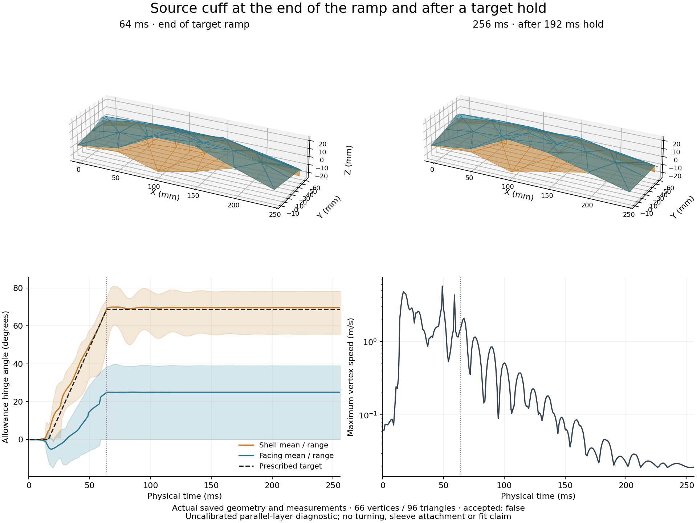

# Pattern-derived 3D solver feasibility

**2026-09-16 · Executed CPU research spike · E0 partly complete; no production solver acceptance**

Latest contact work, 2026-09-18: the optional global-reference experiment supports a pinned IPC barrier and continuous contact guards. The original full-shirt placement fails contact admission; a separate rigid staging experiment now passes static admission without changing source dimensions. Dynamics and assembly remain rejected; see the contact continuation below and the [independent review](../reviews/3d-cloth-contact.md). The default application and Newton experiments are unchanged.

## Verified cuff hold control · 2026-09-23

The latest numerical review repairs contact locality, native candidate completeness, swept triangle nondegeneracy and small-update fold-energy arithmetic. Full Linux discovery passes 427 tests, with five later adversarial replay/coverage tests and six source-generator tests passing separately. The [review](../reviews/3d-cloth-contact.md#numerical-continuation-review--2026-09-23) records failure evidence, independent checks and exact proof limits.

A fresh synthetic source cuff now has a corrected 64 ms sewing/fold baseline and a 256 ms control that holds the same final targets for another 192 ms. The first 67 saved states have identical positions and velocities; both runs use identical numerical source bytes. Independent replay verifies all 373 states and 126,686 exact contact-proof leaves, plus swept triangle nondegeneracy and conservative candidate coverage. Captured settings, source/runtime/verifier hashes and measurements are in the [hold ledger](3d-cuff-hold-results.json).



The hold lowers maximum vertex speed from 1.50883 to 0.0193617 m/s but leaves the facing at 0.094–39.07° against the 68.75° target. Shell angles end at 55.67–78.36°. This is a repeatable target-fidelity failure after substantial motion decay, not a settled or accepted cuff. Source geometry is unchanged; there is no calibrated damping or material validation. The scalar-distance comparison now completes and replays 266 further states with identical source/ramp/contact settings. Facing angles improve to 29.03–62.04°, but maximum speed remains 0.20305 m/s and the adaptive partition differs. Scalar sewing omits layer-side/orientation constraints. The [seam comparison](3d-cuff-hold-results-seams.png) records this diagnostic, not a model acceptance. Review traced an additional asymmetry to incidental crease-child selection for the facing normal frames; explicit body/allowance frame binding is now implemented and independently reviewed; dynamic body-frame controls remain in progress. Actual turning, sleeve attachment and full-shirt execution remain unfinished.

Generate the ledger and figure from the captured runs with `scripts/report-cuff-hold.py --baseline <run> --hold <run> --runtime <runtime.json> --output-prefix <prefix> [--distance-hold <run>]` in a separate plotting environment with `matplotlib==3.10.7`. The script verifies source/input/report/state hashes and the shared trajectory prefix before rendering. `.planning/` trajectories are ignored; the committed summaries do not reproduce missing captured bytes. The first Linux control using defective LBVH is explicitly rejected and excluded from these physical comparisons.

## Explicit frame and contact-buffer controls · 2026-09-23

The facing fold failure has two demonstrated contributors: incidental allowance-side seam frames and substantial repulsion from the contact activation buffer. The extractor now makes the frame region explicit. Body-side binding changes seven source frame triangles while preserving the exact cut mesh, anchors, coefficients and fold targets. Eighteen focused Linux source/frame tests and independent constructive/torque regressions support this correction.

With the same 0.1 mm hard minimum separation and unchanged target/material inputs, reducing the activation buffer from 1 mm to 0.1 or 0.05 mm improves facing angles from 3.23–51.61° to approximately 67.4–68.4° against the 68.75° target. Shell angles improve as well. All three body-frame holds pass full replay: 801 states and 497,588 exact contact-proof leaves, plus independent candidate coverage and swept triangle nondegeneracy. The [frame/contact ledger](3d-cuff-frame-contact-results.json), [figure](3d-cuff-frame-contact-results.png) and [review](../reviews/3d-cloth-contact.md#body-frame-contact-buffer-sensitivity) preserve settings, exact input/code differences, force-law changes, failed replay budgets and proof limits.

This resolves a major diagnostic target-fidelity failure under explicit changed frame/contact profiles. It does not select a calibrated physical model or complete cuff construction. A half-timestep control also passes replay for all 513 states. At the final common saved time, maximum position and hinge differences are 0.174 mm and 0.0284°; the controls retain nonzero motion and do not establish asymptotic convergence. The source perimeter operations depend on sleeve gathering/attachment; the isolated parallel-layer diagnostic still does not execute that dependency, turning through the opening, corner treatment or the remaining garment operations.

### Two-timestep sensitivity

The [temporal ledger](3d-cuff-temporal-results.json) and [comparison figure](3d-cuff-temporal-results.png) isolate initial substeps of 1 ms versus 0.5 ms with identical source, placement, solver bytes, targets and contact parameters. The coarse run accepts 256 steps without rejection; the fine run accepts 513 after one rejection (511 steps of 0.5 ms and two of 0.25 ms). All 256 positive coarse saved fractions occur exactly in the fine capture. Comparison uses the original world coordinates without alignment or interpolation; maxima cover these shared samples, not continuous time or fine-only samples.

At 256 ms, maximum/RMS position differences are **0.173797 / 0.048654 mm**, maximum/RMS hinge differences **0.028385 / 0.007788°**, and maximum velocity-vector difference **0.007252 m/s**. Shared-sample maxima are **0.298685 mm** at 210 ms, **0.106456°** at 79 ms, and **0.058539 m/s** at 29 ms. Fine-run replay verifies 404,784 contact leaves and 49,248 triangle leaves; verifier CPU is 222.335 seconds under the explicit 600-second budget. The final maximum speeds remain 0.013824 and 0.012717 m/s. No convergence order, settled-state error bound, spatial stability or material acceptance follows from one timestep halving.

`scripts/report-cuff-temporal.py --coarse <run> --fine <run> --coarse-replay-log <log> --fine-replay-log <log> --runtime <runtime.json> --output-prefix <prefix> --plot` requires completed replay evidence and checks captured input/source/state/proof/resource hashes. It independently reconstructs every saved hinge angle and final edge ratio. Seven portable synthetic reporting tests pass; an independent review recomputed all 769 saved states' hinge angles using projection onto the plane normal to each hinge edge, and checked every comparison row and figure range. Use the separate plotting environment described above. Raw captures remain ignored research data.

## Source cuff construction phases · 2026-09-23

Source review found that the inspection graph groups sleeve wrist, cuff shell attachment and cuff facing attachment into one `cuff_gather` operation. All four cuff perimeter operations depend on it. Treating that group as an atomic completed seam would attach both cuff layers before turning and consume the intended attachment opening. The prior parallel-layer diagnostic omits this dependency altogether. Neither interpretation is a complete cuff construction.

`scripts/solver_cuff_construction.py` now derives a separate versioned research phase plan without changing the original inspection graph. The explicitly selected `inner-facing-first-outer-shell-last-v1` policy is an interpretation to investigate; the source prose does not uniquely establish those layer roles. Both opening bindings must finish before the facing-to-wrist attachment. Four perimeter stitch phases follow, then turning, shell attachment allowance treatment and final shell-to-wrist closure. The four original perimeter dependencies are explicitly refined from complete gathering to its initial attachment milestone. The source gathering operation remains active and incomplete until final closure; perimeter stitching alone cannot satisfy the source turning requirement.

The shell's 220 mm attachment interval is reserved as the turning opening until closure. The separate 20 mm extension stays in the perimeter and outside the gather. Original source memberships, intervals, operation/dependency identities and instruction text remain recorded. Every existing star member is activated exactly once in the declared plan; activated members must remain held. Pending members must exert no force. The existing global sewing-progress ramp, which retains springs at their initial offsets, does not implement this activation behavior.

`scripts/prepare-cuff-construction.py` captures the full pattern and construction, reconstructs the trusted inventory/assembly, and builds a five-fabric input: sleeve, cuff shell, cuff facing and both opening bindings. It preserves full cut domains, allowance fabric, grain/mirror metadata and unequal source lengths. Eight star-member selectors map to all 40 source-derived sampled constraints without deleting or duplicating rows. It snapshots the generating code and input, verifies source bytes before publication, and requires a fresh private output directory. Parent diagnostic mesh/placement fields are explicitly unused; fresh local rest meshes derive from the captured pattern. No placement is supplied. Other sleeve/body operations, localized closure and interfacing obligations remain visible.

The plan is declarative and remains `accepted: false`, `solverReady: false`. Its unresolved gates include binding wraps/finishing, material-side assignment, interfacing, gather/stitch coverage, perimeter allowances/corners, a turn-compatible seam law, source-derived pulling controls with work accounting, and verified passage through the declared opening. Sparse seam samples do not seal a continuous pocket. A caller cannot complete a physical phase by changing a status field; the plan validator strictly rederives all metadata and provides no execution or acceptance API.

Generate fresh synthetic source with `prepare-cuff-source.py` as documented in the [handoff](3d-engine-handoff.md#resume-and-reproduce), then run:

```sh
OPENBLAS_NUM_THREADS=1 OMP_NUM_THREADS=1 .planning/solver/newton-venv/bin/python scripts/prepare-cuff-construction.py --source-canonical .planning/solver/new-synthetic-cuff-source/canonical.json --side left --attachment-policy inner-facing-first-outer-shell-last-v1 --output .planning/solver/new-cuff-construction-unit
```

Use `--side right` in a separate output directory for the mirrored source roles. An engine-source digest mismatch rejects and requires an explicit migration; an old capture is not silently reinterpreted with changed compiler bytes.

The focused checks pass **18 tests on macOS and Linux ARM**: ten phase/source/tamper tests and eight generator fidelity/failure tests. Independent review verifies the milestone graph, exact 40-row partition, binding stitch-down/apex obligations, full cut domains and rejection of input/code drift before publication. A fresh pinned-Linux left unit contains **227 vertices and 366 triangles** across five instances; its SHA-256 is `981742bdb863a93b4c5e25fbd028758a8c9407b7d390230f649ef573b24f5497`. The raw unit and captured sources remain in ignored `.planning/solver/reviewed-cuff-construction-left-v1/`. Tests validate source correspondence and the declaration, with no numerical execution or acceptance result.

## Pending seam mechanics · 2026-09-23

The offline direct solver accepts explicit activation in `[0, 1]` for each unchanged canonical sewing row. Vector, scalar-distance and material-normal potentials weight energy and all derivatives consistently, including the linear initializer and exact normal-frame curvature. Zero-weight rows retain their coefficients, targets, frames and identities but contribute exactly zero force and stiffness. They skip dynamic anchor/frame evaluation, so an unengaged coincident scalar anchor cannot invalidate an otherwise admitted state. The containing solver still guards every cloth triangle and every required contact path. Scalar targets remain positive and finite even for pending rows.

Diagnostics identify active and pending canonical row indices and report unweighted errors for active rows, with `null` errors for pending rows. The error metric preserves the existing maximum Cartesian-component convention for vector/normal offsets and absolute length error for scalar distances. A small activation cannot disguise a large active seam error. Inputs reject Boolean coercion and positive values that would round to zero on conversion.

`scripts/solver_sewing_activation_schedule.py` supplies an immutable, stateless piecewise-linear schedule with complete ordered row IDs and bounded dyadic fractions. Each row can engage monotonically and remains held; release is forbidden. This module does not itself prove source-row correspondence or completed construction. `scripts/solver_energy_balance.py` accepts both endpoint activations and explicitly changes targets at the old weights, then activation at the new targets, at the previous cloth positions. It separates target work, activation work and fixed-parameter motion. Exact rational accumulation of binary inputs preserves cancelling work; distance lengths and material normals remain validated binary64 geometry samples, not exact real-valued geometry. The generic energy helper can account for release, separately from the no-release schedule, and does not label removed potential energy as dissipation.

The primitive checkpoint was limited to direct mechanics, energy accounting and a standalone schedule. The captured integration below adds an explicit adaptive schedule; raw `sewing_activation` options still reject. No five-fabric construction phase, continuous stitch coverage, turning, material calibration or garment acceptance follows from these primitives. Omitting activation preserves the existing energy-report arithmetic and scope.

Verification: **565 full Linux numerical/supervision tests pass in 201.509 seconds**, including 51 new activation tests. The new cases cover strict primitive/schedule input, independent dense dynamics and frame curvature, unchanged legacy energy reports, Decimal work/precision controls, pending geometry and guard rejection. Documentation and whitespace checks pass. Application, browser and build suites were not rerun for these offline changes.

## Captured seam controls · 2026-09-23

`scripts/solver_sewing_input.py` binds a `captured-sewing-activation-v1` declaration to a non-self-referential SHA-256 of the entire canonical source JSON except `sewingActuation`. The enclosing capture also hashes the complete input bytes. Ordered row identities derive from registration, star member and exact sample fraction; full bundle, source sample, coefficient, compliance and frame metadata are retained. The shared solver compliance comes from the rows; unsupported heterogeneous values reject. Targets are explicit bounded arrays, with positive scalar offsets even for pending rows. The CLI requires both the declaration and `--sewing-activation`, with `--target-fraction 1` to prevent ambiguous legacy scaling.

Generic synthetic inputs establish correspondence to captured canonical JSON only. A cuff construction profile obligatorily invokes `scripts/solver_cuff_source_binding.py`, which reconstructs inventory, assembly, unchanged template/canonical geometry, all registrations, the phase plan and all forty rows. Every selector's five samples must share activation at each knot. The interleaved sleeve-to-shell and sleeve-to-facing rows remain distinct. Cuff source fields cannot select the generic path by changing a recipe option or deleting the profile. Normal sewing requires an explicit ordered canonical triangle, physical instance and mechanical side for every row; source-template triangle identity is additionally derived for validated cuffs. A mechanical offset side is not a textile right-side assignment.

The numerical snapshot contains the required engine dependency tree and registration helper. Source validation rejects missing dependencies, imports cached from another source root and dependency byte changes; it never falls back from an incomplete snapshot to a live checkout. Source coefficients are rederived exactly on the compatible captured numerical runtime. The retained Linux unit rejects native macOS rederivation when BLAS barycentric results differ by approximately `1e-15`; the binder neither rewrites coefficients nor loosens their comparison. Original parent bytes and unrelated historical generator metadata remain outside this validator's proof scope.

The adaptive runner samples the immutable activation schedule at the original interval fractions. It verifies returned control identities, rejects mutation of targets/weights and records endpoint work before publishing an accepted journal outcome. Initial stored seam energy is permitted and recorded; an engaged row need not start in equilibrium. Rejected trials publish no accepted work. Incomplete supervisor recovery removes cached work summaries; replay reconstructs the durable accepted prefix. Strict JSON parsing rejects duplicate keys and nonfinite values before source binding.

The current `scripts/solver_sewing_replay.py` loads outside the captured numerical namespace and imports only the standard library and NumPy. It independently rederives canonical row/control identity, weighted sewing forces, material-frame reactions, active unweighted errors and exact discrete work from adjacent states. Cuff pattern/engine rederivation remains a separate captured-validator boundary; the other cloth force terms still use captured implementations. Exact sewing work comparisons retain the sampled geometry convention. Explicit fused multiply-add reproduces the tested ARM SciPy sparse-row sampling; backend drift fails closed rather than receiving a broad absolute tolerance. These checks do not certify exact real-valued cloth geometry or a fully independent cloth solver.

The captured schedule controls numerical forces. It does not prove that source bindings wrapped, a cuff passed through its opening, an allowance turned inward, a continuous stitch held, or a construction milestone completed. Both the source phase plan and all physical acceptance gates remain explicit and unfinished.

The actual-source capture test includes all **five fabrics, 227 vertices, 366 triangles and forty pending rows**. Proper translations separate the left unit's flat instances; their recorded mirror flags are all false, and rest geometry/winding are unchanged. One `1/1024`-second step passes replay with **366 triangle leaves, 37,550 candidate comparisons and 975 required/observed contact candidates and proof leaves**. All sewing force, energy and work are exactly zero. Passive numerical cloth response still moves a vertex by about `7.78e-9 m`, with maximum speed `7.97e-6 m/s`; this is neither an exact-static claim nor an executed construction phase. The test also rejects missing captured dependencies and raw-type substitutions in the cuff binding report.

Verification before the final namespace hardening: **628 full Linux numerical/supervision tests pass in 268.099 seconds**. The discovery includes the four repaired CLI tests, seven independent combined-control/capture review tests and two actual-cuff capture tests; their focused counts are not additive. The first failed CLI run and successful rerun are retained in ignored `.planning/solver/sewing-capture-cli-sep23-v1.log` and `sewing-capture-cli-sep23-v2.log`; the broad result is `sewing-capture-full-numerical-sep23-v1.log`. No application, browser, build or deployment work is included.

The final namespace fix additionally rejects live and dangling directory links before resolving a source tree. Fourteen source-binding tests pass on both platforms; both actual-cuff capture/replay tests pass again on the final tree. See the [reviewed failure and precise counts](../reviews/3d-cloth-contact.md#current-verification-boundary).

## Sampled sewing path bounds · 2026-09-23

The optional replay argument `--sewing-path-tolerance-m` requests a separate geometric gate for captured scalar-distance controls. `scripts/solver_sewing_sweep.py` uses exact rational arithmetic on the original binary64 source coefficients and saved vertex coordinates. For each active sampled row, it proves the unweighted error bound throughout the affine saved-state path, together with strictly positive anchor distance. It does not substitute the rounded sparse-matrix anchor samples used in numerical force and energy diagnostics.

The target reference is explicitly the exact affine interpolation between independently reconstructed binary64 endpoint target values. This measures planned-ramp tracking; the backward-Euler solve still uses end-of-step parameters, and discrete parameter work retains its target-first convention. Replay rejects intervals spanning an interior activation or assembly knot. Both endpoint weights zero leaves a row pending. Any positive endpoint weight checks the entire closed interval, regardless of its magnitude, including a zero-weight engagement endpoint. The latter rule conservatively rejects coincident anchors at engagement.

Writing squared anchor distance as the quadratic `Q(u)` and the positive affine target as `d(u)`, error at most `epsilon` requires `(d+epsilon)^2-Q >= 0`; it also requires `Q-(d-epsilon)^2 >= 0` on the portion where `d>epsilon`. The verifier splits that lower interval at the exact rational crossing. Endpoints and any interior quadratic minimum give an exact decision without square roots, numerical margins or temporal subdivision. Evidence retains the bound, ordered checked/pending rows, exact rational minimum margins and witness times, and a digest of both states, rows and controls. The caller additionally binds source identity and original interval fractions. A requested failed bound produces no new verified artifact and does not alter the captured numerical run.

Endpoint seam checks alone are insufficient: an anchor moving from `(-3,4,0)` to `(3,4,0)` stays at distance five at both endpoints but reaches four at its midpoint. A held target of five and tolerance one-half therefore rejects. Exact equality at the declared tolerance passes; even a smallest positive activation cannot weight down geometric error.

This is continuous-in-time evidence for the existing sampled material anchors. It does not fill spatial gaps between stitch samples, supply textile-side or finite-thickness seam mechanics, prove wrap/turning/opening passage, or complete a construction phase. A diagnostic engagement may legitimately fail a later held-seam tolerance; declaration and activation alone do not establish that a seam is closed.

Verification: **660 full pinned Linux numerical/supervision tests pass in 315.871 seconds**, including the final captured-source namespace hardening. Eleven primitive and sixteen independent adversarial sweep tests also pass on macOS and Linux ARM. Three Linux CLI tests verify requested success, tight-bound failure without artifact publication, default replay, unsupported-mode rejection and invalid tolerance. The focused counts overlap the full discovery. Logs remain in ignored `.planning/solver/sewing-path-cli-sep23-v1.log` and `sewing-path-full-numerical-sep23-v1.log`. Documentation and whitespace checks pass; application and deployment scope are unchanged.

## First source binding motion · 2026-09-23

The first matched five-fabric binding controls now complete and replay **64 steps each over 128 ms**, with no rejected attempts. Five original left-binding samples remain held at their initial scalar distances near an explicitly chosen, uncalibrated 1 mm stand-off. The other thirty-five source rows remain pending. All **227 vertices, 366 triangles, source coefficients, original compliance and full cut allowances** remain unchanged. The complete source phase plan stays declarative; an initially held sampled attachment does not execute stitching or complete the binding operation.

`scripts/prepare-binding-first-turn.py` prepares both a zero-angle control and a 3° request from a fresh source unit, preserving its input and generating code. The sleeve starts in its source plane; three unused fabric instances are parked by proper translations. A proper source-derived rotation aligns the left strip with its original attachment arc. Three noncollinear, dyadic source-barycentric grippers use **1 N/m** stiffness; all fabric vertices remain free. The textile-side choice is an explicit research declaration, not inferred source semantics. Eight angular samples over the first half of the interval are followed by hold, release over fractions `3/4..7/8`, and a passive tail. Between knots the targets follow chords, with maximum relative contraction approximately `5.3546e-6`; they are not continuous rigid-body constraints.

The [evidence ledger](3d-binding-first-turn-results.json) and [measured comparison](3d-binding-first-turn.png) retain the outcome. At the end of the target ramp, the five local binding-versus-sleeve angles reach **2.901–2.961°**. They subsequently overshoot to **4.485°** and finish at **3.659–3.707°**, with maximum final cloth speed **0.01787 m/s**. The final global relative rigid fit is **3.860°**; local frames and fit residuals remain separate observables. Maximum saved gripper tracking error is **0.5394 mm**. This is a held attachment during a small motion, not a settled or accurately tracked 3° pose.

Independent complete-triangle separation reaches a minimum saved gap of **0.21914 mm** at fraction `3/4`; all saved contact energies are zero. The original source coefficient geometry gives maximum saved scalar target error about **1.325e-12 m**, while saved cross-seam material-correspondence offsets reach **15.47 micrometres**. This directional offset is not constrained by a scalar distance alone and is not a measurement of physical thread slip. Across saved states and all pieces, principal stretches span approximately **0.9999994351–1.0000005741**. These are measurements of this uncalibrated mesh/material control, not physical precision, convergence, or continuous spatial stitching claims. The zero-angle control has only the initial numerical relaxation, reaches zero reported final velocity, and stays near its initial 1 mm gap.

Replay independently verifies **128 accepted transitions, 124,288 contact-proof leaves and 46,848 triangle nondegeneracy leaves** across both runs. A separately requested **10 micrometre** exact temporal distance-error bound passes for every held sampled row; this research diagnostic threshold is not a physical sewing tolerance. The first broad-phase candidate count is 971, and coverage is rederived for every interval. Saved-state surface diagnostics additionally consider every strip/sleeve triangle pair, using exact binary-input feature/intersection predicates and conservative AABB pruning; they do not substitute for continuous contact replay.

Held sewing controls perform exactly zero parameter work. The driven grippers perform `4.233202362181884e-7 J` of target parameter work; release removes `2.1851169973350042e-7 J` of stored potential, leaving net parameter work `2.0480853648468798e-7 J`. Released potential is not claimed physical dissipation. Gripper activation, force and energy are exactly zero from fraction `7/8`; the saved state chain and reconstructed velocities continue without a reset, and release does not set cloth velocity to zero. Worker CPU times are approximately **8.086 s** and **25.833 s**, with replay CPU **42.654 s** and **45.228 s** for zero and 3° controls respectively.

`scripts/analyze-binding-first-turn.py` binds current replay reports, all verifier identities, full states, actual initial placement and source/control recipes. It rederives the source-axis target trajectory and compares complete normalized source JSON, allowing only the explicit angle-dependent fields. It reports independent source-frame angles, offsets, proper rigid fits, rest-based strain and exact saved surface separation. It checks existing replay artifacts rather than rerunning their proofs. The full comparison and snapshots stay in ignored `.planning/solver/`; only the compact ledger and figure are committed.

Reproduce in the pinned Linux ARM runtime: prepare a fresh parent with `prepare-cuff-source.py`, then a left unit with `prepare-cuff-construction.py --source-canonical <parent>/canonical.json --side left --attachment-policy inner-facing-first-outer-shell-last-v1 --output <unit>`. Run `prepare-binding-first-turn.py --source-unit <unit>/unit.json --angle-degrees 0 --output <zero-input>` and repeat with angle `3` and a separate input directory. For each input, run `spike-contact-continuation.py --canonical <input>/canonical.json --placement <input>/placement.json --output <run> --contact-model rest-filtered --ccd-profile temporal-separation-tight-inclusion --activation-distance-m .0001 --minimum-distance-m .0001 --pressure-pa 10000 --target-fraction 1 --subdivisions 64 --step-seconds .128 --sewing-mode distance --sewing-activation --material-grippers --max-attempts 256 --max-depth 8 --max-evaluations 100 --cpu-limit-seconds 180 --wall-limit-seconds 240`. Independently replay each run with `replay-rest-filtered-continuation.py <run> --sewing-path-tolerance-m .00001 --cpu-limit-seconds 180`, then compare using `analyze-binding-first-turn.py --control <zero-run> --driven <three-run> --output <comparison.json>`. All outputs must be fresh. Historical input bytes require their captured generator/source snapshots; a changed generator has a different identity.

The next numerical work is to resolve motion tracking and settling with explicit trajectory/time/tool controls, then establish temporal and spatial stability. Larger whole-strip rotations approach allowance contact; refinement, fold/wrap paths, stitch-down receivers and the missing underarm/apex prerequisite require explicit source-preserving treatment. Neither these runs nor small seam errors complete binding, turning, material/contact response or full-shirt acceptance.

Verification: **697 full pinned Linux numerical/supervision tests pass in 325.495 seconds**. The 37 added tests cover source-frame observations, complete triangle separation, fresh source input and snapshot reproduction, matched reference admission, forged controls/clearance and exact released-tool force/energy. The 24 portable tests pass on macOS; thirteen fresh-source cases explicitly require Linux rather than relaxing source coefficients. Independent reviews of both observation helpers and the reporter found and repaired reference-binding and force-aggregation gaps before the final runs. The full-suite log is ignored at `.planning/solver/binding-first-turn-full-numerical-sep23-v1.log`. Documentation and whitespace checks pass; these offline changes do not require application or deployment validation.

## Fixed-timestep binding time control · 2026-09-23

The next declared experiment dilates the original target path fourfold: **512 ms / 256 steps**, retaining the **2 ms** nominal timestep. Turn, hold, release and passive intervals become `0..256`, `256..384`, `384..448` and `448..512 ms`. The complete twelve-knot target/activation recipe, source geometry, initial placements, original forty rows, five held targets, three 1 N/m grippers and material/contact settings remain unchanged. There is no easing curve or new damping coefficient. The fixed termination time and final sixteen-millisecond observation window are chosen before inspecting the result.

The generator exposes `--time-policy original-128ms-v1|fourfold-512ms-v1`, recording an exact versioned duration/step declaration. Historical inputs without this declaration are admitted only at the original 128 ms / 64 steps. The reporter rejects declaration/run disagreements, checks actual transition durations and distinguishes adaptive subdivisions from the unchanged nominal grid. Each duration retains a matching zero-angle control. Cross-duration comparison requires all non-timing source and physical settings to match; equal fractions represent equal control progress, not equal elapsed time.

The slower run uses explicit supervision budgets of 1,024 attempts, 360 CPU seconds and 480 wall seconds. These bounds permit retry headroom beyond the 256 planned steps; they do not change the physics. Replay retains the original 10 micrometre sampled-distance tolerance. Longer evolution also permits more of the existing backward-Euler numerical dissipation. That effect is distinct from release parameter work and does not establish calibrated material damping or convergence.

Both slower controls complete **256 steps with no rejected attempts**, and both independently replay. The [comparison ledger](3d-binding-fourfold-time-results.json) and [figure](3d-binding-fourfold-time.png) retain the original and slower controls, exact source/settings comparison, all saved observation times and artifact identities. `scripts/analyze-binding-time-controls.py` invokes the current first-turn reporter for all four runs, rejects any changed non-timing source/control fields or numerical settings, and requires every actual step to remain exactly 2 ms. Generator identity and explicit supervision budgets are recorded separately. It does not reinterpret an adaptive run as a fixed-step experiment.

| Saved driven-control observation | Original 128 ms | Fourfold 512 ms |
| --- | ---: | ---: |
| Peak local relative turn | 4.48530° | 3.16491° |
| Largest hold error against 3° | 1.48530° | 0.16491° |
| Final five local angles | 3.6590–3.7073° | 3.0456–3.0543° |
| Peak gripper error | 0.53936 mm | 0.07268 mm |
| Final maximum cloth speed | 17.8691 mm/s | 0.47717 mm/s |
| Largest same-row angle range in final 16 ms | 0.45346° | 0.007971° |
| Minimum complete-surface separation | 0.21914 mm | 0.44805 mm |

Tracking improves, but residual relative motion remains. Across the slower run's entire **64 ms passive tail**, the largest same-row angle range is **0.031476°** and peak speed is **0.54583 mm/s**. The final sixteen-millisecond window has nine saved states in both controls; its peak speed is **0.49872 mm/s** for the slower run. Reporting the window range separately from net endpoint movement prevents an oscillation from disappearing in a single endpoint difference. No settled-pose criterion or construction milestone is accepted. This changes the physical input duration rather than refining the timestep and is **not a temporal convergence study**.

The slower driven control retains maximum saved scalar target error **2.0342e-13 m**, maximum absolute cross-seam material-correspondence offset **6.5477 micrometres**, and saved principal stretches **0.9999999558–1.0000000679**. All saved contact energies remain zero. Independent replay checks **512 new transitions, 497,152 contact-proof leaves and 187,392 triangle leaves**, with the unchanged exact temporal sampled-seam bound. The zero-angle control is stationary over its hold and passive tail after the same initial rounding-scale relaxation.

Held sewing parameter work remains zero. Slower driven gripper target work is **1.7241115547450922e-8 J**; release removes **1.1372392446155177e-9 J**, yielding net parameter work **1.6103876302835405e-8 J**. Released activation, nodal force and stored energy remain exactly zero. Worker CPU times are **27.007 s / 82.843 s**, with independent replay CPU **171.316 s / 172.956 s** for zero/driven respectively. These are uncalibrated numerical energy and runtime observations.

Reproduce from the same five-fabric source unit using `prepare-binding-first-turn.py --time-policy fourfold-512ms-v1` for separate zero/3° inputs. Use the preceding first-turn numerical command with `--subdivisions 256 --step-seconds .512 --max-attempts 1024 --cpu-limit-seconds 360 --wall-limit-seconds 480`; keep all other physical/solver arguments unchanged. Replay each with `--sewing-path-tolerance-m .00001 --cpu-limit-seconds 360`. Run `analyze-binding-time-controls.py --original-control <original-zero-run> --original-driven <original-three-run> --slower-control <slower-zero-run> --slower-driven <slower-three-run> --output <comparison.json>`. Historical input identities require their preserved source snapshots. Full captures, comparison and logs remain ignored under `.planning/solver/binding-fourfold-*-sep23-v1*`.

Verification: **716 full pinned Linux numerical/supervision tests pass in 288.967 seconds**. The 34 focused input/reporter/comparison tests include both-policy source-snapshot reproduction, unchanged complete target recipes, malformed/mismatched timing declarations, altered source/material/frame/settings rejection, exact saved-grid admission and fixed-window versus net-angle-change cases. Eighteen portable cases also pass on macOS; sixteen fresh-source cases require Linux. Adversarial review found and repaired Boolean values passing as numerical zero/one in the comparison's saved-time grid. The tests using mocked reporter records validate comparison logic, not replay proofs; the retained actual runs provide the separate path evidence. Full-suite log: `.planning/solver/binding-fourfold-full-numerical-sep23-v1.log`. Documentation and whitespace checks pass; no application or deployment changes are included.

## Extended binding hold · 2026-09-23

The next fixed control keeps the 256 ms turn and extends only the hold before release. `extended-hold-1024ms-v1` requests **512 steps at 2 ms**: motion `0..256 ms`, hold `256..896 ms`, release `896..960 ms`, and passive continuation `960..1024 ms`. Release and passive intervals retain their previous 64 ms durations. The initial 384 ms must reproduce every saved position and velocity of the preceding 512 ms control exactly. This is a predeclared experiment with a fixed termination time, not a stop-on-settled policy. No stiffness, damping, source geometry, contact parameter or numerical tolerance changes.

Both longer controls complete and independently replay **512 steps without rejection**. The [evidence ledger](3d-binding-extended-hold-results.json) and [comparison figure](3d-binding-extended-hold.png) retain the negative result: the longer driven hold finishes at **0.477643 mm/s**, essentially unchanged from **0.477175 mm/s**. Its five final relative angles are **2.946–2.955°**. Maximum same-anchor angle range over the released 64 ms tail increases from **0.031476° to 0.056263°**; over the final sixteen milliseconds it increases from **0.007971° to 0.012401°**. Holding longer reduces the angle oscillation while tools are active but does not establish equilibrium after release. No additional duration tuning or implicit damping is justified by these results.

Peak relative turn remains **3.164908°** and minimum saved strip–sleeve gap remains **0.448053 mm**, both occurring before the schedules diverge. Maximum sampled sewing-distance error remains **2.0342e-13 m**; all saved contact energies remain zero. These small sampled errors and clearances do not supply active wrapping contact, continuous stitching or a completed binding. The zero-angle control again stops after initial numerical relaxation.

`scripts/analyze-binding-hold-control.py` admits all four runs through the current source/replay reporter, checks the fixed phase times and complete 2 ms grids, and permits only the declared timing and supervision differences. It requires identical complete captured numerical-source digests and exact canonical JSON equality of every position and velocity over the first **192 transitions / 384 ms**, separately for zero and driven controls. Each longer replay verifies **497,152 contact-proof leaves and 187,392 triangle-path leaves** with the unchanged **10 µm** sampled seam-path tolerance. The comparison does not rerun these proofs; it validates their current artifact and verifier identities.

The capture snapshots every `solver_*.py` file, including unused helpers. Adding the refinement and velocity-observation modules therefore changed the complete snapshot identity even though the solver dependencies were unchanged. To preserve strict comparison admission, both earlier 512 ms controls were repeated using the longer control's frozen captured entrypoint. Each repeats all 256 historical positions/velocities exactly and passes replay with 248,576 contact-proof leaves. This avoids weakening capture identity or editing historical artifacts. The new helpers in that frozen snapshot are not imported by the numerical run; later diagnostic repairs do not alter those captured bytes.

Reproduce from the same source unit using `prepare-binding-first-turn.py --time-policy extended-hold-1024ms-v1` for separate zero/3° inputs. Retain the fourfold control's physical arguments and use `--subdivisions 512 --step-seconds 1.024 --max-attempts 1024 --cpu-limit-seconds 360 --wall-limit-seconds 480`. Replay with `--sewing-path-tolerance-m .00001 --cpu-limit-seconds 720`. Prepare or repeat the 256-step baseline from the identical complete numerical snapshot, replay it, then run `analyze-binding-hold-control.py --previous-control <baseline-zero> --previous-driven <baseline-three> --held-control <held-zero> --held-driven <held-three> --output <comparison.json>`. All output directories must be fresh. The sixteen focused hold tests cover complete source/phase admission, exact prefix checks and tampering; mocked fixtures test comparison logic rather than proving replay.

Final verification after the velocity repairs below: **756 full pinned Linux numerical/supervision tests pass in 347.358 seconds**. The preceding 753-test run passed before those three regressions were added and is superseded by this final run. Independent review additionally reconstructs the actual 192-transition prefix for both roles and confirms current reporter/artifact hashes. The retained log is `.planning/solver/binding-extended-hold-full-numerical-sep23-v2.log`; documentation and whitespace checks pass. Application, browser and deployment scope are unchanged by these offline research additions.

## Rigid-velocity observation boundary · 2026-09-23

`scripts/solver_rigid_velocity_diagnostics.py` provides a separate mass-weighted instantaneous velocity decomposition into translation, rotation and residual motion. It records reconstruction, momentum, kinetic partition and orthogonality residuals. Planar noncollinear supports are admitted because their three-dimensional inertia is positive definite; collinear or ill-conditioned supports reject. Optional normal projection uses the explicitly supplied direction. The primitive neither changes forces nor supplies material damping, captured mass validation or an acceptance threshold. Finite-step velocities can retain radial residuals even for finite rigid pose changes, so this observation is distinct from a finite-pose rigid fit.

Independent review exposed two dynamic-range bugs despite the original thirteen passing tests: subnormal normalized masses plus anchored-mean cancellation could understate kinetic energy by about **35%**, and squared-norm underflow could report zero speed for a representable **1e-200 m/s** velocity. The repaired helper rejects subnormal normalized masses, sums original weighted terms with compensated summation and uses stable hypotenuse evaluation for speed maxima. Three added regressions retain both counterexamples and an admitted extreme-mean case. All **sixteen focused tests pass on macOS and Linux**, and independent checks compare nearby admitted cases against exact binary-input rational means/energies. Positive derived energies or inertia that cannot be represented reject. This is a bounded binary64 diagnostic, not an exact-rational certificate or a claim that every dynamic range is supported.

## Binding crease preprocessing · 2026-09-23

`scripts/solver_binding_refinement.py` now derives a separate **non-executable descriptor** from the completely validated, unplaced five-fabric source unit. It applies the existing straight-line splitter first to the named right attachment path at source x=20 mm, then to the named left finish path at x=0. Both lines extend through the original full cut boundary, including end allowances. Choosing these paths as creases is an explicit research decision; the source annotations do not supply their fold angles or a final stitch-down recipe.

The original strip's eleven vertices remain an unchanged prefix. Two recorded stages yield **29 vertices / 44 triangles**, with both crease chains retained in source-path orientation. A future canonical rebuild would contain **245 vertices / 398 triangles**; the descriptor does not emit that executable mesh. Every final vertex has rationally composed weights over the original strip, and every child face names its original parent. Binary64 reconstruction residuals and weight-sum residuals are measured without clamping or normalization. Strict validation rederives the complete descriptor, rather than trusting supplied hashes or residuals. The underlying splitter still uses tolerance-based line classification and geometric union checks; this is not an exact-real domain proof.

The complete original source-unit and forty-row identities, plus the other four local mesh identities, are retained. No seam row, gripper, frame or source phase changes. Executable refinement still requires remapping five binding-side anchors with coefficient-pullback checks, explicit crease-side frame choices, gripper rebinding, updated global offsets, source-capture/replay integration and mechanical/contact validation. Matching only a flat point would not preserve its interpolation under deformation. Two current grippers lie on the proposed x=0 crease and therefore cannot themselves drive the finish allowance about that crease.

The [retained synthetic descriptor](3d-binding-refinement-results.json) and [mesh comparison](3d-binding-refinement.png) record this preprocessing result. Maximum coordinate reconstruction residual is **1.3877787807814457e-17 m**; it is explicitly retained, not rounded into an exact claim. Eight focused tests pass on macOS and pinned Linux ARM, including independent nonplanar coefficient composition and repaired descriptor attacks. A separate review rejects thirty-four additional descriptor mutations and confirms both chains, with seven attachment segments and nine finish segments. An exact binary-input area audit finds nonzero parent-area residuals up to approximately **1.951e-19 m²**, consistent with the documented geometric limitation. No dynamics or source phase is executed by this descriptor.

## Binding anchor remapping · 2026-09-23

`scripts/solver_binding_remap.py` now derives five binding-side anchors from the immutable source rows and the two-stage crease lineage. It solves the original-parent coefficient equations exactly over the binary inputs, exhausts all eligible child triangles and rejects every negative candidate. It does not locate a rounded flat point and then replace the source weights. Equivalent shared-edge candidates may share an anchor only when their sparse refined-vertex operators are exactly equal; selecting an anchor identity never selects a normal frame or crease side.

The pinned Linux source selects child triangles **25, 35, 40, 14 and 5** for its five anchors. Row 1 exposes why the distinction matters: coefficient correspondence selects allowance-side child 35, while containment in the stored flat mesh selects body-side child 37. The latter needs a tiny negative coefficient to reproduce the original material operator. Clipping that coefficient or forcing source sums to one would change the source. Compatible native macOS generation has slightly different original binary coefficients and therefore different valid exact child choices; each is independently rederived without relaxing cross-runtime source identity.

An explicit `exact-coefficient-nearest-binary64-v1` policy converts each nonnegative rational child weight once, with nearest-even rounding. Positive support cannot underflow to zero; no normalization or clamping is allowed. The descriptor retains exact weights, numerical weights, coefficient pullback residuals and bounds, source/derived sums, and separate stored-coordinate reconstruction residuals. Ideal rational pullback preserves arbitrary original nodal values interpolated through the recorded lineage. Binary64 coefficients are measured approximations, and neither claim extends to arbitrary independently moving refined vertices. Twelve focused tests pass on both platforms, using independent exact solvers, nonplanar probes, rounding-cell checks and repaired-metadata attacks.

`scripts/solver_binding_source.py` separately builds the versioned `source-left-binding-refined-unit-v1` numerical input: **245 vertices / 398 triangles**, with immutable `baseUnit`, distinct numerical meshes and strictly rebuilt global offsets. All original source templates, annotations and forty rows stay nested in the base. Thirty-five derived local rows remain canonically identical; five negative anchors use the declared numerical weights while retaining registration, member, fraction, original compliance and opposite-side coefficients. Separate source/numerical row hashes and mesh identities prevent stale source-template indices from being relabeled as refined geometry. Strict full rederivation rejects even repaired hashes. Captured namespace checks require the complete source/binder dependency closure and reject live fallback or mixed cached modules.

The sewing input and independent sewing verifier recognize the new profile and reject reserved-field/profile downgrades. Refined vector and scalar-distance binding require the source validator; independent derivation additionally requires a separately loaded current remap audit. Normal-offset sewing rejects until explicit crease-side frame semantics are implemented. `scripts/solver_binding_remap_replay.py` independently reconstructs both raw interpolation stages, candidate equations, rounding and all derived rows without importing the remap implementation or pattern engine. Pattern/split geometry rederivation remains the separately captured source validator's responsibility.

The [pinned Linux evidence](3d-binding-remap-results.json) retains the five complete remap witnesses, forty original/numerical row identities, global offsets, current source/helper identities and the separate independent audit. The largest absolute coefficient pullback residual after conversion is **1.1817803680091998e-17**. Rows 0, 1 and 4 have nonzero conversion residuals; rows 2 and 3 convert exactly. Source and derived weight sums remain explicit, including any translation leakage; rounded reporting values do not establish exact equality. The independent audit passes twelve focused tests on both platforms and verifies all twenty-three original-parent child candidates. Eight fresh-source builder tests and eight integration/admission tests additionally check immutable originals, rebuilt indices, dependency fallback rejection, profile downgrade, callback identity/immutability and unsupported frames. The latter integration cases pass alongside twenty-nine existing sewing-input/replay tests on both platforms.

Runner and main replay entry-point integration remain **unapplied**. Automatic approval review rejected that specific patch twice for insufficiently explicit authorization to change the validation boundary; the inert, reviewable proposal is retained in ignored `.planning/solver/binding-refined-entrypoint-proposal.patch`. No refined numerical trajectory, captured replay, fold, wrap or construction milestone is claimed. The subsequent gripper descriptor below advances source/control correspondence; crease-side frames and mechanical/refinement validation remain open.

Final verification of this bounded implementation passes **796 full pinned Linux numerical/supervision tests in 422.720 seconds**. All forty new tests are included: twelve remap, twelve independent audit, eight source-builder and eight binder integration cases. The final native source-builder run also passes all eight tests after namespace closure and frame rejection were frozen. Full log: `.planning/solver/binding-remap-full-numerical-sep23-v1.log`. Independent review confirms the retained source/derived hashes, all twenty-three candidates, forty row witnesses and current dependency identities. Documentation and whitespace checks pass. These results do not test the unapplied entry-point proposal or an executed refined trajectory.

## Binding gripper migration · 2026-09-23

`scripts/solver_binding_gripper_remap.py` derives a bounded, non-executable descriptor from an original cuff source with one to sixteen declared material grippers and a validated bare refined source core. It requires exact correspondence with every immutable base-unit field, then binds the original mesh and complete gripper recipe through the existing primitive validator. For a refined binding grip it enumerates only children of that grip's declared original triangle, solves the full original coefficient operator exactly and applies the previously declared nearest-binary64 policy. Equivalent edge candidates may select the same point operator; they do not choose a normal frame or material side. Other instances keep their original ordered local triangle and raw weights while rebuilding the global triangle index.

Only mesh identity, triangle index and derived weights may change in the numerical recipe. Targets, activation, knot fractions, release, stiffness, identities and order remain canonically identical. Original and refined inputs remain unchanged. Whole-source hashes bind extra original metadata, but this migration does not validate old placement, other controls or historical trajectory semantics. The strict descriptor validator rederives every field; a self-consistent replacement hash alone cannot authorize a different material point.

The separate `scripts/solver_binding_gripper_remap_replay.py` imports only the standard library. It independently composes raw interpolation stages, checks intermediate and ultimate parent support, solves child coefficients with determinants, verifies nearest-even conversion against adjacent floats and reconstructs all control and residual fields. Source-pattern and split-geometry validity remain the separately captured strict source validator's responsibility. Its verified result is an arithmetic/control correspondence audit, not captured solver replay.

The [pinned Linux ledger](3d-binding-gripper-remap-results.json) retains the complete three-grip descriptor, source/core identities, independent audit and two counterexamples. Wrist, apex and allowance grips migrate to canonical triangles **75, 55 and 86** with weights `[0.5, 0, 0.5]`, `[0, 0.5, 0.5]` and `[0.375, 0.125, 0.5]`. All three have exactly zero coefficient pullback residual. Stored coordinates introduce a separate allowance-anchor difference of `(2^-61, 2^-59, 0)` metres, with norm **1.788112e-18 m**; the other two remain exact. This small observation is retained rather than treated as zero.

An added synthetic sleeve grip exposes a materially larger indexing error: original triangle **200** must become **232**. Keeping 200 still passes the generic binder because it names a valid sleeve face, but moves the material anchor by **0.2309048 m**. Cuff triangles preceding the refined strip retain their indices, so a uniform global shift is also incorrect. A separate synthetic binding grip with raw weights `[0.1, 0.2, 0.7]` requires nonexact conversion: maximum pullback residual is **2^-55**, and the derived weight sum differs from the original by **−2^-55**. Neither source nor derived coefficients are normalized to conceal that difference. These counterexamples change declared test inputs and are not alternate historical trajectories.

For anchor difference `delta`, old spring residual `r` and `c = stiffness × activation`, unchanged controls still permit force change `−c × delta` and energy change `c × (dot(r, delta) + dot(delta, delta)/2)`. Exact coefficient pullback only transfers the original operator when refined nodal values follow the recorded interpolation; freely moving refined nodes introduce additional degrees of freedom. World placement, force/work comparisons and a guarded captured refined motion therefore remain required. No controls are installed by this descriptor, no rest geometry is reshaped and no construction phase is accepted. The proposed runner/main-replay patch remains unapplied.

Reproduce on the compatible pinned Linux runtime: generate the original source unit and three-grip control using the preceding first-turn instructions, call `build_binding_source(base_unit)`, then `build_binding_gripper_remap(original_control, refined_core, subdivisions=256)` and `verify_binding_gripper_remap` on the same three inputs. Separately run `validate_binding_source` and `verify_binding_remap` on the bare refined core. This regenerates source-bound evidence with new artifact identity; it does not recreate the retained historical run bytes. The ignored retained inputs and audit files are under `.planning/solver/binding-gripper-remap-sep23-v2/`.

Final verification passes **820 full pinned Linux numerical/supervision tests in 361.034 seconds**, including eleven new producer and thirteen independent-audit tests. All twenty-four also pass natively on macOS. The tests cover nonplanar coefficient action, nonzero nearest conversion, non-unit source sums, unchanged release/targets/stiffness, same-ancestor intermediate-parent substitution, stale global indices, repaired hashes, malformed raw JSON, bounded schedules and isolated standard-library execution. Independent review reconstructs the main descriptor and both counterexamples, checks every retained artifact and source/helper identity, and confirms unchanged original capture linkage. Review found and repaired an omitted seam-auditor digest in the initial ledger; v2 retains byte-identical numerical artifacts with the complete verifier provenance. Full suite log: `.planning/solver/binding-gripper-full-numerical-sep23-v1.log`. Documentation and whitespace checks pass. No application, browser, production engine or build checks were rerun for these isolated offline helpers; nothing is deployed.

## Compliant source-material controls · 2026-09-23

The offline reference now has an explicit virtual-gripper term, `scripts/solver_material_grippers.py`. Each bounded anchor names its physical instance, canonical triangle and unchanged barycentric weights. Its quadratic potential is `0.5 * stiffness * activation * |material point - target|²`. Targets and activation follow a captured, stateless piecewise-linear schedule. Zero activation contributes zero force; release does not reset position, velocity, rest geometry or the other cloth forces. These are compliant external controls, not moving fixed vertices or a representation of solid tool geometry.

`scripts/solver_gripper_input.py` binds the declaration to an exact hash of the captured rest coordinates, ordered triangles and instance offsets. Full canonical/placement and captured-code hashes remain in the enclosing research manifest. The CLI requires both `--material-grippers` and a matching `gripperActuation` declaration. Free positive-mass cloth is required; fixed-support reactions are not implemented. Schedule knots must align with the initial dyadic grid, and subdivision/depth limits must remain within the schedule's exact fraction domain. Rejected trials cannot advance the controls or accumulate work.

The guarded global solver includes the gripper force, curvature and stable energy difference alongside sewing, membrane, bending, fold and contact terms. Every accepted adaptive transition records energy and external linear impulse before the journal outcome. Work uses a declared discrete order: change targets at old activation, then change activation at the new targets, both at the previous cloth positions. Exact rational evaluation of the binary inputs preserves cancelling parameter work. Released potential energy is reported separately; it is not claimed physical dissipation or recovered actuator energy. A completed run sums accepted transitions only. Interrupted recovery omits a potentially stale worker aggregate; replay reconstructs the accepted prefix.

The current independent `scripts/solver_gripper_replay.py` loads outside the captured numerical namespace and imports no solver implementation. It rederives source bindings, controls, quadratic forces, reactions, discrete work and external momentum accounting. The enclosing replay adds its independently assembled gripper gradient to the stationarity check and retains exact contact-candidate coverage and every-triangle path checks. Other elastic/contact forces and non-gripper energy terms still use captured implementations; this is not a fully independent cloth model.

The retained [two-layer control ledger](3d-material-gripper-contact-results.json) contains a synthetic six-vertex, two-triangle fixture with six 0.5 N/m vertex grippers. It completes 80 ms in eight accepted steps without rejection, in 2.849 worker CPU seconds. The layers start 1.953125 mm apart; their symmetric targets approach 0.453125 mm before release. With a 1 mm activation buffer beyond the 0.1 mm collision core, the smallest saved vertical layer gap is **1.097911 mm** and peak saved contact energy is **4.107915e-10 J**. This demonstrates contact response near activation, not motion near the collision core. Final edge-length ratios are 1.0 and maximum speed is **4.127391e-5 m/s**; release does not stop or reset the cloth.

Replay checks all eight states, with maximum reconstructed residual **8.612702e-7 N**. It verifies sixteen triangle-path leaves. All 216 independent swept primitive comparisons exclude contact-core candidates, so this run has **zero narrow contact-proof leaves**; the exclusion is explicitly recorded. Total discrete parameter work is **2.937478e-7 J**, including **1.562131e-7 J** removed during release. These are numerical control-energy quantities, not a material damping or physical tool-work measurement.

The source is reproducible from `GripperContinuationCliTests.contact_fixture()` in `scripts/test_solver_gripper_continuation_cli.py`. Serialize it as canonical JSON and write a matching placement file with `placedMeters` and the canonical file's SHA-256. Run `spike-contact-continuation.py` with the ledger's numerical arguments and fresh input/output paths, then `replay-rest-filtered-continuation.py <run> --cpu-limit-seconds 30`. The exact retained bytes and generator copy are in ignored `.planning/solver/material-gripper-contact-source-v1/`; run/state/source/replay artifacts are in `.planning/solver/material-gripper-contact-linux-v1/`. The ledger records hashes, runtime, every saved diagnostic and its limited scope. It alone cannot replay the trajectory.

This primitive does not execute the five-fabric construction plan. Actual binding paths, material-side declarations, continuous seam coverage, true per-member sewing activation, a turn-compatible seam law, interfacing and passage through the reserved opening remain required. Application output remains placement inspection.

Verification: **61 focused Linux gripper tests** pass, including analytic/derivative, independent Decimal cancellation, source/parameter tampering, adaptive rollback, interruption, capture and replay cases. The final complete Linux numerical/supervision run passes **514 tests in 203.919 seconds**; the [review](../reviews/3d-cloth-contact.md#material-gripper-integration-review) retains the repaired findings and initial failed run. Documentation and whitespace checks pass. Application, browser, production engine and build suites were not rerun for these offline research-only changes.

## Decision

Select **Newton 1.6.0 / Warp 1.17.0 / SolverVBD on CPU** as the implementation candidate. It installs headlessly on this host, consumes application-owned rest meshes, preserves their rest tensors, supports independent physical particles, sewing springs and cloth self-contact, and produces ordinary glTF without model-generated geometry. This is a candidate selection, not an accepted full-shirt assembly or drape claim.

Reject the existing optional GarmentCode Warp fork for product integration: its pinned [license §3.3](https://github.com/maria-korosteleva/NvidiaWarp-GarmentCode/blob/63baf6855efdd89b2834b74640f84b3bb0d86b50/LICENSE.md) restricts use to research/evaluation. Its [README](https://github.com/maria-korosteleva/NvidiaWarp-GarmentCode/blob/63baf6855efdd89b2834b74640f84b3bb0d86b50/README.md) identifies Warp 1.0.0-beta.6 as its base and describes manual compilation. The separate application geometry source remains at its existing lock. No source from this simulation fork is copied into the application, and its runtime was not built or exercised after the license gate failed. CPU-only availability is **not** the reason for rejecting it; its source supports CPU.

The dedicated [engine plan](../plans/pattern-derived-3d-engine.md) still governs acceptance. Full-component turning, thickness-aware contact, calibrated anisotropy, body interaction and worker isolation remain open gates. A successful two-panel experiment cannot satisfy those gates.

Measured reports, including the failed older source mesh and final source-bound reruns, are retained in [the numerical ledger](3d-solver-spike-results.json). Historical characterization and final provenance-checked reports are distinguished in that file.

## Reproduction and ownership

The four microfixtures use procedural synthetic rectangles. An additional holdout calls the application's actual `compile_shirt` and `mesh_panel` functions for `placket_left` and `frill_left`, with explicit synthetic measurements. Both paths retain local rest coordinates, source panel/vertex identities and grain directions; actual-source artifacts also retain the mesher's source interpolation weights and independent rest-validation report. No body assets, private measurements, upstream garment assets, textures or weights are loaded. The spike is separate from the application's existing Python runtime and does not modify the live checkout.

From the isolated repository root:

```sh
python3 -m venv .planning/solver/newton-venv
.planning/solver/newton-venv/bin/pip install -r scripts/solver-spike.requirements.txt
timeout --kill-after=5s 300s .planning/solver/newton-venv/bin/python scripts/spike-3d-solver.py --output .planning/solver/baseline
timeout --kill-after=5s 300s .planning/solver/newton-venv/bin/python scripts/spike-3d-solver.py --output .planning/solver/refined --fixture gather --profile gather-refinement --steps 480 --verify-profile refined-gather-v1
timeout --kill-after=5s 300s .planning/solver/newton-venv/bin/python scripts/spike-3d-solver.py --output .planning/solver/holdout --fixture gather --profile gather-refinement --steps 960 --timestep-denominator 480 --translated --verify-profile refined-gather-v1
timeout --kill-after=5s 300s .planning/solver/newton-venv/bin/python scripts/spike-3d-solver.py --output .planning/solver/source-gather --fixture source-gather --profile gather-refinement --steps 960
.planning/solver/newton-venv/bin/python -m unittest discover -s scripts -p 'test_solver_spike_geometry.py'
.planning/solver/newton-venv/bin/python scripts/check-solver-spike-lifecycle.py --python "$PWD/.planning/solver/newton-venv/bin/python" --output .planning/solver/lifecycle
```

Output directories hold canonical JSON, self-contained glTF 2.0 display derivatives and a measured `report.json`. Final reports capture script, oracle, profile and applicable engine-module digests before execution and reject changes during a run; profile assessments embed the frozen contents. Canonical geometry is metres, Z-up; glTF applies the proper rigid conversion to Y-up. Binary vertex/index buffers are embedded, with no external requests. Source mappings live in canonical JSON rather than being inferred from render geometry. Browser rendering itself is not an executed acceptance check for this research script.

The script enforces 1–1,000 steps, 240 CPU seconds and 4 GiB address space. The external `timeout` bounds wall time. These are **research process limits**, not a queue/concurrency capacity recommendation and not a network/filesystem sandbox. The lifecycle harness launches with only PATH/LANG/HOME, avoiding application credentials; the standalone spike inherits its caller's environment and must not be used as a production worker entrypoint.

## Host and dependency evidence

The actual host exposed only the Warp `cpu` device. Warp reported no NVIDIA driver; `nvcc` was absent. Python was 3.12. The cgroup reported 512 GiB memory and a CPU quota of 64 CPU-seconds per second; these unusually large sandbox-visible ceilings are not a guarantee of dedicated resources. No new paid infrastructure was requested.

| Dependency | Pin and license evidence | Integration consequence |
|---|---|---|
| Newton | 1.6.0; upstream tag `c2ca70bec5998062b0b2d35869865cbe3a49feee`; [Apache-2.0](https://github.com/newton-physics/newton/blob/v1.6.0/LICENSE.md) | Server-side code candidate; retain notices if distributed |
| Modern Warp | `warp-lang==1.17.0`; [Apache-2.0 core](https://github.com/NVIDIA/warp/blob/v1.17.0/LICENSE.md) | Distinct from the research-only GarmentCode fork |
| Warp wheel libraries | Installed wheel includes CUDA/NVRTC/libmathdx licenses, Apache/LLVM exception, and separate notices for Gaia, cubql, NanoVDB, dlpack, fp16, appdirs, mesh algorithms and utilities | The aggregate wheel is not simply Apache-2.0; keep bundled notices and complete a distribution-specific audit before redistributing binaries |
| NumPy | `numpy==2.5.3`; installed metadata lists BSD-3-Clause, 0BSD, MIT, Zlib and CC0; wheel includes OpenBLAS/LAPACK notices, GCC runtime exception and LGPL libquadmath | Server use tested; redistributing a packaged runtime requires the wheel's transitive notices/obligations |
| Shapely | `shapely==2.1.2`; BSD-3-Clause Python package, bundled GEOS under LGPL-2.1 | Used only for actual application source compilation/meshing; retain bundled notices for redistribution |
| Newton optional assets/extras | Package notices include CC-BY-4.0 and font/utility licenses; simulation/importer/render extras were not installed | No examples/assets are copied or exposed; introducing an asset requires its own provenance |

Version pins are in `scripts/solver-spike.requirements.txt`; they are an experiment dependency list, not yet a deployment lock or redistribution approval. Official [VBD source](https://github.com/newton-physics/newton/blob/v1.6.0/newton/_src/solvers/vbd/solver_vbd.py) identifies the solver as experimental. Newton's tested minimal package requires only Warp and NumPy; Shapely is added for application geometry. Optional MuJoCo, USD, graphics and imported-body paths were not used.

## Executed microfixtures

Baseline profile: two 5×5-vertex panels, 64 total triangles, ten VBD iterations per step, 120 steps at 1/240 s. Sewing uses zero-rest-length springs; cloth rest tensors are created from the original planar geometry **before** rigid placement. Density 0.2 kg/m² and isotropic numeric membrane/bend constants are synthetic assumptions, not a calibrated fabric. Gravity is deliberately zero to isolate assembly; this does not demonstrate hanging drape.

| Fixture | Registration springs | Maximum / p95 seam gap, mm | Edge length ratio range | Final nonadjacent surface intersections | Warm wall time |
|---|---:|---:|---:|---:|---:|
| Equal 200 mm seam | 5 | 0.866 / 0.864 | 0.9857–1.0113 | 0 / 1,750 tested pairs | 1.49 s |
| Unequal 200:300 mm gather, baseline | 5 | 0.843 / 0.810 | 0.8032–1.2418 | 0 / 1,750 | 1.14 s |
| Two rigidly angled collar-like layers | 5 | 0.826 / 0.823 | 0.9883–1.0192 | 0 / 1,750 | 0.87 s |
| Overlap with only two point closures | 2 | 0.695 / 0.694 | 0.9995–1.0005 | 0 / 1,750 | 0.84 s |

All produced finite positions, unchanged triangle rest tensors and complete source mappings. Two original baseline runs produced bit-identical position hashes on this host. Baseline peak process RSS was 687,292 KiB (about 671 MiB). Initial kernel compilation added roughly 8–11 seconds; warm timings are not cold-start guarantees.

The folded-layer fixture starts from two rigidly rotated flat layers. Its final mean normal angle was 158.3°. It does not demonstrate turning a sewn collar, maintaining a material fold, or preserving prescribed layer order. The overlap fixture only localizes closures; no weld is applied to whole front boundaries.

## Gather root cause and measured adaptation

The baseline gather is **not accepted** despite its small seam residual. Pairing every edge vertex one-to-one forces each corresponding segment to have approximately the same deformed length. The 200 mm edge stretches to 243.45 mm and the 300 mm edge compresses to 244.51 mm. Increasing both resolutions/stiffness and adding out-of-plane rigid placement did not solve this: an intermediate 162-vertex run still reached a 1.238 edge ratio.

The corrected representation retains five registration anchors but gives the longer edge three source segments between each anchor. Those intermediate vertices can form folds without resetting the 300 mm rest length. Rigid out-of-plane initial placement breaks symmetry; deformation remains solver-produced.

Measured corrected fixture: 90 vertices, 128 triangles, five sewing springs, 480 steps at 1/240 s, 10× baseline membrane stiffness and sewing stiffness. Warm runtime 4.66 s; peak RSS 667,964 KiB. Maximum seam residual **0.2225 mm**, edge ratios **0.99959–1.00091**, area ratios **0.99951–1.00057**. Short seam arc: **200 → 200.0056 mm**. Long seam arc: **300 → 299.9938 mm**. No collapsed triangles or intersections across 7,542 nonadjacent triangle pairs. Rest tensors remain byte-identical.

`scripts/solver-spike-profiles.json` freezes the narrowly scoped `refined-gather-v1` bounds from this baseline before a separate holdout. The holdout simultaneously translated the fixture and halved timestep to 1/480 s for 960 steps. It passed the frozen seam/strain/area/arc-length/rest/surface checks: maximum gap 0.2508 mm, edge ratio maximum 1.00127, short arc 199.9710 mm, long arc 299.9664 mm, no surface intersections. Cold wall time was 18.90 s.

The holdout mean panel normal angle changed from 22.8° to 79.4°. Numerical material/arc preservation does **not** establish a unique settled shape or timestep-independent garment appearance. A separate translation-only run at the original timestep passed the same frozen profile: gap 0.2280 mm, maximum edge ratio 1.00091, panel normal angle 21.6°. A velocity/energy settling criterion and broader timestep sensitivity assessment remain open. No threshold has been loosened to label the baseline gather successful.

## Actual source holdout

The actual shirt compiler emits a **570 mm placket attachment** and **1,026 mm frill attachment** for the synthetic 1.8-fullness fixture. The adapter selects their named `right` edges, preserves pattern bytes/digest and source interpolation maps, and requires exact quarter-interval anchors rather than snapping rest positions.

The original refinement-only mesher produced 314 vertices / 540 triangles with thin elements (frill minimum angle 1.9°, maximum aspect 30.5). That run **failed**: 15 nonadjacent surface intersection pairs, edge ratios 0.8552–1.1123, short arc 601.92 mm and long arc 1,052.31 mm. It is retained as a failed observation, not hidden behind the successful rectangle test.

The updated boundary-densified constrained mesher uses disclosed resolutions **47.5 mm for placket and 42.75 mm for frill**, chosen so quarter anchors are already exact. This creates 112 vertices / 144 triangles. The same solver/material settings and 960 steps produce a 0.2930 mm maximum gap; edge ratios 0.99899–1.00561; short arc **570.1239 mm**, long arc **1,025.9485 mm**; no collapsed triangles or intersections across 9,842 nonadjacent pairs; and unchanged rest tensors. Warm wall time was 10.47 s in the first updated-mesh run. The source fidelity checks run before simulation.

The final source/oracle-digest-bound repeat produced identical positions, 10.58 s wall time and 673,684 KiB peak RSS. The final frozen synthetic holdout repeat passed unchanged bounds at 8.53 s warm wall time and 668,376 KiB peak RSS. These are individual process peaks, not measured simultaneous-worker capacity.

This is actual-pattern adapter evidence, **not a frozen-profile pass**: its maximum edge ratio exceeds the synthetic profile's 1.005 bound, and that profile was scoped to a different fixture. Full garment constraints, facing sandwich/turning and interval seam coverage are absent. General construction needs assembly-driven anchor insertion, rather than relying on conveniently divisible synthetic lengths. These results justify further adapter work without claiming the selected shirt is assembled.

## Independent checks and lifecycle

`scripts/solver_spike_geometry.py` does not call solver collision APIs. It tests all final nonadjacent triangle pairs using segment/triangle intersections plus positive-area coplanar polygon clipping, and independently calculates area and full sampled seam-arc lengths. Independent review caught dimensionally inconsistent absolute determinant tolerances that missed a 1 mm crossing. The corrected oracle uses dimensionless angular/barycentric tolerances, edge-scaled distance tolerances and squared-edge-scaled area tolerances; clipping coordinates are rebased to avoid translation cancellation. Five unit tests cover crossings without inside vertices, coplanar overlap versus boundary-only contact, separation, rotations/scales and tiny far-from-origin overlap. Retained baseline and gather holdout outputs were rechecked with the corrected oracle; zero-intersection results remained zero.

No stitched-neighbor collision exemptions are applied. Topologically adjacent faces are omitted; the oracle reports this. Zero detected final surface intersections is not a swept-collision, thickness-clearance, adjacent-fold or body-penetration proof. The current implementation must not advertise those stronger claims.

The cancellation harness observed one process in the running solver process group, sent SIGTERM, reaped it in **0.038 s**, found zero group members remaining, and successfully executed a fresh fixture afterward. This demonstrates termination of the observed tree; it does not inject an additional child or exercise application lease expiry, artifact installation races, deletion, network confinement or filesystem confinement. Those remain worker-integration tests.

## Capability ledger and remaining E0 gates

| Requirement | Current evidence | Remaining work |
|---|---|---|
| Headless CPU and bounded runtime | Installed and executed; measured resource use and cancellation | Production-sized shirt resource sweep; worker isolation and concurrency |
| Actual source geometry | Independent rest coordinates/identity, triangle rest tensors unchanged | Full curved-piece, cut-on-fold and physical-inventory integration |
| Equal seam and sparse gathered attachment | Measured fixtures and frozen gather holdout pass | Anchored nonuniform gathers, free interval diagnostics, robust placement across sizes |
| Layer/contact behavior | VBD self-contact enabled; final nonadjacent surface oracle | Thickness, adjacent folds, intended layer order, turning, multi-way attachment and binding |
| Materials/grain | Grain/source metadata preserved; scalar assumptions explicit | Anisotropic constitutive interpretation, perturbation tests, calibrated material provenance |
| Body contact | No body assets needed for these fixtures | Procedural cleared body, surface collision oracle and negative controls |
| Artifact format | Self-contained glTF plus authoritative source-map JSON written | Browser load/selection and private publication checks |
| Numerical profile | Scoped gather bounds frozen and holdout checked | Full-shirt profile and convergence/shape repeatability acceptance |

The next adaptation is an application-owned adapter that lowers validated assembly intervals into sparse sewing registration with sufficient long-side tessellation, retains the unaltered local rest mesh, provides collision-aware staged placement and validates source/inventory/material/contact independently. Keep unsupported turning/binding/allowance semantics explicit. Do not switch to an invented decorative mesh or claim that this research completes the full 3D plan.

## Full-shirt adaptation follow-up · 2026-09-17

The physical assembly compiler now validates the exact source seam recipe against selected components, expands multi-layer memberships, rejects duplicate physical edge consumption, accounts for every free edge, binds localized closure marks, and topologically orders the represented operations. Its `solverReady` remains false: orientation, turning, binding wraps and interfacing are explicit unresolved execution requirements. Uniform gather fractions are a trusted proposal, not a validated sewing distribution. The inventory fixture independently checks the four-way front attachment and self-seam obligations.

The mesher accepts exact named-boundary registration fractions, including nonuniform fractions on sampled curves, without moving original source vertices. This removes the earlier reliance on conveniently divisible experimental edge lengths. The default inspection mesh does not request these extra registration points.

An optional quality-refinement experiment uses the application's existing pinned SciPy 1.17.0: Delaunay interior points, boundary-segment recovery and bounded circumcenter insertion with boundary encroachment splitting. Independent rest validation still checks the result; the algorithm does not certify a minimum angle. At 60 mm maximum edges on the synthetic full-shirt source, front-body minimum triangle quality rises from **0.010739 to 0.188049**, and back-body quality from **0.006591 to 0.106870**. Area/boundary errors remain below 1e-7 in millimetre units. The cost rises from 606/629 vertices to 3,225/6,622 vertices, taking approximately 6/11 seconds respectively. This is opt-in research, not the normal private inspection path or accepted full-shirt cloth resolution.

`scripts/spike-full-shirt.py` expands all 24 fabric instances, retains per-instance source meshes and unchanged rest tensors, and records source/runtime identity. The initial radial stress run (120 steps, 3,802 vertices, 6,360 triangles, 284 sparse constraints) **failed**: maximum edge ratio 238.54, maximum seam gap 1,293.17 mm, 126 seconds, 751,608 KiB peak RSS. It was a deliberately unvalidated placement/registration stress case and must not be used as evidence that garment assembly works. Its captured digests identify the earlier experiment version, not the current script.

The next trial uses a versioned body-free rigid staging recipe derived from source shoulder/torso/sleeve dimensions, with gradual sewing-spring activation. Every transform is proper and preserves rest-edge lengths. Independent review found that the experiment originally bypassed declared physical mirroring and triangle winding; this was corrected before retaining staged results. The experiment remains hard-classified `rejected-experimental-assembly` regardless of seam residuals. No localized closure constraints, binding wraps, turning, material calibration, body contact, independent collision acceptance or convergence profile has yet been implemented for the complete shirt. Cloth orientation and physical layer order require further validated semantics. A successful timestep or a lower numerical residual cannot override those missing gates.

Reproduce staged research (separate candidate environment; install `scipy==1.17.0` there for the optional quality path):

```sh
timeout --kill-after=5s 300s .planning/solver/newton-venv/bin/python scripts/spike-full-shirt.py --output .planning/solver/new-staged-run --steps 120 --shirt-placement
timeout --kill-after=5s 300s .planning/solver/newton-venv/bin/python scripts/spike-full-shirt.py --output .planning/solver/new-quality-run --steps 10 --shirt-placement --quality-refinement
services/engine/.venv/bin/python services/engine/placement_test.py
```

The two commands use different step counts and cannot establish a controlled resolution-comparison pass. Hard process budgets remain 240 CPU seconds and 4 GiB, with a 300-second external wall timeout. Cold quality meshing is included in those budgets. Private application jobs continue to expose only source-linked placement inspection.

The corrected mirrored staged run completed 120 steps with unchanged rest tensors but **still failed**: edge ratios 0.07256–164.7073, maximum/p95 seam gaps 456.11/236.50 mm, maximum speed 0.4788 m/s, 170.84 seconds and 752,140 KiB RSS. The [full-shirt numerical ledger](3d-full-shirt-results.json) retains source/version digests and original-report checksums for this run and the earlier radial failure. The corrected source snapshot remains beside the ignored research artifacts. These runs are historical evidence when their script digests differ from current code.

The first full quality-refinement attempt hit the 4 GiB address-space limit while meshing, before producing solver metrics. A follow-up explicitly limits OpenBLAS/OMP to one thread to distinguish thread address-space reservation from geometry cost. Back-panel outward/right-side fabric orientation remains underdefined by source winding and is not silently changed to obtain a favorable contact result.

Inspection of sleeve-binding construction identifies a further concrete gate: the seam-line strip is only 20 mm wide at the 10 mm allowance fixture, whereas the real cut domain is 40 mm wide. Wrapping the allowance requires cut-line cloth and an interior stitch/fold path. Applying a boundary weld to the existing seam-line shell would remove required fabric and cannot implement that construction.

## Cut-domain foundation and isolated contact controls · 2026-09-17

`services/engine/cloth_domain.py` now tessellates actual `draft.cutLine` fabric and embeds every named original seam path in cloth triangles. Interior path samples preserve source segment/fraction, arc length and barycentric correspondence; segments remain inside their declared triangle. The independent runtime validator checks cut coverage, nonoverlap, winding, boundary topology, original vertex identity, concavity-safe source supports, complete path continuity and bounded inputs. Six tests cover all 18 source templates and corruption cases. The binding fixture retains its 40 mm cut width around the 20 mm seam domain. These are not particle-index stitch constraints: a weighted solver adapter, wraps, turning and allowance contact remain unimplemented. The application viewer still uses explicitly labeled seam-line placement inspection.

To isolate the numerical instability, `scripts/spike-full-shirt.py` now supports `--fixture front-panel` and `--fixture torso`, `--no-sewing`, `--disable-contact` and optional `--rest-neighbor-filters`. Every result remains rejected experimental assembly. Missing seam measurements are null when no sewing constraints exist. Source digests include placement code even when radial staging is selected.

The source-bound [control ledger](3d-contact-control-results.json) contains 30-step unsewn front-panel controls with zero gravity, unchanged rest tensors and identical 606-vertex/1,056-triangle geometry:

| Contact configuration | Maximum edge ratio | Maximum displacement |
|---|---:|---:|
| Disabled diagnostic control | 1.000144 | 0.001403 mm |
| Standard self-contact | 1.150886 | 5.012063 mm |
| Whole-primitive local filters, final v2 | 1.147317 | 4.797691 mm |

This isolates a contact-related contribution without establishing the entire full-shirt failure's cause. The initial endpoint-only v1 filter reduced the maximum ratio to 1.017852, but review rejected its ability to exempt distant primitive interiors merely because an endpoint was nearby. That result is retained as historical rejected evidence. V2 restricts exclusions to same-instance whole primitives within a bounded immutable rest-edge neighborhood. It does not solve the stationary-panel instability, and no tolerance was relaxed to accept it.

Seven filter tests cover candidate-map locality, long-primitive and separate-instance negative controls, source-transform invariance, budgets, and an actual one-step Newton layered-contact probe. The dynamic probe establishes retained interlayer separation response only; it does not validate full dynamics, folding, thickness clearance or convergence. A 3,225-vertex/6,260-triangle quality-refined front-panel trial exceeds the unchanged four-million candidate-check budget before solver stepping, including after candidate deduplication. Both failures are recorded. This configuration is therefore not supported within the current research budget.

Independent [cloth/contact review](../reviews/3d-cloth-contact.md) records the fixed source-support and winding attacks and the exact scope of dynamic evidence. The following continuation implements experimental weighted interior sewing and revises the contact/refinement controls; the allowance foundation is still not integrated into a production simulator.

## Embedded sewing and pointwise contact · 2026-09-17

`embedded_constraints.py` compiles exact source-arc samples into sparse barycentric constraints, independently revalidates them against cut-domain geometry, and performs mass-weighted XPBD projection in metres. Unequal seam lengths retain their distinct rest arcs. Multi-layer registrations use independent star constraints. Duplicate physical registrations, repeated terms, altered supports and malformed numeric inputs fail rather than doubling stiffness. Pinned particles and mass-weighted centre of motion are preserved. Optional time-varying target offsets stage closure without changing the rest mesh. Eleven tests pass; this is a coupling primitive, not completed assembly semantics.

The separate Newton adapter in `scripts/solver_point_contact.py` filters using the **current contact point's immutable source-material position**. It certifies short same-sheet routes through source containment or bounded rest-edge paths rather than exempting whole triangles or edges because one endpoint is nearby. Separate physical layers and distant folded regions retain contact response. Seven tests include actual compiled-kernel notch attacks and dynamic layer/fold controls. Optional seam exemptions require both corresponding source anchors and small radii; they do not exempt entire seams or layers. They are not certified for future slit/disconnected-domain topology. The adapter verifies its pinned runtime and topology, records generated-kernel identity and uses an isolated process; it does not modify the installed Newton package.

The [numerical ledger](3d-embedded-sewing-results.json) retains accepted-false results and source/report checksums. Initial immediate projection closed distant source points with corrections up to 260 mm, so it was not a plausible assembly path. Staged closure reduces that impulse, but residual alone still gives false confidence. Independent review also identified both test panels starting on the same side of their right seam. `probe_placement.py` adds a source-derived proper rigid rotation, centre alignment and a 5 mm gap. Six tests verify lengths, winding, translation covariance and unsupported-path rejection. No fabric dimensions are scaled to close a gather.

Final opposed, staged controls use actual placket/frill cut templates, 240 steps, four substeps and a 120-step closure ramp:

| Probe | Stitch samples | Maximum edge ratio | Final surface-pair count | Maximum speed |
|---|---:|---:|---:|---:|
| Equal plackets | 5 | 1.002591 | 28 | 0.0753 m/s |
| Placket/frill gather | 5 | 1.045213 | 315 | 0.6780 m/s |
| Placket/frill gather | 21 | 1.043076 | 289 | 0.5195 m/s |

All three have seam residuals below 0.00005 mm and unchanged rest tensors, yet **all remain rejected**. The diagnostic counts include some noncoplanar touches and exclude adjacent faces; they are not a swept/thickness contact oracle. Cut allowances extend across each seam and require actual fold/press/layer semantics, not broader collision exemptions. Projection after VBD contact can reintroduce penetration. Full-sheet settling, convergence, binding wraps, turning, gravity and calibrated materials remain open.

The 24-piece unrefined full-shirt trial with pointwise contact still fails: maximum edge ratio **140.906839**, maximum seam gap **342.146 mm**, 231.08 seconds. This trial retains the older experimental boundary-spring assembly, not the new cut-domain interior coupling. Improving its contact detector does not make its assembly recipe executable.

## Quality-refinement batch correction · 2026-09-17

The former refiner could insert nearby circumcentres from a stale triangulation in one batch. That created approximately 3-micrometre **new interior edges**, despite a shortest source-boundary edge of 1.595 mm. At metre-scale float32 placement, even the contact-disabled one-step control reported a maximum edge ratio of 1.024918. This was not a fabric material property or a reason to relax strain acceptance.

The corrected batch accepts centres only when they remain outside each other's original circumcircles. Original source vertices and boundaries remain unchanged. The synthetic front drops from 3,225 to 375 vertices, with its shortest edge now 1.595 mm. The back has 399 vertices and a shortest edge of 0.614 mm. The new regression and existing source validator check actual body panels; independent rotated/translated probes preserve the source. These results do not guarantee a minimum feature size for arbitrary patterns.

On the refined front's 30-step stationary control, contact-enabled maximum displacement is **0.000741 mm**, maximum edge ratio **1.000036**, and harness runtime **4.79 seconds**; the previous 3,225-vertex version exhausted its 150-second CPU budget. The contact-disabled counterpart reports 0.000794 mm and 1.000068 in 2.45 seconds. These final timings include quality meshing; the older one-step timer excluded it, so those runtime values are not a controlled performance comparison. Request/source snapshots identify the exact runs. This validates a narrow stationary control, not hanging cloth or the complete shirt.

The first full-shirt retry exposed a different failure at the collar stand: distinct registration fractions rounded to an identical generated boundary coordinate. Refinement repeatedly split the resulting zero-length segment without increasing the unique-vertex count, exhausting the 4 GiB limit. The fix skips exactly identical consecutive generated coordinates without moving source vertices and adds explicit zero-length, unsplittable-midpoint and segment-count guards. Three refinement regressions pass, including actual collar registration/source checks. All 18 templates now pass the synthetic full-shirt registration/quality-mesh preflight; collar stand and fall have 60/39 vertices. The failed attempt is retained in the ledger rather than replaced by the successful preflight.

The final refined full shirt in that run has 24 physical fabric instances, 2,656 vertices and 3,816 triangles. It becomes nonfinite at **step 73 of 120**, after 82.82 seconds. Two position components and two velocity components are nonfinite; rest coordinates remain finite. The fail-fast harness preserves a strictly valid rejected JSON report and a checksummed binary failed state instead of losing diagnostics to JSON serialization. Failures also carry physical-instance offsets. An independent injected-NaN test verifies this rejection path; it is separate from the natural failure. Final finite-state metric calculations use float64 to avoid float32 norm overflow. The successful one-step front-panel smoke check does not promote the failed shirt.

## Full cut-cloth sewing continuation · 2026-09-17

The [stability ledger](3d-sewing-stability-results.json) retains the controls after that failure. Newton's default coloring omits sewing springs; refinement removes 117 conflicts while preserving cloth/bending separation. A pinned CPU-only membrane adapter replaces cancellation-prone area/cofactor arithmetic with equivalent cross-product expressions, retaining the material law and area floor. Independent derivative, ownership/restoration and contact-coexistence checks are in the [review](../reviews/3d-embedded-sewing.md). Neither correction makes an underconverged spring solution physically valid.

The complete research path now supports actual cut fabric via `--embedded-sewing`, substeps and a smooth offset ramp with settling time. It validates all source paths, resolves declared whole-edge endpoints against exact source geometry, and preserves physical mirroring and rest tensors. Refined sleeve meshing excludes exterior slivers rather than relaxing coverage checks. Both coupling harnesses copy the pre-step CPU state; historical embedded trajectories used an alias that invalidated their velocity reconstruction. New canonical outputs retain velocities and previous positions for independent checks.

Corrected full-shirt no-contact run: **24 fabric instances, 2,244 vertices, 3,512 triangles and 305 constraints**, 120 steps with two substeps and an 80-step ramp. It is finite but rejected: maximum edge ratio **11.3479**, seam gap **28.3465 mm**, speed **6.0894 m/s**. Independent artifact validation reproduces geometry, residuals and reconstructed velocities. This does not establish contact, layer order, turning, body interaction or settled material drape.

Reproduce this experimental path with the pinned research Python and a new private output directory:

```sh
timeout --kill-after=5s 300s .planning/solver/newton-venv/bin/python scripts/spike-full-shirt.py --output .planning/solver/new-cut-cloth-run --embedded-sewing --shirt-placement --quality-refinement --stable-membrane --disable-contact --steps 120 --substeps 2 --ramp-steps 80
.planning/solver/newton-venv/bin/python scripts/test_solver_constraint_coloring.py
.planning/solver/newton-venv/bin/python scripts/test_solver_membrane_stability.py
.planning/solver/newton-venv/bin/python scripts/test_solver_spike_geometry.py
.planning/solver/newton-venv/bin/python scripts/test_full_shirt_embedded.py
```

The final same-duration cut-cloth run with pointwise contact also completes, in **237.57 seconds**, with finite states and unchanged rest tensors. It remains rejected: edge ratios **0.1202–22.5654**, maximum seam gap **5.2443 mm**, maximum speed **0.8228 m/s**. Its captured source digests match the final implementation, including the endpoint guard, copied state, membrane adapter and refined sleeve fix. Contact being enabled is not a collision-acceptance result; the solver does not yet establish valid layer order or coupled convergence.

An independent final-surface check of that contact run reports **7,186 intersecting nonadjacent triangle pairs**, with the oracle's documented touch/exclusion limits. This further rejects the result; enabling self-contact alone does not establish successful collision handling.

These are research controls, not production configuration. Allowance folds/layer execution, simultaneous versus staged assembly operations, coupled sewing/contact convergence and scoped numerical acceptance remain unresolved.

Current verification includes 104 application tests, 31 engine cases and 23 browser cases in full runs, followed by all six meshing/placement/coupling wrappers against the collar fix. Typecheck and build pass. Independent numerical review covers eleven coupling, seven contact, eight surface-oracle/state and six rigid-probe tests, plus three refinement regressions. Numerical acceptance of the assembled shirt remains a separate unresolved gate.

## Source-endpoint orientation continuation · 2026-09-17

Independent endpoint-equivalence review proves that the previous collar registrations forced three nonzero neckline intervals to collapse through shoulder, center-back and placket junctions. The research harness now uses the same source-endpoint direction recipe for embedded constraints and boundary springs, independently of placement. Neck intervals 1, 3 and 5 reverse their garment-side participants; collar-stand facing retains shell orientation, and placket-right facing reverses with its shell. Collar-fall shell/facing use the opposite traversal to the stand attachment. Four new topology regressions preserve all seven collar-chain junctions and sleeve shoulder/underarm connectivity. This recipe is scoped to the trusted shirt compiler; it does not resolve binding wraps or turning.

The [orientation control ledger](3d-registration-topology-results.json) retains original report/canonical checksums, captured source digests, runtime versions and arguments for the old and new trajectories. Every result remains rejected:

| Control | Maximum edge ratio | Maximum seam gap, mm | Maximum speed, m/s |
|---|---:|---:|---:|
| Previous, contact disabled, 120 steps | 11.347855 | 28.346453 | 6.089410 |
| Corrected orientation, contact disabled, 120 steps | 2.895634 | 0.899999 | 4.913456 |
| Corrected orientation, contact disabled, 360 steps | 3.318603 | 0.979860 | 4.951132 |
| Previous, pointwise contact, 120 steps | 22.565358 | 5.244292 | 0.822834 |
| Corrected orientation, pointwise contact, 120 steps | 40.334746 | 0.967937 | 0.810883 |

The 120-step runs use two substeps and an 80-step closure ramp. The longer no-contact run uses a 240-step ramp. All retain 24 pieces, 2,244 vertices, 3,512 triangles and 305 constraints. Independent artifact checks confirm exactly unchanged rest geometry, triangulation and initial placement for the no-contact comparison. Correct connectivity reduces its error but does not establish convergence; the contact run's maximum local stretch worsens. Small final seam gaps cannot justify either output.

Verification for this research-only change: 104 application tests, eight meshing/placement/coupling wrappers (including four independently authored topology tests), five embedded-shirt integration tests, typecheck and documentation checks pass. Browser and build checks were not repeated because no application or rendering code changed. See the [review](../reviews/3d-embedded-sewing.md) for independently recomputed artifact metrics and the remaining scope limits. Production remains unchanged.

## Global membrane reference and torso control · 2026-09-17

The research harness now records per-substep membrane/kinetic energy, momentum, moving-target residuals and solver convergence. `solver_torso_control.py` supplies a source-validated translation witness for four torso shells, optionally separated by a rigid front-panel gap. This intentionally overlapping, contact-disabled fixture isolates sewing numerics; it is not wearable placement.

`solver_global_sewing.py` implements a CPU float64 sparse reference for implicit inertia, the existing membrane energy and weighted interior sewing. It rejects unsupported gravity, bending, damping and other force elements. The direct method uses the analytical membrane Hessian projected to a positive-semidefinite search metric, while preserving the original objective and gradient. The line search evaluates a rest-referenced algebraic energy to avoid masking tiny descent behind the large constant in the least-squares residual norm. Invalid collapsed initialization candidates are excluded; the valid previous state remains available. End-state nondegeneracy is not swept inversion or collision validation.

Independent tests check analytical derivatives, rigid covariance, translation nullspaces, weighted pinned anchors, the exact two-triangle solution, momentum preservation, stable-energy equivalence and collapsed-prediction recovery. Projection changes only the search metric, not material parameters or pattern dimensions. Reports always retain `accepted: false`.

The 5 mm perturbed torso control contains 1,366 vertices, 2,196 triangles and 25 embedded constraints. With 12 steps, one substep and a two-step closure ramp, every step meets the unchanged **1e-6 N** gradient infinity-norm threshold. Maximum edge ratio is **1.000504611**, minimum **0.999830224**, final maximum seam gap **0.000000519 mm**, and center-of-mass displacement **5.80e-12 mm**. Runtime is **70.59 seconds**, including meshing. These are floating-point diagnostic measurements, not physical precision claims. The earlier projected-Hessian run with residual-norm energy failed its second step despite a converged final step; all-step convergence must be checked.

Reproduce with the pinned research environment in a new private directory:

```sh
OPENBLAS_NUM_THREADS=1 .planning/solver/newton-venv/bin/python scripts/spike-full-shirt.py --output .planning/solver/new-global-torso-control --steps 12 --embedded-sewing --global-reference --membrane-only-control --substeps 1 --ramp-steps 2 --quality-refinement --torso-equilibrium-control --torso-front-gap-mm 5 --fixture torso --disable-contact
.planning/solver/newton-venv/bin/python -m unittest discover -s scripts -p 'test_solver_*.py'
```

The full-shirt eight-step stress attempt with a six-step closure ramp exhausts the 240-second CPU limit during its sixth substep. Its first five completed substeps all fail convergence, with force residuals from `0.0005926` to `0.1193 N`. No final garment metrics exist for that interrupted run. The [ledger](3d-global-reference-results.json) retains its captured sources, arguments and partial trajectory digest. The harness now captures global numerical exceptions and CPU-limit signals delivered during the global solve as rejected reports with the previous valid state, and summarizes every substep rather than only the last one. Hard kills and interruptions outside that solve can still leave incomplete artifacts, which remain rejected.

This closes a narrow coupled membrane/sewing control. Full-shirt convergence, bending, gravity, contact, layer operations, body interaction, calibrated materials and production simulation remain open. Next, isolate full-shirt convergence using staged seam subsets and bounded residual diagnostics before adding contact to the reference. The production application and its placement-inspection classification are unchanged.

## Safeguarded search and energy-change precision · 2026-09-17

The reference now tries the coupled exact Hessian only when its sparse factorization verifies a symmetric permutation, positive pivots, the LDL factor identity and the linear-system residual. Indefinite, singular, asymmetric and numerically unreliable metrics fall back to the element-projected metric. A descending direction alone does not certify positive definiteness. Earlier unsafeguarded exact-Hessian trials remain rejected in the ledger.

Batched matrix multiplication replaces two three-factor tensor contractions without changing the membrane derivatives. An independent 3,500-element comparison found relative differences below `1.2e-15` and approximately 2.18× faster whole-function evaluation on this host; the larger contraction-only speedup is not a whole-solver speed claim. Each iterate reuses its raw element Hessians for the projected fallback. Direct analytical gradients avoid rebuilding the large residual Jacobian; independent checks compare them with the original sparse Jacobian product, finite differences and pinned/no-face analytical controls.

An optional `--global-linear-solver shifted` experiment adds a bounded mass-scaled diagonal **only to the search metric**, preserving the original objective, forces, inertia and physical sewing compliance. It tries at most twelve factorizations before requesting the existing fallback, records each shift and accepted line-search scale, and preserves mass-weighted translation in the tested free-particle controls. The default remains the unshifted safeguarded method. The optional shift passes the twelve-step torso control but exhausts the 240-second full-shirt budget in step two; it is not a demonstrated full-shirt improvement.

The longer unshifted trial exposed a distinct precision failure: its first step stalled at `2.32498e-6 N` while the reported energy remained exactly `1.7701206183577338 J` and accepted step scales fell to `1.19e-7`. Comparing two absolute energies could no longer resolve the proposed decrease. The v6 line search instead evaluates the algebraically equivalent energy **change**: quadratic differences for inertia/sewing and a rationalized cross-product area difference for membrane energy. Deformation increments derive from the actual represented vertex displacement. Identical states and uphill changes reject even if a large absolute-energy constant hides the difference. This changes neither the force-residual threshold nor the physical energy. Endpoint checks still do not certify swept nondegeneracy or contact.

Research evaluation budgets are now explicit captured inputs (`--global-max-evaluations`, default 300, bounded 1–10,000). The default CPU cap remains 240 seconds; a separately labeled global-reference budget can be selected with `--global-cpu-limit-seconds` (30–900 seconds). A longer budget is an offline diagnostic profile, not permission to relabel earlier timed-out runs as passes or deploy a slower production job. The 4 GiB memory cap and `1e-6 N` stationarity threshold remain unchanged. Every report still carries `accepted: false`.

The final v6 torso rerun passes all twelve steps in **32.22 seconds**, with edge ratios `0.999828321–1.000510373` and negligible mass-center displacement. The final full-shirt control contains **24 pieces, 2,244 vertices, 3,512 triangles and 305 weighted constraints**. With 1,000 evaluations per step and the explicit 600-second CPU profile, **all eight steps converge**; the largest force residual is `4.62061e-7 N`. Runtime is **299.49 seconds**, with peak reported RSS 975,064 KiB. Final maximum seam gap is `0.000667554 mm`, edge ratios are `0.939777139–1.080925661`, and mass-center displacement is `8.48e-14 mm`. These small displacement/residual figures describe floating-point controls, not physical precision. Independent artifact reconstruction verifies source hashes and exactly unchanged rest geometry, placement, triangles, inventory, constraints and assembly against the preceding control.

This clears the full-shirt **stationarity** control for this particular eight-step profile. It exceeds the earlier 240-second budget, reaches maximum speed **14.60 m/s**, and has no bending, gravity, damping, contact or body. It is not settled cloth, a certified local minimum, collision-free assembly or a deployable garment simulation. Two extra physical steps after the six-step closure ramp do not establish settling. Earlier failed and incomplete trials remain separately recorded in the [ledger](3d-global-reference-results.json).

Reproduce in a new private directory:

```sh
OPENBLAS_NUM_THREADS=1 .planning/solver/newton-venv/bin/python scripts/spike-full-shirt.py --output .planning/solver/new-global-delta-shirt --steps 8 --embedded-sewing --global-reference --global-max-evaluations 1000 --global-cpu-limit-seconds 600 --membrane-only-control --substeps 1 --ramp-steps 6 --quality-refinement --shirt-placement --disable-contact
```

Next, test timestep/assembly-schedule sensitivity and controlled bending/damping dynamics before relying on garment settling, then validate coupled contact, layer operations and body interaction. No numerical tolerances, material parameters or pattern dimensions were adjusted to obtain this stationarity result. Verification for this continuation: 99 numerical tests, four adversarial harness cases, eight shirt-harness cases, nine engine wrappers and 104 application cases pass, as do typecheck, documentation and whitespace checks. Browser/build checks were not repeated because no frontend or application runtime changed. Production remains unchanged.

## Dynamics accounting and schedule controls · 2026-09-17

The eight-step stationarity result covers 33.3 milliseconds of physical time, including a 25-millisecond closure ramp and only 8.3 milliseconds afterward. Its final speed cannot establish either settling or a damping defect. Schedule sensitivity must hold timestep fixed while changing ramp duration; timestep sensitivity must preserve physical ramp and total duration. A larger timestep at unchanged step counts changes both assembly speed and implicit numerical damping.

The new experimental energy accounting includes sewing potential and separates the discrete change caused by updating targets at fixed previous positions. Algebraic differences avoid subtracting large nearly equal absolute energies. The signed remaining mechanical-energy change is diagnostic, not a material-damping estimate or acceptance threshold. Existing global optimizer objectives include inertial penalties and cannot substitute for mechanical energy. The [independent review](../reviews/3d-embedded-sewing.md#dynamics-accounting-review--2026-09-17) records analytical spring, membrane, frame and invalid-state checks.

Local inspection of the pinned Newton bending kernel identified the next implementation: elastic four-vertex dihedral hinges with energy `0.5 * edge_ke * edge_rest_length * (theta - theta_rest)^2`. The September 18 continuation below implements this conservative term. Its sparse search metric includes cross-vertex hinge coupling; Newton's Gauss–Newton outer product is not an exact hinge Hessian. Conservative bending alone cannot establish physical damping or settled drape.

The retained slower-schedule control doubles both the ramp and total physical duration while keeping `dt = 1/240 s`: 12 ramp steps, 16 total steps, 50 milliseconds of closure and 16.7 milliseconds afterward. It completes in 602.61 wall seconds under the explicit 600-second CPU profile, but steps **6, 7 and 12** exhaust their 1,000-evaluation budgets without convergence. Maximum edge ratio is **1.148816953**, maximum seam gap **0.000724744 mm**, and final maximum speed **13.779916807 m/s**. Slowing this schedule alone does not resolve dynamics or establish settling. The [ledger](3d-global-reference-results.json) retains captured sources, arguments, checksums and every substep's convergence; it does not relabel the run as successful because later steps converge.

The harness now exposes bounded `--step-seconds` (default `1/240`, range `1/1920..1/30`) separately from substeps and records physical ramp, total and held-target durations. Global-reference trajectories include sewing energy, signed target work and cumulative work-adjusted change. Energy diagnostics are evaluated before committing the candidate state; accounting failure follows the existing rejected-state recovery path. These research controls do not change the default physics, production jobs or garment acceptance.

The instrumented 12-step, 5 mm torso control converges at every step in **31.69 seconds**, retaining maximum edge ratio **1.000510373**. Its final held-target step has zero target-parameter work and a **−2.5236465e-6 J** mechanical-energy change. This is a numerical diagnostic, not calibrated damping. The captured trajectory and per-step energy accounting are retained in the ledger. Independent tests cover physical-duration consistency across substep counts, cumulative work, source capture, malformed timestep rejection and discarded-candidate recovery after an accounting exception.

## Elastic bending reference · 2026-09-18

`solver_bending.py` implements the pinned Newton signed-dihedral energy, analytic angle derivatives and a sparse coupled Gauss–Newton search metric. This is conservative resistance to bending, not damping, measured material calibration or contact. Rest angles and edge lengths come from the actual source mesh; initialization does not reset them to the placed or deformed garment. Boundary edges and zero-stiffness hinges supply no bending force.

The optional `--elastic-bending-control` replaces `--membrane-only-control` in the global-reference harness. It requires disabled contact and the direct solver. It includes bending in residuals, exact energy/gradient evaluation, line-search energy changes and mechanical-energy accounting. The v1 profile uses projected membrane plus Gauss–Newton bending. The v2 profile first tests exact membrane plus Gauss–Newton bending with the existing assembled positive-definite guard, then falls back to the projected membrane metric. Neither is an exact total Hessian; reports count `coupledSteps` separately from `exactSteps`. Bending steps start at the previous positions so an unconstrained initializer cannot jump the guarded angle branch. Degenerate hinges, branch endpoints and endpoint angle jumps of at least pi reject. These checks do not certify swept nondegeneracy or collision-free motion.

The harness captures bending topology, rest angles, rest lengths, stiffness and helper source bytes. Extended-precision angle differences improve small-step energy accounting on the pinned Linux environment; they are not arbitrary precision. Existing membrane-only profiles remain available, and every garment report remains `accepted: false`.

The v1 12-step, 5 mm torso control converges at every step under the unchanged **1e-6 N** threshold in **21.95 seconds**. Maximum edge ratio is **1.000061764**, maximum seam gap **1.64295e-7 mm**, and final maximum speed **0.09392 m/s**. These are numerical controls, not physical precision or settled-cloth claims. The 50-millisecond test still has no gravity, contact, material damping or body interaction.

The v1 eight-step full-shirt comparison completes in **144.24 seconds**, but only step one converges. At step two, hinge 1378 reaches an angle only **1.6462e-8 radians** below pi, close to the explicit `1e-8` branch exclusion. Its force residual remains **30.10 N**, and subsequent steps cannot advance. Final maximum edge ratio is **1.215387349**, and maximum seam gap is **362.218634 mm**. This is a branch-boundary failure, not evidence that looser convergence tolerances or a longer run would solve it. The failed state and every substep remain retained.

The final v2 coupled metric retains all twelve converged torso steps in **15.97 seconds**, with maximum edge ratio **1.000061759** and seam gap **1.64285e-7 mm**. The v2 shirt finishes sooner (**55.93 seconds**) but still fails steps **2–8**; maximum edge ratio is **1.328448694**, with a **362.218649 mm** seam gap. Faster failure is not improved garment quality. Both versions and their exact source snapshots remain separately recorded in the [ledger](3d-global-reference-results.json).

Independent source mapping identifies the v1 stalled hinge in `back_right:shell` near the upper center-back/neckline. Its two nondegenerate adjacent triangles fold almost onto each other, with approximately **10.9643 mm²** projected overlap. The contact-disabled model permits this motion; no exclusion of adjacent triangles from an intersection oracle can establish validity. Next investigate contact-aware fold prevention and the explicit dihedral branch model together. Simply removing the guard, wrapping angles or substituting a periodic energy would change the numerical/material model without resolving the observed same-sheet fold. This remains a rejected experiment, not proof that the source garment is impossible to assemble.

Reproduce in a new private directory:

```sh
OPENBLAS_NUM_THREADS=1 .planning/solver/newton-venv/bin/python scripts/spike-full-shirt.py --output .planning/solver/new-bending-torso --steps 12 --embedded-sewing --global-reference --elastic-bending-control --substeps 1 --ramp-steps 2 --quality-refinement --torso-equilibrium-control --torso-front-gap-mm 5 --fixture torso --disable-contact
```

## Local fold barrier and swept hinge controls · 2026-09-18

The optional `--local-fold-barrier-joules` experiment adds a separately captured angular energy to the elastic reference. It is **local fold regularization**, not finite-thickness self-contact, a calibrated material law or garment acceptance. Existing membrane and bending energies, sewing compliance, source dimensions and stationarity tolerance stay unchanged; the additional potential is an explicit model change. The default reference remains available without it.

For each interior hinge, the barrier activates beyond the captured angle (default 90 degrees). With normalized gap `s = (pi - abs(theta)) / (pi - activation)`, its energy is `-k * (s - 1)^2 * log(s)` for `s < 1`, and zero otherwise. Here `k` is explicitly joules per hinge, independent of bending stiffness. Its energy, first and second angle derivatives vanish at activation. The search metric pulls positive scalar angle curvature back through the angle Jacobian; it is not the exact Cartesian Hessian. Reports account separately for barrier energy and include it in mechanical-energy changes. This uncalibrated per-hinge law is not mesh-resolution-independent.

`solver_hinge_sweep.py` checks affine paths through bounded Bernstein subdivision. It bounds edge vectors, both triangle normals, their dot product and their signed triple product. A candidate must certify nondegeneracy and avoidance of the principal-angle branch along both the optimizer segment and the physical previous-state-to-candidate segment. Ambiguous paths reject. Floating safety margins are not directed-rounding proofs, and neither this local guard nor the barrier detects nonadjacent or inter-layer contact. Existing endpoint angle exclusions remain active.

The 12-step torso control with `0.001 J` per hinge reproduces the previous bending result exactly, including all canonical positions and velocities. All steps converge, with worst residual `1.77033e-7 N`; the barrier stays inactive. This verifies preservation of that control, not efficacy on the full shirt. Full-shirt experiments retain their own source snapshots and classifications in the numerical ledger.

The eight-step full-shirt trial with a six-step closure ramp completes in **182.78 seconds**, but only its first step converges. Maximum edge ratio is **1.343974217**, final maximum seam gap **109.196846 mm**, and final force residual **1.90383e7 N**. Independent inspection identifies the limiting hinge in `sleeve_left` at global indices `[2024,2035,2025,2034]`, only approximately `1e-8` radians from pi. The earlier back-neck hinge is now approximately 175.35 degrees, so the failure is redistributed rather than solved. The final physical affine segment passes the local sweep guard; approaching a forbidden fold is distinct from crossing it. This run remains rejected.

The matched four-substep trial preserves the same 25 ms closure and 33.3 ms total requested duration, but changes the timestep from `1/240` to `1/960 s`. Its first **14 substeps converge**; substeps 15–31 do not, and substep 32 hits the declared 600-second CPU limit. The saved failure report and previous finite state remain rejected; there is no completed final garment. Wall time is 617.65 seconds. Smaller steps postpone failure but do not close the assembly gate, and these two profiles do not establish timestep independence. The next physical gate remains coupled finite-thickness/nonadjacent contact and executable layer operations; neither a stronger uncalibrated angular penalty nor relaxed acceptance would establish that gate.

Subsequent raw-input validation fixes reject invalid empty-hinge parameters and malformed topology before filtering. They do not alter the valid-input numerical equations used in these captured shirt runs. The final-source torso rerun again reproduces the same canonical geometry and all twelve converged steps in 20.30 seconds. Each trial retains its own source snapshot rather than attributing old results to changed bytes.

## Coupled surface-contact reference · 2026-09-18

The optional `IpcSurfaceContact` adapter adds [IPC Toolkit 1.6.0](https://github.com/ipc-sim/ipc-toolkit) to the research global solver. It uses the toolkit's nonphysical barrier mode with explicitly supplied activation distance, minimum surface separation and uncalibrated stiffness. The barrier enters the actual objective, gradient, projected search metric and mechanical-energy accounting. It is not a post-solve position correction. The existing solver remains the default; the full-shirt CLI does not enable this experiment.

[Continuous collision bounds](https://ipctk.xyz/python-api/ccd.html) limit optimizer directions before evaluation; accepted candidates must also pass the physical previous-state-to-candidate path check. Rest geometry, ordered topology and source material metrics remain independent of placed geometry. Input checks reject malformed/nonmanifold topology, degenerate triangles, intersecting starts, insufficient clearance, and unrepresentable squared-distance/barrier scales before native evaluation. Contact-only steps require the guarded direct solver. Contact energy differences currently use float64 subtraction; cancellation near equilibrium is a remaining numerical limitation, not a reason to loosen stationarity.

This is frictionless triangle-surface research: no calibrated cloth thickness, friction, body, layer-turning or sewn-layer model. Incident primitives are omitted by toolkit contact; the separate local hinge guard is not replaced by a claim of universal self-contact. The coupled contact metric is PSD-projected, not the exact total Hessian. A parameter pin and MIT toolkit license do not establish binary redistribution approval.

An actual-source cuff shell/facing control exposes a runtime limit absent from the small triangle tests: default CCD spends its 120-second CPU budget before the first solve. With the same tolerance (`1e-6`) and conservative rescaling (`0.8`), a 10,000-iteration TightInclusion configuration checks the initial crossing path in 0.58 seconds and returns a `0.8125` safe step bound. Profile v2 captures this configuration explicitly. [The pinned implementation](https://github.com/ipc-sim/ipc-toolkit/blob/v1.6.0/src/ipc/ccd/tight_inclusion_ccd.cpp) can retry near-zero impacts without an iteration limit; the configuration is not a substitute for the enclosing process CPU limit. This comparison alone does not establish coupled source-panel dynamics.

The captured full-shirt placement fails before contact simulation: the independent discrete oracle finds **1,511 intersecting nonadjacent pairs**, while toolkit admission independently finds an intersection and zero minimum active candidate distance. It has 2,244 vertices and 3,512 triangles. This pre-existing placement was used in the contact-disabled fold controls; the new finding does not invalidate those narrower convergence observations, but prevents promoting them to a valid contact initialization. The source-bound [contact ledger](3d-contact-results.json) and [adversarial review](../reviews/3d-cloth-contact.md) retain this rejection.

Reproduce the admission check from the isolated checkout, selecting a new output directory:

```sh
.planning/solver/newton-venv/bin/pip install -r scripts/solver-contact.requirements.txt
OPENBLAS_NUM_THREADS=1 .planning/solver/newton-venv/bin/python scripts/solver_contact_preflight.py --canonical .planning/solver/fold-barrier-shirt-v1/canonical.json --output .planning/solver/new-contact-preflight --activation-distance-m .001 --minimum-distance-m .0001 --stiffness 1e8
```

Expected exit status is **2**, with a retained rejection report; status 0 would indicate only placement admission, never garment acceptance. Reports distinguish minimum active-candidate distance from a measured global clearance and preserve input bytes' digest plus source snapshots. They do not certify the supplied file's provenance back to a pattern independently of its existing source ledger.

The rigid staging continuation below addresses static initialization only. Explicit finite-separation sewing/layer operations remain necessary: zero-distance spring targets across distinct contacting layers are incompatible with positive separation; broad seam exclusions would conceal the problem. Full-shirt contact, assembly, settling and material acceptance remain open.

The final actual-source cuff shell/facing control completes all four requested `1/240 s` steps in **1.155 seconds**, with force residuals `8.998e-8`, `5.137e-7`, `7.881e-7` and `2.132e-7 N`. All recorded clearances exceed **1.08783 mm**, both intersection oracles remain zero, and the physical CCD paths pass. Original rest metrics and source coordinates are unchanged; total-momentum residual is below `6.87e-18 kg m/s`. This uses two existing cuff instances, rigid 2 mm initial separation, opposing 0.25 m/s velocities and an explicitly diagnostic within-shell vector constraint, not an assembly seam. These 16.7 ms of dynamics demonstrate source-derived layer contact only. Independent review verifies saved states/source digests; the contact ledger retains default-CCD resource failures and the final control separately.

## Rigid initialization and full-shirt contact diagnosis · 2026-09-18

`solver_rigid_staging.py` computes per-instance translations under fixed separating-plane constraints. It admits only bounded, planar pieces and preserves their edge vectors. The preflight additionally checks the original placement against immutable source rest coordinates using a proper rigid transform. This is an alternative initial arrangement, not a collision-free motion from the old arrangement, an assembly recipe, or a garment result. It does not change layer turning, rest shapes or contact exclusions.

The reviewed shirt arrangement retains all **24 fabric instances, 2,244 vertices and 3,512 triangles**. Its **276 instance pairs** have independently recomputed separating-plane gaps of at least **2.000002 mm**, with maximum translation **63.381461 mm** and maximum edge-vector error **2.78e-17 m**. Both the existing independent discrete surface oracle and IPC report zero intersections, replacing the original arrangement's 1,511 intersecting pairs. The minimum active IPC candidate distance is only **0.138238 mm** because candidates within a piece remain active; the inter-instance plane bound must not be presented as global surface clearance.

This arrangement increases the maximum seam gap from **488.995143 mm to 491.631623 mm**; one individual constraint worsens by **87.363219 mm**. Those diagnostics deliberately expose the cost of separation. Nothing has been sewn or settled by staging, and `accepted` remains false even when `contactAdmissible` is true.

Reproduce with a fresh output directory:

```sh
OPENBLAS_NUM_THREADS=1 .planning/solver/newton-venv/bin/python scripts/solver_contact_preflight.py --canonical .planning/solver/fold-barrier-shirt-v1/canonical.json --output .planning/solver/new-rigid-preflight --activation-distance-m .001 --minimum-distance-m .0001 --stiffness 1e8 --rigid-clearance-m .002 --max-translation-m .25
```

Independent adversarial review passed 50 randomized four-piece arrangements against both contact oracles, plus input immutability and centroid checks. It found negative and out-of-instance seam indices producing false gap diagnostics, malformed constraint containers escaping rejection reporting, and NaN coefficients contaminating rejection reports. Explicit instance-local index, container, finite-weight and normalized-anchor checks close those findings. Exact CLI reproductions now retain valid rejected reports and no staged artifact.

The bounded dynamics profiles use the staged shirt, zero velocity, one `1/240 s` step, target vectors at 99% of initial seam vectors, compliance `1e-8 m/N`, and the existing uncalibrated elastic/contact model. Default contact threading exhausted a 60-second process CPU budget before 60 evaluations. A symmetric sparse ordering increased solve cost and was reverted. Keeping the original ordering and limiting IPC to one thread completed 60 evaluations in **28.52 CPU seconds / 29.99 wall seconds**, but its **0.196322 N** force residual fails the unchanged **1e-6 N** stationarity threshold. This isolates resource overhead from convergence; it does not establish a garment-quality or runtime-capacity improvement. Source snapshots and profiles remain in `.planning/solver/contact-profile-*`.

Extending the same single-thread trial to **300 evaluations** completes in **99.29 CPU seconds / 103.61 wall seconds**, but still fails stationarity at **0.00615923 N**. Independent final-state checks find zero surface intersections and **2.611754× maximum edge stretch**, which also rejects this state as garment output. A collision-free endpoint is not a quality pass. The state, report and executed source snapshots are retained in `.planning/solver/contact-profile-colamd-single-300-v2`.

Independent diagnosis finds **111.947970 N** peak in-plane contact force on the back pieces while all pieces are still flat and rigidly placed. The closest reduced IPC stencils belong to one source triangle; the starting contact energy is **0.207639 J** despite inter-instance separation beyond the activation range. This is an intrinsic triangulation/contact-model problem, not evidence that sewing targets or source rest dimensions should be changed.

Two proposed remedies were tested and rejected. Vertex-adjacency suppression leaves the shirt's artificial force unchanged and hides real contact in a folded three-triangle fan, changing its continuous bound from **0.296875 to 1**. IPC's OGC geometric collision set removes the flat-rest force and retains tested fold/layer contacts, but rebuilding sets around parallel offset layers produces discontinuous energy: a `1e-9 m` perturbation yields an approximately **28,760 N** directional derivative mismatch. Area weighting does not resolve that test. Neither candidate changes the retained adapter. The independent reproducer and source-bound evidence are `.planning/solver/review_ipc_locality.py` and `.planning/solver/review-ipc-locality.json`.

The toolkit's improved-max approximation was also tested with its required area weighting. Scalar derivatives pass, but its assembled `CLAMP` contact Hessian still has a **-0.115980** eigenvalue on the offset-layer fixture; signed inclusion/exclusion weights mean per-stencil projection cannot be assumed to produce a PSD aggregate. Area weighting reduces the real layer force from **2.772 N to 1.73253e-5 N** under unchanged numeric stiffness. It therefore needs a separately justified units/stiffness profile and a correctly safeguarded assembled search metric, not a silent mode switch. The unweighted variant also produces negative shirt contact energy and is rejected.

The [rigid staging and contact diagnosis ledger](3d-rigid-staging-results.json) preserves the source-bound static result, rejected 300-evaluation run and independent counterexamples. The next contact task is to validate an area-consistent energy and its assembled search metric on stationary flat-source, parallel-layer, local-fold and refinement controls before another full-shirt assembly trial. Do not relax convergence or suppress whole local neighborhoods to pass these gates. Finite-separation sewing semantics remain a separate unresolved requirement.

## Contact range and physical-path continuation · 2026-09-18

The optional `area-improved-max` contact profile combines IPC's signed improved-max collision set, immutable rest-area weights and its physically normalized barrier. The raw squared-distance barrier has units m⁴; multiplying by `activation / ((2 * minimum + activation) * activation)²` gives meters. Rest-area weighting then permits an explicit pressure parameter in Pa to produce joules. This is dimensional consistency, not calibrated cloth pressure or refinement-independent quadrature. The legacy profile remains the default; no production jobs use either experimental simulation path.

The new profile returns the unprojected signed contact Hessian. Both assembled search metrics are guarded: the coupled primary must pass the existing positive-definite factorization check; otherwise the projected-membrane fallback receives a bounded physical-inertia shift if necessary. These shifts affect only search directions, not objective energy, forces, source dimensions, material constants or the `1e-6 N` stationarity threshold. An earlier experiment shifting the primary first remains rejected; it could suppress a better projected fallback. Read-only energy-mode properties prevent native potential construction and collision-set configuration from drifting apart.

Independent refinement controls reject area weighting as a complete flat-rest remedy. At 1 mm activation and 0.1 mm minimum separation, the staged shirt still has `0.000207318 J` contact energy and `0.111409 N` peak contact force under the explicit, uncalibrated 10,000 Pa profile. A single planar 10 mm square is force-free at four subdivisions but not at eight, sixteen or thirty-two. Separate-layer force also changes with refinement. Zero minimum separation does not remove the artifact. These failed controls are retained rather than reclassified as successful contact.

The current shirt's smallest active primitive distance is approximately 0.138238 mm, leaving only 0.038238 mm beyond its 0.1 mm minimum separation. A separate **0.02 mm activation / 0.1 mm minimum / 10,000 Pa** experiment starts with exactly zero contact energy and gradient while retaining all candidates and the same CCD. It changes the contact-range model explicitly; it is not an equivalent-law optimization or a universally valid resolution. Refinement can reactivate intrinsic forces, and geometry below the minimum separation still rejects. Independent tests retain local-fold force and crossing-layer CCD and verify analytical layer energy/normal-force responses across nine pressure/range combinations.

With a single `1/240 s` step and a 1% sewing-target reduction, this narrow profile still fails: the revised search stops after 182 evaluations with `413246.921 N` force residual and zero endpoint contact energy. Independent instrumentation identifies the physical previous-state-to-candidate contact path as the rejecting guard; the optimizer segment and both hinge sweeps pass. An endpoint-only barrier cannot penalize a collision that occurs only during the intervening motion. Removing the physical-path check would hide this failure.

A separately labeled 0.01% target-reduction control at the same timestep converges in four evaluations with `1.01904e-7 N` force residual and about 1.15 seconds wall time. Independent checks find edge ratios `0.999865109–1.000054882`, maximum vertex movement 0.0431684 mm, zero endpoint intersections under both oracles and a passing physical CCD path. Contact remains inactive. This is a very small sewing motion, not full assembly or demonstrated active-contact dynamics.

`solver_adaptive_contact.py` now provides bounded temporal subdivision. It preserves the original physical interval and its linear target ramp; rejected candidates never advance positions, velocities or physical time. It retains every rejected attempt, checks each accepted residual independently of the solver's success flag, stops on resource failure, and returns the last converged state with an explicit completed fraction. Completion still carries `accepted: false`. This mechanism addresses curved physical motion by changing temporal resolution, not by slowing the target schedule or accepting unconverged states. Full-shirt continuation results and remaining limits must be assessed separately from the small-motion control.

The tracked `spike-contact-continuation.py` CLI captures source/input bytes, rejects nonzero initial contact force or energy for this particular experiment, and saves each accepted state with its physical time and digest. It checks source-rigid placement, embedded constraints, bounded resources and both final intersection oracles. Replay must follow those accepted substeps; the single straight chord from the original state to the final state can cross even when the piecewise trajectory does not. A prior exploratory run without intermediate states cannot supply independent trajectory replay evidence.

The captured 0.1%-closure trial completes all eight `1/1920 s` substeps over the requested `1/240 s` interval in 13.00 wall seconds. Maximum accepted residual is `4.00066e-7 N`; final edge ratios are `0.998655850–1.000557049`. Both endpoint intersection oracles report zero. All 24 pieces and source rest metrics remain present. This is a short, small sewing motion with inactive contact, not full assembly. A separate pinned two-layer active-contact test converges in eight evaluations at a `1e-4 s` timestep, retains its pinned layer and increases clearance from approximately 110 to 118.908 micrometers; the larger incoming-layer resource failure remains recorded separately.

Reproduce a captured continuation from saved synthetic source inputs into a fresh private directory:

```sh
OPENBLAS_NUM_THREADS=1 .planning/solver/newton-venv/bin/python scripts/spike-contact-continuation.py --canonical .planning/solver/fold-barrier-shirt-v1/canonical.json --placement .planning/solver/rigid-shirt-staging-v2/staged-placement.json --output .planning/solver/new-contact-continuation --activation-distance-m .00002 --minimum-distance-m .0001 --pressure-pa 10000 --target-fraction .999 --subdivisions 8 --max-evaluations 100 --cpu-limit-seconds 240
```

Exit status zero means only that this declared diagnostic interval completed with its checks. Every result remains unaccepted as garment output. The CLI refuses an existing output directory, and the source/input/state snapshots remain private. Finite-separation assembly targets, reliable large-motion continuation, refinement-compatible contact, settling and body/material validation remain open.

## Physical-path predicate diagnosis · 2026-09-18 continuation

An independent reviewer reproduced the blocked transition from time fraction .5625 to .625 of the **1% target-reduction experiment**. These fractions describe the diagnostic time interval, not garment assembly completion. The original adapter stops at approximately 50,955.52 N residual. Keeping its Tight Inclusion optimizer limiter, objective, source geometry, material parameters and force tolerance unchanged, but replacing the physical-path predicate with a separate continuous geometric check, converges at **2.373728955e-7 N** in **40 evaluations**, with active contact energy **1.517492174e-6 J**. The alternative ACCD proposal also converges with the separate predicate; switching CCD backend alone does not solve the failure. ACCD is not adopted as an independently conservative certification method.

The bug is semantic: `step_limit == 1` conflates a conservative fraction-to-boundary proposal with a necessary condition for a safe physical chord. One limiting front-panel edge pair has Euclidean distance decreasing from 0.17220077 to 0.16087238 mm, above the 0.1 mm minimum, yet the conservative toolkit returns .875. Its effective-distance rescaling and coordinate-box test can restrict a Euclidean-safe path. This finding does not justify deleting physical-path checks or treating arbitrary rejected paths as safe.

For a fixed direction n, primitive vertices move affinely. If every pairwise projected separation at both endpoints of a temporal interval exceeds `minimum * norm(n)`, convexity proves separation throughout that interval. A useful implementation uses outward-rounded support bounds and an upper normal norm, plus bounded temporal subdivision when no single direction proves the whole interval. Uncertified intervals must remain rejected. This proof may use a translating separator; taking the union of all endpoint vertices against a static plane is safe but unnecessarily restrictive.

The initial optional `solver_swept_separation.py` implementation supplies the stricter static-plane certificate and leaves all unproved candidates to the existing toolkit. Its eight focused tests passed, including exact-rational support checks, through-crossing retention and unchanged contact energy/derivatives. It is **not the completed correction**: independent review of the converged physical chord finds nine candidates still unresolved by this implementation. A separate outward-rounded temporal audit reports 7,682 candidates and 7,690 certified leaves, maximum depth five, with a lower bound of 0.102862203345322 mm. The exact reusable temporal implementation and its final adversarial review still need to be integrated and rerun.

The reviewed probe endpoint has zero detected intersections under both oracles, rest-edge ratios approximately 0.991534159–1.003511273, and maximum seam gap approximately **488.558987 mm**. This is a bounded active-contact numerical advance, not an assembled garment or completed 1% interval. Mesh-refinement-dependent intrinsic contact and incompatible zero-distance finite-thickness seams remain separate physical-model blockers.

**Historical checkpoint (superseded by the September 19 results below):** the command sandbox shut down during follow-up work. The measurements above were observed in shell output from the independent review and its diagnostic logs before shutdown; subsequent file-tool reads could not locate the private reviewer report. Re-locate or reproduce those private artifacts and verify source hashes before promoting this account to a committed source-bound ledger. The eight-test output was observed, but the final full-shirt comparison, full regression suite, process-supervisor work and independent certificate review were not completed. No commit, push or deployment was performed in this continuation. The working tree contains uncommitted earlier area-contact/adaptive work and new partial certificate/supervisor work; inspect rather than overwrite it on resumption.

The next bounded task is to implement the independent physical-chord predicate with outward-rounded temporal support certificates, retaining Tight Inclusion as the optimizer step proposal; reproduce the .625 active-contact step before expanding the interval. Separately finish crash-safe parent supervision and checkpointing so native hangs, signals and malformed diagnostic values cannot silently lose the last verified state. Then run numerical and application regressions, collect an independent adversarial review, and commit only the verified scope. Do not deploy or claim garment acceptance from these probes.

## Integrated physical-path certificate and durable continuation · 2026-09-19

The preceding checkpoint tasks are now implemented and verified in the isolated checkout. The opt-in `temporal-separation-tight-inclusion` profile uses `solver_temporal_separation.py` to certify original affine primitive motion with outward-rounded relative support bounds and complete dyadic interval coverage. Unresolved candidates, invalid arithmetic or exhausted depth/node budgets reject. The optimizer still proposes steps through the static swept-plane filter and unchanged Tight Inclusion configuration. Both the optimizer-segment and previous-physical-state chord guards remain, with endpoint validation. No objective, source rest dimensions, material values, target schedule or **1e-6 N** stationarity tolerance was relaxed. The legacy default is unchanged.

This predicate certifies nonincident primitive separation under the native candidate/filter policy. The bare helper requires initially valid topology and surface geometry; the adapter validates both endpoints. It does not certify swept triangle nondegeneracy, incident material thickness, body contact or assembly semantics. Conservative native broad-phase coverage remains an assumption supported by implementation inspection and independent tests. A proof-node budget does not bound native broad-phase allocation or CCD runtime; external process supervision is mandatory.

The captured `.5625 → .625` reproduction converges in **40 evaluations** at **2.373728955e-7 N**, with **1.517492174e-6 J** contact energy, **0.237545274 N** peak force component and **0.106900413 mm** minimum enumerated endpoint clearance. Independent reconstruction exactly matches its force residual, velocity and rest metrics, and verifies all **7,084 rational certificate leaves** over **7,083 candidates**. Nine candidates remain unresolved by the static filter. Review found and fixed an extended-precision scalar conversion hole: times/minimum distances that change when converted to binary64 now reject. The older reproduction snapshot predates that input-validation fix; current code reproduces its full proof identically. The final full-interval experiment uses exact final source snapshots instead.

### Full short-interval result

A fresh source-bound run completes the entire **1/240-second interval** with a **1% sewing-target reduction**, eight contiguous substeps, no rejected attempts and no interrupted attempts. These are experiment times and target changes, not percentages of garment assembly.

| Independently replayed quantity | Result |
| --- | ---: |
| Maximum stationarity residual | **1.326702969e-7 N** |
| Position-to-velocity reconstruction error | **0** |
| Exact-rational continuous certificate leaves | **60,250** |
| Endpoint intersections, both oracles, all eight states | **0** |
| Final contact energy | **3.398987285e-6 J** |
| Final peak contact-force component | **0.905930012 N** |
| Final rest-edge ratio range | **0.984977967–1.010422190** |
| Final maximum embedded seam gap | **486.715308 mm** |
| Worker CPU / supervised wall time | **133.69 / 138.93 s** |

Replay reconstructs stationarity without rerunning the optimizer, verifies source/input/state hashes, exactly checks every certificate leaf and its complete candidate-time coverage, preserves source rest metrics, and passes physical hinge sweeps. All 24 instances, 2,244 vertices and 3,512 triangles remain. The terminal report has no recovery/journal errors and no surviving worker-group members. Every garment acceptance flag remains false. The large remaining seam gap, refinement-sensitive intrinsic contact and zero-distance seam targets versus positive thickness remain physical-model blockers.

### Crash-safe attempt evidence

`solver_attempt_journal.py` persists a hash-chained, atomic/fsynced header and every attempt's start/outcome before retrying. Records include exact interval/dt, parent/depth, original subdivision, captured provenance and last accepted-state hash. Accepted state bytes precede their committed outcome; recovery advances only through a verified contiguous prefix. Orphan states and malformed/missing records cannot advance time. Nonfinite diagnostics retain explicit strict-JSON tags and field paths but cannot grant numerical acceptance. External CPU/wall/process-group supervision recovers unfinished attempts as interrupted after cleanup.

The real-solver accepted → rejected → native-stalled retry regression preserves all three outcomes and exactly **0.005 seconds / 50% accepted progress**, with matching hashes/provenance and no remaining process-group members. The journal has bounded events, bytes and diagnostics and reserves recovery capacity. Host loss or supervisor SIGKILL still cannot publish a new terminal report; filesystem failures remain incomplete rather than fabricated success. Hashes detect corruption, not hostile same-user rewriting.

The [source-bound numerical ledger](3d-physical-path-results.json) records profiles, runtime, source/test hashes, eight-state artifact hashes, replay evidence and review scope. **334 numerical tests**, **104 application tests / 1,018 assertions**, TypeScript checking and documentation checks pass. The numerical total includes 77 focused journal/supervision/CLI cases and persisted temporal guard regressions. Independent certificate review separately ran 53 distinct tests, checked 2,845 exact certificates from 6,400 arithmetic inputs and found zero omissions among 2,393 expected broad-phase overlaps. These counts are separate evidence categories, not an inflated summed test total.

Reproduce into a fresh private output directory using the previously captured canonical source and rigid placement, retaining the earlier CLI parameters but setting `--target-fraction .99 --ccd-profile temporal-separation-tight-inclusion --wall-limit-seconds 480`. The default CPU cap remains 240 seconds. No application behavior, browser/build artifact or live deployment changed. Next work should separately test temporal/refinement controls and finite-thickness sewing semantics before stronger assembly claims or a broader target ramp.

## Matched temporal-resolution control · 2026-09-19

The next bounded control changes only initial subdivisions from eight to sixteen, preserving the same captured input bytes, solver source bytes, 1% linear target reduction, 1/240-second total interval, contact law and 1e-6 N stationarity tolerance. Input paths and output directories differ; their input hashes match. The sixteen-step run completes without rejection in 94.46 CPU seconds / 98.82 supervised wall seconds. Maximum recomputed residual is 9.987003566e-7 N. No tolerance was relaxed.

Saved-state replay verifies all sixteen source/state hashes, exact velocity reconstruction, both endpoint intersection oracles, physical hinge sweeps, unchanged rest metrics and 113,795 exact-rational continuous-path certificate leaves. Both endpoint oracles report zero intersections throughout. The minimum certified candidate bound is 0.1000001784 mm, only slightly above the unchanged 0.1 mm threshold. This is a path bound, not a measurement of global endpoint clearance. Replay was performed by the implementing agent; it is not a new independent review.

Despite convergence of every nonlinear step, halving the timestep changes final vertex positions by up to **8.977915 mm** (RMS **0.767043 mm**) and velocities by up to **7.329216 m/s** (RMS **0.725573 m/s**). Final contact energy is 1.367661391e-5 J, compared with 3.398987285e-6 J in the eight-step run. Maximum seam gap barely changes, from 486.715308 to 486.715360 mm. Seam-gap agreement therefore does not establish trajectory agreement. These two resolutions demonstrate temporal sensitivity, not time convergence or a reliable assembled garment.

The seven existing contact-range adversarial tests also pass. A fresh stationary 1 mm square control has zero contact force at four subdivisions, but six subdivisions produce 2.784704264e-10 J of contact energy and 4.432137743e-6 N peak force. Eight subdivisions reject minimum separation. The physical-path correction has not resolved refinement-dependent intrinsic contact.

The [temporal-control ledger](3d-temporal-control-results.json) records source/input/state hashes, arguments, supervision and replay digests. Private raw evidence is in `.planning/solver/temporal-control-sep19-16`; its replay script is `.planning/solver/physical-path-sep19/replay-temporal16.py`. Reproduce with the preceding command and `--subdivisions 16` into a fresh directory. No solver or application code changed. Before expanding the closure ramp, compare a further temporal resolution and resolve the contact/refinement and finite-thickness sewing gates separately. All garment acceptance flags remain false; nothing is deployed.

### Thirty-two-substep follow-up

The matched 32-substep run also completes, with no rejected or interrupted attempts, in **108.59 CPU seconds / 113.08 supervised wall seconds**. Captured source/input digests and numerical arguments match the sixteen-step control except for subdivision count; input/output path differences do not change input bytes. All 32 saved states pass recomputed stationarity, exact velocity reconstruction, both endpoint intersection oracles, unchanged rest metrics and physical hinge sweeps. Implementer replay verifies **222,006 exact-rational certificate leaves** with complete candidate-time coverage. Maximum residual is **8.652627774e-7 N**; the minimum certified path bound is **0.1000104223 mm**. These are research checks, not a new independent review or global clearance measurement.

The maximum endpoint difference between sixteen and thirty-two steps is **3.254793 mm**, with **0.273964 mm RMS**; maximum velocity difference is **4.276551 m/s**, with **0.405723 m/s RMS**. The preceding eight/sixteen comparison was 8.977915 mm maximum position difference. The smaller discrepancy is encouraging but does not establish timestep independence, a validated error bound or a stable assembly trajectory. Maximum seam gap remains **486.715382 mm**. Finite-thickness sewing, executable layer operations and refinement-compatible contact remain open; simply extending the current zero-distance target ramp is not an assembly solution.

The [32-step ledger](3d-temporal32-control-results.json) retains source/input/state hashes, replay log/script hashes and the exact comparison. Private evidence is `.planning/solver/temporal-control-sep19-32`; reproduce with the same command and `--subdivisions 32`. No solver code, numerical tolerances or application behavior changed.

## Rest-filtered contact model investigation · 2026-09-19

The next implementation addresses contact locking directly. [Unlocking Thickness Modeling for Codimensional Contact Simulation](https://arxiv.org/abs/2510.10256) identifies nonphysical forces between nearby reference-material stencils and retains collision barriers with smaller fixed local thickness parameters. This motivates a new, explicitly experimental `RestFilteredSurfaceContact`, not a claim to reproduce the paper or repair the old model without changing its physics.

The adapter precomputes nearby primitive pairs within each connected planar source panel. Separate panels are never eligible merely because their reference coordinates overlap. Runtime candidates are partitioned by immutable primitive identities before native collision reduction; every candidate remains in exactly one barrier group. The full group keeps its declared minimum separation and activation. For local pairs, activation is one quarter of the smallest filtered reference distance, and the positive core is the lesser of that value and the original minimum. The potential uses area-weighted IPC rather than improved-max. These changes define a new uncalibrated contact law. They do not alter material rest shapes, elasticity or the 1e-6 N stationarity threshold.

Energy, gradient, raw Hessian, endpoint admission and continuous step limits all use the same two groups and assigned distances. The existing assembled-metric safeguards remain applicable. Static support certificates and Tight Inclusion retain conservative path rejection; this adapter does not yet use the separate temporal predicate. Candidate allocation and native CCD still need external budgets. The offline continuation CLI exposes `--contact-model rest-filtered`; its existing default remains unchanged, and incompatible CCD options reject before capture.

The new model eliminates artificial rest energy and forces on the tested 1 mm square grids at 4, 6, 8 and 16 subdivisions. The original model's finer-grid failure remains a regression for that original law. A captured full-shirt stationary solve with 1 mm activation and 0.1 mm full minimum also completes with zero initial/final contact energy and force. It retains all 24 source instances and filters 2,086 within-panel primitive pairs, with a local core/activation of approximately 0.0345594 mm. It therefore does **not** certify 0.1 mm thickness everywhere. No seams move in this stationary control.

A separate synthetic two-panel perimeter-sewing control executes a complete 16-step target ramp from 2 mm spacing to a positive 0.11 mm layer offset. The lower panel is pinned; the upper panel's center remains free. Every nonlinear step converges below 1e-6 N, with contact active at the end. This demonstrates one prescribed parallel-layer registration using the existing vector constraints; it does not implement garment turning, allowance folds, frame transport, gathers or general thickness-aware seam semantics. These coarse panels have no eligible local filter pairs, so the sewing control validates full-thickness coupling separately from the refined-grid controls.

Derivative checks include an active compressed panel, raw Hessian products and parallel-layer alignment changes. Rotation covariance, fixed configuration, retained local-fold response, crossing-layer rejection, minimum-clearance rejection and bounded malformed inputs also pass. These are implementer tests, not an independent review. Planar Euclidean reference locality and whole-primitive thickness assignment need further adversarial review on concave panels and long primitives. Removing rest locking does not establish refinement-convergent contact quadrature, full-shirt motion, drape or release readiness.

The subsequent full-shirt **1% target-reduction interval completes all eight substeps** under the new model at the wider 1 mm activation, in **166.57 CPU seconds / 174.55 wall seconds**. Source-bound replay reconstructs every residual and velocity, checks both endpoint intersection oracles, retains source rest positions and repeats each physical-path guard. Maximum residual is **9.275906437e-7 N**; both endpoint oracles find zero intersections throughout. Final contact energy is **0.00127876264 J**, peak contact-force component **3.09182125 N**, and edge ratios **0.984975456–1.010464123**. Maximum seam gap remains **486.715319 mm**. This short motion is neither full closure nor evidence that the new and old contact laws are equivalent.

The synthetic sewing rerun retains all sixteen states, with maximum residual **9.055085492e-7 N**, final offset-target error **7.003782635e-9 m**, minimum upper-panel height **0.110000841 mm** and active contact energy **1.093203016e-5 J**. Both endpoint oracles report zero intersections at every step. The target error is numerical constraint accuracy, not physical sewing precision. It is a prescribed planar seam, not turning or a complete component-shirting recipe.

An initial all-panel reference broad phase exhausted the candidate budget; component-local preprocessing fixes that unnecessary cross-panel work. The first motion trial hit 120 CPU seconds; batched support calculations then reached five converged steps before the same limit. The completed run uses the existing normal 240-second CPU allowance. These failed captures remain in the [rest-filtered ledger](3d-rest-filtered-contact-results.json), together with source/input/state hashes, replay and synthetic-sewing evidence. The full **346-test numerical suite passes** before arithmetic-equivalent support batching; the **11 focused tests** and eight-state replay pass on the final source. Documentation and whitespace checks pass. Application/browser/build suites are not repeated for this offline-only change. Work remains uncommitted and undeployed.

Reproduce using the existing continuation command with `--contact-model rest-filtered --activation-distance-m .001 --minimum-distance-m .0001 --pressure-pa 10000 --target-fraction .99 --subdivisions 8 --cpu-limit-seconds 240 --wall-limit-seconds 360`, omitting any temporal CCD override and selecting a fresh output directory. All outputs remain `accepted: false`. The next gate is independent review of this new thickness assignment and explicit garment layer/seam execution; rest-force elimination alone cannot close the garment-release gate.

## Per-pair temporal certification for rest-filtered contact · 2026-09-19

The optional rest-filtered adapter now supports `--ccd-profile temporal-separation-tight-inclusion`. Its optimizer proposal, energy, gradient, Hessian and fixed thickness assignment remain unchanged. Physical-path acceptance uses outward-rounded temporal support proofs at each candidate's assigned minimum. The broad phase still covers the full declared minimum; every returned primitive candidate is checked. Invalid, nonpositive or above-coverage assignments reject. Exhausted proof budgets and unresolved candidates remain failures. The original profile remains the default.

The same eight-substep full-shirt interval completes in **71.28 CPU seconds / 73.91 wall seconds**, compared with **166.57 CPU seconds / 174.55 wall seconds** for the preceding source-bound run. Final positions and velocities are exactly equal as stored binary64 values. This single paired observation supports reduced overhead for this fixture, not a general performance guarantee. It preserves the short 1% target ramp and does not close the roughly 487 mm seam gap.

Replay reconstructs all eight force residuals and velocities, verifies source/state hashes, retains source rest geometry and passes both endpoint intersection oracles. An additional implementer audit checks **58,763 certificate leaves** with exact rational arithmetic, including each assigned minimum and complete candidate/time coverage. Maximum residual remains **9.275906437e-7 N**. Separate tests cover both thickness groups under common motion, rotating paths requiring subdivision, crossing despite safe endpoints, invalid thickness assignments, exhausted budgets, unchanged derivatives/proposals and complete synthetic positive-offset sewing.

The full numerical run passes **352 tests**. A subsequent additional temporal sewing regression passes in the final **15-test rest-filtered suite**; those overlapping counts are not additive. All **104 application tests** pass. The [source-bound ledger](3d-rest-filtered-temporal-results.json) records exact inputs, source snapshots, state hashes and the comparison. Reproduce the preceding rest-filtered command with `--ccd-profile temporal-separation-tight-inclusion` and a fresh output directory. This is implementer verification, not independent model review or release approval. Turning, binding, source-bound layer execution, full closure, settling, contact/refinement and material acceptance remain open.

## Actual-source cuff offset-sewing control · 2026-09-19

The next control extracts the left cuff shell and facing from the captured full-shirt cut-domain source: **40 vertices, 48 triangles and 20 unchanged embedded seam registrations**. `scripts/spike-cuff-sewing-input.py` verifies equal panel coordinates/topology and paired source-sample reconstruction, copies their rest vertices and embedded constraints, and records the parent source hash and original instance ranges. It rigidly offsets the facing 2 mm along the source normal. This is an explicitly isolated parallel-layer diagnostic, not a garment recipe or execution of the cuff's turning operation.

The target ramp reduces that 2 mm separation to a prescribed **0.11 mm** offset over **16 ms**, using the unchanged 1e-8 m/N compliance, uncalibrated material model and 1e-6 N stationarity tolerance. The supervised run completes in **107.93 CPU seconds / 112.20 wall seconds**, with **18 accepted substeps and two rejected attempts** retained in the journal. Adaptive subdivision changes temporal resolution without changing the requested duration or target schedule. Both panels remain free; there are no added pins, contact exemptions or modified rest dimensions.

Implementer replay verifies all 18 saved states, reconstructed velocities and force residuals, both endpoint intersection oracles and **6,522 exact-rational continuous-path proof leaves**. Maximum recomputed residual is **7.679465828e-7 N**. There are zero detected endpoint intersections. These source panels have no locally filtered pairs: the full **0.1 mm** nonincident contact minimum remains active. Final contact energy is **1.094725 J**; the final edge-ratio range is **0.968767–1.031115**.

The maximum final anchor gap is **0.136156 mm**, and maximum error relative to the prescribed vector target is **0.026183 mm**. Completion means the solver followed the entire schedule to stationarity; it does not mean exact seam equality, settled motion or garment-quality acceptance. Turning, allowance folds, sleeve attachment, material validation and full-shirt assembly remain unimplemented by this control. The [source-bound cuff ledger](3d-source-cuff-sewing-results.json) retains accepted/rejected evidence and limitations.

Reproduce from the existing captured shirt source into two fresh private directories:

```sh
OPENBLAS_NUM_THREADS=1 .planning/solver/newton-venv/bin/python scripts/spike-cuff-sewing-input.py --canonical .planning/solver/fold-barrier-shirt-v1/canonical.json --output .planning/solver/new-cuff-input
OPENBLAS_NUM_THREADS=1 OMP_NUM_THREADS=1 .planning/solver/newton-venv/bin/python scripts/spike-contact-continuation.py --canonical .planning/solver/new-cuff-input/canonical.json --placement .planning/solver/new-cuff-input/placement.json --output .planning/solver/new-cuff-run --contact-model rest-filtered --ccd-profile temporal-separation-tight-inclusion --activation-distance-m .001 --minimum-distance-m .0001 --pressure-pa 10000 --target-fraction .055 --step-seconds .016 --subdivisions 16 --cpu-limit-seconds 120 --wall-limit-seconds 180
```

The tracked extraction script reproduces the captured input bytes exactly on this source fixture. The source capture itself remains private ignored research data; the script is not an application garment exporter or an arbitrary-input service. No live service, production database or application capability is changed by these controls.

## Rotation-invariant scalar sewing · 2026-09-20

The offline global solver now has an optional `sewing_mode="distance"`. Each unchanged embedded anchor row supplies a vector between material registrations; the new energy is `(length - target_distance)^2 / (2 * compliance)`. Targets are positive scalar distances in metres, rather than fixed world-space vectors. This removes the directional spring torque that a fixed nonzero vector target introduces when a sewn component rotates. The existing vector mode remains the default. This is a distinct constraint model, not evidence that an old trajectory was wrong.

`solver_distance_sewing.py` supplies the scalar residual, exact gradient and Hessian, a PSD-projected fallback search metric, and cancellation-resistant energy differences. The global solver includes these terms in the actual coupled objective and stationarity test. Compressed springs can have negative tangential curvature; the existing positive-definite primary check and projected fallback handle that curvature without altering the energy. Zero-length anchors reject because the positive-distance norm energy is nondifferentiable there. Mechanical-energy accounting uses scalar-length changes and retains separately labeled target-parameter work.

Six focused tests verify all coordinate derivatives, exact versus projected curvature, rigid covariance, zero resultant force/torque, analytical free-particle compression and expansion, pinned tangential motion, energy accounting, and a complete two-triangle-layer closure with active contact and both endpoint intersection oracles. The latter reaches a prescribed 0.11 mm spacing above the unchanged 0.1 mm contact minimum. No contact exemptions or source-metric changes are introduced; the force residual threshold remains 1e-6 N.

Distance alone does not determine layer side, seam tangent alignment, allowance folding or turning. It can permit tangential freedom that a real seam should constrain. This primitive therefore remains optional research infrastructure and must be combined with explicit garment operations and validated frames before assembly acceptance. It does not enable application simulation or deployment.

The supervised continuation CLI exposes `--sewing-mode distance`, deriving positive initial scalar lengths from the same source-validated embedded rows and scaling them by the declared target fraction. Adaptive subdivision retains the original linear scalar schedule and physical duration; vector mode and its defaults are unchanged. Reports separately identify the sewing mode, maximum final anchor gap and error against the target at the completed fraction. Scalar targets are not silently substituted into a vector run.

`scripts/replay-rest-filtered-continuation.py RUN_DIRECTORY` replays new rest-filtered captures in a separate process, verifies captured source/input/state hashes and the journal's accepted prefix, reconstructs velocities and force residuals, checks both endpoint intersection oracles and physical hinge paths, and audits every continuous-contact proof leaf with exact rational arithmetic and complete candidate/time coverage. It reads numerical modules from the run's captured source, writes a non-overwriting `verified-replay.json`, and can verify a partial accepted prefix without inventing a missing final state. This is implementer replay, not independent model review. Run it with the numerical environment and `OPENBLAS_NUM_THREADS=1 OMP_NUM_THREADS=1`; its process CPU limit is 100 seconds.

Verification: **361 numerical tests** pass after CLI/adaptive integration, with **eight CLI tests** rerun after adding the replay/corrupted-state subprocess regression. The overlapping counts are not additive. **104 application tests**, TypeScript checking, documentation and whitespace checks pass. No frontend or application runtime changes require new browser/build evidence for this offline primitive.

### Source-cuff scalar-distance limits

The same 40-vertex, 48-triangle cuff and 20 source registrations were rerun with scalar-distance sewing. Initial spacing, 0.11 mm requested final distance, 16 ms total duration, 16 initial subdivisions, compliance, full 0.1 mm contact minimum and all material settings are unchanged from the vector control. The constraint law is explicitly different. Both new runs remain incomplete: the 120-second CPU budget retains 16 converged states through fraction **0.9375**, and the 240-second budget retains 18 through **0.984375**. These fractions describe the target schedule, not garment assembly. The second run takes 240.01 CPU seconds and records the budget failure rather than a completed final state.

Replay verifies both accepted prefixes, source/input/state hashes, journal agreement, reconstructed velocities and residuals, physical hinge paths, both endpoint intersection oracles and exact continuous-path proof coverage. The shorter run verifies **3,492 leaves**; the longer verifies **5,446 leaves**, with maximum recomputed residual **9.106292e-7 N**. Zero endpoint intersections are detected in the saved states. The longer run's last maximum anchor gap is **0.151750 mm**, and its maximum error relative to the then-current scalar target is **0.012219 mm**. Neither is the requested completed 0.11 mm seam.

Numerical rejection remains substantive: the larger late attempts exhaust 100 evaluations at approximately **18.88 N** and **481.00 N**, before further temporal subdivision. The new rotation freedom is verified by separate analytical and dynamic controls; it does not imply improved source-cuff convergence. The prior fully completed vector-cuff result remains valid within its original scope. No tolerance, source metric or contact neighborhood was relaxed to promote these scalar attempts.

The [scalar-sewing ledger](3d-distance-sewing-results.json) retains both resource failures and all verified prefix identities. Reproduce the earlier cuff command with `--sewing-mode distance`, choosing fresh output directories and explicitly selecting 120/180 or 240/360 CPU/wall-second budgets. Replay each result with the tracked replay command above. Next, isolate the late scalar/contact convergence failure on its last verified state before treating scalar constraints as the garment assembly path. Layer orientation, turning, binding, settling and full-shirt acceptance remain separate open requirements. No application feature or deployment is enabled.

### Completed scalar-distance cuff control · 2026-09-20

The same scalar cuff schedule now completes with an explicitly larger **480-second CPU / 600-second wall budget**, using **289.90 CPU seconds / 301.65 wall seconds**. All captured numerical source hashes match the preceding 240-second run. Its first eighteen accepted-state hashes are identical; the additional nineteenth state completes the original 16 ms schedule. Three rejected attempts remain in the journal. Only the resource allowance and output destination changed: geometry, target schedule, compliance, contact minimum, stationarity threshold and evaluation cap are unchanged. The previous failed budgets remain valid resource-limit results.

Implementer replay verifies all **19 states**, reconstructed residuals and velocities, input/source/state hashes, both endpoint intersection oracles and **8,342 exact-rational continuous-path proof leaves**. Maximum residual is **9.106292e-7 N**, below the unchanged 1e-6 N threshold, and every saved endpoint has zero detected intersections. The final maximum anchor gap is **0.138998 mm** against the prescribed **0.11 mm** scalar target, with **0.028998 mm** maximum target error. Edge ratios are **0.968589–1.031476**. These are numerical diagnostics, not physical sewing accuracy or garment acceptance.

The [completion ledger](3d-distance-cuff-completion-results.json) records the source-bound result and exact prefix comparison. Reproduce the previous scalar cuff command with `--cpu-limit-seconds 480 --wall-limit-seconds 600` and a fresh output directory, then run the existing replay command. No numerical implementation changed, so this verification consists of the complete supervised run, nineteen-state replay, documentation and whitespace checks; earlier regression counts are not presented as newly rerun tests.

This closes the prescribed isolated parallel cuff's scalar-distance schedule. Distance constraints still do not specify layer side or seam tangent alignment; turning, allowance folds, sleeve attachment, settling, independent contact-model review and full-shirt acceptance remain open. The next assembly task must address those operation semantics rather than count additional cuff budget increases as garment progress. Nothing is deployed.

## Material-normal seam offsets · 2026-09-20

The optional offline `normal-offset` sewing mode uses a declared ordered source triangle and an explicit side for each embedded registration. Its residual is the anchor displacement minus the positive target distance times that signed, deformed triangle normal. The negative anchor must be a normalized barycentric combination inside the frame triangle; the positive anchor must be outside that triangle. The global solver additionally requires the exact ordered triangle to belong to its source model. No frame or side is inferred from nearest geometry.

Unlike scalar distance alone, this potential distinguishes the two sides and penalizes tangential displacement. Unlike a world-space vector target, its offset rotates with the material. The gradient includes the normal's derivatives and resulting reactions on all frame vertices. Omitting those reactions would violate rotational covariance and torque balance. Search uses a Gauss–Newton metric, explicitly not the exact Hessian; the objective and convergence test use the full residual and gradient. Both existing contact paths and the unchanged 1e-6 N stationarity threshold remain active. Energy accounting includes changing scalar offset targets.

Five focused tests verify every coordinate derivative, Gauss–Newton curvature, finite energy differences, rigid covariance, zero resultant force and torque, explicit opposite-side behavior, tangential registration, malformed frames and degenerate-frame rejection. A rotated two-triangle control completes its 16 ms offset ramp from 2 mm to 0.11 mm with active contact, conserved centre of mass, passing physical contact paths and zero detected intersections under both endpoint oracles. Adaptive stepping and energy accounting exercise the coupled implementation, not a post-solve geometric projection.

This is an asymmetric source-frame seam potential, not a complete sewn-edge constitutive model. It does not align the second panel's normal or seam tangent, prescribe allowance folds, or execute turning/binding. A penalty favoring one side is not a swept orientation/nondegeneracy certificate. Endpoint frame degeneracy rejects, while general swept frame nondegeneracy remains unproved. Material calibration, independent review and complete-shirt acceptance remain open. The application and default vector/distance controls are unchanged; all research results retain `accepted: false`.

The primitive passes the complete **366-test numerical suite**. The subsequent CLI integration passes **ten focused CLI tests**, including the normal-offset captured worker, journal, replay, corruption rejection, and missing/wrong-side/foreign-frame failures. These counts overlap. The supervised CLI accepts `--sewing-mode normal-offset` only with explicit `sewingFrames.faces` and `sewingFrames.sides` in the captured canonical input. It requires the initial anchors to match those declared offsets; it does not silently infer a side from the current positions. Replay separately reconstructs normal and frame reactions with cross products, rather than calling the potential's gradient.

For the existing parallel cuff fixture, `spike-cuff-sewing-input.py --normal-offset-frames` adds a declared facing-to-shell frame recipe. Each negative anchor selects a containing facing source triangle with verified planar winding; side -1 follows the recipe's explicit shell-below-facing placement. The default extraction remains unchanged. The complete captured canonical digest covers the frame recipe. This is parallel component registration, not a garment turning recipe.

Reproduce into fresh private directories with the earlier cuff extraction command plus `--normal-offset-frames`, then the cuff continuation command plus `--sewing-mode normal-offset --cpu-limit-seconds 480 --wall-limit-seconds 600`. Replay with `scripts/replay-rest-filtered-continuation.py`. Completion and resource outcomes must be recorded separately from the primitive's regression tests.

### Completed source-cuff material-normal control

The full 16 ms schedule completes in **199.14 CPU seconds / 206.63 supervised wall seconds**, with **19 accepted states and three rejected attempts**. All pre-existing canonical fields (rest/placed coordinates, topology, physical instance offsets, embedded constraints and provenance) match the preceding cuff input exactly; only the explicit frame recipe is added. This changes the sewing energy, not the cloth source or contact model, so the scalar/vector trajectories are separate controls rather than equivalent-performance baselines.

Replay verifies all nineteen states, reconstructed velocities and residuals, captured source/input/state hashes, both endpoint intersection oracles and **6,215 exact-rational continuous-contact proof leaves**. The maximum independently reconstructed force residual is **7.368538e-7 N**. Every recorded endpoint has zero detected intersections. Contact remains active at completion, with **1.051901 J** final energy. Replay uses a separate cross-product frame-reaction formula; this remains implementer verification, not independent model review.

Final maximum anchor gap is **0.137735 mm** against the prescribed **0.11 mm** normal offset; maximum vector target error is **0.027861 mm**. Maximum final tangential offset is **0.004295 mm**. The smallest signed anchor offset across saved states is **0.108172 mm**, with every saved registration on its declared side. These sampled anchor measurements are not global surface clearance, swept orientation certification or physical sewing precision. Completion does not establish settling or cuff turning.

The [source-bound material-normal cuff ledger](3d-normal-cuff-sewing-results.json) records the exact sources, inputs, states, rejected-attempt count, replay hashes and unchanged-source comparison. Next operations must explicitly define allowance folds, turning openings and attachment order, then validate their collision-constrained execution. Do not treat this closed parallel registration as an executable turning operation or full-shirt acceptance. Nothing is deployed.

## Staged sewing and folding · 2026-09-23

The captured continuation CLI accepts an opt-in `assemblySchedule` with independent piecewise-linear sewing and fold progress. Knots must coincide with the initial dyadic time grid, so no attempted interval crosses an operation boundary. Targets may hold while the other operation advances. Both ramps must span their complete captured targets, and malformed, decreasing or unaligned schedules reject before motion. Existing linear controls retain their original interpolation.

Positions, velocities, rest geometry, contact, seam constraints and fold stiffness persist across operation boundaries. A rejected attempt subdivides time within its original stage and restores the last accepted state; it does not restart the cloth or reset its rest metric. The immutable input and attempt journal bind the schedule. Replay independently interpolates operation progress and reconstructs residuals at each saved state, retaining both endpoint intersection oracles and exact-rational continuous-contact proofs.

Focused tests cover staged target holds, velocity/state continuity, rejected-step rollback, invalid knots, missing opt-in and captured fold replay. This is operation scheduling infrastructure, not demonstrated cuff turning or garment acceptance. The source-cuff combined closure/fold experiment is a separate gate.

`spike-cuff-sequence-input.py` combines the captured source-cuff sewing and outer-allowance fold controls into a 66-vertex, 96-triangle two-layer control. It reconstructs the crease subdivision from the original shell mesh, preserves its parent triangles and remaps all twenty seam registrations into containing child triangles. Keeping old barycentric weights after subdivision would incorrectly attach across the new fold; each remapped anchor instead reconstructs the same material coordinate within an original parent. The facing normal frames follow those child triangles. Both layers receive twelve ordered allowance actuators in the same signed direction, with the original 2 mm rigid initial spacing. This explicit parallel-layer operation is not a turned cuff recipe.

The diagnostic spends its first quarter closing the normal-offset seams with zero fold targets, then holds the seam targets while advancing the folds. Source IDs, source hashes, original anchor weights and input hashes remain recorded. Focused preprocessing tests reject mismatched sources, changed parent mappings, moved rest coordinates, altered seam coefficients, false anchor coordinates and nonrigid placement. The numerical regression run after scheduling passes **383 tests**; the later two preprocessing tests separately verify this combined control. Completion, collision replay, deformation and runtime of the actual sequence must be reported separately.

Reproduce by extracting the sewing control with `spike-cuff-sewing-input.py --normal-offset-frames` and the fold control with `spike-cuff-fold-input.py --crease outer-allowance`, both from the same captured full-shirt source. Pass their canonical files as `--sewing-input` and `--fold-input` to `spike-cuff-sequence-input.py`, now with explicit `--crease-frame-region body` or `allowance`. The historical controls used allowance-side frames selected incidentally; omission now rejects ambiguous crease anchors. Run the combined input with `spike-contact-continuation.py --assembly-schedule --fold-actuation --sewing-mode normal-offset`, the existing rest-filtered temporal-contact profile, and at least four initial subdivisions. Use fresh private output directories. The chosen duration, target fraction and fold angle remain experimental inputs, not frozen garment acceptance thresholds.

### Exact normal-offset sewing curvature

The primary coupled search metric now includes the exact Hessian of the source-normal sewing energy. It adds the residual-weighted second derivative of the normalized triangle cross product to the existing Gauss–Newton matrix. This changes the search direction, not the objective, force, compliance, contact profile, target schedule or 1e-6 N convergence threshold. The assembled primary matrix still requires the positive-definiteness/descent checks; the existing Gauss–Newton sewing fallback remains available with guarded membrane/contact terms. Bending and fold actuation retain Gauss–Newton approximations, so this is not an exact total Hessian.

Verification covers every Hessian column against gradient differences, symmetry, rigid covariance, shared-frame accumulation, both layer sides, zero residual and degenerate frames. The numerical suite passes **386 tests**, with the later seven-test normal-sewing run additionally covering shared-frame and zero-residual cases. The latter count overlaps the suite. On the 0.5 mm offset / 1.2 rad allowance control, the new metric completes in **39.01 CPU seconds**, with 67 accepted states and three rejected attempts. Replay verifies all states and **28,598 exact-rational path-proof leaves**, with zero detected endpoint intersections and maximum residual 9.992192e-7 N.

Schedule completion is not fold-quality acceptance: final hinge angles range from about **0.08° to 84.33°** against a 68.75° target, and the largest edge stretch is **3.66%**. The facing underfolds substantially. The maximum anchor gap is **0.502480 mm** against a 0.5 mm target, with **0.002801 mm** maximum vector target error. This wider-gap diagnostic is distinct from the existing 0.11 mm closure target. Baseline, tighter-offset and stronger-actuation controls retain their separate outcomes; none constitutes turned cuff or garment acceptance.

### Combined cuff sequence outcomes

All six controls use the same source geometry, 64 ms physical interval, 64 initial substeps, 100 evaluations per attempt, 1e-6 N stationarity tolerance, 0.1 mm contact minimum, 1 mm activation range and 10,000 Pa contact pressure. Sewing reaches its final prescribed offset at 16 ms, then holds while the fold target advances to 1.2 rad. The source attachment path remains outside the twenty shell/facing perimeter registrations; no turning motion through that opening is executed.

| Search / offset / actuator stiffness | Schedule fraction | Terminal result | CPU evidence | Verified states / exact proof leaves |
| --- | --- | --- | --- | --- |
| Prior metric / 0.11 mm / 0.02 J/rad² | 26.5625% | CPU budget exhausted | 600 s cap | 32 / 18,116 |
| Prior metric / 0.5 mm / 0.02 J/rad² | 100% | Schedule complete; facing underfolds | 398.86 s | 139 / 52,266 |
| Exact sewing curvature / 0.5 mm / 0.02 J/rad² | 100% | Schedule complete; facing underfolds | 39.01 s | 67 / 28,598 |
| Exact sewing curvature / 0.11 mm / 0.02 J/rad² | 37.5% | CPU budget exhausted | 600 s cap | 33 / 33,585 |
| Exact sewing curvature / 0.11 mm / 2 J/rad² | 35.15625% | CPU budget exhausted | 600 s cap | 33 / 33,196 |
| Exact sewing curvature / 0.5 mm / 2 J/rad² | 94.140625% | 256-attempt budget exhausted | 416.70 s | 157 / 85,345 |

Replay verifies **461 saved states and 251,106 exact-rational continuous-contact proof leaves**, including accepted prefixes of unsuccessful runs. Every saved endpoint passes both intersection oracles; maximum independently reconstructed residual is 9.996320e-7 N. Stronger actuation improves some angle tracking but the last wide-gap state still spans **39.23–66.11°**, with maximum error **24.15°** against its completed target. It also stretches an edge by **12.29%** and compresses another by **4.51%**. Increasing actuator strength is not a demonstrated physically acceptable fix.

The completed wider-gap comparison changes only the normal-sewing search curvature in the physical solve, but its adaptive histories differ: **75 versus three rejected attempts**, and 139 versus 67 accepted states. Maximum final vertex displacement between runs is **33.265 mm**, or **32.925 mm** after rigid alignment. Therefore the measured runtime reduction does not establish equivalent geometry, timestep convergence or a generally faster accepted garment. A fixed-discretization comparison and better coupled fold tracking remain necessary before advancing to a turned cuff.

The [source-bound six-control ledger](3d-cuff-sequence-results.json) retains inputs, numerical sources, report/replay hashes, budgets, outcomes, final strain and sampled layer-offset diagnostics. The [geometry and target-tracking figure](3d-cuff-sequence.png) shows the completed 0.5 mm / 0.02 J/rad² exact-curvature control, including the facing's underfold. An additional finite-difference check on its actual deformed mesh tests twelve Hessian directions with maximum relative error 1.283e-8. Eleven full-shirt/global harness tests pass separately from the numerical suite. Nothing is deployed; coupled target fidelity, temporal/refinement stability, turning, binding, full-shirt acceptance and independent model review remain open.

## Source-cuff allowance crease · 2026-09-22

`solver_crease_mesh.py` subdivides a planar source triangulation along an explicit straight line. It retains original vertices, adds only interpolated edge points, records each child's parent triangle and checks parent coverage. Overlap, inconsistent winding, T-junctions, disconnected creases and boundary-only lines reject. This is optional offline research preprocessing, not a replacement production mesher or general curved/multiple-crease implementation.

`spike-cuff-fold-input.py --crease outer-allowance` verifies that the cuff template matches the captured canonical mesh and reconstructs the recorded outer stitch samples from their source triangles. The experimental recipe explicitly extends this straight stitching line through both side allowances to the cut boundary. That extension is an operator choice, not an inferred instruction to turn a sewn cuff. The default centerline control remains available.

Five focused tests pass, covering source interpolation, parent mappings, rotation/translation, existing crease edges, malformed topology, T-junctions and extractor source-correspondence rejection. The broader numerical run passes **378 tests**; the final five focused tests additionally cover the later T-junction and extractor checks. These counts overlap.

Three 80 ms schedules complete on the subdivided **33-vertex, 48-triangle shell with twelve allowance hinges**, each with sixteen replay-verified states. All retain the 0.1 mm nonincident contact minimum, 1 mm activation range, 10,000 Pa pressure and 1e-6 N stationarity tolerance. No primitive pairs receive reduced thickness in these fixtures.

| Target / stiffness | Measured final angles | CPU seconds | Final contact energy | Exact path-proof leaves |
| --- | --- | --- | --- | --- |
| 2.6 rad / 0.02 J/rad² | 146.246–148.161° | 11.68 | 0 J | 1,151 |
| 3.13 rad / 2 J/rad² | 176.799–177.704° | 14.76 | 0.028389 J | 1,366 |
| -2.6 rad / 0.02 J/rad² | -148.161–-146.246° | 11.99 | 0 J | 1,151 |

Replay verifies **48 states and 3,668 exact path-proof leaves**, with zero detected endpoint intersections and maximum residual 9.990e-7 N. Reversing the moderate target produces the exact Z-reflection of the positive result in this pinned run. This demonstrates signed actuation for this symmetric fixture, not global layer-side certification. The strong near-closed fold activates contact and has final edge ratios **0.992803–1.003424** (up to 0.720% compression); rest coordinates remain unchanged, but the cloth deforms under force. This is not material or strain acceptance.

The [source-bound ledger](3d-source-cuff-allowance-results.json) retains input/report/replay/state and numerical source hashes. Re-extraction with the final preprocessing code reproduces all three captured inputs byte-for-byte. The [figure](3d-source-cuff-allowance.png) renders saved solver geometry. Reproduce using the existing fold commands with `--crease outer-allowance` on extraction; add `--target-angle-radians 3.13 --stiffness-joules 2` or `--target-angle-radians -2.6` for the other controls. Use fresh output directories and replay each run.

This verifies a single shell fold, not the assembled cuff or garment. Turning through an opening, corner handling, binding, convergence under timestep/refinement changes, material validation and independent model review remain open. Nothing is deployed.

## Prescribed fold actuation · 2026-09-21

The offline solver now accepts an explicit subset of ordered source hinges, positive per-hinge angular stiffness in joules/radian², and signed target angles in radians. A separate actuator potential adds torques and frame reactions to the coupled objective; it does not replace the cloth's rest angles, membrane metric or elastic bending. Its Gauss–Newton search metric is not an exact Hessian. Both optimizer and physical hinge paths are checked even when the optional local fold barrier is absent. Existing contact checks remain active.

Adaptive subdivision interpolates fold targets over the original physical duration, including rejected retries. Energy accounting separately reports fold energy and discrete target-parameter work. Missing targets, foreign or duplicate hinges, nonpositive stiffness, branch-cut targets and unsupported search modes reject. A fold-only control may use an empty sewing list only with an explicit actuator recipe; legacy sewing validation is unchanged.

Five focused tests pass: coordinate derivatives, rigid covariance, balanced force/torque, signed direction, source/input rejection, adaptive retry scheduling, and separate optimizer/physical sweep rejection. A two-triangle control completes a 0 → 2.6 radian target ramp over 80 ms with contact enabled and unchanged 1e-6 N stationarity tolerance. Each retained state passes reconstructed force balance, velocities/energy accounting, both endpoint oracles and physical contact/hinge paths; the final angle exceeds 2.5 radians. Cloth rest data remain unchanged. This is implementer verification of fold actuation, not an allowance-fold recipe, turning through an opening, binding wrap, material calibration or full-garment acceptance. Nothing is deployed.

The supervised continuation CLI now accepts `--fold-actuation` only with a captured `foldActuation` recipe specifying ordered `hinges`, per-hinge `stiffnessJoules`, `initialAnglesRadians` and `targetAnglesRadians`. Initial angles must match rigid source placement. A single-panel, empty-sewing diagnostic is allowed only with this explicit mode. No-seam reports use null gap metrics, not fabricated zero seam errors. Source snapshots, process budgets, attempt journaling, rejected attempts and exact contact-path replay remain in force. Replay reconstructs the target schedule and full residual; it shares the fold derivative implementation and is not independent model review.

`spike-cuff-fold-input.py` extracts the actual 20-vertex, 24-triangle cuff shell without changing any coordinates or topology. Its seven existing centerline hinges form a verified continuous crease. This is an experimental centerline operation, explicitly not the shirt's original allowance line or a cuff-turning recipe. The extractor records the parent canonical hash and original vertex range. It never silently inserts or moves a crease.

The complete numerical run passes **372 tests** after the primitive, with **two new moving-fold CLI tests** separately passing after supervised integration. The CLI tests exercise captured motion/replay, tampering, missing opt-in/recipe, wrong initial angles, invalid topology, stiffness and branch targets. **104 application tests pass**, and all **ten existing continuation CLI regressions** pass on the final integration. These counts overlap; they are not an aggregate release certification.

### Completed source-cuff fold controls

Three 80 ms source-cuff shell schedules complete with sixteen accepted states and zero rejected attempts each. All use the unchanged source mesh, 0.1 mm nonincident contact minimum, 1 mm activation range, 10,000 Pa barrier pressure and 1e-6 N stationarity tolerance. This fixture has zero rest-filtered primitive pairs, so none receives a reduced minimum. The prescribed torques are experimental external actuation; the cloth's elastic rest angles and membrane metric remain unchanged.

| Target angle / per-hinge stiffness | Final measured hinge angles | CPU seconds | Final contact energy | Exact contact proof leaves | Maximum replay residual |
| --- | --- | --- | --- | --- | --- |
| 2.6 rad / 0.02 J/rad² | 146.174–146.206° | 6.74 | 0 J | 400 | 5.282e-7 N |
| 3.05 rad / 0.02 J/rad² | 171.322–171.342° | 7.03 | 0 J | 386 | 7.482e-7 N |
| 3.13 rad / 2 J/rad² | 177.193–178.400° | 6.09 | 0.000620349 J | 386 | 9.459e-7 N |

These are three different target/actuator controls, not performance comparisons or a temporal-convergence study. The first two stay outside contact activation; the stronger third control exercises nonzero self-contact response. Its final edge ratios are **0.999925818–1.000069330**, less than 0.0075% deviation from unchanged rest lengths. Achieved angles differ from requested targets because the coupled solve balances actuation, inertia, elastic bending, fold barriers and contact. No state was geometrically projected into its target.

Implementer replay verifies all **48 states and 1,172 exact-rational contact-path leaves**, hashes and journal agreement, reconstructed velocities, full residuals, hinge sweeps and both endpoint intersection oracles. Zero endpoint intersections are detected in every saved state. The [source-bound ledger](3d-source-cuff-fold-results.json) records exact inputs, sources, state/report/replay hashes, extraction provenance and source-coordinate/topology equality. The [figure](3d-source-cuff-fold.png) renders saved geometry rather than an illustrative garment.

Reproduce the first control with fresh output directories:

```sh
OPENBLAS_NUM_THREADS=1 OMP_NUM_THREADS=1 .planning/solver/newton-venv/bin/python scripts/spike-cuff-fold-input.py --canonical .planning/solver/fold-barrier-shirt-v1/canonical.json --output .planning/solver/new-fold-input
OPENBLAS_NUM_THREADS=1 OMP_NUM_THREADS=1 .planning/solver/newton-venv/bin/python scripts/spike-contact-continuation.py --canonical .planning/solver/new-fold-input/canonical.json --placement .planning/solver/new-fold-input/placement.json --output .planning/solver/new-fold-run --fold-actuation --contact-model rest-filtered --ccd-profile temporal-separation-tight-inclusion --activation-distance-m .001 --minimum-distance-m .0001 --pressure-pa 10000 --target-fraction 1 --step-seconds .08 --subdivisions 16 --cpu-limit-seconds 240 --wall-limit-seconds 360
OPENBLAS_NUM_THREADS=1 OMP_NUM_THREADS=1 .planning/solver/newton-venv/bin/python scripts/replay-rest-filtered-continuation.py .planning/solver/new-fold-run
```

For the other controls, add `--target-angle-radians 3.05` or `--target-angle-radians 3.13 --stiffness-joules 2` to extraction and select new directories. The original full-shirt source remains private ignored research data. These controls fold one shell around its existing mesh centerline; they do not execute a construction allowance fold, sewn shell/facing turning, binding, sleeve attachment or full-shirt assembly. Contact-model review, timestep/refinement convergence, settling and material acceptance remain open. Nothing is deployed.
